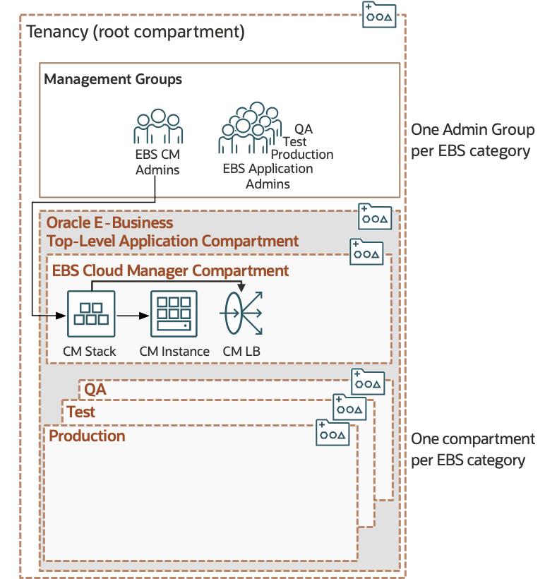

# Deploy and Configure Oracle E-Business Suite Cloud Manager

## Introduction

In this lab, we will deploy Oracle E-Business Suite (EBS) Cloud Manager using the Marketplace Application: Oracle E-Business Suite Cloud Manager Stack for Demos.

Estimated Lab Time: 30 minutes

### About <Product/Technology> (Optional)
Enter background information here about the technology/feature or product used in this lab - no need to repeat what you covered in the introduction. Keep this section fairly concise. If you find yourself needing more than two sections/paragraphs, please utilize the "Learn More" section.

### Objectives

In this lab, you will:
* Deploy and configure EBS Cloud Manager.
* Verify log in into EBS Cloud Manager.

### Prerequisites

This lab assumes you have:
* The tenancy admin user name and password
* The following IAM with Identity Domains information documented in your `key-data.txt` file:
    * `Cloud_Manager_Admin_Username`
    * `Cloud_Manager_Admin_Password`
    * `Client_Tenant`
    * `Client_ID`
    * `Client_Secret`

## Task 1: Sign in to the Oracle Cloud Infrastructure Console

Use the tenancy administrator credentials to sign in to Oracle Cloud Infrastructure (OCI) console.

1. Reference your `key-data.txt` file and locate the tenancy administrator credentials.

2. Sign in to the OCI console using the following:

    * **User name**: `Tenancy Admin User`
    * **Password**: `Tenancy Admin Password`

## Task 2: Deploy and Configure Oracle E-Business Suite Cloud Manager

You will now deploy Oracle E-Business Suite Cloud Manager using a Marketplace stack. The stack creates the following cloud resources:

* A compartment to contain resources required by EBS Cloud Manager.
* An EBS Cloud Manager Administrators IAM user and group, as well as the policies required to manage the compartment.
* Network resources – including a VCN, an internet gateway, subnets, route tables, security lists, and security rules.
* A Compute instance for running EBS Cloud Manager.

Then, the stack will configure EBS Cloud Manager to work with your OCI tenancy and the newly created OCI resources.

 

1. In the OCI console navigation menu, under **Marketplace**, select **All Applications**.

<!--Add screenshot here-->

2. From the Marketplace applications, page:

    a. Navigate to **Filter**, then **Type**, and select **Stack**.

    b. In the search bar, enter "E-Business Suite".

    c. Click the application **Oracle E-Business Suite Cloud Manager Stack for Demos**.
    <!--Add screenshot here-->

3. In the **Version** drop-down list, ensure the default is selected.

4. In the **Compartment** drop-down list, select the parent compartment of the compartment where the EBS Cloud Manager Compute instance will be deployed. For example, mycompanytenancy(root)

5. Review and accept the Terms of Use.

6. Click **Launch Stack**.
<!--Add screenshot here-->

7. On the Stack Information screen, enter the following values:

    a. **Name**: Default is Oracle E-Business Suite Cloud Manager Stack for Demos-&lt;date&time&gt;.

    b. **Description**: Add a description for the stack.

    c. The last two variables should be grayed out.

      1. **Compartment**: This is the one chosen previously.

      2. **Terraform Version**: Select 0.12.x from the drop-down list.

    d. Click **Next**.
    
    <!--Add screenshot here-->

## Task 3: Log in to Oracle E-Business Suite Cloud Manager

Before logging into the EBS Cloud Manager web application, you need to add the **hostname** in the login URL to your local computer hosts file.

Follow the applicable set of instructions based on your workstation to edit the local ``hosts`` file and add an entry and perform this configuration:

<if type="Windows">

**For Windows users**

  1. Navigate to Notepad in your start menu.

  2. Hover over Notepad, right-click, and select the option **Run as Administrator**.

  3. In Notepad, navigate to ``File > Open``.

  4. Browse to ``C:\\Windows\System32\drivers\etc``.

  5. Find the file "hosts".

      

  6. In the hosts file, scroll down to the end of the content.

  7. Add the following entry to the very end of the file: ``<lb_public_ip> myebscm.ebshol.org``

  8. Save the file.

  9. Type the Login URL generated and documented to your ``key-data.txt`` previously into your browser.
  
  10. Log into the Oracle E-Business Suite Cloud Manager using your IDCS credentials for the EBS Cloud Manager account as documented in your ``key-data.txt`` file.

  Note: It may take some additional time for the load balancer to be properly configured. Sometimes it may take up to 30 minutes or an hour to configure. If you would like to check on the status of the load balancer,  in OCI go to **Networking** > **Load Balancers** and then check the **Overall Heatlh** status. If it is OK, the connection can be established. 

  Note: If your login URL is not working or if your compute instance which contains the Cloud Manager image was ever stopped/turned off you may need to check and see if the application is running. The command for this can be found in the Lab "Optional: Managing the EBS Cloud Manager Virtual Machine."

  Note: Your browser may give you an error when attempting to access the EBS Cloud Manager. If you run into an error using the EBS login URL try using a different browser or an incognito session. If this does not solve the problem, try adding ``:443`` after the url (i.e. ``https://myebscm.ebshol.org:443``).

  

Once logged in, you are on the **Environments page**.

  

</if>

<if type="Mac">

**For Mac users**

  1. Open a Terminal window.

  2. Enter the following command:

    ```
    <copy>
    sudo vi /etc/hosts
    </copy>
    ```

  This will then require your local computer password to edit the file. Enter the password and you should see a screen similar to the one shown below.

  3. Type 'i' to edit the file.

  4. Go to the last line and add the following entry as follows: ``<lb_public_ip> myebscm.ebshol.org``

  5. Once you have finished editing the file, hit 'esc' and enter ``:wq`` to save and exit.

  

  6. Type the Login URL generated and documented to your ``key-data.txt`` previously into your browser.
  
  7. Log into the Oracle E-Business Suite Cloud Manager using your IDCS credentials for the EBS Cloud Manager account as documented in your ``key-data.txt`` file.

  Note: It may take some additional time for the load balancer to be properly configured. Sometimes it may take up to 30 minutes or an hour to configure. If you would like to check on the status of the load balancer,  in OCI go to **Networking** > **Load Balancers** and then check the **Overall Heatlh** status. If it is OK, the connection can be established. 

  Note: If your login URL is not working or if your compute instance which contains the Cloud Manager image was ever stopped/turned off you may need to check and see if the application is running. The command for this can be found in the Lab "Optional: Managing the EBS Cloud Manager Virtual Machine."

  Note: Your browser may give you an error when attempting to access the EBS Cloud Manager. If you run into an error using the EBS login URL try using a different browser or an incognito session. If this does not solve the problem, try adding ``:443`` after the url (i.e. ``https://myebscm.ebshol.org:443``).

  

Once logged in, you are on the **Environments page**.

  

</if>

## Learn More

* [Oracle E-Business Suite Cloud Manager Guide](https://docs.oracle.com/cd/E26401_01/doc.122/f35809/toc.htm)
* [Oracle E-Business Suite and Oracle Cloud Blog](https://blogs.oracle.com/ebsandoraclecloud/)

## Acknowledgements
* **Author** 
  - Santiago Bastidas, Product Management Director
* **Contributors** 
  -  Terri Noyes, Product Management Director
* **Last Updated By/Date** 
  - Tiffany Romero, May 2024
