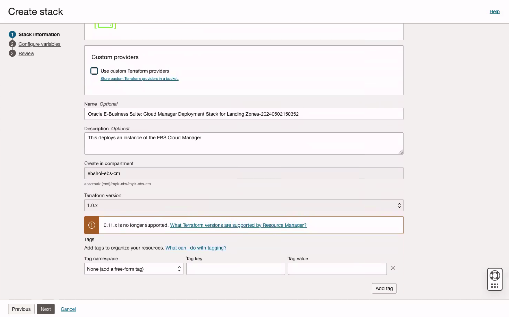
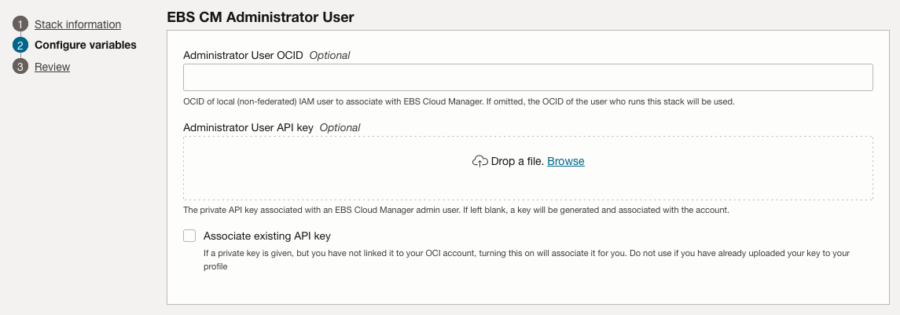

# Deploy and Configure Oracle E-Business Suite Cloud Manager

## Introduction

In this lab, we will deploy Oracle E-Business Suite (EBS) Cloud Manager using the Marketplace stack *Oracle E-Business Suite: Cloud Manager Deployment Stack for Landing Zones*.

Estimated Lab Time: 25 minutes

### About Oracle E-Business Suite: Cloud Manager Deployment Stack for Landing Zones
This Resource Manager stack provisions a new Compute instance based on the Oracle E-Business Suite Cloud Manager Marketplace image and configures the Cloud Manager application to work with your tenancy.

### Objectives

In this lab, you will:
* Deploy and configure EBS Cloud Manager.
* Verify and log in to EBS Cloud Manager.

## Task 1: Sign in to the Oracle Cloud Infrastructure Console

Use the tenancy administrator credentials to sign in to Oracle Cloud Infrastructure (OCI) console.

1. Reference your `key-data.txt` file and locate the tenancy administrator credentials.

2. Sign in to the OCI console using the following:

    * **User name**: `Tenancy Admin Username`
    * **Password**: `Tenancy Admin Password`

## Task 2: Deploy and Configure Oracle E-Business Suite Cloud Manager

You will now deploy Oracle E-Business Suite Cloud Manager using a Marketplace stack. The stack creates a Compute instance for running EBS Cloud Manager.

Then, the stack will configure EBS Cloud Manager to work with your OCI tenancy and the newly created OCI resources.

 

1. In the OCI console navigation menu, under **Marketplace**, select **All Applications**.

2. From the Marketplace applications, page:

    a. Navigate to **Filter**, then **Type**, and select **Stack**.

    b. In the search bar, enter `E-Business Landing Zones`.

    c. Click the application **Oracle E-Business Suite: Cloud Manager Deployment Stack for Landing Zones**.

    

3. In the **Version** drop-down list, ensure the default is selected.

4. In the **Compartment** drop-down list, select the compartment "ebshol-ebs-cm" found under ebshol-ebs.

5. Review and accept the Terms of Use.

6. Click **Launch Stack**.
 

7. On the Stack information screen, enter the following values:

    a. **Name**: Default name is "Oracle E-Business Suite: Cloud Manager Deployment Stack for Landing Zones-&lt;date&time&gt;".

    b. **Description**: Add a description for the stack.

    c. Click **Next**.
    
    

8. On the Configure variables screen:

    a. **Security compartment**: Select "ebshol-Security" from the drop-down list.

    b. **Environment category identifier**: Select "identity-ebshol-ebs-Production" from the drop-down list.

    c. **Server host name for EBS Cloud Manager Login URL**: Enter `myebscm.ebshol.org`.

    

    d. **Client ID** and **Client Secret**: Enter the Client ID and Client Secret recorded in the `key-data.txt` file.

    e. **Domain URL**: Enter the Domain URL recorded in the `key-data.txt` file. 

    

    f. In the EBS CM Administrator User section, leave all fields blank. For this lab, these values are dynamically chosen for you based on the user connected to the OCI Console.

    

    g. **Compute Instance Shape**: Select "VM.Standard.E2.1".

    h. Generate a new SSH key. For more information on SSH keys, visit: [Generating an SSH Key Pair](https://www.oracle.com/webfolder/technetwork/tutorials/obe/cloud/compute-iaas/generating_ssh_key/generate_ssh_key.html).

    Record the path to the SSH Key Pair in the `key-data.txt` file for future reference.

    i. Under **SSH Public key**, select the **Choose SSH key file** radio button. 

    j. **Availability Domain**: Select the first availability domain in the drop-down list.

    k. Under **EBS CM services administration password**, leave the password in the **Enter the password** field as-is.

    l. Click **Next**.

    

    m. After reviewing your entries, click **Create**.

    

## Task 3: Log in to Oracle E-Business Suite Cloud Manager

Before logging into the EBS Cloud Manager web application, you need to add the **hostname** in the login URL to your local computer hosts file.

Follow the applicable set of instructions based on your workstation to edit the local `hosts` file and add an entry and perform this configuration:

<if type="Windows">

**For Windows users**

  1. Navigate to Notepad in your start menu.

  2. Hover over Notepad, right-click, and select the option **Run as Administrator**.

  3. From the **File** menu in Notepad, select **Open**.

  4. Browse to `C:\\Windows\System32\drivers\etc`.

  5. Find the file named "hosts".

      

  6. In the `hosts` file, scroll down to the end of the content.

  7. Add the following entry to the very end of the file: 
  
    ```
    <copy>
    <Load_Balancer_IP_address> myebscm.ebshol.org
    </copy>
    ```

  8. Save the file.

  9. Enter the Login URL generated and documented to your `key-data.txt` previously into your browser.
  
  10. Log into the Oracle E-Business Suite Cloud Manager using your IDCS credentials for the EBS Cloud Manager account as documented in your `key-data.txt` file.

  
    
  Once you are logged in, you are on the **Environments page**.
  

  **Notes**: 
  * It may take some additional time for the load balancer to be properly configured. Sometimes it may take up to 30 minutes or an hour to configure. If you would like to check on the status of the load balancer, in OCI go to **Networking**, then **Load Balancers**, and check the **Overall Health** status. If it is OK, the connection can be established. 

  * If your login URL is not working or if your compute instance which contains the Cloud Manager image was ever stopped/turned off you may need to check and see if the application is running. The command for this can be found in the Lab "Optional: Manage the EBS Cloud Manager Virtual Machine."
  
  * Your browser may give you an error when attempting to access the EBS Cloud Manager. If you run into an error using the EBS login URL try using a different browser or an incognito session. If this does not solve the problem, try adding `:443` after the URL (for example, `https://myebscm.ebshol.org:443`).
</if>

<if type="Mac">

**For Mac users**

  1. Open a Terminal window.

  2. Enter the following command: 
  
    ```
    <copy>
    sudo vi /etc/hosts
    </copy>
    ```

  This will then require your local computer password to edit the file. Enter the password and you should see a screen similar to the following screenshot.

  3. At the bottom of the file, enter `a` to append a new line.

  4. Add the following entry as follows: 
  
    ```
    <copy>
    <Load_Balancer_IP_address> myebscm.ebshol.org
    </copy>
    ```

  

  5. Once you have finished editing the file, press "esc" and enter `:x` to save and exit.

  6. Enter the Login URL generated and documented to your `key-data.txt` previously into your browser.
  
  7. Log into the Oracle E-Business Suite Cloud Manager using your IDCS credentials for the EBS Cloud Manager account as documented in your `key-data.txt` file.
  
  
  
  Once logged in, you are on the **Environments page**.
  
  

Notes: 
* It may take some additional time for the load balancer to be properly configured. Sometimes it may take up to 30 minutes or an hour to configure. If you would like to check on the status of the load balancer, in OCI navigate to **Networking**, then **Load Balancers**, and check the **Overall Health** status. If the status is OK, the connection can be established. 

* If your login URL is not working or if your compute instance which contains the Cloud Manager image was ever stopped/turned off you may need to check and see if the application is running. The command for this can be found in the Lab "Optional: Managing the EBS Cloud Manager Virtual Machine."

* Your browser may give you an error when attempting to access the EBS Cloud Manager. If you run into an error using the EBS login URL try using a different browser or an incognito session. If this does not solve the problem, try adding `:443` after the URL (for example, `https://myebscm.ebshol.org:443`).

</if>

## Learn More

* [Oracle E-Business Suite Cloud Manager Guide](https://docs.oracle.com/cd/E26401_01/doc.122/f35809/toc.htm)
* [Oracle E-Business Suite and Oracle Cloud Blog](https://blogs.oracle.com/ebsandoraclecloud/)

## Acknowledgements
* **Author** - Santiago Bastidas, Product Management Director
* **Contributors** -  Tiffany Romero, Technical Writer; Terri Noyes, Product Management Director
* **Last Updated By/Date** - Tiffany Romero, EBS Documentation, May 2024
