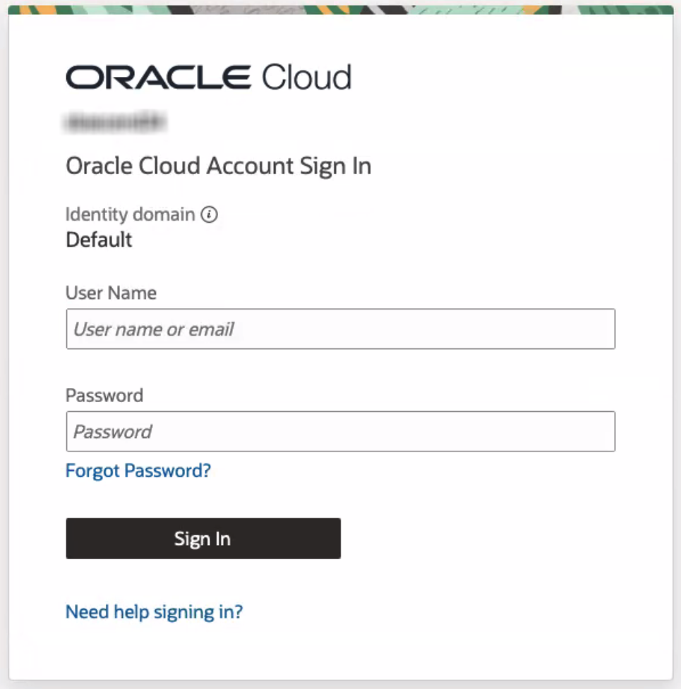
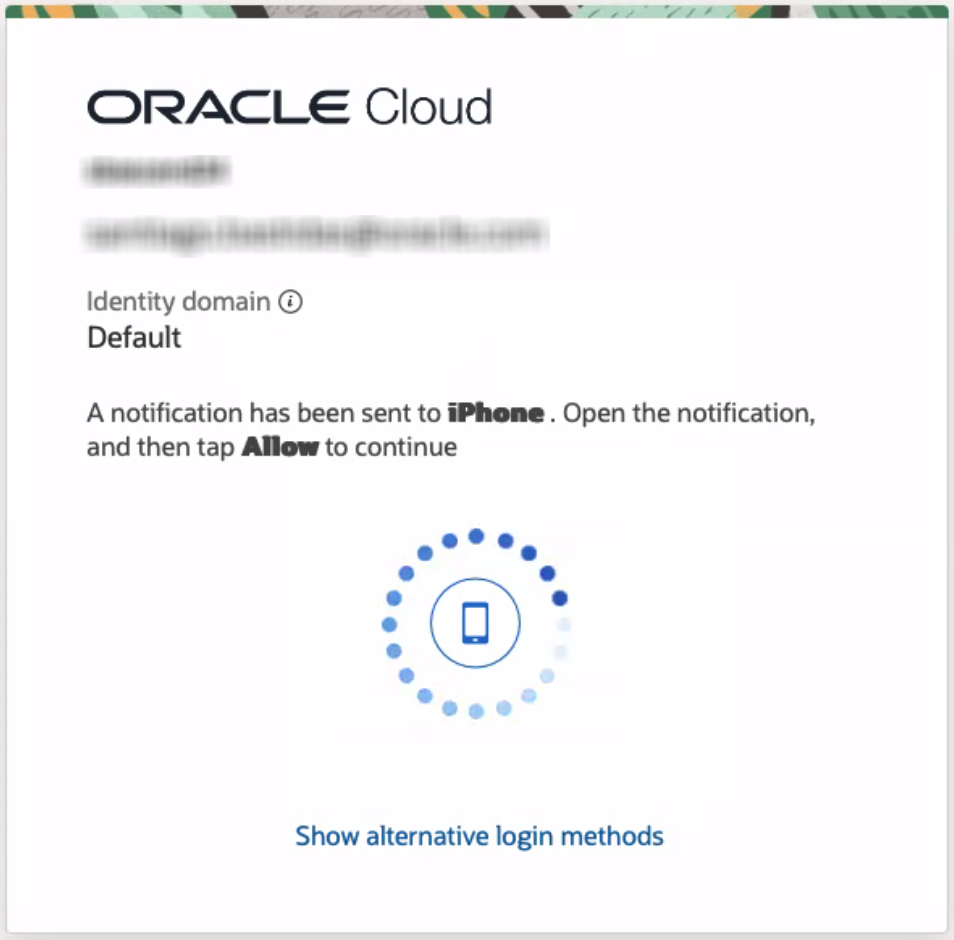

# Getting Started

## Introduction

In this lab, you will prepare for the procedures described in this workshop. You will download a file that will be used to store variables that are referenced in each lab. 

Then you will establish your Oracle Cloud account (tenancy) and administrator credentials.

Estimated Time: 5 minutes

### Objectives

In this lab, you will:
* Download the `key-data.txt` file, a file that will be used throughout the workshop. 
* Establish your Cloud account (tenancy) and administrator credentials.
* Log in to your Oracle Cloud account to verify access.

## Task 1: Download the key-data.txt file

Use [this link](./files/key-data.txt?download=1) to download the `key-data.txt` file. Place the file on your desktop or another memorable location for quick reference.

As you go through this workshop, use this text file to record information you will need to reference, such as credentials and variable values.

## Task 2: Establish Your Oracle Cloud Account and Credentials

To conduct this lab, you must either establish a new Free Tier account or use an existing Oracle Cloud paid account. 

*Free Tier Accounts*

To establish a Free Tier account:

1. Go to the [Oracle Cloud Free Tier Sign Up Page](https://signup.cloud.oracle.com/) to create your account and establish your credentials. 

2. You will then get an email notifying you that you Oracle Cloud account is ready. Click on **Sign In** and authenticate.

Note that you will be a tenancy administrator for your new account. 

Record your credentials in the `key-data.txt` file for reference.

*Oracle Cloud Paid Accounts*

If you have an existing Oracle Cloud paid account, verify that you have tenancy administrator credentials before proceeding with this workshop. 

## Task 3: Log in to Oracle Cloud

1. Go to [cloud.oracle.com](https://cloud.oracle.com) and enter your **Cloud Account Name** and click **Next**. This is the name you chose while creating your account in the previous section. It's NOT your email address. If you've forgotten the name, reference the `key-data.txt` file or see the confirmation email.

2. Enter your Cloud Account credentials and click **Sign In**. Your user name is your email address. The password is what you chose when you signed up for an account.

3. Based on the multi-factor authentication setup for your account, provide authentication to sign into the account. For example, click **Allow** on the app or enter your **authentication code** and click **Verify** based on the authentication setup. For more details, refer to the [Managing Multifactor Authentication documentation](https://docs.oracle.com/en-us/iaas/Content/Identity/Tasks/usingmfa.htm).

    

4. After verfication, you will be signed in to Oracle Cloud.

## Learn More

* [Oracle Cloud Free Tier Sign Up](https://signup.cloud.oracle.com/)

## Acknowledgements
* **Author** - Santiago Bastidas, Product Management Director
* **Contributors** -  Tiffany Romero, Technical Writer; Terri Noyes, Product Management Director
* **Last Updated By/Date** - Tiffany Romero, EBS Documentation, May 2024
