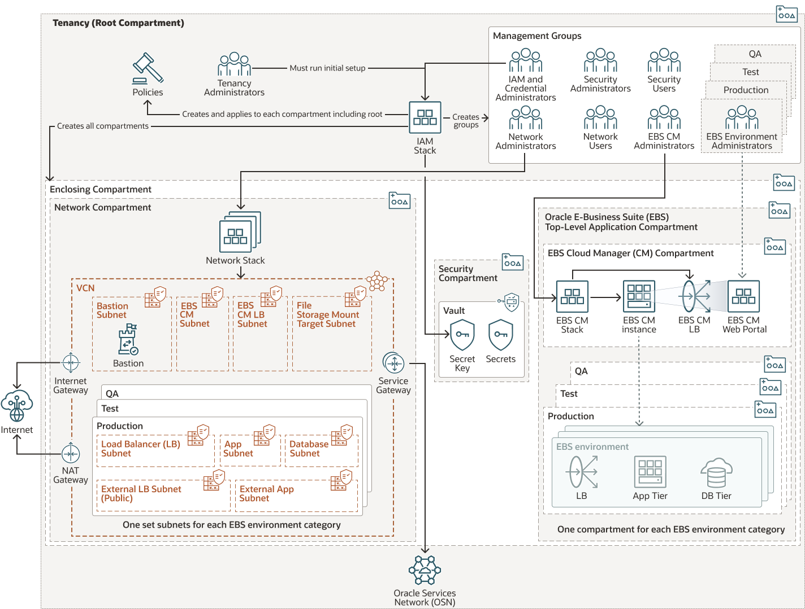

# Introduction

## About this Workshop

In this workshop, you will first establish a pre-defined landing zone that: 
* Meets the security guidelines prescribed by the Center for Internet Security (CIS) Oracle Cloud Infrastructure Foundations Benchmark, and 
* Supports Oracle E-Business Suite (EBS) workloads. 

Note that this landing zone is comprised of compartments, groups to manage those compartments, and a fully configured network. 

After deploying the landing zone, you will install and configure EBS Cloud Manager, which can utilize the resources from the landing zone to manage your EBS environments. Once this is completed, you will be able to provision your first EBS environment. 

Estimated Workshop Time: 2 hours

Note the following:
* This workshop is quite detailed and technical. PLEASE take your time and DO NOT skip any steps.
* IP addresses and URLs in the screenshots found in this procedure may differ from what you use in the labs as these are dynamically generated. 
* For security purposes, some sensitive text (such as IP addresses) may be redacted in the screenshots in this procedure.

### Objectives

In this workshop, you will learn how to:
* Set up the landing zone
* Deploy and configure Oracle E-Business Suite Cloud Manager

### Prerequisites

The following expertise is beneficial:
* Knowledge of how to connect to virtual machines from your local machine (such as Putty or SSH)
* Knowledge of Oracle E-Business Suite (EBS)
* Familiarity with Oracle Cloud Infrastructure (OCI) and Identity and Access Management (IAM) domains

### Workshop Overview
The following figure outlines the workshop architecture. 

**Figure 1: Workshop Architecture**

This workshop uses the following components: 
* Trial accounts (one per attendee)
* Marketplace stacks for Oracle E-Business Suite:
    * Tenancy Admin Stack for Landing Zones
    * Network Admin Stack for Landing Zones
    * Cloud Manager Deployment Stack for Landing Zones

The following table describes the exercises you will perform in this workshop.

**Table 2: Storyboard**

| What          |      How      |  Notes |
| ------------- | ------------- | ------------- |
| **Lab 1**: Getting Started  | Download `key-data.txt`, establish Oracle Cloud account | You will use the `key-data.txt` file to record information that you will use throughout the workshop. |
| **Lab 2**: Set up the landing zone |  Create the foundation; Create the network | Run the EBS Tenancy Admin Stack for Landing Zones and EBS Network Admin Stack for Landing Zones to create the compartment distribution and network. |
| **Lab 3**: Register EBS Suite Cloud Manager as a confidential application | Register EBS Cloud Manager as a confidential application in tenancies using IAM with identity domains | Configure EBS Cloud Manager authentication using IAM with identity domains. |
| **Lab 4**: Deploy and configure EBS Cloud Manager  | Deploy and configure EBS Cloud Manager and required resources| Use the EBS Cloud Manager Deployment Stack for Landing Zones to deploy the EBS Cloud Manager Compute instance and configure the web application. |
<!--| **Lab 5**: Provision your EBS environment | Use One-Click Provisioning to create and configure your first EBS environment | Provision an environment using One-Click Provisioning; Enable and set EBS account passwords; Open firewall and security list to allow connections to EBS environment; Configure local hosts file and log in to EBS. |-->

## Learn More

* [Deploy a secure landing zone that meets the CIS Foundations Benchmark for Oracle Cloud](https://docs.oracle.com/en/solutions/cis-oci-benchmark/index.html#GUID-89CA48AA-73E1-4992-A43F-CA5FA5CE21CD)
* [Oracle E-Business Suite Cloud Manager Guide](https://docs.oracle.com/cd/E26401_01/doc.122/f35809/toc.htm)
* [Oracle E-Business Suite and Oracle Cloud Blog](https://blogs.oracle.com/ebsandoraclecloud/)

## Acknowledgements
* **Author** - Santiago Bastidas, Product Management Director
* **Contributors** -  Tiffany Romero, Technical Writer; Terri Noyes, Product Management Director
* **Last Updated By/Date** - Tiffany Romero, EBS Documentation, May 2024
