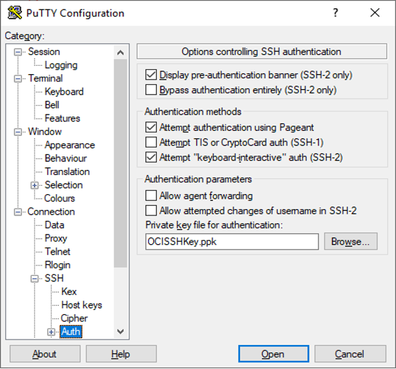
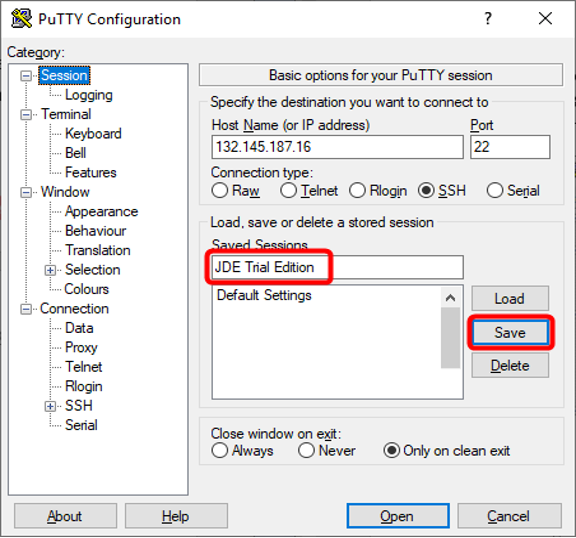
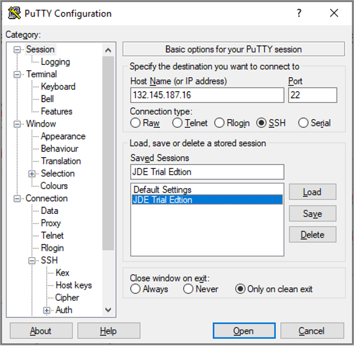

# Manage the Oracle EBS Cloud Manager Virtual Machine

## Introduction
Within the virtual machine that Oracle E-Business Suite (EBS) Cloud Manager runs on, you can also preform a number of management tasks that give you more control of the instance. Here we will go over a few of the main commands that are available.

### **Objectives**

* Start the EBS Cloud Manager application.
* Stop the EBS Cloud Manager application.

### **Prerequisites**

* Tenancy Admin User
* Tenancy Admin Password
* Your Instance Public IP added in your `key-data.txt` file.
    * `Cloud_Manager_Instance_Public_IP`
    * `SSH_Public_Key`

## Task 1: Connect to an Oracle Cloud Infrastructure Compute Instance Using a Mac, Linux, or UNIX-Based Machine Using Command Line SSH

Mac OS X amd many Linux machines include a command-line SSH client as part of the operating system. 

To use it on the Mac OS, navigate to **Finder**, select **Go**, then select **Utilities** from the top menu. Look for **Terminal**. To connect over SSH, you can use the following command on a Linux or UNIX style system:

    <copy>
    $ ssh –i </path/to/privateKey> opc@<PublicIP_Address>
    </copy>

For example:

``$ ssh -i ./keys/id_rsa opc@XXX.XXX.XXX.XX``

Once connected, you can continue.

## Task 2: Connect to an Oracle Cloud Infrastructure Compute Instance Using a Windows-Based Machine

**Method 1:** Using SSH with Git Bash

1.  Launch Git Bash.

    

2.  To connect over SSH, you can use the following command on a Linux or UNIX style system.

        <copy>
        $ ssh –i </path/to/privateKey> opc@<PublicIP_Address>
        </copy>

    For example:

    ``$ ssh -i ./keys/id_rsa opc@XXX.XXX.XXX.XX``

    **Note:** Do not copy and paste this line into Git Bash. Unpredictable results may occur.

3.  If after entering the ssh command, you receive a message such as in the following screenshot, reply with ``YES``.

    

4. Once connected, you can continue to Step 3.

**Method 2:** Using SSH with Putty for Windows

For Windows, you can also use a tool like PUTTY to set up PuTTY to connect to an OCI instance.

1.	Launch **PuTTY**.

    

2. Within the PuTTY session, under the **Session** category, enter the public IP address (for example, XXX.XXX.XXX.XX) from the instance information in the **Host Name** field, and then select **Connection**, then **Data**.

   

3.  In the **Auto-login username** field, enter **opc**. From the Category navigation tree, select **Connection**, **SSH**, and then select **Auth**.

    

4.  Use **Browse** to locate the ppk version of your SSH public keyfile in the location where you saved it. (If you do not have a ppk version of your SSH keyfile, then you will need to create one.) 

    Return to the **Session**.

    

5.  In the Session category, enter a unique label (for example, JDE Trial Edition) for the connection in the **Saved Sessions** field, and click **Save**. This will retain all settings for future connections.

    

6.  Connect to the instance by clicking **Open**.

    

7.  PuTTY will open a command window. On first connection, a Security Alert window will appear. Click **Yes** to accept that you trust the connection to this host.

    
1. Connect to the EBS Cloud Manager virtual machine.

    SSH into the EBS Cloud Manager instance from your local machine by using the IP address and the SSH private key you used during the deployment of the EBS Cloud Manager instance. 

    ```
    <copy>
    ssh -i <private_ssh_key_filepath> opc@<Source_EBS__public_IP>
    </copy>
    ```
## Task 3: Starting the Cloud Manger Application Within the Virtual Machine

Now that you have connected to the compute instance, you can perform the commands to start the EBS Cloud Manager services by entering the following commands:

    ```
    <copy>
    sudo su - oracle
    cd /u01/install/APPS/apps-unlimited-ebs/bin
    sh ebscloudmgrctl.sh startall
    </copy>
    ```

Then enter the EBS Cloud Manager administrator password when prompted.

After running these commands, your services should turn on. If they were already on, then nothing will happen.

## Task 4: Stopping the Cloud Manger Application Within the Virtual Machine

While you are connected to the compute instance, you can also perform the commands to stop the EBS Cloud Manager Services by entering these commands.

    ```
    <copy>
    sudo su - oracle
    cd /u01/install/APPS/apps-unlimited-ebs/bin
    sh ebscloudmgrctl.sh stopall
    </copy>
    ```

Then enter the EBS Cloud Manager administrator password when prompted.

After running these commands, your services should turn off and you will no longer be able to connect to Cloud Manager from the web. If they were already off, then nothing will happen.

## More Information

For full documentation on Oracle E-Business Suite Cloud Manager, [click here!](https://docs.oracle.com/cd/E26401_01/doc.122/f35809/toc.htm)

## Acknowledgements

Acknowledgements
* Author: Chris Wegenek, Cloud Engineering
* Last Updated By/Date: Tiffany Romero, EBS Documentation, June 2024


