# Provision Your Oracle E-Business Suite Environment

## Introduction

In this lab, we will use the One-Click Provisioning feature of Oracle E-Business Suite Cloud Manager to provision an Oracle E-Business Suite (EBS) environment in your Oracle Cloud Infrastructure (OCI) tenancy.

Estimated Time: 45 minutes

### About Oracle E-Business Suite Cloud Manager
Oracle E-Business Suite Cloud Manager is a web application running on a Compute instance in your own tenancy. It is used to provision and manage the lifecycle of all your EBS environments in your OCI tenancy.

### Objectives

In this lab, you will: 
* Provision your first Oracle E-Business Suite environment.
* Enable and set Oracle E-Business Suite account passwords.
* Open up security configurations to allow traffic to E-Business Suite.
* Configure Local hosts file and log in to Oracle E-Business Suite.

### Prerequisites (Optional)

This lab assumes you have:
* Cloud Manager Admin credentials
* Cloud Manager Application variables in ``key-data.txt`` file

## Task 1: Log in to Oracle E-Business Suite Cloud Manager
1. Navigate to your Oracle E-Business Suite Cloud Manager application using the Login URL recorded in your ``key-data.txt`` file.

  Note : If your login URL is not working or if your compute instance which contains the Cloud Manager image was ever stopped/turned off you may need to check and see if the application is running. The command for this can be found in the Lab "Optional: Managing the EBS Cloud Manager Virtual Machine."

2. Log in with your Cloud Manager Admin credentials.

  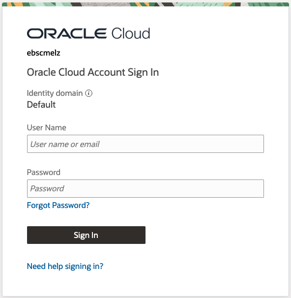

  This will bring you to the home screen.

  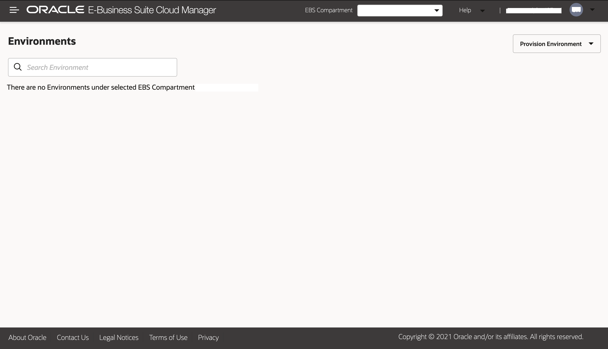

  <!-- Add screenshot from Santiago -->

## Task 2: Provision an Environment Using One-Click Provisioning
1. On the Oracle E-Business Suite Cloud Manager Environments page, click **Provision Environment** and select **One-Click**.

  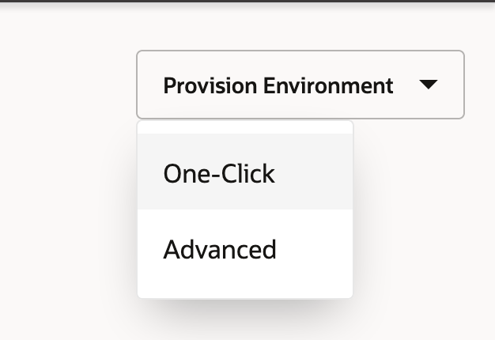

2. Enter and select the following details for your new environment.

    a. **Environment Name**: ebsholenv1

    b. **Purpose**: Vision Demo Install

    c. **EBS Version**: 12.2.13

    d. **DB Version**: 19.0.0.0

    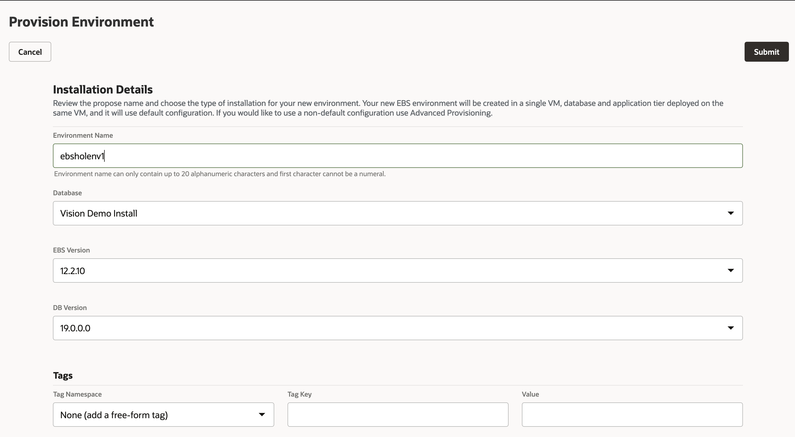

3. Click **Submit**.

You can check the status of the activity to provision the environment in the Activities page. The provisioning process will take approximately 30-35 minutes.

## Task 3: Enable and Set Oracle E-Business Suite Account Passwords

1. SSH to the newly created environment by using the following steps:

    a. SSH into the Cloud Manager instance from your local machine by using the IP address in the ``key-data.txt`` file and the private key you created during the deployment of the Cloud Manager in OCI. 

        ```
        <copy>
        ssh -i <filepath_to_your_ebshol_folder/artifacts/ebs_hol_key> opc@<cloud_manager_public_ip>
        </copy>
        ```

    b. Switch to the Oracle user in the Cloud Manager instance

        ```
        <copy>
        sudo su - oracle
        </copy>
        ```
    
    c. Connect to the ``ebsholenv1`` by executing the following

        ```
        <copy>
        ssh <ebsholenv1_private_ip>
        </copy>
        ```
    
    The private ip can be found by clicking on your newly created environment, as shown.

      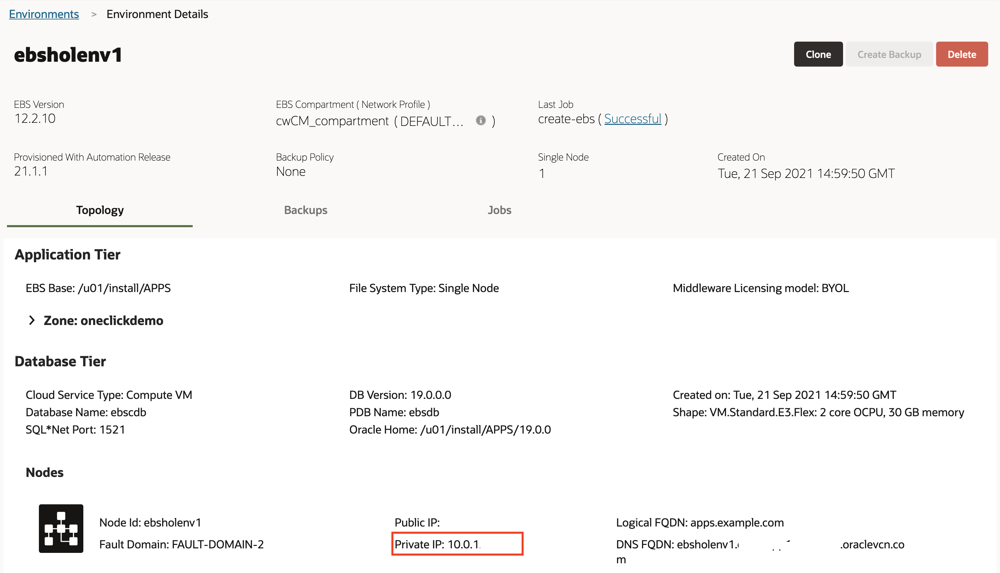

2. Once logged into your EBS instance as an Oracle user, source your variables for the release you are using via the following commands:
        
      a. Source variables for **release 12.2**.
    
        <copy>
        . /u01/install/APPS/EBSapps.env run 
        </copy>  

      Note: If you are using a different version than 12.2, refer to the documentation at the following link: [Enable and Set Oracle E-Business Account Passwords (Conditionally Required)](https://docs.oracle.com/cd/E26401_01/doc.122/f35809/T679330T679344.htm#cmg_postprov_pwds).

3. To log in through the web interface, you must initially set a password of your choice for the SYSADMIN user. After the SYSADMIN user is active with the new password, you can create new users or activate existing locked users. To enable the SYSADMIN user, run the following commands:

    ```
    <copy>
    mkdir -p ~/logs

    cd  ~/logs

    sh /u01/install/APPS/scripts/enableSYSADMIN.sh
    </copy>
    ```

When prompted, enter a new password for the SYSADMIN user. Record this password in your ``key-data.txt`` file.
The SYSADMIN user can now connect to Oracle E-Business Suite through the web interface and create new users or activate existing locked users.

  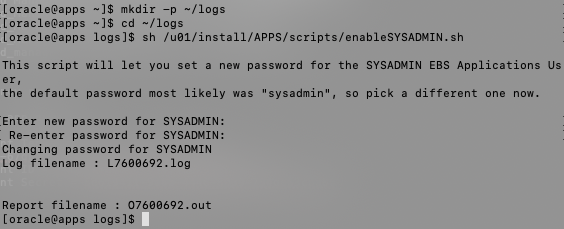

You can refer to [Enable and Set Oracle E-Business Account Passwords (Conditionally Required)](https://docs.oracle.com/cd/E26401_01/doc.122/f35809/T679330T679344.htm#cmg_postprov_pwds) for more details.

## Task 4: Open Firewall and Security List to Allow Connections to EBS Environment

1. Exit from the EBS instance and reconnect as the opc user.

    ```
    <copy>
    exit

    ssh opc@<ebsholenv1_private_ip>
    </copy>
    ```
  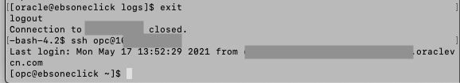

2. Open the firewall on the EBS instance to allow traffic on port 4443. 

    ```
    <copy>
    sudo firewall-cmd --zone=public --permanent --add-port=4443/tcp

    sudo firewall-cmd --reload
    </copy>
    ```
  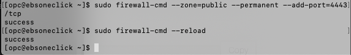

    ```
    <copy>
    sudo firewall-cmd --zone=public --add-rich-rule='rule family=ipv4 source address=0.0.0.0/0 port port=8000 protocol=tcp accept' --permanent

    sudo firewall-cmd --zone=public --add-rich-rule='rule family=ipv4 source address=0.0.0.0/0 port port=8000 protocol=tcp accept'
    </copy>
    ```
  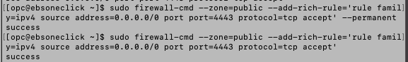


3. Now we will open the Security List in our VCN to allow traffic from the internet on port 4443. Go to OCI and navigate to the **Networking** > **Virtual Cloud Networks** section. 

  Note: In the below screenshots, the naming convention is a little different. Where you see **cwCM** as a prefix, you will most likely have **ebshol**. 

  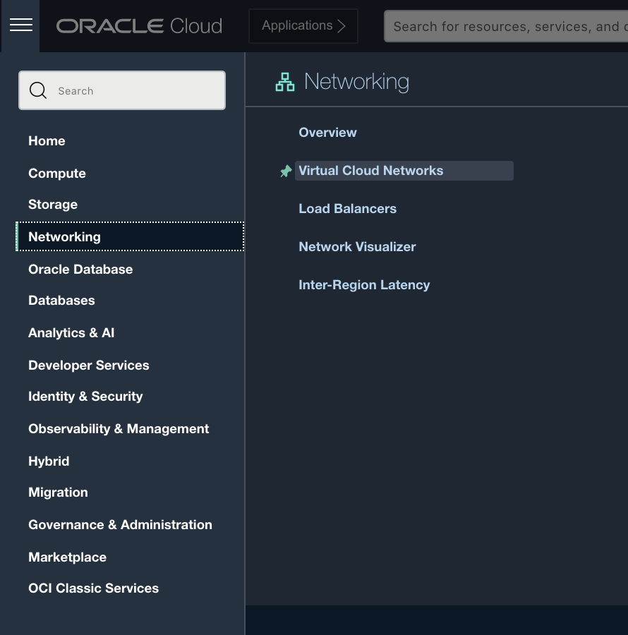

  a. Ensuring you are in the right compartment (**ebshol\_compartment**), click on **ebshol\_vcn**. Then select the **Security Lists** Resource and the **ebshol\_apps\_seclist** from there. 

    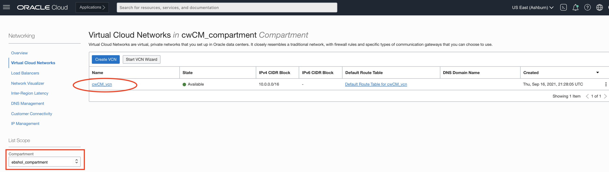

    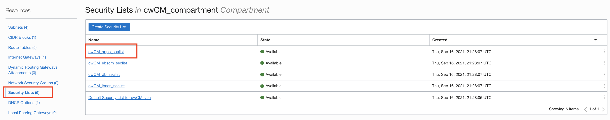

  b. Here we will add an Ingress rule to allow traffic to access our EBS instance. Click **Add Ingress Rule**. 

    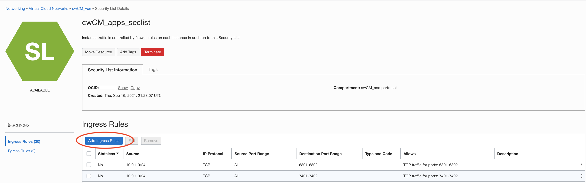

  c. Fill out the following information leaving the rest as default: 

    i. **Source CIDR:** ``0.0.0.0/0``

    ii. **Destination Port Range:** ``4443``

    
  d. Click **Add Ingress Rule**.

      


## Task 5: Configure Local Hosts File and Log in to Oracle E-Business Suite

1. Click the Cloud Manager Environment: "ebsholenv1"

  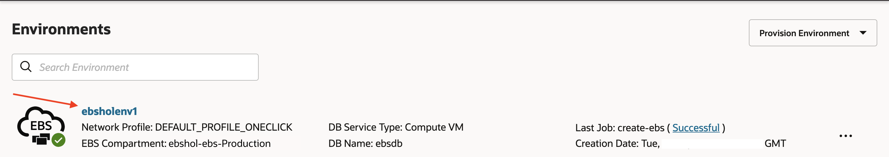

2. Then click the arrow next to **Zone: oneclickdemo**.

  1. Note the IP address listed at **Web Entry IP:**

  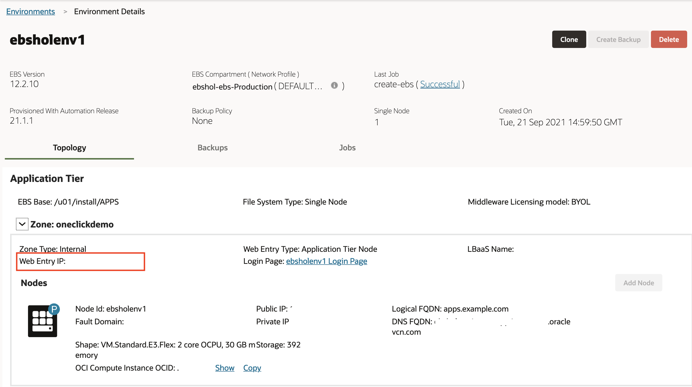

3. Edit the local hosts file on your laptop and add an entry.

  **For Windows users**

    1. Navigate to Notepad in your start menu.

    2. Hover over Notepad, right-click, and select the option **Run as Administrator**.

    3. In Notepad, navigate to **File** > **Open**.

    4. Browse to ``C:\\Windows\System32\drivers\etc``.

    5. Find the file ``hosts``.

        

    6. In the hosts file, scroll down to the end of the content.

    7. Add the following entry to the very end of the file:
    ``<ip_address> ebsholenv1.example.com``

    8. Save the file.

  **For Mac users**

    1. Open a Terminal Window.

    2. Enter the following command:

        ```
        <copy>
        sudo vi /etc/hosts
        </copy>
        ```

      This will then require your local computer password to edit the file. Enter and you should see a screen similar to the one shown below.

    3. Type 'i' (insert) to edit the file using vi.

    4. Go to the last line and add the following entry as show below:
    ``<ip_address> ebsholenv1.example.com``

    5. Once you have finished editing the file hit 'esc' and type ':wq' to save and exit.

      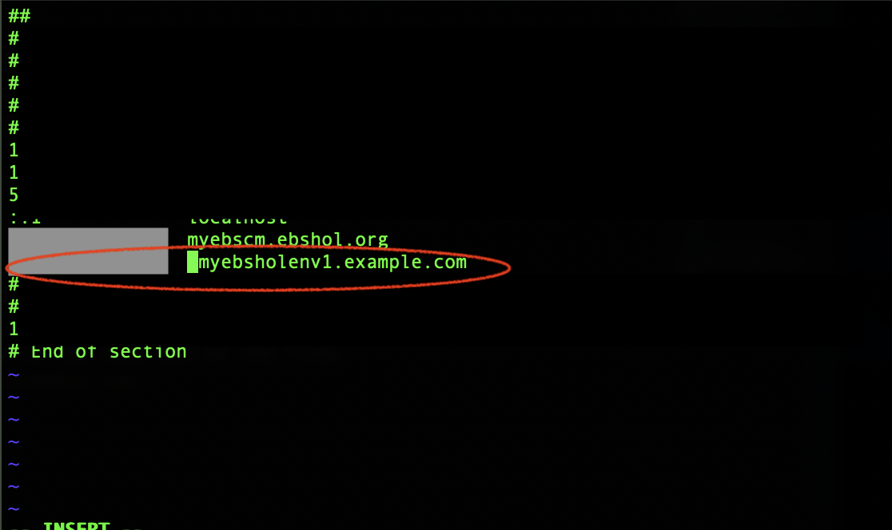

4. Log in to Oracle E-Business Suite:

  a. From the Cloud Manager environment page. Click the link following **Login Page:**

    

  b. When prompted, accept the warning concerning the certificate coming from an unauthorized certificate authority as we are using a self-signed certificate. (You will change the certificate with your own when executing this procedure outside of this hands-on lab.)

  c. On this page, you will log in to Oracle E-Business Suite.

  

## Learn More

*(optional - include links to docs, white papers, blogs, etc)*

* [URL text 1](http://docs.oracle.com)
* [URL text 2](http://docs.oracle.com)

## Acknowledgements
* **Author** - Santiago Bastidas, Product Management Director
* **Contributors** -  Tiffany Romero, Technical Writer; Terri Noyes, Product Management Director
* **Last Updated By/Date** - Tiffany Romero, EBS Documentation, May 2024
