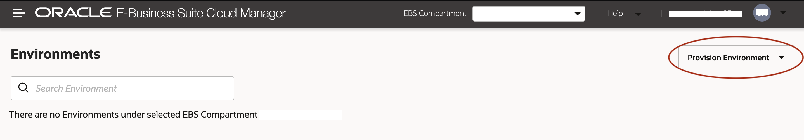
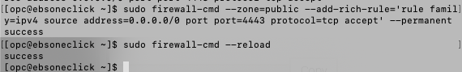
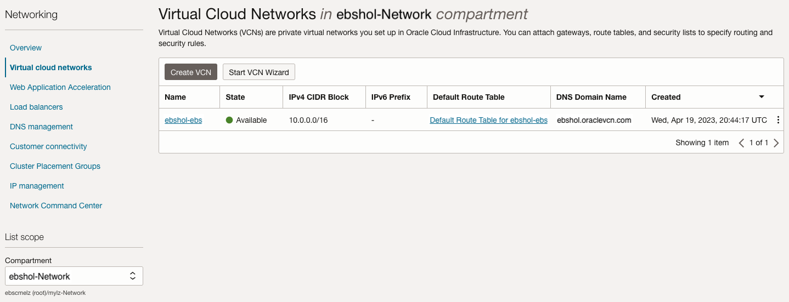
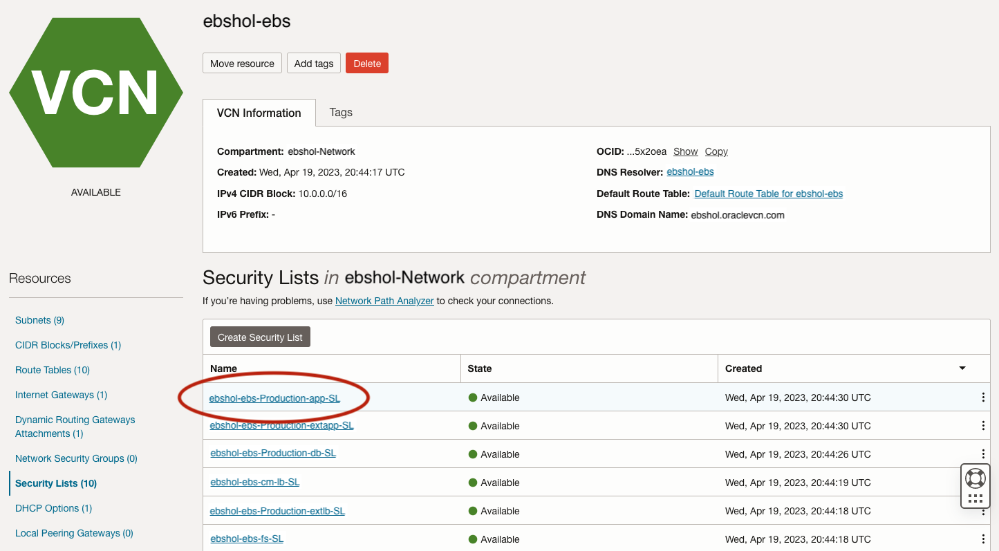
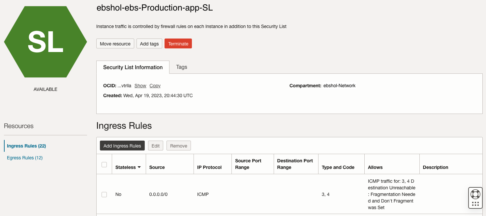
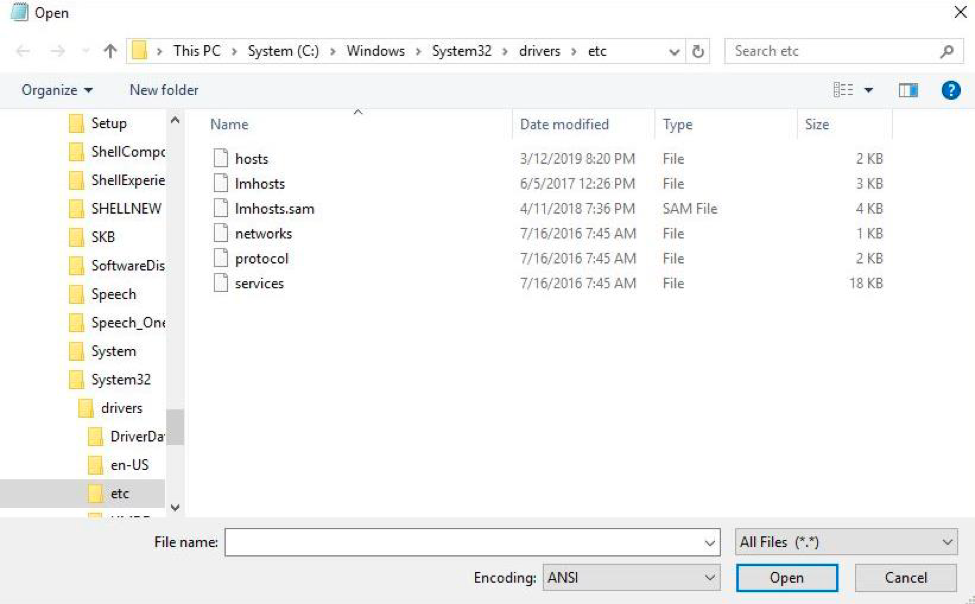
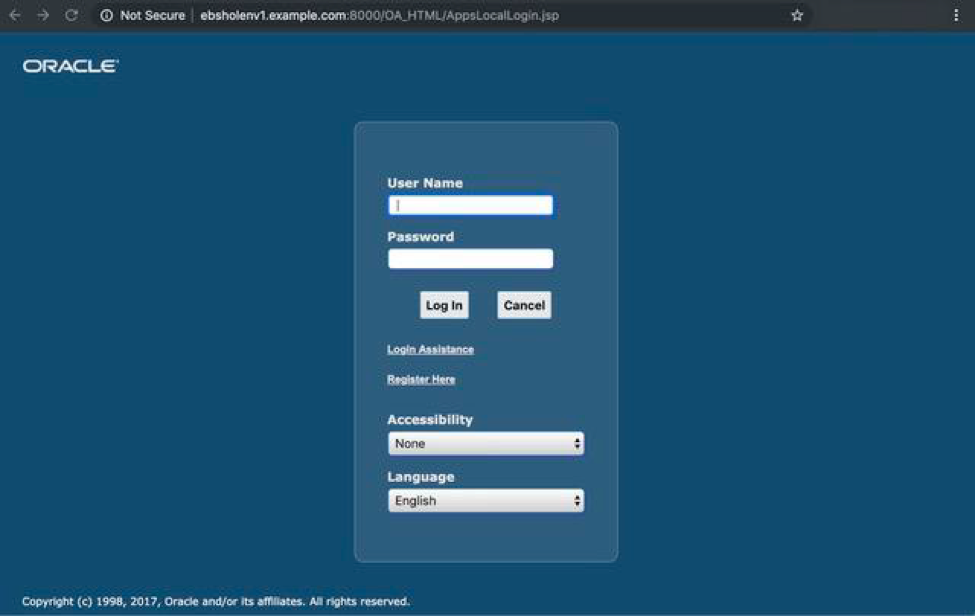

# Provision Your Oracle E-Business Suite Environment

## Introduction

In this lab, we will use the One-Click Provisioning feature of Oracle E-Business Suite Cloud Manager to provision an Oracle E-Business Suite (EBS) environment in your Oracle Cloud Infrastructure (OCI) tenancy.

Estimated Time: 40 minutes

### About Oracle E-Business Suite Cloud Manager
Oracle E-Business Suite Cloud Manager is a web application running on a Compute instance in your own tenancy. It is used to provision and manage the lifecycle of all your EBS environments in your OCI tenancy.

### Objectives

In this lab, you will: 
* Provision your first EBS environment.
* Enable and set EBS account passwords.
* Open security configurations to allow traffic to EBS.
* Configure the local hosts file and log in to EBS.

### Prerequisites

This lab assumes you have:
* EBS Cloud Manager Admin credentials
* EBS Cloud Manager application variables in the `key-data.txt` file

## Task 1: Log in to Oracle E-Business Suite Cloud Manager
1. Navigate to your Oracle E-Business Suite Cloud Manager application using the Login URL recorded in your `key-data.txt` file.

  **Note**: If your login URL is not working or if your compute instance which contains the Cloud Manager image was ever stopped/turned off you may need to check and see if the application is running. The command for this can be found in the Lab "Optional: Managing the EBS Cloud Manager Virtual Machine."

2. Log in with your EBS Cloud Manager Admin credentials.

  

  This will bring you to the home screen.

  

## Task 2: Provision an Environment Using One-Click Provisioning
1. On the Oracle E-Business Suite Cloud Manager Environments page, click **Provision Environment** and select **One-Click**.

    

2. Enter and select the following details for your new environment.

    a. **Environment Name**: ebsholenv1

    b. **Purpose**: Vision Demo Install

    c. **EBS Version**: 12.2.13

    d. **DB Version**: 19.0.0.0

    

3. Click **Submit**.

You can check the status of the activity to provision the environment in the Activities page. The provisioning process will take approximately 30-35 minutes.

## Task 3: Enable and Set Oracle E-Business Suite Account Passwords

1. SSH to the newly created environment by using the following steps:

    a. SSH into the EBS Cloud Manager instance from your local machine by using the IP address in the `key-data.txt` file and the private key you created during the deployment of EBS Cloud Manager in OCI. 

        <copy>
        ssh -i <filepath_to_your_ebshol_folder/artifacts/ebs_hol_key> opc@<cloud_manager_public_ip>
        </copy>

    b. Switch to the `Oracle` user in the Cloud Manager instance:

        <copy>
        sudo su - oracle
        </copy>
    
    c. Connect to `ebsholenv1` by running the following command:

        <copy>
        ssh <ebsholenv1_private_ip>
        </copy>
    
    The private IP address can be found by clicking on your newly created environment, as shown.

      

2. Once logged into your EBS instance as an `Oracle` user, source your variables for the release you are using the following commands:
        
      a. Source variables for **release 12.2**.
    
        <copy>
        . /u01/install/APPS/EBSapps.env run 
        </copy>  

      **Note**: If you are using a different version than 12.2, refer to [Enable and Set Oracle E-Business Account Passwords (Conditionally Required)](https://docs.oracle.com/cd/E26401_01/doc.122/f35809/T679330T679344.htm#cmg_postprov_pwds).

3. To log in through the web interface, you must initially set a password of your choice for the `SYSADMIN` user. After the `SYSADMIN` user is active with the new password, you can create new users or activate existing locked users. To enable the `SYSADMIN` user, run the following commands:

    ```
    <copy>
    mkdir -p ~/logs

    cd  ~/logs

    sh /u01/install/APPS/scripts/enableSYSADMIN.sh
    </copy>
    ```

When prompted, enter a new password for the `SYSADMIN` user. Record this password in your ``key-data.txt`` file.
The `SYSADMIN` user can now connect to EBS through the web interface and create new users or activate existing locked users.

  

You can refer to [Enable and Set Oracle E-Business Account Passwords (Conditionally Required)](https://docs.oracle.com/cd/E26401_01/doc.122/f35809/T679330T679344.htm#cmg_postprov_pwds) for more details.

## Task 4: Open Firewall and Security List to Allow Connections to EBS Environment

1. Exit from the EBS instance. 

2. Reconnect as the opc user.

    ```
    <copy>
    ssh opc@<ebsholenv1_private_ip>
    </copy>
    ```

  

3. Open the firewall on the EBS instance to allow traffic on port 4443. 

    ```
    <copy>
    sudo firewall-cmd --zone=public --permanent --add-port=4443/tcp

    sudo firewall-cmd --reload
    </copy>
    ```
  

4. Open the firewall on the EBS instance to allow traffic on port 8000.  

    ```
    <copy>
    sudo firewall-cmd --zone=public --add-rich-rule='rule family=ipv4 source address=0.0.0.0/0 port port=8000 protocol=tcp accept' --permanent

    sudo firewall-cmd --reload
    </copy>
    ```
  

5. Now we will open the Security List in our VCN to allow traffic from the internet on port 4443. Go to OCI and navigate to **Networking** and then **Virtual Cloud Networks** section. 

  

  a. Ensuring you are in the right compartment (**ebshol-Network**), click on **ebshol\_vcn**. Then select the **Security Lists** Resource and the **ebshol-ebs-Production-app-SL** from there. 

  

  

  b. Here we will add an Ingress rule to allow traffic to access our EBS instance. Click **Add Ingress Rule**. 

  

  c. Fill out the following information leaving the rest as default: 

    * **Source CIDR:** `0.0.0.0/0`

    * **Destination Port Range:** `4443`

    
  d. Click **Add Ingress Rule**.

  

## Task 5: Configure Local Hosts File and Log in to Oracle E-Business Suite

1. Click the Cloud Manager Environment: "ebsholenv1"

  

2. Then click the arrow next to **Zone: oneclickdemo** to expand the section.

   Note the IP address listed at **Web Entry IP:**

  

3. Edit the local hosts file on your laptop and add an entry.

  **For Windows users**

    1. Navigate to Notepad in your start menu.

    2. Hover over Notepad, right-click, and select the option **Run as Administrator**.

    3. From the **File** menu in Notepad, select **Open**.

    4. Browse to `C:\\Windows\System32\drivers\etc`.

    5. Find the file named `hosts`.

        

    6. In the `hosts` file, scroll down to the end of the content.

    7. Add the following entry to the very end of the file:
    
      ```
      <copy>
      <ip_address> ebsholenv1.example.com
      </copy>
      ```

    8. Save the file.

  **For Mac users**

    1. Open a Terminal window.

    2. Enter the following command:

        ```
        <copy>
        sudo vi /etc/hosts
        </copy>
        ```

      This will then require your local computer password to edit the file. Enter the password and you should see a screen similar to the following screenshot.

    3. Enter `i` (insert) to edit the file using vi.

    4. Go to the last line and add the following entry as shown:
    `<ip_address> ebsholenv1.example.com`

    5. Once you have finished editing the file, press "esc" and enter `:x` to save and exit.

    

4. Log in to Oracle E-Business Suite:

  a. On the Cloud Manager environment page, click the link following **Login Page:**

  

  b. When prompted, accept the warning concerning the certificate coming from an unauthorized certificate authority as we are using a self-signed certificate. (You will change the certificate with your own when executing this procedure outside of this hands-on lab.)

  c. Now you can log in to Oracle E-Business Suite.

  

## Learn More

* [Learn About Deploying Terraform Stacks for E-Business Suite and Cloud Manager](http://docs.oracle.com)
* [Deploy a secure landing zone that meets the CIS Foundations Benchmark for Oracle Cloud](http://docs.oracle.com)
* [Oracle E-Business Suite Cloud Manager Guide, *Manage the Oracle E-Business Suite Cloud Manager Virtual Machine*](https://docs.oracle.com/cd/E26401_01/doc.122/f35809/T679330T679341.htm)
* [My Oracle Support Document 2517025.1, *Oracle E-Business Suite on Oracle Cloud Infrastructure*](https://)
* [Oracle E-Business Suite Cloud Manager Today](https://blogs.oracle.com/ebsandoraclecloud/post/oracle-e-business-suite-cloud-manager-today)

## Acknowledgements
* **Author** - Santiago Bastidas, Product Management Director
* **Contributors** -  Tiffany Romero, Technical Writer; Terri Noyes, Product Management Director
* **Last Updated By/Date** - Tiffany Romero, EBS Documentation, May 2024
