# Register Oracle E-Business Suite Cloud Manager as a Confidential Application

## Introduction

*Describe the lab in one or two sentences, for example:* This lab walks you through the steps to ...

Estimated Lab Time: -- minutes

### About <Product/Technology> (Optional)
Enter background information here about the technology/feature or product used in this lab - no need to repeat what you covered in the introduction. Keep this section fairly concise. If you find yourself needing more than two sections/paragraphs, please utilize the "Learn More" section.

### Objectives

*List objectives for this lab using the format below*

In this lab, you will:
* Objective 1
* Objective 2
* Objective 3

### Prerequisites (Optional)

*List the prerequisites for this lab using the format below. Fill in whatever knowledge, accounts, etc. is necessary to complete the lab. Do NOT list each previous lab as a prerequisite.*

This lab assumes you have:
* An Oracle Cloud account
* All previous labs successfully completed

## Task 1: Sign in to the Oracle Cloud Infrastructure Console

Use the tenancy administrator credentials to sign in to Oracle Cloud Infrastructure (OCI) Console.

1. Reference your ``key-data.txt`` file and locate the tenancy administrator credentials.

2. Sign in to the Oracle Cloud Infrastructure console using the following:

    * **User name**: ``Tenancy Admin User``
    * **Password**: ``Tenancy Admin Password``

## Task 2: Register Cloud Manager as a Confidential Application in Tenancies Using IAM with Identity Domains

1. Open the navigation menu and click **Identity & Security**. Under **Identity**, click **Domains**.

    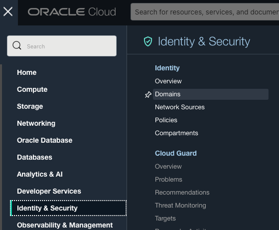

2. Select the root compartment in the **Compartment** drop-down list.

3. Within the list of domains, click the link for the "Default" domain.

    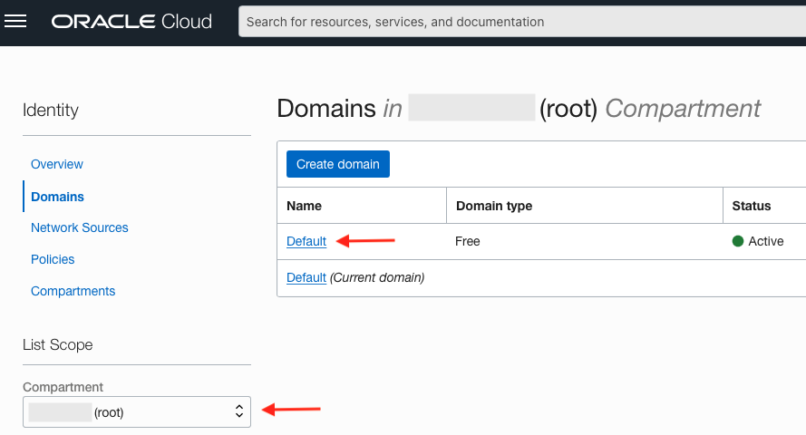

4. Click **Applications** in the menu on the left.

    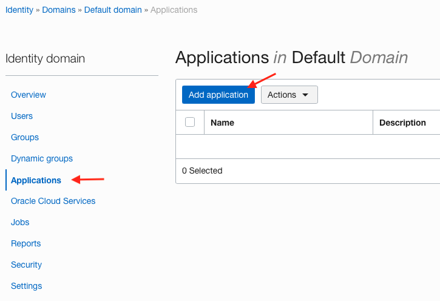

5. Click **Add application**.

6. Select **Confidential Application**. 

    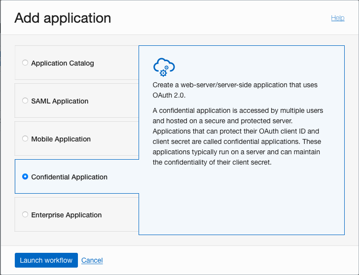

7. Click **Launch Workflow**. This takes you to the Add Confidential Application page.

8. Under Add application details, enter the following:
    - **Name**: ``Oracle E-Business Suite Cloud Manager``
    - **Description**: Enter a description.

9. Click **Next**.

10. Under Configure OAuth:

    a. Click **Configure this application as a client now**.
    
    b. Under Allowed Grant Types, select the following options:
    - Client Credentials
    - Refresh Token
    - Authorization Code

    c. Now, we are going to set our Cloud Manager URL. For this lab, use the following example URL: ``https://myebscm.ebshol.org:443``

    Save your Cloud Manager URL in your ``key-data.txt`` file as ``Cloud_Manager_URL``.

    Using the Cloud Manager URL you have just saved, append that URL with the following values as shown to enter your Redirect URL.

    d. **Redirect URL**: ``<Cloud Manager URL>/cm/auth/callback``
    
    For example: ``https://myebscm.ebshol.org:443/cm/auth/callback``

    e. **Post-Logout Redirect URL**: ``<Cloud Manager Balancer URL>/cm/ui/index.html?root=login``
    
    For example: ``https://myebscm.ebshol.org:443/cm/ui/index.html?root=login``

    f. **Logout URL**: Leave this field empty.

    

    g. Under Client Type, ensure that the **Confidential** radio button is selected.

    h. Select the **Introspect** option for Allowed Operations.

    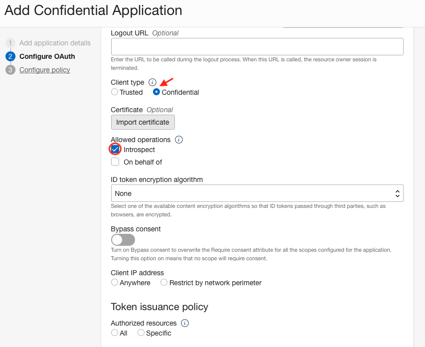

    i. Under Token Issuance Policy, select the **Add app roles** check box.

     1. Click **Add roles**.
        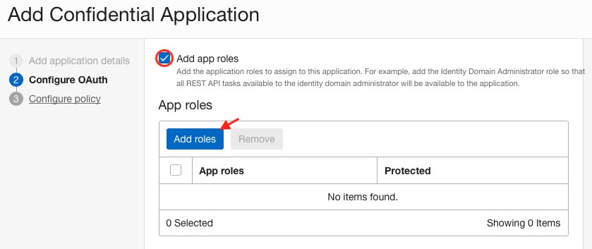
     2. Select **Authenticator Client** and **Me**. Then click **Add**.
        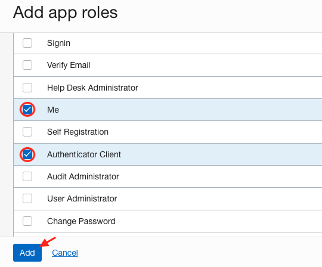
    
    3. Click **Next**.
    
11. Under Configure policy, click **Finish**.

    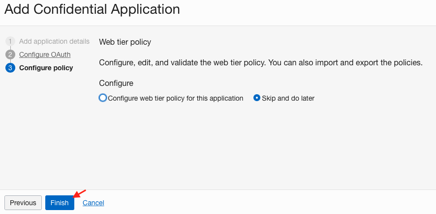

12. Make a note of the following values under General Information in your ``key-data.txt`` (under ``Client_ID`` and ``Client_Secret``, respectively):

    • Client ID

    • Client secret (In order to view, click Show secret.)

    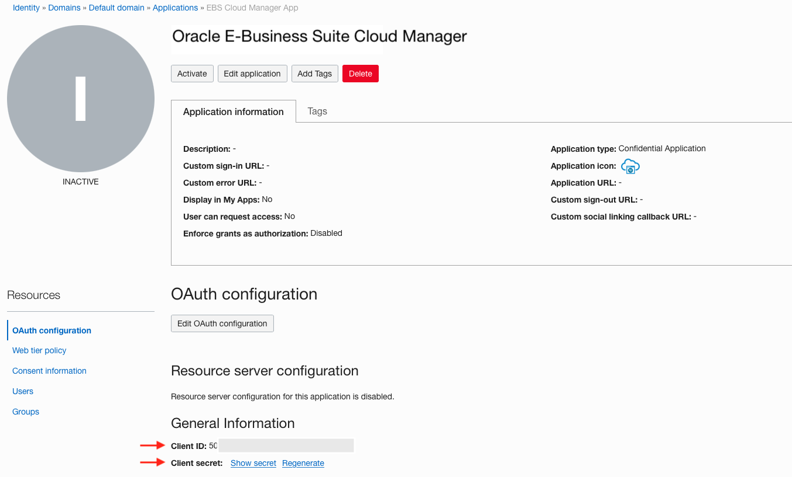

13. Click **Activate** and confirm to activate the confidential application.

    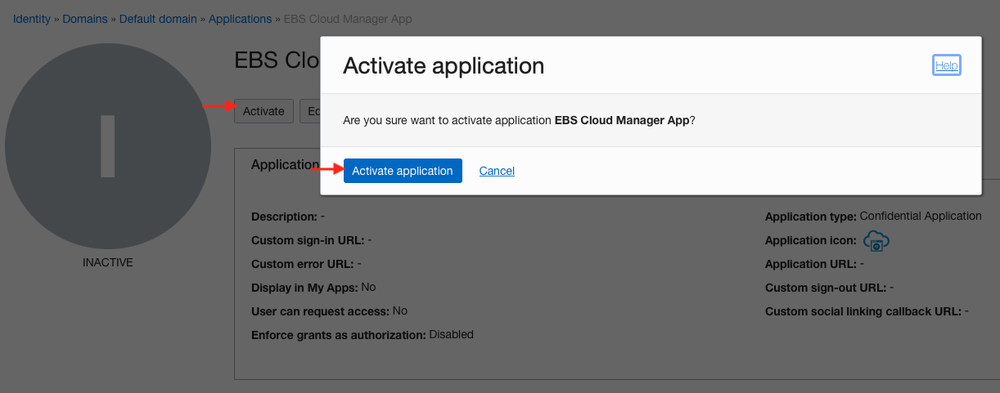

14. Record your Oracle Identity Cloud Service Client Tenant value as ``Client_Tenant`` in the ``key-data.txt``. This is found in the Overview of the default domain under the Domain Information section. It is seen as part of the URL found in Domain URL, after the "//" and before ".identity.oraclecloud.com". It begins with the characters "idcs-", followed by a string of numbers and letters in the format ``idcs-xxxxxxxxxxxxxxxxxxxxxxxxxxxxxxxx``

    For Example: ``idcs-6572bfeb183b4becad9e649bfa14a488``.
    
    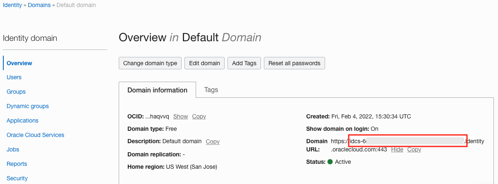

## Learn More

* [Learn About Deploying Terraform Stacks for E-Business Suite and Cloud Manager](https://docs.oracle.com/en/solutions/deploy-landing-zone-e-business-suite-cm/learn-deploying-terraform-stacks-e-business-suite-and-cloud-manager1.html#GUID-CAA809AC-2A7F-40F9-96E9-493C2F388494)
* [URL text 2](http://docs.oracle.com)

## Acknowledgements
* **Author** 
  - Santiago Bastidas, Product Management Director
* **Contributors** 
  -  Terri Noyes, Product Management Director
* **Last Updated By/Date** 
  - Tiffany Romero, May 2024
