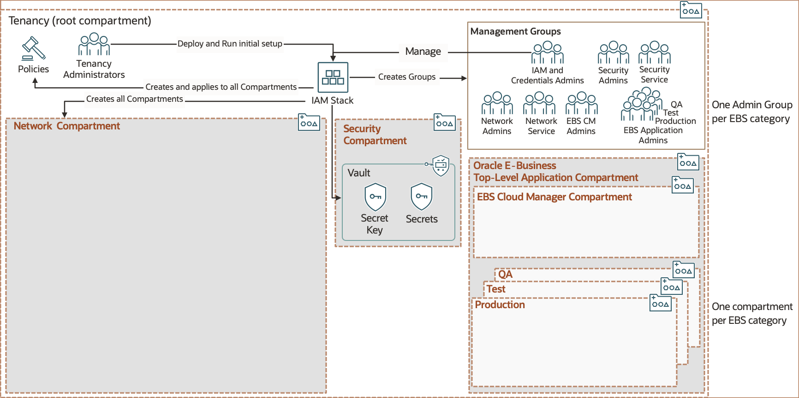
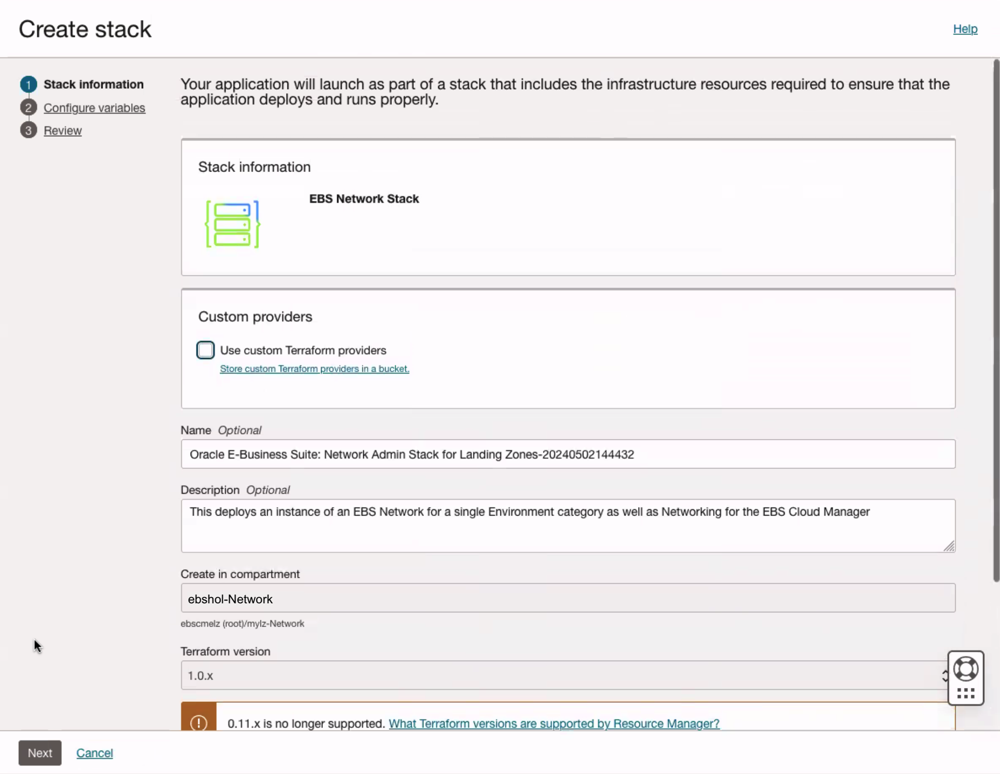

# Set Up the Landing Zone

## Introduction

This lab walks you through the steps to deploy a Terraform-based landing zone template to your tenancy. This template meets the security guidance prescribed in the CIS Oracle Cloud Infrastructure Foundations Benchmark and fulfills Oracle E-Business Suite (EBS)-specific workload requirements.

Estimated Lab Time: 25 minutes

### About Oracle Cloud Infrastructure Marketplace Stacks

We will be using resource manager stacks available on the Oracle Cloud Infrastructure (OCI) Marketplace to deliver the templates. In this lab, we will deploy *Oracle E-Business Suite: Tenancy Admin Stack for Landing Zones* and *Oracle E-Business Suite: Network Admin Stack for Landing Zones*.

### Objectives

In this lab, you will:
* Set up a compartments structure, administrative groups, and policies that make up the landing zone foundation.
* Set up the network required to deploy EBS workloads and EBS Cloud Manager.

### Prerequisites

This lab assumes you have:
* An Oracle Cloud account
* All previous labs successfully completed

## Task 1: Sign in to the Oracle Cloud Infrastructure Console

Use the tenancy administrator credentials to sign in to Oracle Cloud Infrastructure (OCI) Console.

1. Reference your `key-data.txt` file and locate the tenancy administrator credentials.

2. Sign in to the Oracle Cloud Infrastructure console using the following:

    * **User name**: `Tenancy_Admin_Username`
    * **Password**: `Tenancy_Admin_Password`

## Task 2: Create the Foundation

In this task, we will create the compartments, management groups, and policies that make up the foundation for the CIS OCI Foundations Benchmark.

The following diagram depicts the compartment distribution, which includes the application compartment for EBS workloads with subcompartments corresponding to environment categories (such as test or production).

1. In the Oracle Cloud Infrastructure (OCI) Console navigation menu, under **Marketplace**, select **All Applications**.

2. From the Marketplace applications page:

    a. Navigate to **Filter**, then **Type**, and select **Stack**.

    b. In the search bar, enter `E-Business Landing Zone`.

    c. Click the application **Oracle E-Business Suite: Tenancy Admin Stack for Landing Zones**.

    

    d. In the **Version** drop-down list, ensure the default is selected. 
    
    e. In the **Compartment** drop-down list, select the root compartment.

    f. Review and accept the Terms of Use.

    g. Click **Launch Stack**.

    

3. On the Stack information screen, enter the following values:

    a. **Name**: Default name is "Oracle E-Business Suite: Tenancy Admin Stack for Landing Zones-&lt;date&time&gt;".

    b. **Description**: Add a description for the stack.

    c. Click **Next**.

    

4. On the Configure variables screen, enter the following values:

    a. **Landing Zone Prefix**: `ebshol`

    b. **Parent Compartment**: Select your root compartment as the parent compartment for your resources.

    c. **EBS workload environment categories**: Using the drop-down list, add the following categories - **Production**, **QA**

    d. Click **Next**.

    

5. On the Review screen, ensure the **Run apply** checkbox is selected. Verify the information and click **Create**.

    

    Note that if you receive the following error while creating this stack, you must click on the "Stack Details" link at the top of the page. From there, click **Apply** and in the window that appears, click **Apply** again to rerun the stack.

    ``dial tcp: lookup <xxxxxxxxxxxxx>-management.kms.<region>>.oraclecloud.com on XXX.XXX.XXX.XXX:XX: no such host``

## Task 3: Create the Network

This task guides you through the process of running the network stack, which will allow you to define a VCN, subnets to support EBS Cloud Manager deployment, as well as the subnets for the first environment category. Additionally, you will configure security rules, and deploy gateways required to support a secured EBS workload deployment. 

The following diagram depicts a virtual cloud network with all subnets required for running EBS workloads and EBS Cloud Manager. The network stack can be deployed multiple times, one for each environment category. 

1. In the Oracle Cloud Infrastructure (OCI) Console navigation menu, under **Marketplace**, select **All Applications**.

2. From the Marketplace applications page:

    a. Navigate to **Filter**, then **Type**, and select **Stack**.

    b. In the search bar, enter `E-Business Landing Zone`.

    c. Click the application **Oracle E-Business Suite: Network Admin Stack for Landing Zones**.

    

    d. In the **Version** drop-down list, ensure the default is selected. 
    
    e. In the **Compartment** drop-down list, select "ebshol-Network".

    f. Review and accept the Terms of Use.

    g. Click **Launch Stack**.

    

3. On the Stack Information screen, enter the following values:

    a. **Name**: Default name is "Oracle E-Business Suite: Network Admin Stack for Landing Zones-&lt;date&time&gt;".

    b. **Description**: Add a description for the stack.

    c. Click **Next**.

    

4. On the Configure variables screen, enter the following values:

    a. **Security compartment**: Select "ebshol-Security" from the drop-down list.

    b. **Workload identifier**: Select "identity-ebshol-ebs" from the drop-down list.

    c. Ensure the **Create VCN** checkbox is selected (this is the default).

    d. Ensure the **Configure EBS Cloud Manager subnets** checkbox is selected (this is the default).

    

    e. Select the **Public EBS Cloud Manager load balancer** checkbox. The **EBS Cloud Manager instance subnet CIDR** field will auto-populate.

    f. Ensure the **Create subnets for an EBS environment** checkbox is selected (this is the default).

    g. In the **Environment category identifier** drop-down list, select "identity-ebshol-ebs-Production". The **Application tier subnet CIDR** and **Database tier subnet CIDR** fields will auto-populate.

    

    h. Select the **Create default load balancer tier subnet** checkbox. The **Load balancer subnet CIDR** will auto-populate.

    i. Select the **Create external load balancer and application tier subnets** checkbox. The **External load balancer subnet CIDR** and **External application tier subnet CIDR** fields will auto-populate. 

    

    j. In the Bastion section, ensure the **Create bastion subnet** and **Use bastion service** checkboxes are selected (this is the default). The **Bastion allow list** and **Bastion TTL Limit** will be prepopulated.

    k. Click **Next**.

    

5. On the Review screen, ensure the **Run apply** checkbox is selected. Verify the information and click **Create**.

    

## Learn More

* [Deploy a secure landing zone that meets the CIS Foundations Benchmark for Oracle Cloud](https://docs.oracle.com/en/solutions/cis-oci-benchmark/index.html)
* [Learn About Deploying Terraform Stacks for E-Business Suite and Cloud Manager](https://docs.oracle.com/en/solutions/deploy-landing-zone-e-business-suite-cm/learn-deploying-terraform-stacks-e-business-suite-and-cloud-manager1.html#GUID-CAA809AC-2A7F-40F9-96E9-493C2F388494)
* [Oracle E-Business Suite Cloud Manager Guide](https://docs.oracle.com/cd/E26401_01/doc.122/f35809/toc.htm)

## Acknowledgements
* **Author** - Santiago Bastidas, Product Management Director
* **Contributors** -  Tiffany Romero, Technical Writer; Terri Noyes, Product Management Director
* **Last Updated By/Date** - Tiffany Romero, EBS Documentation, May 2024
