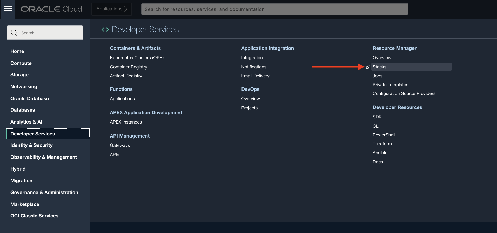
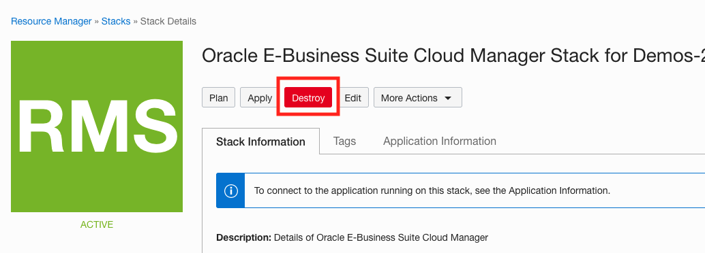
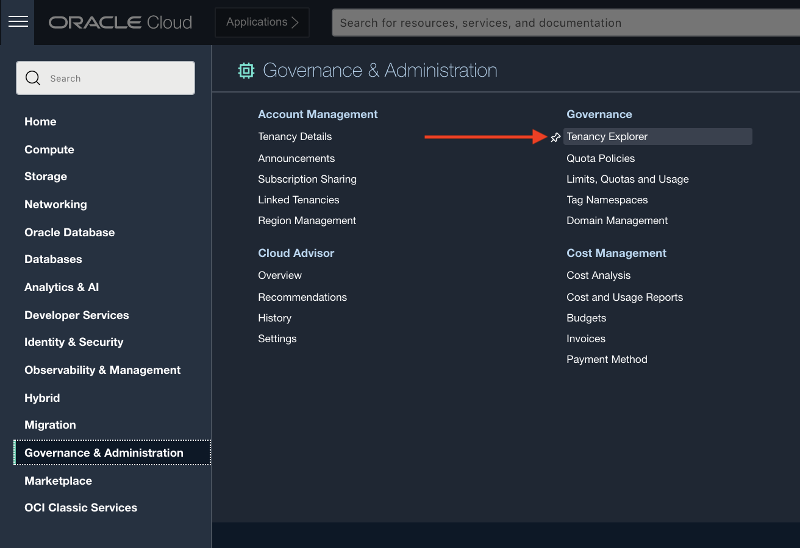
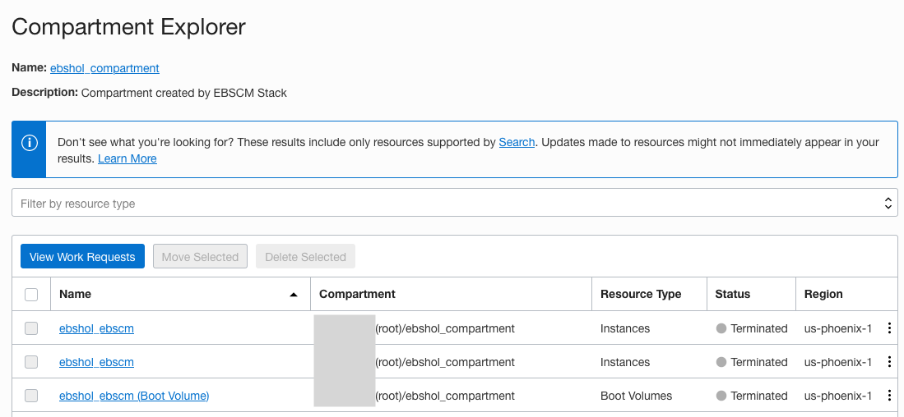

# Tear Down Your Oracle E-Business Suite Environments

## Introduction
In this lab, we will use Oracle E-Business Suite (EBS) Cloud Manager to delete your EBS environments. Then we will delete all the resources in Oracle Cloud Infrastructure (OCI) with the stack previously created in Lab 2. 

Estimated Lab Time: 15 minutes

### **Objectives**
* Delete your EBS environments.
* Destroy OCI resources used for EBS Cloud Manager.

### **Prerequisites**
* Tenancy Admin User
* Tenancy Admin Password
* Cloud Manager Admin Credentials

## Task 1: Delete the EBS Environment from Cloud Manager

1. Navigate to the EBS Cloud Manager Environments page.

2. For ebsholenv1, click the stacked lines to the right of the environment and select **Delete**. Confirm deletion by selecting **Yes** in the pop-up. 

    

    This will begin the deletion process and remove all resources created by the environment. You can check the progress of the deletion by clicking the link next to Latest Activity. 

    Once the environment has been deleted, it will no longer appear on the EBS Cloud Manager Environments page. 

    You can repeat this step for all other EBS environments you wish to delete. 

## Task 2: Delete the Cloud Manager Instance

1. Navigate to the OCI console and login as the tenancy admin user. Navigate to **Developer Services**, **Resource Manager**, then **Stacks**, and select the stack you used to create the Cloud Manager environment (ensure that you are in the correct compartment if no items display).

    

2. On the Stack Details page, select **Destroy**. Name your destroy job whatever you like and then click **Destroy**.

    

    The job will run and teardown all resources created by the stack, including the Cloud Manager instance and the networking components. 

3. Once the destroy job has finished and the Cloud Manager instance has been deleted, you may go to **Governance & Administration**, **Governance**, then **Tenancy Explorer**. Select **ebshol_compartment** on the left side of the screen to validate that it is empty. 

    Note: There may be resources still listed in the compartment, but they should have a status of **Terminated**. If there are still active resources in the compartment, you will need to destroy them before deleting the compartment. 

    

    

    In the Tenancy Explorer when viewing the **ebshol\_compartment** parent compartment (in this case the root compartment), you can click on the three dots to the right of **ebshol\_compartment** and then delete the compartment.

    

    You have now torn down all the resources you created for the EBS Cloud Manager instance and its EBS environments. 

## More Documentation on Oracle E-Business Suite Cloud Manager

If you're interested in the full capabilities of Oracle E-Business Suite Cloud Manager and would like to learn more, see the [Oracle E-Business Suite Cloud Manager Guide](https://docs.oracle.com/cd/E26401_01/doc.122/f35809/toc.htm)

## Acknowledgements

* **Author:** William Masdon, Cloud Engineering
* **Contributors:** 
  - Santiago Bastidas, Product Management Director
  - Quintin Hill, Cloud Engineering
  - Mitsu Mehta, Cloud Engineering
  - Chris Wegenek, Cloud Engineering
* **Last Updated By/Date:** Tiffany Romero, EBS Documentation, June 2024

