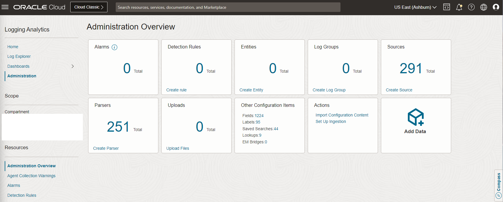
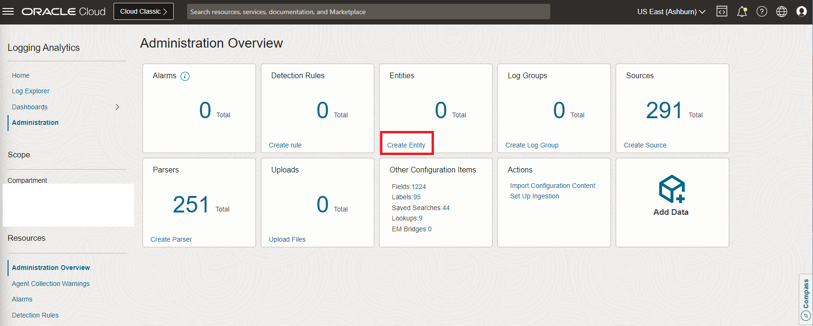
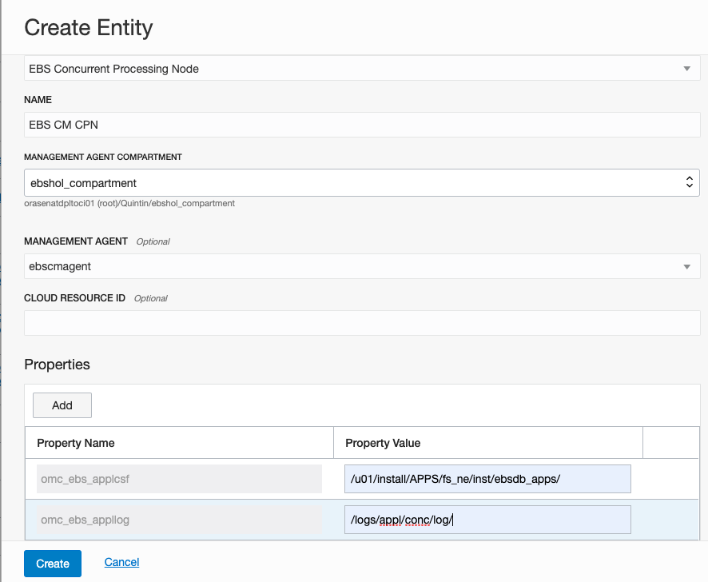
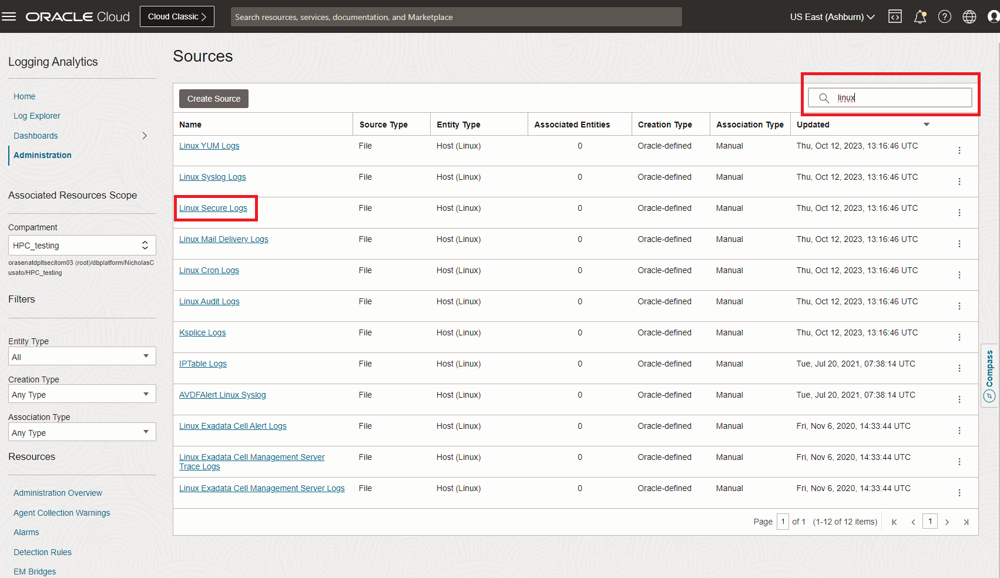
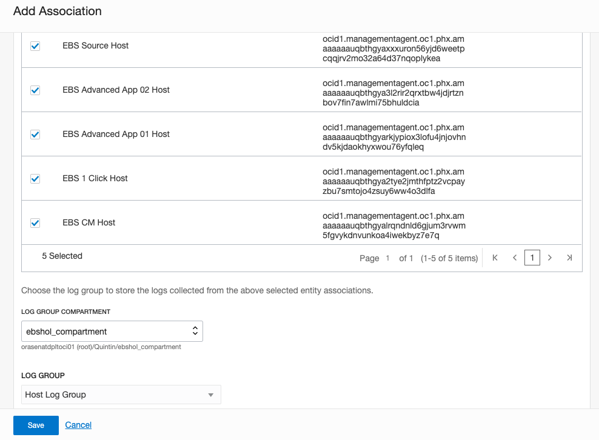
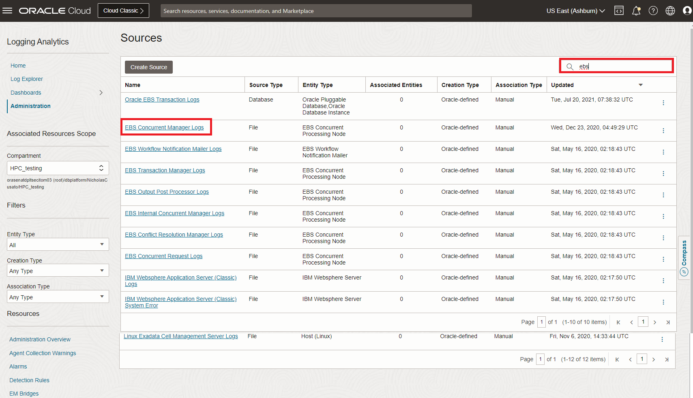

# Create Entities and Log Groups / Associate Log Sources

## Introduction

This lab will setup OCI Logging Analytics Service in the OCI Console creating Entities, Log Groups and Associating Log Sources. Now that we have our agents installed and our flow logs going to logging analytics we will now create entities and associate these entities with log sources.

**Here you can create Entities and Log Sources for the entities that you want to monitor. We recommend you start with one Entity to understand the flow and then repeat the rest.**

Estimated Lab Time: 30 minutes

### Objectives

In this lab, you will:
* Become familiar with creating Entities associating Log Sources and using Log Groups.
* At the end of this lab you will be able to visualize all your ingested data in the Log Explorer.

### Prerequisites
Complete Lab 1 and 2 of this workshop
* An Oracle Cloud Environment
* EBS Cloud Manager, EBS 1-Click and Advanced Provisioned Instance, Network - All done in the previous workshop

## Task 1: Create Entities

**Note:** Our entities for our flow logs are automatically setup. In this step we will focus on our Entities and Log Sources from the agents installs. 

1. We will create an entity for host logs and ebs logs for each of the agent installations. As you did in the previous step repeat the following steps for each of the servers you installed a management agent.

  

2. Navigate to Logging Analytics - Administration and click on **Entities**

3. From here you can see the Entities that already have been created. Click **Create Entity**

  

  (example is for our first EBS Cloud Manager agent)

  a. For host logs: 

    - Create an Entity with Entity Type: `Host(Linux)`
    - Name: EBS CM Host
    - Management Agent: ebscmagent
  b. Click **Create**

  

  c. For ebs concurrent processing logs:

    - Create an Entity with Entity Type: EBS Concurrent Processing Node
    - Name: EBS CM CPN
    - Management Agent: ebscmagent
    - Properties:
        - ```omc_ebs_applcsf: /u01/install/APPS/fs_ne/inst/<instance_name>/```
        - ```omc_ebs_appllog: /logs/appl/conc/log```

  

## Task 2: Create Host Log Group and EBS CPN Log Group

1. Navigate to Logging Analytics - Administration - Log Groups

2. Click **Create Log Group**

Name it `Host Log Group` and click **Create**

Repeat and name the other group `EBS CPN Log Group`

  

## Task 3: Associate Log sources
  
Now that you have your entities go to Logging Analytics - Administration - Sources

1. For Host Logs:

  a. Type in `linux` in the search bar on the right
    
  

  b. Click on `Linux Secure Logs`

  c. Click Add

  d. Click the box in the left to associate for all your Host Entities

  e. Select `Host Log Group` Click Save and Deploy

  

  f. Repeat for the following Log Sources: Linux Syslog Logs, Linux YUM Logs, Linux Audit logs, Linux Cron Logs, Ksplice Logs

2. For EBS logs:

  a. Type in `ebs` in the search bar

  

  b. Click on `EBS Concurrent Manager Logs`

  c. Click Add

  d. Click the box in the left to associate for all your EBS CPN entities

  e. Select `CPN Log Group` Click Save and Deploy

  

  f. Repeat for the following Log Sources: EBS Concurrent Request Logs, EBS Conflict Resolution Manager Log, EBS Internal Concurrent Manager log, EBS Transaction Manager Logs, Output Post Processor Logs

## Task 4: View your logs in the Log Explorer

Now that you have completed these steps you can go to the Log Explorer and view flow logs, ebs logs, host logs, and audit logs. In the next step we will create visualizations and dashboards based off this data.

  Note: If you have other logs you are looking to ingest find the respective log source and entity type and location of the log source and you can create the entity and the associate the respective log source with this same process.

This will now complete the Creating Entities Log Groups and associate Log Sources lab for this workshop.

You may now proceed to the next lab.

## Acknowledgements
* **Author** - Quintin Hill, Cloud Engineering, Packaged Applications
* **Contributors** -  Kumar Varun, Logging Analytics Product Management 
* **Last Updated By/Date** - Nicholas Cusato, Taylor Rees, Stephen Stuart, June 2023


