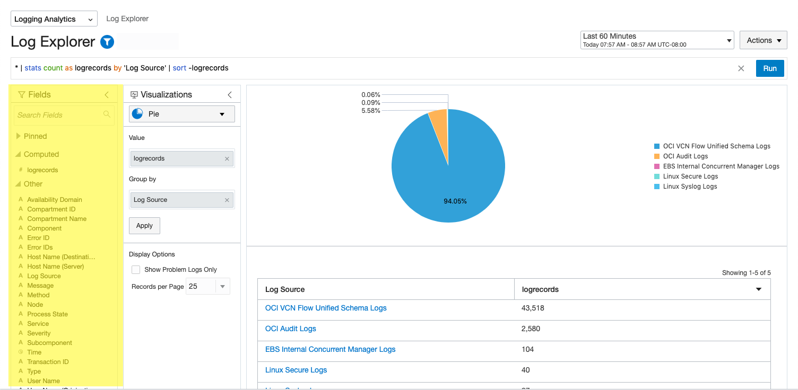
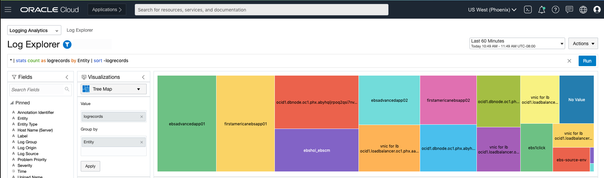
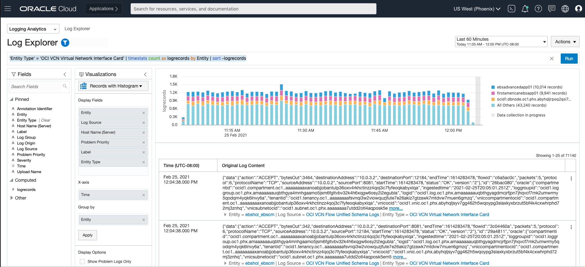

# Visualize Data in Log Explorer and Create Dashboards Logging

## Introduction

This lab you will begin using the visualizations in Log Explorer to gain insight from your data. In this Lab we will familiarize ourselves with the visualization tool `Log Explorer` and build dashboard.

Estimated Lab Time: 15-30 minutes

### Objectives

In this lab, you will:
* Visualize and Absorb this Data in the Logging Analytics User Interface.
* At the end of this lab you should be ready to begin creating your own dashboards and visualizations.

### Prerequisites
* Completed Labs 1-3 
* An Oracle Cloud Environment
* EBS Cloud Manager, EBS 1-Click and Advanced Provisioned Instance, Network - All setup in previous workshop

## Task 1: Overview of Log Explorer 

1. Navigate to Logging Analytics - Log Explorer

  **Note: The corresponding query will be shown captioned below each image.**

  Your screen will look similar to this, with a pie chart showing an overview of the different logs that you have ingested. Likely your VCN Flow Logs will dominate your pie chart.

  

2. The first being the Query Search. You can filter through and analyze your logs based off of regex that define your search. As you change your fields and visualizations you will see these changes in the graph and the query search bar. If you ever want to return to the initial dashboard go to **Actions** and click **Create New**

  

  ```* | stats count as logrecords by 'Log Source' | sort -logrecords```

3. The second being the Fields panel on the left. Here you can choose what fields you want to use for grouping, filtering, and exploring your log data. You can drag your fields into the visualization panel or click on the three dots to the right of the field name to filter or pin the field.

  

  ```* | stats count as logrecords by 'Log Source' | sort -logrecords```

4. The third is the Visualizations panel that you can select what kind of graph you would like to use for your widget as well as drag and drop fields into the proper axis.

  **Click the cluster visualization to see how this will change your widget**

  

  ```* | cluster```

5. Lastly the main part of the log explorer is where you can see the data in a visual. These are called widgets. 

## Task 2: Create a Dashboard

1. From the log explorer go to Actions in the top right and Click **Save As**

2. Provide  a Search Name: `logs cluster` and Description

3. Select Add to a dashboard

4. Select New Dashboard

5. make sure the compartment being used is our ebshol_compartment 

6. Give the Dashboard a name: `EBS Dashboard` and Description

  

7. Click **Save**

  Now Navigate to Logging Analytics - Dashboards

  a. You will see your EBS Dashboard. Click into it

  b. You will now see your visualization as the lone widget. Click **Edit** on the far right

  c. From the edit you can add additional widgets as well as change the size of your widget.

  

  d. As you create more widgets based off of queries or built using the fields and visualization panels you can add them from the right side by dragging the widget into the dashboard and placing as you see fit. Allowing you to customize your dashboard to your preference.

## Task 3: Example flow for analyzing your VCN Flow Logs
  
We will now walk through a flow to understand our logs and create some common widgets. Corresponding query will be shown captioned below each image

1. First lets look at the logs we have ingested based on Entity Type

2. Remove the `Log Source` from Group by and drag `Entity` from the fields panel

3. Hit Apply

4. You now have a widget showing your logs by Entity 

  

  ```* | stats count as logrecords by Entity | sort -logrecords```

5. This isn't too readable so lets change the visualization type.

6. click the down arrow next to `Pie` and select the `Histogram` or `TreeMap` to see breakdowns of this data in different graphs.

  

  ```* | timestats count as logrecords by Entity | sort -logrecords```

  

  ```* | stats count as logrecords by Entity | sort -logrecords```

7. Lets look at the histogram: ```* | timestats count as logrecords by Entity | sort -logrecords```

  

8. Let's drill deeper.

  a. Select Entity Type in the fields panel and select `OCI VCN Virtual Network Interface Card`

  

    ```'Entity Type' = 'OCI VCN Virtual Network Interface Card' | timestats count as logrecords by Entity | sort -logrecords```

  b. We see about the same graph as before as most of our logs are Network Flow logs right now. 

  c. Now select `ebsadvancedapp01`

  d. Now we see the logs strictly for ebsadvancedapp01 subnet.

  

  ```Entity = ebsadvancedapp01 | timestats count as logrecords by Entity | sort -logrecords```

  e. Lets scroll down and expand one of the logs. By clicking the arrow next to Log Source in the Original Log Content. You can now see the values that have been parsed from your logs.

  f. You can expand this at the bottom right of this entry.

  

  g. Now if you click on the value shown by Source IP you will now filter your logs that have this source IP.

9. Now go to the top clear your query and just type `reject` to find all the logs with a rejection on your network.

  

  ```reject | timestats count```
    
**Note: You can type `failed` or `error` instead of `reject` to see if there are any logs of this type that show up.**

This will now complete the Visualization lab for this workshop.

For more information on how to create widgets to understand your data refer to [visualize data using charts and controls](https://docs.oracle.com/en-us/iaas/logging-analytics/doc/visualize-data-using-charts-and-controls.html#GUID-93988D5B-9717-4F63-8362-16B08BC3E020)

You may now proceed to the next lab.

## Acknowledgements
* **Author** - Quintin Hill, Cloud Engineering, Packaged Applications
* **Contributors** -  Kumar Varun, Logging Analytics Product Management
* **Last Updated By/Date** - Nicholas Cusato, Taylor Rees, Stephen Stuart, June 2023


