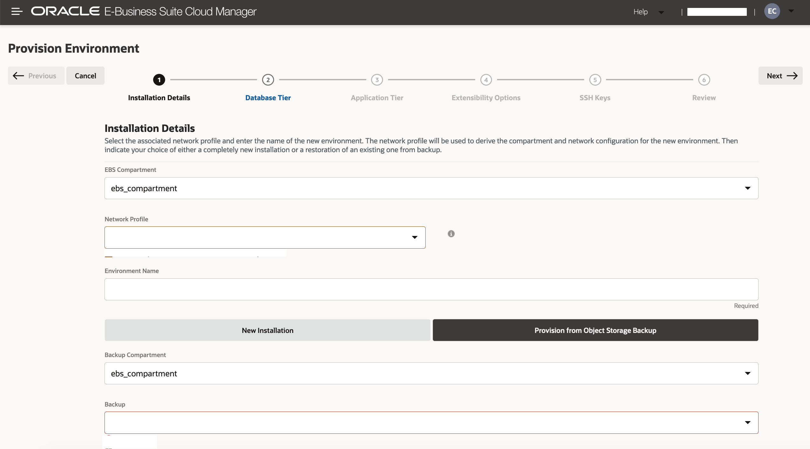
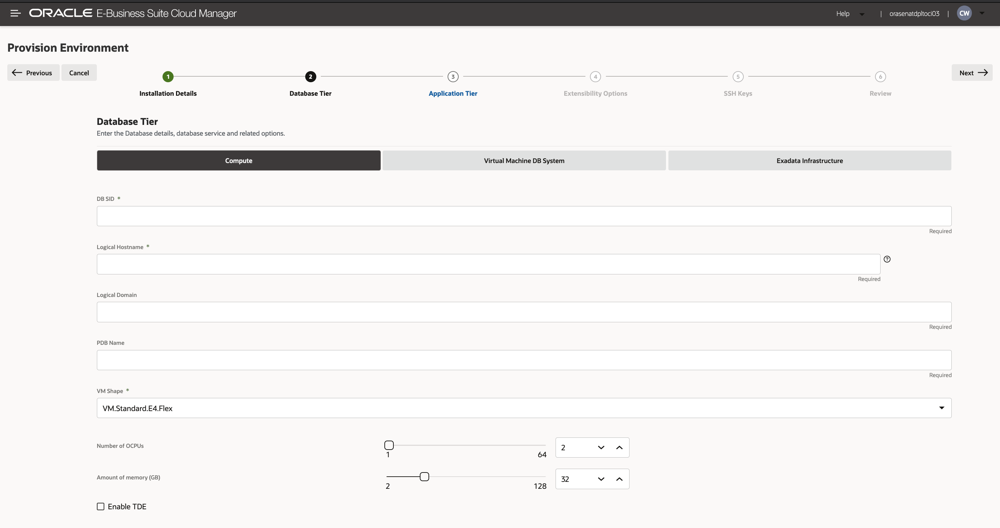
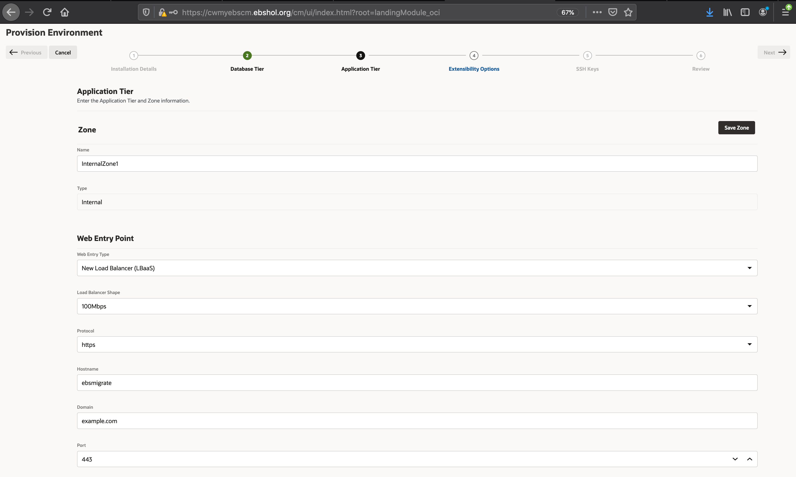
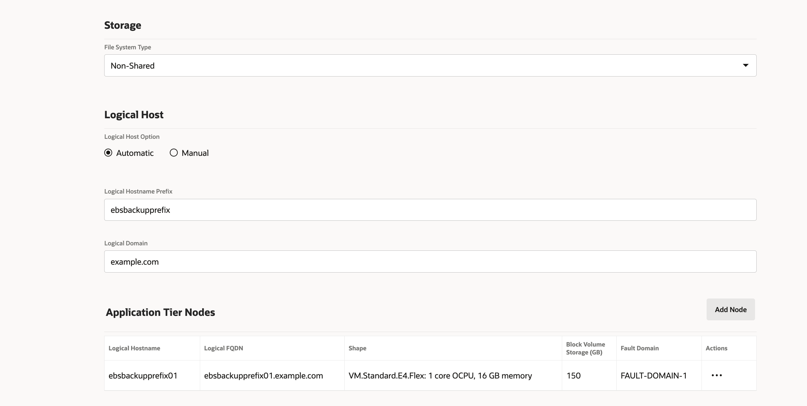
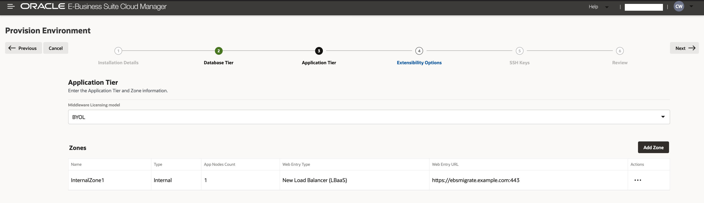
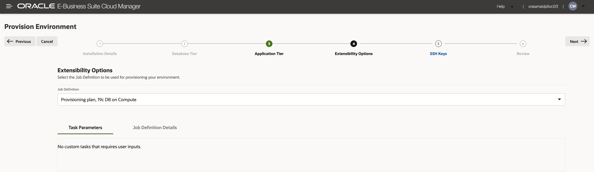
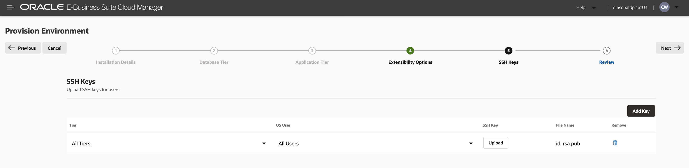
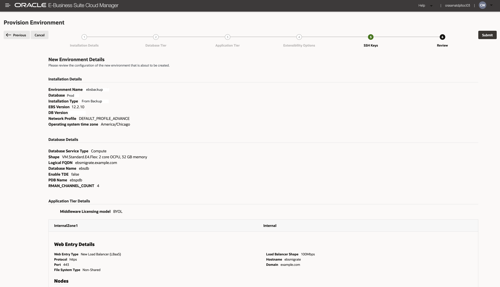

# Deploy an EBS Environment on Cloud Manager from a Backup

## Introduction

In this section, you will provision a new E-Business Suite Environment from the backup you created using the EBS Cloud Backup Module in the previous lab. 

**Estimated Lab Time:** 10 minutes (with approx. 1-1.5 hour wait time for provisioning)

### **Objectives**

In this lab, you will:
 
* Provision an EBS instance in Cloud Manager from a backup

### **Prerequisites**

* Complete **Lab 4: Create a Backup with the Oracle E-Business Suite Cloud Backup Module**
* key-data.txt file documented with following information:

    - `apps_password` (In this Lab: apps)
    - `weblogic_password` (In this Lab: welcome1)

## Task 1: Provision an EBS Instance on the Cloud Manager from the Backup
This step will take you through how to provision an E-Business Suite instance from a backup in Object Storage. In order to complete this step, you will need access to the Cloud Manager that was created in the previous workshop: [Lift and Shift On-Premises EBS to OCI](https://livelabs.oracle.com/pls/apex/dbpm/r/livelabs/view-workshop?wid=672&clear=180&session=5980193088668). 

1. Login to the EBS Cloud Manager using the SYSADMIN user and the password you created for the user in Lab 1. 

2. Click on **Advanced Provisioning** and then select **Provision from Object Storage Backup**.

3. Enter a name for the environment and then select **EBS1228COMPUTE** for Backup Bucket which contains the backup of the EBS instance you created in the previous lab.

    a. Enter the encryption password you created in the previous lab as well as the apps (default: apps) and weblogic server (default: welcome1) passwords.

    

    b. Click **Next**.

4. Enter a name for the database and create a password for the database. Enter a hostname and domain name for the database tier; as well as the type of compute you desire.

    

    Click **Next**. 

5. Specify a hostname and domain name for your web entry point. 

    **Hostname:** `ebsmigrate`

    **Domain:** `example.com`

    

    a. Specify a Logical Hostanme Prefix and Logical Domain.
    
    **Logical Hostname Prefix:** `ebsbackupprefix`

    **Logical Domain:** `example.com`

    b. Then add an app tier node.

    

    c. Click **Save Zone**

    

    d. Click **Next**. 

6. Do not change anything on the Extensibility Options menu. Click **Next**.

    

7. (Optional) Add SSH keys. Upload a public SSH key of your choice. Then click **Next**. 

    

6. After reviewing all the details, you can click **Submit** to begin provisioning the new instance on Cloud Manager from the backup you created in Lab 4. 

    

    After approximately 1-1.5 hours, your new EBS instance will finish provisioning and you will have successfully migrated an EBS environment to OCI. 

Congratulations, you have successfully migrated an EBS instance to the EBS Cloud Manager on OCI. 

## Learn More

* [Creating a Backup of an On-Premises Oracle E-Business Suite Instance on Oracle Cloud Infrastructure](https://www.oracle.com/webfolder/technetwork/tutorials/obe/cloud/compute-iaas/creating_backup_of_ebs_instance_on_oci/101_backup_oci.html)
* [Requirements for Oracle E-Business Suite on Oracle Cloud Infrastructure (Doc ID 2438928.1)](https://support.oracle.com/epmos/faces/DocumentDisplay?_afrLoop=97656525609392&id=2438928.1&_afrWindowMode=0&_adf.ctrl-state=1bsk4t5eng_4#S2)

## Acknowledgments

* **Author:** William Masdon, Cloud Engineering
* **Contributors:** 
    - Aurelian Baetu, Technology Engineering HUB - Cloud Infrastructure
    - Santiago Bastidas, Product Management Director
    - Quintin Hill, Cloud Engineering
    - Chris Wegenek, Cloud Engineering
* **Last Updated By/Date:** Chris Wegenek, Cloud Engineering - September 2021

