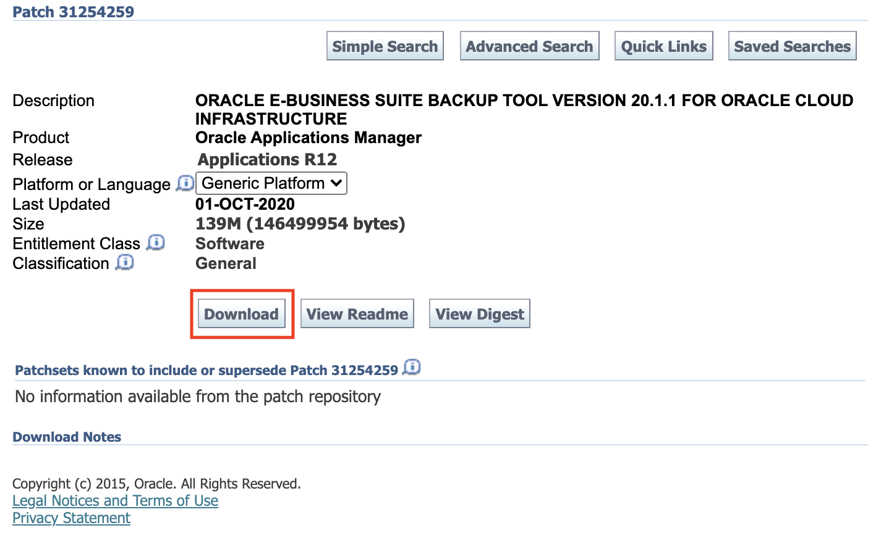

# Install the Oracle E-Business Suite Cloud Backup Module

## Introduction

This lab will walkthrough the downloading and configuration of the Oracle E-Business Suite Cloud Backup Module. 

**Estimated Lab Time:** 10 minutes

### **Objectives**

In this lab, you will:
* Download and Install the Oracle E-Business Suite Cloud Backup Module

### **Prerequisites**

* Complete Lab 2: **Prepare the Source Oracle E-Business Suite Environment**
* A MyOracleSupport account is needed to download the Cloud Backup tool to the source EBS environment.
* key-data.txt file documented with following information:

**From MyOracleSupport Account:**

* `MOS_Email_Address` (typically your tenancy admin user)

## Task 1: Install the Oracle E-Business Suite Cloud Backup Module

This section describes how to install the Oracle E-Business Suite Cloud Backup Module on the Linux server that you have chosen to use as the backup module server, which can be located either on-premises or in OCI Compute. It can be one of the Oracle E-Business Suite nodes or another server that resides in your intranet. The backup module server must have at least 500 MB of free space and must have the wget libraries installed.

Download the Backup Module from My Oracle Support to the backup module server.

1. Connect to the source EBS environment.

    SSH into the source EBS instance from your local machine by using the IP address and the SSH private key you used during the deployment of the source EBS instance. 

    ```
    <copy>
    ssh -i <private_ssh_key_filepath> opc@<Source_EBS__public_IP>
    </copy>
    ```

2. Change to the Oracle user and then go to the stage directory.

        <copy>
        sudo su - oracle
        cd /u01/install/APPS/stage
        </copy>

    

3. Copy the download link for the Backup Module. 

    Access the latest version of the Backup Module from My Oracle Support [Patch 33105050](https://updates.oracle.com/download/33105050.html). 

    Right click on the Download button and select **Copy link address**

    

4. Enter the wget command containing the patch name, your MyOracleSupport e-mail address, and the download link.

    Make sure to replace firstname.name@oracle.com with your MOS email address in this example: 

        wget --output-document=p33105050_R12_GENERIC.zip --http-user=<MOS_Email_Address> --ask-password '<download link>'
    
    Example:

        wget --output-document=p33105050_R12_GENERIC.zip --http-user=firstname.name@oracle.com --ask-password 'https://updates.oracle.com/Orion/Download/process_form/p33105050_R12_GENERIC.zip?file_id=109968332&aru=23539624&userid=O-firstname.name@example.com&email=firstname.name@example.com.com&patch_password=&patch_file=p33105050_R12_GENERIC.zip'

    Enter your MyOracleSupport account password when prompted. 

    

5. Extract the downloaded patch. Unzipping the patch zip file creates a directory named RemoteClone.

        <copy>
        unzip p33105050_R12_GENERIC.zip
        </copy>

    

6. Change to the RemoteClone directory and change the permission to "execute" for all the downloaded scripts.

        <copy>
        cd 33105050
        cd RemoteClone
        chmod +x *.pl
        chmod +x lib/*.sh
        </copy>

    
  
You may proceed to the next lab.

## Learn More

* [Creating a Backup of an On-Premises Oracle E-Business Suite Instance on Oracle Cloud Infrastructure](https://www.oracle.com/webfolder/technetwork/tutorials/obe/cloud/compute-iaas/creating_backup_of_ebs_instance_on_oci/101_backup_oci.html)
* [Requirements for Oracle E-Business Suite on Oracle Cloud Infrastructure (Doc ID 2438928.1)](https://support.oracle.com/epmos/faces/DocumentDisplay?_afrLoop=97656525609392&id=2438928.1&_afrWindowMode=0&_adf.ctrl-state=1bsk4t5eng_4#S2)

## Acknowledgments

* **Author:** William Masdon, Cloud Engineering
* **Contributors:** 
    - Aurelian Baetu, Technology Engineering HUB - Cloud Infrastructure
    - Santiago Bastidas, Product Management Director
    - Quintin Hill, Cloud Engineering
    - Chris Wegenek, Cloud Engineering
* **Last Updated By/Date:** Chris Wegenek, Cloud Engineering, September 2021


