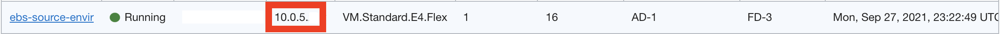
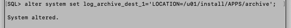

# Prepare the Source Oracle E-Business Suite Environment.

## Introduction

In this lab we prepare the source Oracle E-Business Suite instance to be migrated to the Cloud Manager on Oracle Cloud Infrastructure. 
You will copy the API Signing key from the Cloud Manager instance to the source Oracle E-Business Suite environment. 
Then you will create the stage area directories that will hold the backups and the Backup tool.
You will ensure SSH connectivity between all the of following nodes: the Node where the Backup tool is deployed, the Application Tier Node, and the Database Tier Node. 
Lastly, you will put the Database in Archive Mode before creating the backup.

**Estimated Lab Time:** 30 minutes

### **Objectives**

In this lab, you will:

* Copy an API key to the source environment
* Create stage area directories for the application and database tier
* Enable SSH on all required nodes
* Put the database into archive mode

### **Prerequisites**

* Complete Lab 1: **Creating the Source Oracle E-Business Suite Environment**
* key-data.txt file documented with following information:
    
    1.  **From Provisioning your Cloud Manager Instance You Should have recorded:**

        * `Cloud_Manager_Instance_public_IP`

    2. **From your source EBS Instance**

        * `Source_EBS_Instance_public_IP`
        * `Source_EBS_Instance_private_IP`
        * `Fully_Qualified_Hostname` (In this Lab: apps.example.com)
        * `apps_password` (In this Lab: apps)
        * `weblogic_password` (In this Lab: welcome1)

## Task 1: Copy API signing key to the source Oracle E-Business Suite environment

If you would like to use a different API key for the Source EBS instance you can follow the steps in these short tutorials. See [How to Generate an API Signing Key](https://docs.cloud.oracle.com/iaas/Content/API/Concepts/apisigningkey.htm#How), [How to Get the Key's Fingerprint](https://docs.cloud.oracle.com/iaas/Content/API/Concepts/apisigningkey.htm#How3), and "To Upload an API Signing Key" in [Using the Console](https://docs.cloud.oracle.com/iaas/Content/Identity/Tasks/managingcredentials.htm#three).

The key file must be placed in a location where it can be referenced by the Oracle E-Business Suite Cloud Backup Module. For example: `/u01/install/APPS/.oci/`

1. Connect to your Oracle E-Business Suite Cloud Manager Compute instance that was created in the previous workshop: [Lift and Shift On-Premises EBS to OCI](https://livelabs.oracle.com/pls/apex/dbpm/r/livelabs/view-workshop?wid=672&clear=180&session=5980193088668).
    
    SSH into the Cloud Manager instance from your local machine by using the IP address in the ``key-data.txt`` file and the SSH private key you used during the deployment of the Cloud Manager in OCI or by using Putty on a Windows machine. 

    ```
    <copy>
    ssh -i <private_ssh_key_filepath> opc@<Cloud_Manager_public_IP>
    </copy>
    ```

    

2. You will need to read the private API key using the ``cat`` command and copy the private API key to your clipboard or in a text file on your desktop.

    ```
    <copy>
    sudo su
    cd /u01/install/APPS/.oci/
    ls
    </copy>
    ```
    From here you should see a user name and associated pem key such as ``myebscm.admin@example.com.pem``
    Now run the cat command to print out the contents of the key (you may need to edit the name of the file in the command below)
    ```
    <copy>
    cat /u01/install/APPS/.oci/myebscm.admin@example.com.pem
    </copy>
    ```

    Select all the resulted characters to copy the key (make sure not to copy any spaces).

    Paste the key in a text file on your desktop.

    
    
3. Connect to the source EBS environment.

    SSH into the source EBS instance from your local machine by using the IP address and the SSH private key you used during the deployment of the source EBS instance. 

    ```
    <copy>
    ssh -i <private_ssh_key_filepath> opc@<Source_EBS__public_IP>
    </copy>
    ```

    

4. Switch to the Oracle user in the source EBS instance.

    ```
    <copy>
    sudo su - oracle
    </copy>
    ```

    

5. Create a directory named ``.oci``, create a ``.pem`` file with the same name as you had in the cloud manager instance. For example: **ebscm.admin@example.com.pem** and change permissions to the file.

    ```
    <copy>
    mkdir /u01/install/APPS/.oci
    cd /u01/install/APPS/.oci
    touch /u01/install/APPS/.oci/ebscm.admin@example.com.pem
    chmod 600 /u01/install/APPS/.oci/ebscm.admin@example.com.pem
    </copy>
    ```

    

6. Open the vi editor along with the path and name for the API key, paste the API key from your clipboard and Exit the vi editor with save.

    ```
    <copy>
    vi /u01/install/APPS/.oci/ebscm.admin@example.com.pem
    </copy>
    ```
    
    

    a. Press '``i``' on your keyboard to insert text.

    b. Paste the key by right clicking your mouse.

    c. Press '``Esc``'.

    d. To save the file write '``:wq``' and press '``Enter``'.
        
    

## Task 2: Create Stage and Archive Directories 

These directories will hold:

  * **Apps Stage Area directory** - temporary files used during the application tier backup process as well as the application tier backup file in zip or tar format that is created locally before it is uploaded to Oracle Cloud Infrastructure Object Storage.
  * **DB Stage Area directory** - backup utilities and the temporary files used to process the backup.

  * **Archive directory** - archive .dbf files for the database

    ```
    <copy>
    mkdir /u01/install/APPS/stage
    mkdir /u01/install/APPS/stage/appsStage
    mkdir /u01/install/APPS/stage/dbStage
    mkdir /u01/install/APPS/archive
    </copy>
    ```

    

## Task 3: Enable SSH on all Required Nodes

All nodes must have SSH enabled. 

In our case Application Tier Node, DB Tier Node and Backup module are on the same instance.

1. The SSH configuration file (~/.ssh/config) must have the entry **ServerAliveInterval 100**.
    ```
    <copy>
    cd  ~/.ssh
    touch ~/.ssh/config
    chmod 644 ~/.ssh/config
    vi ~/.ssh/config
    </copy>
    ```
    
    
        
    a. Press '``i``' on your keyboard to insert text

    b. Insert a new line containing "``ServerAliveInterval 100``".

    c. Press '``Esc``'.

    d. To save the file write '``:wq``' and press '``Enter``'.

    

2. Generate a new set of SSH keys without passphrase in the ~/.ssh/ directory. Choose default name for the keys. Press '``Enter``' when asked for a passcode to create the keys without one. 

    ```
    <copy>
    cd ~/.ssh
    ssh-keygen
    </copy>
    ```

    

3. Create the authorized keys file and update it with the SSH public key.

    ```
    <copy>
    cat ~/.ssh/id_rsa.pub >> ~/.ssh/authorized_keys
    </copy>
    ```

    

3. Verify the ssh connection by using the private IP of the source environment.

    You can find the private IP of the environment by checking the information of the ebs instance you created in the OCI console.

    
    
    ```
    <copy>
    ssh oracle@<Source_EBS_Instance_private_IP>
    </copy>
    ```

    Choose yes to connect to the host.

    

5. After verifying the connection is established you can close it. 
        
    ```
    <copy>
    exit
    </copy>
    ```

    

## Task 4: Put the database into Archive Mode

1.	Stop Apps Tier using the stopapps.sh script.

    ```
    <copy>
    /u01/install/APPS/scripts/stopapps.sh
    </copy>
    ```

    

2. Source the EBS environment and connect to the database.
        
    ```
    <copy>
    cd /u01/install/APPS/19.0.0/
    . ./ebscdb_apps.env run
    sqlplus / as sysdba
    </copy>
    ```

    

3. Check whether the Database is in archive mode.

    ```
    <copy>
    archive log list;
    </copy>
    ```

    

4. Put the Database in Archive mode.

    ```
    <copy>
    shutdown immediate;
    startup mount;
    alter database archivelog;
    alter database open;
    </copy>
    ```

    

5. Change the log archive destination. 

    ```
    <copy>
    alter system set log_archive_dest_1='LOCATION=/u01/install/APPS/archive';
    </copy>
    ```

    

6. Confirm that the Database is in Archive mode and close the Database connection.

    ```
    <copy>
    archive log list;
    </copy>
    ```

    ```
    <copy>
    exit
    </copy>
    ```

    

7. Start the applications tier by running the startapps.sh script.

    ```
    <copy>
    /u01/install/APPS/scripts/startapps.sh
    </copy>
    ```

    
  
You may proceed to the next lab.

## Learn More

* [Creating a Backup of an On-Premises Oracle E-Business Suite Instance on Oracle Cloud Infrastructure](https://www.oracle.com/webfolder/technetwork/tutorials/obe/cloud/compute-iaas/creating_backup_of_ebs_instance_on_oci/101_backup_oci.html)
* [Requirements for Oracle E-Business Suite on Oracle Cloud Infrastructure (Doc ID 2438928.1)](https://support.oracle.com/epmos/faces/DocumentDisplay?_afrLoop=97656525609392&id=2438928.1&_afrWindowMode=0&_adf.ctrl-state=1bsk4t5eng_4#S2)

## Acknowledgments

* **Author:** William Masdon, Cloud Engineering
* **Contributors:** 
    - Aurelian Baetu, Technology Engineering HUB - Cloud Infrastructure
    - Santiago Bastidas, Product Management Director
    - Quintin Hill, Cloud Engineering
    - Chris Wegenek, Cloud Engineering
* **Last Updated By/Date:** Chris Wegenek, Cloud Engineering, September 2021


