# Clone Your Oracle E-Business Suite Environment

## **Introduction**
In this lab, we will use the cloning feature of Oracle E-Business Suite (EBS) Cloud Manager to clone your Oracle E-Business Suite environment.

Estimated Lab Time: 15 minutes

Watch this short video to preview how to clone Oracle E-Business Suite using cloud manager.

[](youtube:Rxm2_5uL0Lg)

### **Objectives**
* Clone your EBS environment.
* Configure local host files for the cloned environment and log in to the cloned EBS environment.

### **Prerequisites**
* Tenancy Admin User
* Tenancy Admin Password
* Cloud Manager Admin Credentials

## Task 1: Access the Clone Environment Page

1. Navigate to the Cloud Manager Environments page.

2. From the ebsholenv1 environment page, click **Clone** in the top right. 

  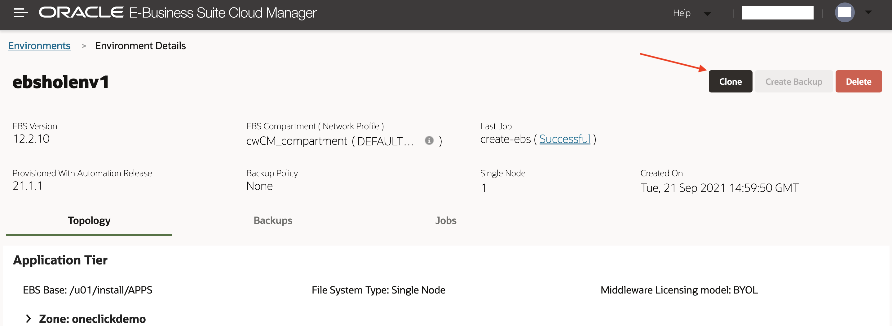

  Enter Details (see screenshot and points below)

3. Enter the following values for the clone details (Note these variables in your ``key-data.txt``):

    a. **Environment Name**: ebsholenv2

    b. **Source Apps Password**: apps

    c. **Source WebLogic Server Password**: welcome1

    d. Then, click **Next**.

    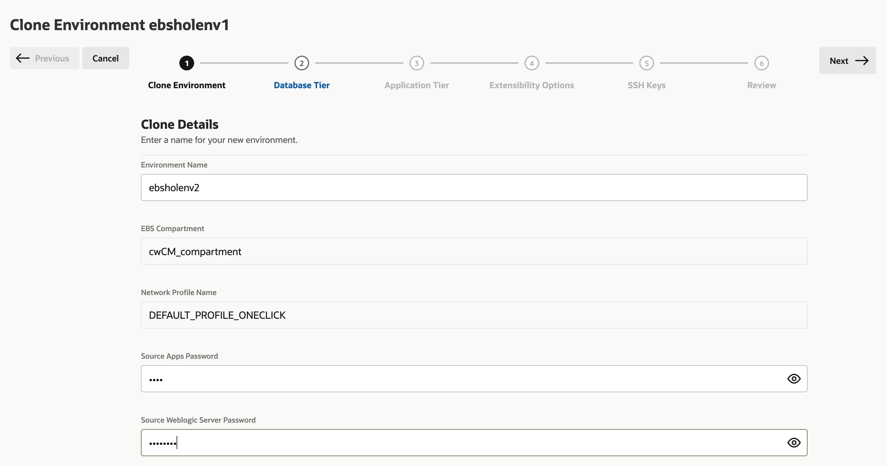

4. Database Tier: We can leave these values as they are and click **Next**.

    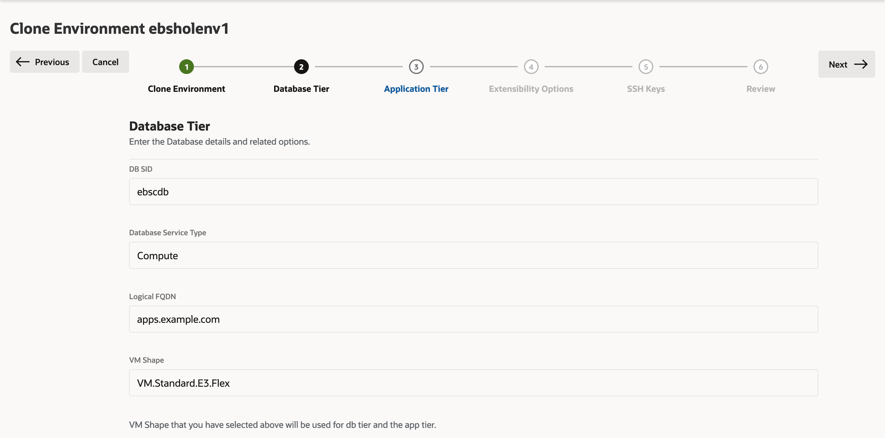

5. Application Tier: Make sure **Start Application Tier** is switched on.

    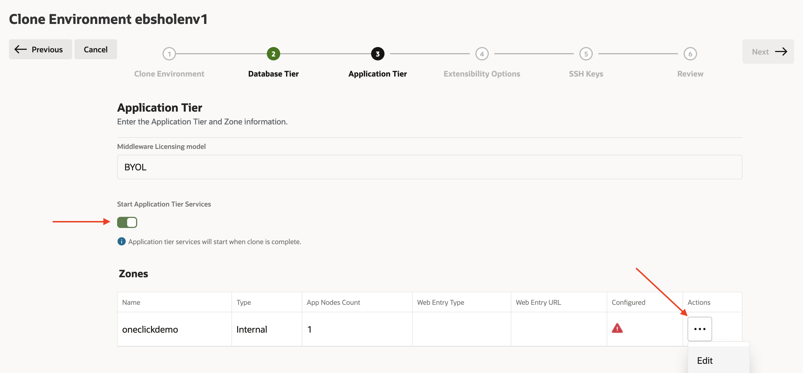
    Now under the Zones section, find the Actions icon, and click **Edit**. Enter and verify the following values:
    
    a. **Web Entry Type**: New Load Balancer

    b. **Load Balancer Shape**: Select 100Mbps

    c. **Protocol**: https

    d. **Hostname**: ebsholenv2 

    f. **Domain**: example.com

    g. **Port**: 443

    h. Click **Save Zone** and **Next**.

  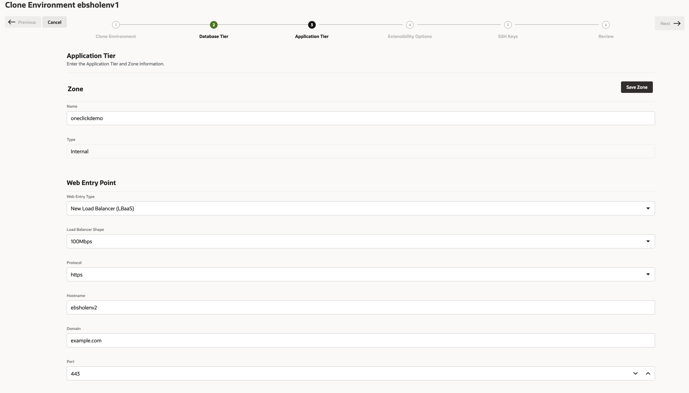

6. Extensibility Options:
    
    a. Click **Next**.

    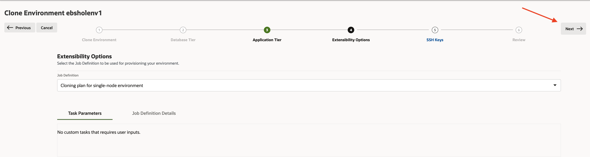
  
7. SSH Keys:

    a. Upload your SSH Key on the SSH Page.

    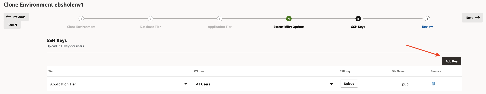

8. Review: 

    a. Review the information and click **Submit**.

     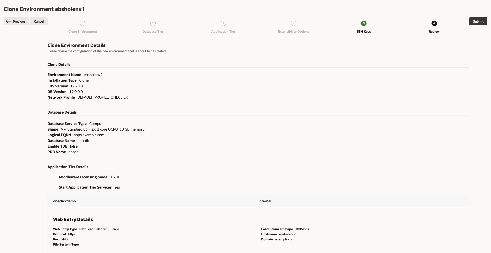

9. You can check the status of the activity to clone the environment in the Activities page. The new environment is listed on the Environments page.

## Task 2: Configure Local Host Files for the Cloned Environment and Log in to Oracle E-Business Suite

1. Now click the Cloud Manager environment "ebsholenv2".

2. Then click the arrow next to **Zone: oneclickdemo**.

  1. Note the IP address listed at **Web Entry IP**.

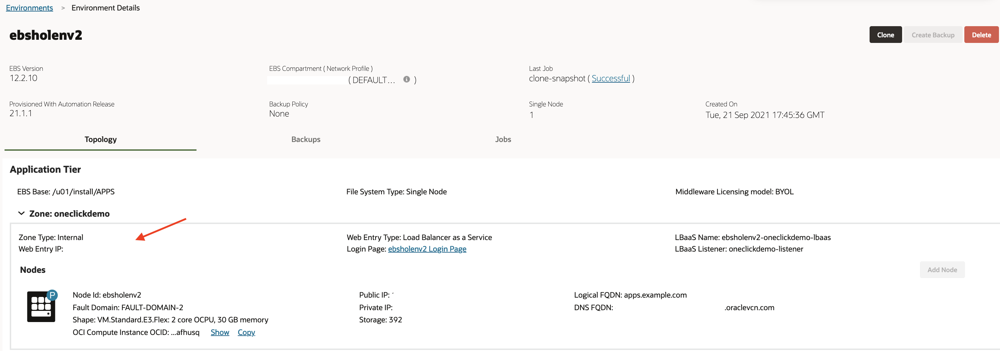

3. Edit the local hosts file on your laptop and add an entry.

  **For Windows users**

    1. Navigate to Notepad in your start menu.

    2. Hover over Notepad, right-click, and select the option **Run as Administrator**.

    3. In Notepad, navigate to **File** > **Open**.

    4. Browse to ``C:\\Windows\System32\drivers\etc``.

    5. Find the ``hosts`` file.

        

    6. In the hosts file, scroll down to the end of the content.

    7. Add the following entry to the very end of the file:
    ``<ip_address> ebsholenv2.example.com``

    8. Save the file.

  **For Mac users**

    1. Open a Terminal Window.

    2. Enter the following command:

        ```
        <copy>
        sudo vi /etc/hosts
        </copy>
        ```

      This will then require your local computer password to edit the file. Enter and you should see a screen similar to the one shown below.

    3. Type 'i' to edit the file.

    4. Go to the last line and add the following entry as show below:
    ``<ip_address> ebsholenv2.example.com``

    5. Once you have finished editing the file hit 'esc' and type ':wq' to save and exit.

        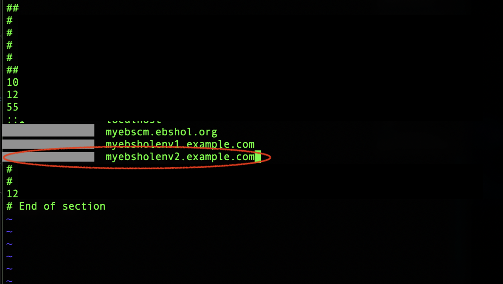

4. Log in to Oracle E-Business Suite:

  a. From the Cloud Manager environment page. Click the link following **Login Page:**

    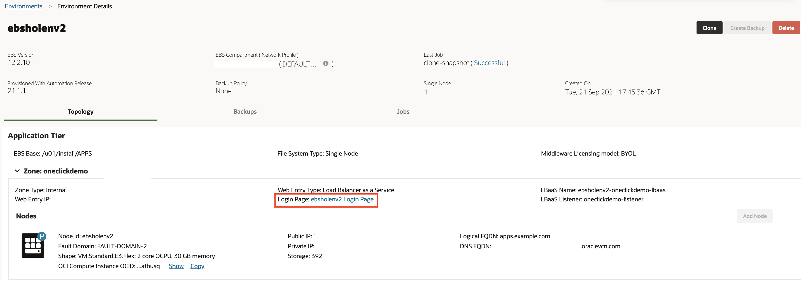

  b. When prompted, accept the warning concerning the certificate coming from an unauthorized certificate authority as we are using a self-signed certificate. (You will change the certificate with your own when executing this procedure outside of this hands-on lab.)

  c. On this page, you will log in to Oracle E-Business Suite with the credentials you generated in Lab 3, part 3.

  

## Acknowledgements

* **Author:** Quintin Hill, Cloud Engineering
* **Contributors:** 
  - Santiago Bastidas, Product Management Director
  - William Masdon, Cloud Engineering
  - Mitsu Mehta, Cloud Engineering
  - Chris Wegenek, Cloud Engineering
* **Last Updated By/Date:** Tiffany Romero, EBS Documentation, December 2023


