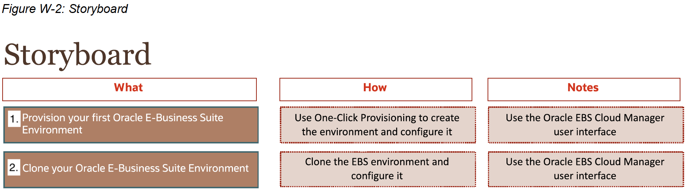

# Introduction

## About this Workshop

This workshop showcases the use of the Oracle E-Business Suite Cloud Manager graphical user interface to provision and clone environments on Oracle Cloud Infrastructure.

Estimated Workshop Time: 1 hours

Notes:

* The workshop is quite detailed and technical. PLEASE take your time and DO NOT skip any steps.
* IP addresses and URLs in the screenshots in this workbook may differ from what you use in the labs as these are dynamically generated.
* For security purposes, some sensitive text (such as IP addresses) may be redacted in the screenshots in this workbook.

UNIX commands (usually executed in an SSH session using PuTTY) are displayed in a monospace font within a box, as follows:

```
sudo yum install wget -y $ wget -O bitnami-mean-linux-installer.run https://bitnami.com/stack/mean/download_latest/linux-x64
```

### Workshop Overview

The following figure (W-1) outlines the workshop architecture.
Figure W-1: Workshop Architecture


This workshop uses the following components:

* Trial accounts (one per attendee)

  - Oracle E-Business Suite Cloud Manager Compute instance
    - User-provisioned using Oracle Marketplace image
    - Oracle E-Business Suite Cloud Manager application
    - EBS sandbox network deployment script

  - Oracle E-Business Suite environment 1 Compute instance
    - User-provisioned environment
    - Application and database tiers on this compute instance

  - Oracle E-Business Suite environment 2 Compute instance
    - Cloned from environment 1
    - Application and database tiers on this Compute instance

The following figure (W-2) describes the exercises that you will perform in this workshop.
Figure W-2: Storyboard



### Objectives

In this lab, you will:
* Use One-Click Provisioning feature of Oracle E-Business Suite Cloud Manager to provision an Oracle E-Business Suite environment
* Use Cloning feature of Oracle E-Business Suite Cloud Manager to clone your Oracle E-Business Suite environment

### Prerequisites

You will need the following in order to complete this workshop:

* A modern browser
* A secure remote login (Secure Shell, or SSH) utility
        - Such as PuTTY - downloaded from [here](https://www.ssh.com/ssh/putty/download)
* A secure copy program
        - Such as WinSCP - downloaded from [here](https://winscp.net/eng/index.php)
* Knowledge of basic UNIX commands

* Make sure that you have downloaded your CM `<number>`.zip file before starting this workshop.

You may now proceed to lab 1.

## Appendix
### Terminology

The following terms are commonly employed in Oracle E-Business Suite cloud operations and used throughout our documentation:

**Availability Domain** – One or more data centers located within a region.

**Bucket** – A logical container used by Object Storage for storing your data and files. A bucket can contain an unlimited number of objects.

**Compartments** – Allows you to organize and control access to your cloud resources. A compartment is a collection of related resources (such as instances, virtual cloud networks, block volumes) that can be accessed only by certain groups.

**Oracle E-Business Suite Cloud Backup Module** – The Oracle E-Business Suite Cloud Backup Module is a stand-alone tool that interviews the user to establish settings, and then uses those settings to back up an Oracle E-Business Suite environment to Oracle Cloud Infrastructure Object Storage.

**Oracle E-Business Suite Cloud Manager** - Oracle E-Business Suite Cloud Manager is a graphical user interface used for creating, managing, and configuring Oracle E-Business Suite environments on Oracle Cloud Infrastructure. Oracle E-Business Suite Cloud Manager can be used with the Oracle E-Business Suite Cloud Backup Module to lift and shift or clone environments from on-premises to Oracle Cloud Infrastructure.

**EBS Cloud Manager infrastructure** – Virtual network resources, compute resources, and policies required to run EBS Cloud Manager on Oracle Cloud Infrastructure.

**EBS Sandbox Virtual Cloud Network (VCN)** – Networking and compute resources required to run EBS on Oracle Cloud Infrastructure. The EBS Sandbox VCN includes the recommended networking resources (VCN, subnets routing tables, internet gateway, security lists, and security rules) to run Oracle E-Business Suite on OCI.

**Oracle Cloud Infrastructure Load Balancing Service** - The Oracle Cloud Infrastructure Load Balancing service provides automated traffic distribution from one entry point to multiple servers reachable from your virtual cloud network (VCN). The service offers a load balancer with your choice of a public or private IP address, and provisioned bandwidth.

**Oracle Cloud Infrastructure (OCI)** – Combines the elasticity and utility of public cloud with the granular control, security, and predictability of on-premises infrastructure to deliver high-performance, high availability, and cost-effective infrastructure services.

**Region** – Oracle Cloud Infrastructure are hosted in regions, which are located in different metropolitan areas. Regions are completely independent of other regions and can be separated by vast distances – across countries or even continents. Generally, you would deploy an application in the region where it is most heavily used, since using nearby resources is faster than using distant resources.

**Tenancy** – When you sign up for Oracle Cloud Infrastructure, Oracle creates a tenancy for your company, which is a secure and isolated partition within Oracle Cloud Infrastructure where you can create, organize, and administer your cloud resources.

**Virtual Cloud Network (VCN)** – A virtual version of a traditional network – including subnets, route tables, and gateways – on which your instances run. A cloud network resides within a single region, but can cross multiple availability domains.

## Acknowledgements

* **Author:** Quintin Hill, Cloud Engineering
* **Contributors:** Santiago Bastidas, Product Management Director
* **Last Updated By/Date:** Quintin Hill, Cloud Engineering, May 2021


