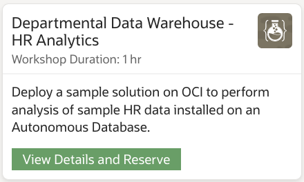

# Faster Richer Reporting of EBS Data
Are your LOB’s asking for faster, richer reporting of your EBS data? Are you looking to modernize your departmental data marts with your EBS data? Explore the process with Oracle Autonomous Data Warehouse and Oracle Analytics Cloud, where you can load and optimize data from EBS as well as a multitude of sources into a centralized data warehouse for analysis so departments can gain actionable insights faster.  This solution uses data in an Oracle Autonomous Data Warehouse and then uses Oracle Analytics Cloud to analyze the data to provide actionable insights.

## 

## Task 1: Access the Load and Optimize Data from EBS workshop

Access the workshop at [Load and Optimize Data from EBS](https://apexapps.oracle.com/pls/apex/r/dbpm/livelabs/run-workshop?p210_wid=678).

Lines of business like the Human Resources department, typically, don't have timely or efficient access to data and information. Analysts gather the data manually, work with it on an individual basis, and then share copies of files through email or file servers. With Oracle Autonomous Data Warehouse and Oracle Analytics Cloud, you can load and optimize data from a multitude of sources into a centralized data warehouse for analysis so departments can gain actionable insights.

This solution uses data in an Oracle Autonomous Data Warehouse (ADW) and then uses Oracle Analytics Cloud (OAC) to analyze the data to provide actionable insights.

This workshop will guide you through the installation of HR schema, available on the Oracle Autonomous Database. Thereafter, you will learn how to connect ADW to OAC and show a sample analysis with some refined data.

[Learn more now!](https://apexapps.oracle.com/pls/apex/r/dbpm/livelabs/run-workshop?p210_wid=678)

## Acknowledgements

* **Author:** Brad Tewksbury, Senior Director, Business Development
* **Last Updated By/Date:** Tiffany Romero, EBS Documentation, May 2023

