# Preparing Your Tenancy for Oracle E-Business Suite

## Introduction
In this exercise, you will prepare your Oracle E-Business Suite environment by setting up Oracle E-Business Suite Cloud Manager authentication.

Estimated Lab Time: 30 minutes
<!--
Watch this short video to preview how to prepare your tenancy for Oracle E-Business Suite.

-->
### **Objectives**
* Register Oracle E-Business Suite Cloud Manager as a confidential application.

### **Prerequisites**
* This step is to be performed by the tenancy administrator.

## Task 1: Sign in to the Oracle Cloud Infrastructure Console

Use the tenancy administrator credentials to sign in to Oracle Cloud Infrastructure console.

1. Reference your ``key-data.txt`` file and locate the tenancy administrator credentials.

2. Sign in to the Oracle Cloud Infrastructure console using the following:

    * **User name**: ``Tenancy Admin User``
    * **Password**: ``Tenancy Admin Password``

## Task 2: Register Cloud Manager as a Confidential Application in Tenancies Using IAM with Identity Domains

1. Open the navigation menu and click **Identity & Security**. Under **Identity**, click **Domains**.

    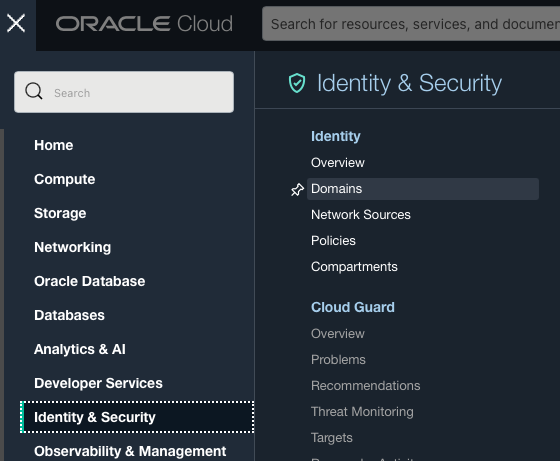

2. Select the root compartment in the **Compartment** drop-down list.

3. Within the list of domains, click the link for the "Default" domain.

    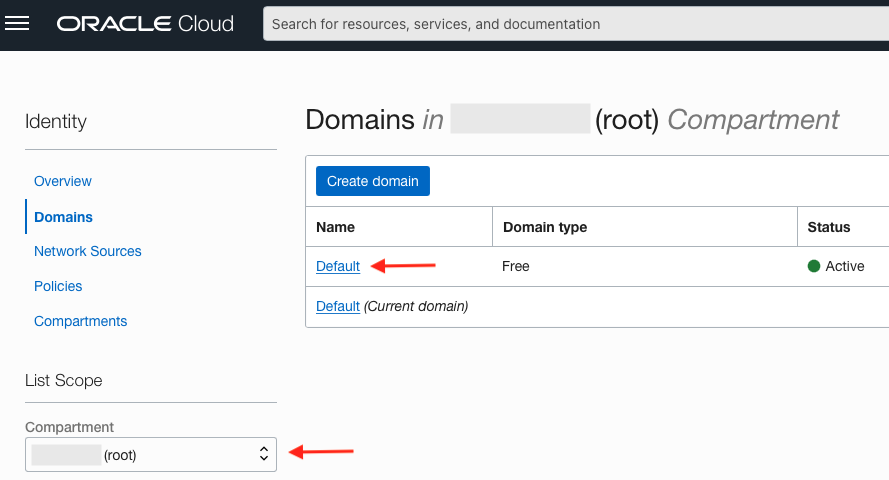

4. Click **Applications** in the menu on the left.

    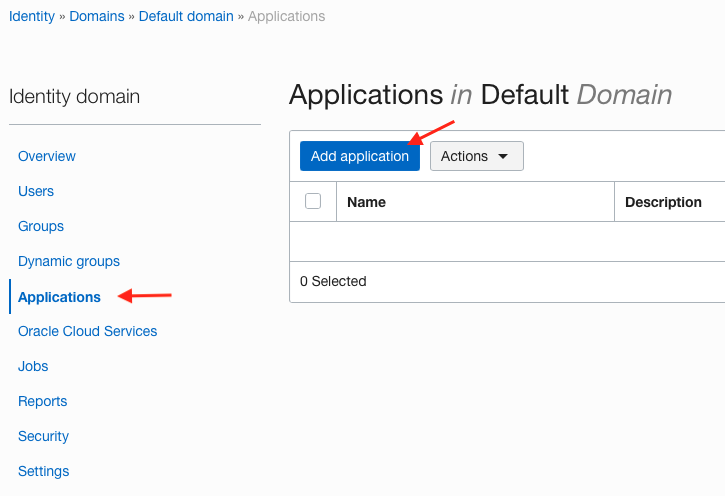

5. Click **Add application**.

6. Select **Confidential Application**. 

    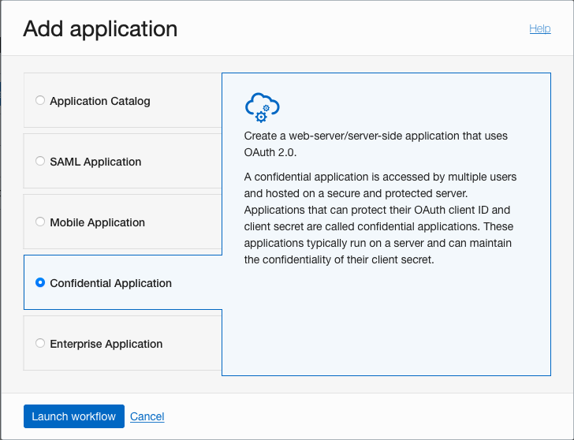

7. Click **Launch Workflow**. This takes you to the Add Confidential Application page.

8. Under Add application details, enter the following:
    - **Name**: ``Oracle E-Business Suite Cloud Manager``
    - **Description**: Enter a description.

9. Click **Next**.

10. Under Configure OAuth:

    a. Click **Configure this application as a client now**.
    
    b. Under Allowed Grant Types, select the following options:
    - Client Credentials
    - Refresh Token
    - Authorization Code

    c. Now, we are going to set our Cloud Manager URL. For this lab, use the following example URL:

        Example Cloud Manager URL: https://myebscm.ebshol.org:443

    Save your Cloud Manager URL in your ``key-data.txt`` file as ``Cloud_Manager_URL``.

    Using the Cloud Manager URL you have just saved, append that URL with the following values as shown to enter your Redirect URL.

    d. **Redirect URL**: ``<Cloud Manager URL>/cm/auth/callback``
    
        Example: https://myebscm.ebshol.org:443/cm/auth/callback

    e. **Post-Logout Redirect URL**: ``<Cloud Manager Balancer URL>/cm/ui/index.html?root=login``
    
        Example: https://myebscm.ebshol.org:443/cm/ui/index.html?root=login

    f. **Logout URL**: Leave this field empty.

    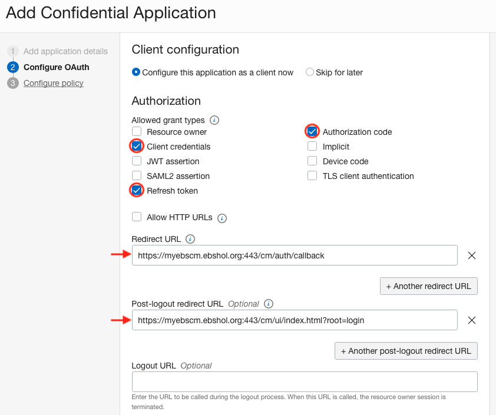

    g. Under Client Type, ensure that the **Confidential** radio button is selected.

    h. Select the **Introspect** option for Allowed Operations.

    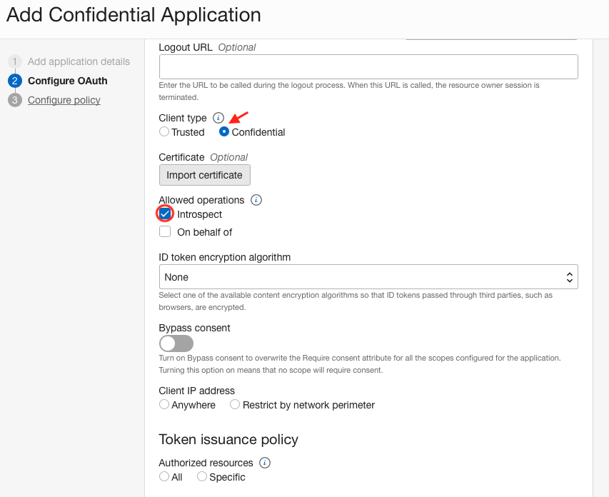

    i. Under Token Issuance Policy, select the **Add app roles** check box.

     1. Click **Add roles**.
        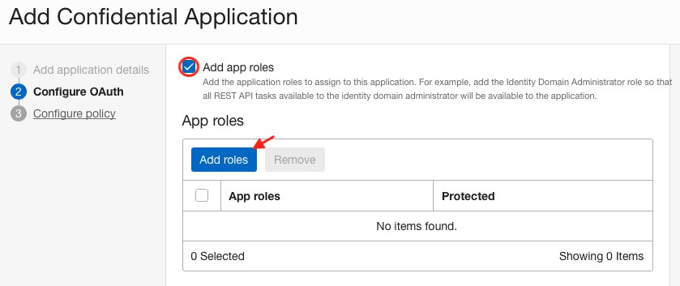
     2. Select **Authenticator Client** and **Me**. Then click **Add**.
        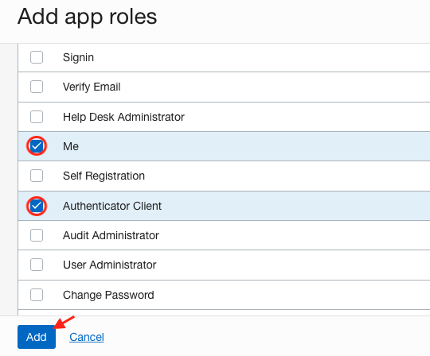
    
    3. Click **Next**.
    
11. Under Configure policy, click **Finish**.

    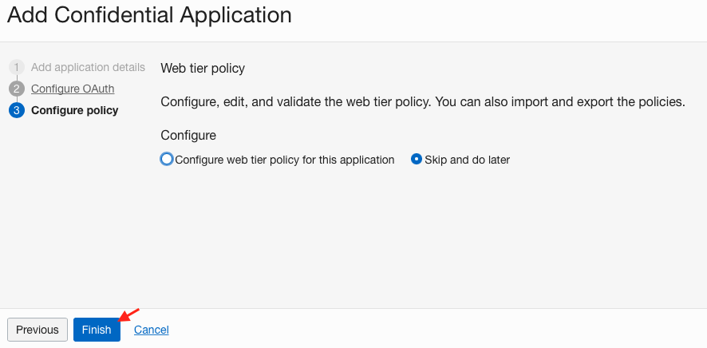

12. Make a note of the following values under General Information in your ``key-data.txt`` (under ``Client_ID`` and ``Client_Secret``, respectively):

    • Client ID

    • Client secret (In order to view, click Show secret.)

    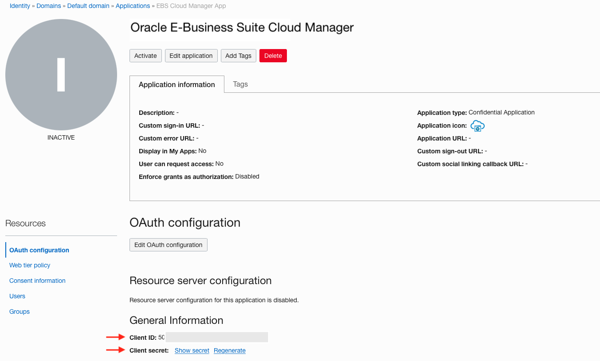

13. Click **Activate** and confirm to activate the confidential application.

    

14. Record your Oracle Identity Cloud Service Client Tenant value as ``Client_Tenant`` in the ``key-data.txt``. This is found in the Overview of the default domain under the Domain Information section. It is seen as part of the URL found in Domain URL, after the "//" and before ".identity.oraclecloud.com". It begins with the characters "idcs-", followed by a string of numbers and letters in the format ``idcs-xxxxxxxxxxxxxxxxxxxxxxxxxxxxxxxx``

    For Example: ``idcs-6572bfeb183b4becad9e649bfa14a488``.
    
    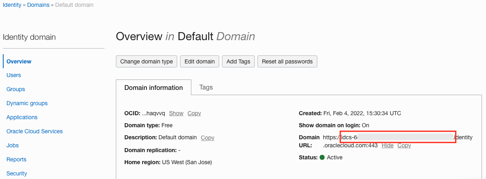

You may now proceed to the next lab.

## Acknowledgements

* **Authors:** 
  * Santiago Bastidas, Product Management Director
  * Vijay Kumar Vudari Satyanarayana, Principal Cloud Architect
  * Danish Ansari, Principal Cloud Architect
* **Contributors:** 
  - William Masdon, Cloud Engineering
  - Mitsu Mehta, Cloud Engineering
  - Chris Wegenek, Cloud Engineering
* **Last Updated By/Date:** Tiffany Romero, EBS Documentation, May 2023

