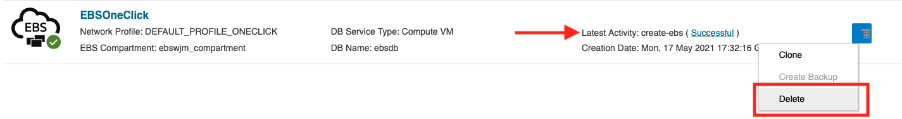

# Teardown Your Oracle E-Business Suite Environments

## Introduction
In this lab, we will use the Oracle E-Business Suite Cloud Manager to destroy your Oracle E-Business Suite environments.

Estimated Lab Time: 5 minutes

### **Objectives**
* Delete your EBS environments

### **Prerequisites**
* Tenancy Admin User
* Tenancy Admin Password
* Cloud Manager Admin Credentials

## Task 1: Delete the EBS Environment from Cloud Manager

1. Navigate to the Cloud Manager Environments page.

2. For ebsholenv1, click the stacked lines to the right of the environment and select **Delete**. Confirm deletion by selecting **Yes** on the popup. 

    

    The environment will begin the deletion process. This will teardown all resources created by the environment. You can check the progress of the deletion by clicking the link next to Latest Activity. 

    Once the environemnt has been destroyed, it will no longer appear on the Cloud Manager Environements page. 

    You can repeat this step for all other EBS environments you wish to delete. 

## Acknowledgements

* **Author:** William Masdon, Cloud Engineering
* **Contributors:** 
  - Santiago Bastidas, Product Management Director
  - Quintin Hill, Cloud Engineering
  - Mitsu Mehta, Cloud Engineering
* **Last Updated By/Date:** William Masdon, Cloud Engineering, May 2021

