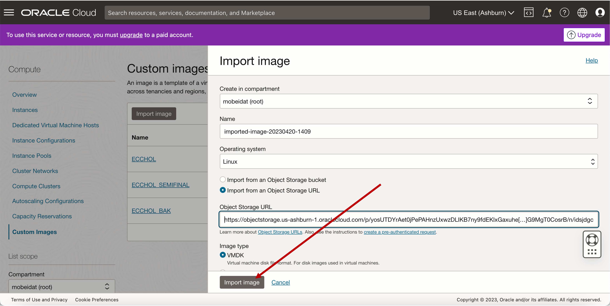
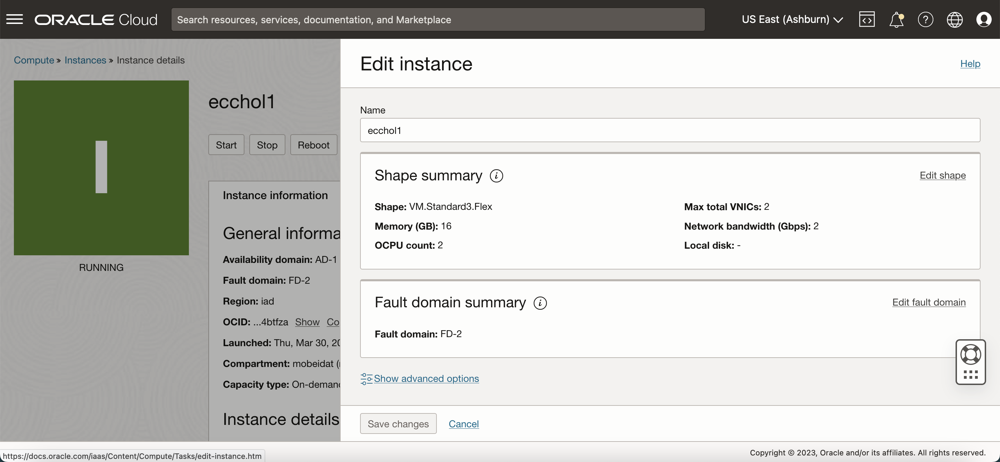

# Instantiate an instance of a compute machine using a custom image


This lab walks you through the steps to instantiate an instance of a compute machine using a custom image provided so that you can set up Oracle Enterprise Command Center Framework


Estimated Time: 20 minutes

### Objectives
In this lab, you will:
* Instantiate an instance of a compute machine using a custom image


### Prerequisites

This lab assumes you have:
* An Oracle Cloud account
* All previous labs successfully completed

##  

## Task 1: Instantiate an of a compute machine using a custom image

1. Login to Oracle cloud  https://cloud.oracle.com with your  account details in order to create an instance from custom image 

2. Click on the side navigation panel on the left and click on "Compute" 

    
3. After clicking on "Compute" click on "Custom Images"
    
4. Click on the "Import image" button  
    

5. Click on the radio button "Import from an Object Storage URL" and Copy/Paste the below URL 
    ```
  	 <copy>https://objectstorage.us-ashburn-1.oraclecloud.com/p/yosUTDYrAet0jPePAHnzUxwzDLIKB7ny9fdEKlxGaxuhe[…]G9MgT0CosrB/n/idsjdgcr3efb/b/ECCBucket/o/ECCHOL</copy>
    ```

6. Click on "Import image"
    

7. You should see the image importing as in the below screen
    
9. Click on the image, you should see it is importing
    
10. When the image loads, you will see the below screen (The colour changes to green)
    
11. Click on "Create instance"  
    
12. Name your instance as "ecchol1"

    
13. Click on "Edit" in the Image and Shape section, and then Edit the Image shape
    

    

14. From "Shape series" either select "Intel" or "AMD" processor and select the checkbox to modify the OCPUs and memory

    
    ```
  	    Shape name for AMD: VM.Standard.E4.Flex
Shape name for Intel: VM.Standard3.Flex
Select Core: 2 and Memory (GB): 16 
    ```
  
    

15. For the purpose of this demo select "Intel" as processor in Shape series. <n>Following is an example:
    ```
  	     Shape: VM.Standard3.Flex, 
OCPU count: 2,
Network bandwidth (Gbps): 2, 
Memory (GB): 16 and
Local disk: Block storage only 
    ```

16. Click on "Select Shape"
    
17. Click on "Edit" in the Networking section  
    


18. Select  Create the option "Create a new virtual cloud network(VCN)"
    
For more information please refer [Set up VCN] (https://github.com/oracle-livelabs/apex/blob/c717ad669a90218e2f18290d7ab2d850ae9134a3/forms-to-apex-migration-dbcs/setup-vcn/setup-vcn.md)
19. Save  respective  private and public key as a backup, so that you can establish an ssh connection to the instance. This is an optional step, only required if you want to connect via ssh

    

20. Click on "Create" to create the instance

21. You will see the below screen when this step is successful

    

22. Copy the Public IP address shown

    

23. Navigate from the side navigation panel, to "Networking", to "Virtual Cloud Network"

    

24. Click on the VCN you just created

    
25. Click on the subnet

    


26. Click on the security list
    
27. Create an ingress rule for port 6080 to whitelist it in the subnet created in VCN. To do that click on "Add ingress rule"

    
28. In Destination port add 6080, in Source CIDR add 0.0.0.0/0 and click on "Add Ingress rules"

    
29. Once the instance is up and running you can access livelabs(VNC)  via the following URL 

<b>Note:</b> Replace {PUBLICIP} with the Public IP of the instance you copied before

```
  	 <copy>http://{PUBLICIP}:6080/vnc.html?password=LiveLabs.Rocks_99&resize=scale&quality=9&autoconnect=true&reconnect=true</copy>
```
```
  	 <copy>Example: http://150.166.145.18:6080/vnc.html?password=LiveLabs.Rocks_99&resize=scale&quality=9&autoconnect=true&reconnect=true</copy>
```


30. You should see the below screen when you access the URL above:
    


## Task 2: Validate instance

Open the respective VNC URL from your local system browser (replace PUBLICIP with the Public IP of the instance you copied before)
<pre><button class="copy-button" title="Copy text to clipboard">Copy</button><code class="hljs apache"><span class="copy-code"><span class="hljs-attribute">http://{PUBLICIP}:6080/vnc.html?password=LiveLabs.Rocks_99&resize=scale&quality=9&autoconnect=true&reconnect=true

</span></code></pre></li>

Within the browser, navigate to chrome and from the address bar go to http://apps.example.com:8000 and verify:

* If EBS homepage is displayed
* Login with following credentials:

 <pre><span class="hljs-attribute">Username= SYSADMIN
Password= welcome1


</span></code></pre></li>
* Ensure if the responsibility tree is up


<b>Note:</b> If you are not able to type in VNC, then please hit the command key


## Task 3: Validate if EBS run edition can be sourced 

<n>To Source EBS edition</n>

* Type the following command (Case is important) in the command prompt :
<pre><button class="copy-button" title="Copy text to clipboard">Copy</button><code class="hljs apache"><span class="copy-code"><span class="hljs-attribute">source /u01/install/APPS/EBSapps.env run

</span></code></pre></li>

In the image below, the terminal shows how you source the running EBS edition on the terminal.


## Optional Task: Access instance via SSH 

Apart from accessing via VNC you can access the instance from your own machine via SSH

* Using the private key you previously saved, run the following command in the command prompt to access the instance. Also use the saved Public IP address in the placeholder

<pre><button class="copy-button" title="Copy text to clipboard">Copy</button><code class="hljs apache"><span class="copy-code"><span class="hljs-attribute">ssh -i privatekey opc@{PUBLICIP}

</span></code></pre></li>

## Optional Task: Correct mistakes if made during instance creation

<b>Note</b>: If you have made a mistake whilst creating the instance, you can edit via configuration details.

Example: If you have set Memory as 8gb instead of 16gb then you should go to the instance page

* Click on edit and change the configuration accordingly


  
## Learn More
* [Enterprise Command Centres- User Guide](https://docs.oracle.com/cd/E26401_01/doc.122/e22956/T27641T671922.htm)
* [Enterprise Command Centres- Administration Guide](https://docs.oracle.com/cd/E26401_01/doc.122/f34732/toc.htm)
* [Enterprise Command Centres- Extending Guide](https://docs.oracle.com/cd/E26401_01/doc.122/f21671/T673609T673618.htm)
* [Enterprise Command Centres- Installation Guide](https://support.oracle.com/epmos/faces/DocumentDisplay?_afrLoop=264801675930013&id=2495053.1&_afrWindowMode=0&_adf.ctrl-state=1c6rxqpyoj_102)

* [Enterprise Command Centres- Direct from Development videos](https://learn.oracle.com/ols/course/ebs-enterprise-command-centers-direct-from-development/50662/60350)
* [Enterprise Command Centres for E-Business Suite- Technical details and Implementation](https://mylearn.oracle.com/ou/component/-/117416)

## Acknowledgements

* **Author** - Muhannad Obeidat, VP
* **Contributors** -  Muhannad Obeidat, Nashwa Ghazaly, Mikhail Ibraheem, Rahul Burnwal, Manikanta Kumar and Mohammed Khan
* **Last Updated By/Date** - Mohammed Khan, August 2023

