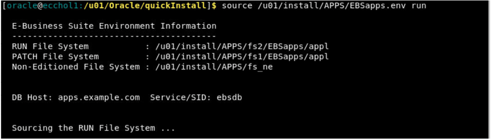
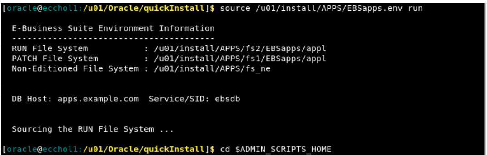
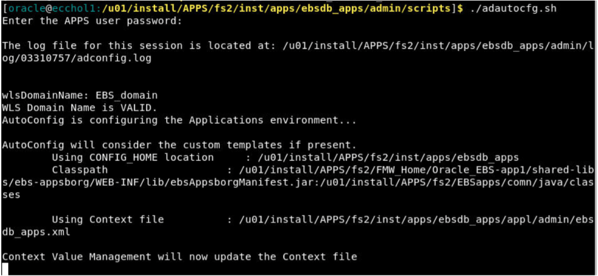
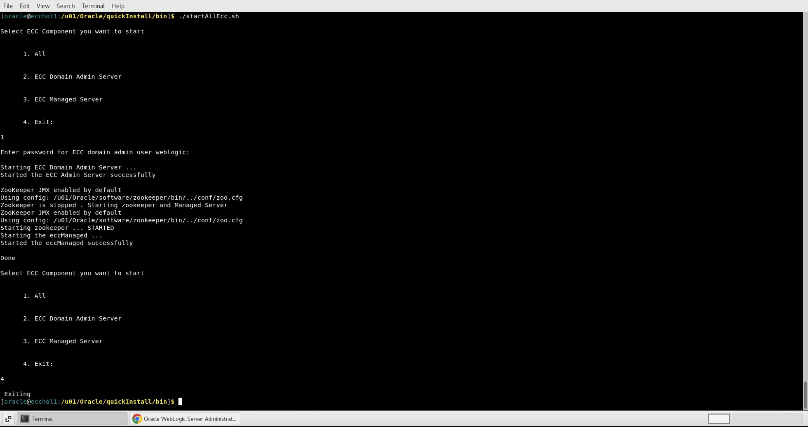

# Troubleshooting


### Introduction

This lab walks you through the steps needed to start and stop EBS apps services and  Enterprise Command Center Framework (ECC)


Estimated Time: 30 minutes


### Objectives

In this lab, you will:
* Learn how to start and stop ECC

### Prerequisites 

This lab assumes you have:
* Completed all previous labs successfully 
 

##  Task 1: Learn how to run autoconfig,start & stop EBS apps 
1. Open EBS terminal and then run AutoConfig. For running Autoconfig you need to first source the EBS run edition using below command

    ```
  	 <copy>source /u01/install/APPS/EBSapps.env run</copy>
    ```
    

2. Then, navigate to below location

    ```
  	 <copy>cd $ADMIN_SCRIPTS_HOME</copy>
    ```

    

3. Run the below script

    ```
  	 <copy>./adautocfg.sh</copy>
    ```


4. It will prompt you for apps password which is by default **apps** 

    
    

5. Once Autoconfig runs successfully then navigate to below location:

    ```
  	 <copy>cd $ADMIN_SCRIPTS_HOME</copy>
    ```


    


6. And then, run the following script to check OHS status:


    ```
  	 <copy>./adapcctl.sh status</copy>
    ```

    

7. And then, run the following script to stop OHS regardless if OHS was UP/Down:


    ```
  	 <copy>./adapcctl.sh stop</copy>
    ```


       

8. And then, run the following script to start OHS:

    ```
  	 <copy>./adapcctl.sh start</copy>
    ```


    

9. And then, run the following script again to check the OHS status if it has successfully started:

    ```
  	 <copy> ./adapcctl.sh status</copy>
    ```


    
 

## Task 2: Learn how to start and stop ECC

1. Start ECC

   Start the Oracle Enterprise Command Center Framework servers by running the **./startAllEcc.sh** script located in the $ECC_BASE/Oracle/quickInstall/bin directory and choosing option 1 - All. This option starts the Oracle Enterprise Command Center Framework managed server and the admin server in the required sequence. When prompted, enter the Oracle Enterprise Command Center Framework domain admin server user name and password.

   


2. Stop ECC

   Stop the Oracle Enterprise Command Center Framework servers by running the **./stopAllEcc.sh** script located in the $ECC_BASE/Oracle/quickInstall/bin directory and choosing option 1 - All. This option stops the Oracle Enterprise Command Center Framework managed server and the admin server in the required sequence. When prompted, enter the Oracle Enterprise Command Center Framework domain admin server user name and password.


You may now  **proceed to the next lab**

## Learn More
* [Enterprise Command Center- User Guide](https://docs.oracle.com/cd/E26401_01/doc.122/e22956/T27641T671922.htm)
* [Enterprise Command Center- Admistration Guide](https://docs.oracle.com/cd/E26401_01/doc.122/f34732/toc.htm)
* [Enterprise Command Center- Extending Guide](https://docs.oracle.com/cd/E26401_01/doc.122/f21671/T673609T673618.htm)
* [Enterprise Command Center- Installation Guide](https://support.oracle.com/epmos/faces/DocumentDisplay?_afrLoop=264801675930013&id=2495053.1&_afrWindowMode=0&_adf.ctrl-state=1c6rxqpyoj_102)
* [Enterprise Command Center- Direct from Development videos](https://learn.oracle.com/ols/course/ebs-enterprise-command-centers-direct-from-development/50662/60350)
* [Enterprise Command Center for E-Business Suite- Technical details and Implementation](https://mylearn.oracle.com/ou/component/-/117416)

## Acknowledgements

* **Author**- Muhannad Obeidat, VP

* **Contributors**-  Muhannad Obeidat, Nashwa Ghazaly, Mikhail Ibraheem, Rahul Burnwal and Sriram Sumaithangi

* **Last Updated By/Date**- Sriram Sumaithangi, May 2025

