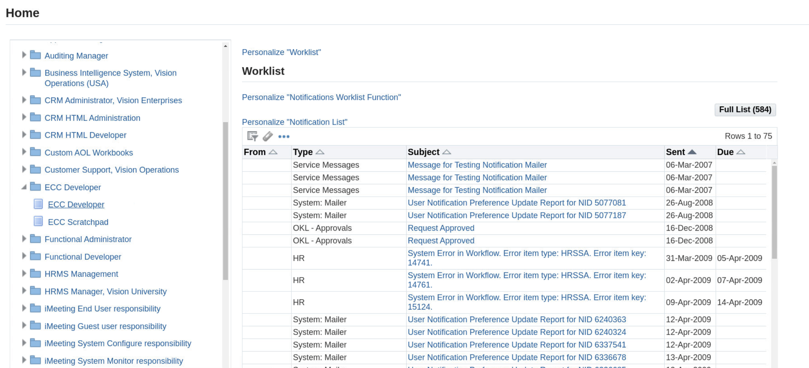
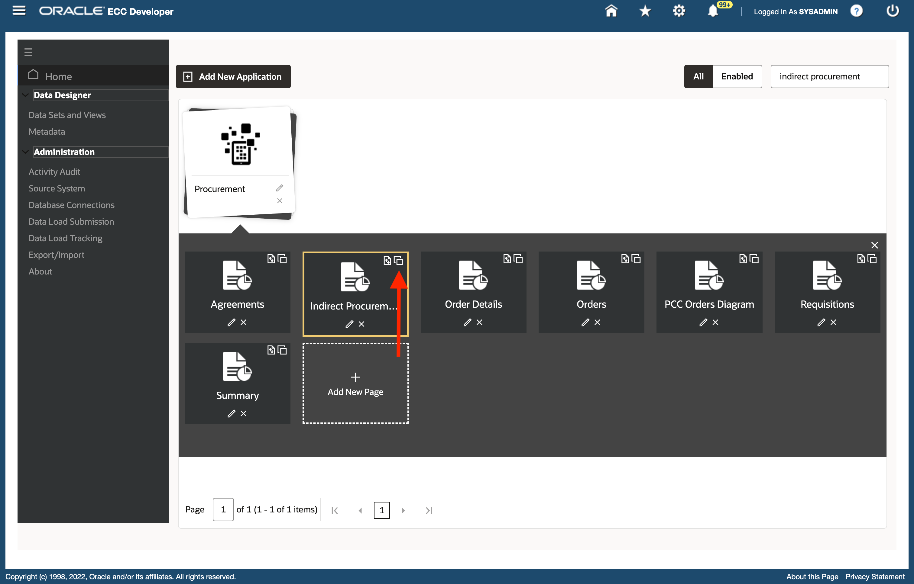
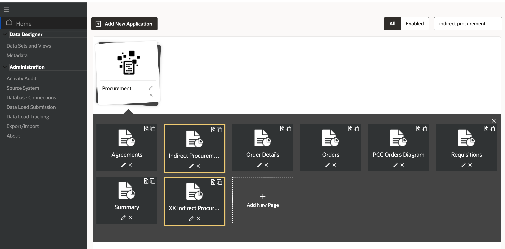
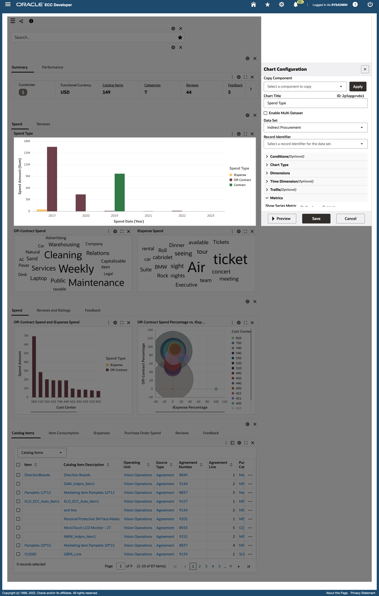
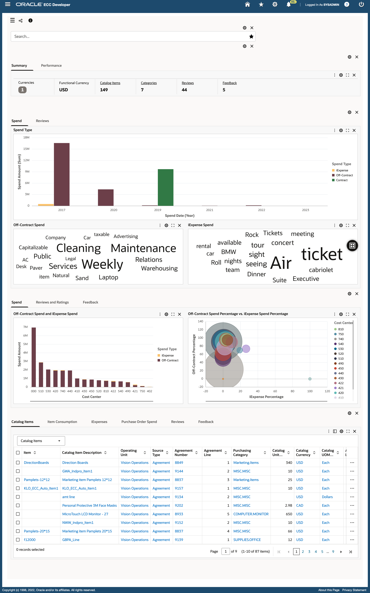
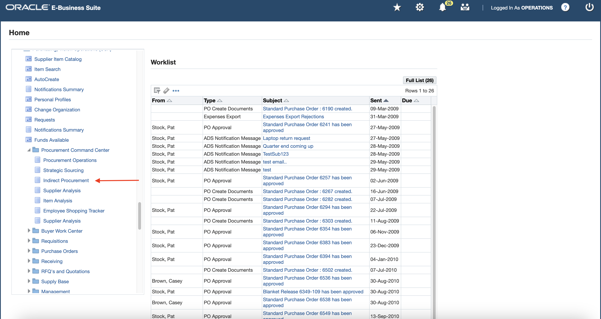

# Extensibility via existing data sets

### Introduction


This lab walks you through the steps to extend your Oracle Enterprise Command Center dashboards


Estimated Time: 30 minutes

### Objectives
In this lab, you will:
* Copy a dashboard
* Create new components
* EBS OA personalization


### Prerequisites

This lab assumes you have:
* Completed all previous labs successfully 

##  

## Task 1: Admin user extensibility

**Goal:** As a buyer I want to see the bigger picture of procurement function by means of high level metrics and charts that should help me improve the overall procure to pay process.

1. Login to EBS apps (From the browser URL navigate to http://apps.example.com:8000) with below credentials

    ```
  	 Username: sysadmin
Password: welcome1
    ```

2. Navigate to ECC Developer -> ECC Developer
    
3. Search for "Indirect procurement" on the home page, this should filter Procurement application. You will see the below image
    
4. Click on the copy page icon for "Indirect procurement"  dashboard, highlighted below
    

5. The new page will be copied within the same application. Click on the edit icon to edit this new page
    
6. Change the page name and page short name as mentioned below and click on "Save"
    - Page Short Name:
    ```
  	 <copy>xx-po-pcc-ind-procurement</copy>
    ```
    - Page Name:
    ```
    <copy>XX Indirect Procurement</copy>
    ```
     

7. Search for "Indirect procurement" on the home page again and click on the page we just copied and renamed to open the page
    

8. Add a chart component in the "Spend" tab (under the Summarization bar) to highlight spend amount

    - Chart title: Spend Type
    - Data set: Indirect Procurement 
    - Chart type: Bar
    - Dimension: Spend type (series dimension) and Spend Date (Year) (Group dimension)
    - Metric: Attribute (Spend amount) and Aggregation (Sum) 

14. Click preview 
     
15. Click Save
     
This concludes this task, we successfully extended Indirect Procurement dashboard with a new component (Chart) to suit our requirements but we also need to display this extended Indirect procurement dashboard to all users by replacing the shipped dashboard.


## Task 2: New dashboard RBAC Setup 


1. Login to EBS apps (From the browser URL navigate to http://apps.example.com:8000) with below credentials

    ```
  	 Username: sysadmin
Password: welcome1
    ```
2.	Create a new FND Function for custom Indirect Procurement Dashboard:
     * Navigate to EBS Home Page -> Functional Administrator responsibility -> Core Services -> Functions
        
        

     * Search with Code as 
                                                            ```
  	    <copy>PO_PCC_ECC_IND_PROC</copy>
            ```
     * Click on the “Duplicate” icon displayed for PO\_PCC\_ECC\_IND\_PROC
          

     * Change the details in the duplicate function page as mentioned below:
          * Name: 
                                                                      ```
  	    <copy>PO PCC ECC Custom Indirect Procurement Page</copy>
            ```
          * Code: 
                   ```
  	    <copy>XX_PO_PCC_ECC_IND_PROC</copy>
            ```
          * Description: 
                             ```
  	    <copy>PO PCC ECC Custom Indirect Procurement Page</copy>
            ```
     

     * Click on the “Continue” button
     * Change the value for HTML Call to 
                                  ```
  	    <copy>GWY.jsp?targetAppType=ECC&targetPage=web/eccapp/po_pcc/xx-po-pcc-ind-procurement</copy>
            ```
     * Click on the “Submit” button

           

3.	Add the new FND Function to PO\_PCC\_HOME\_PAGE menu
     * Navigate to EBS Home Page -> Functional Administrator responsibility -> Core Services -> Menus
        
     * Search with code as
                                       ```
  	    <copy>PO_PCC_HOME_PAGE</copy>
            ```
     * Click on “Update” button for “PO PCC Home Page” menu

          

     * In the menu manager section, click on “+” icon to add below details:
          * Function: 
                                                 ```
  	    <copy>PO PCC ECC Custom Indirect Procurement Page</copy>
            ```
     * Click on “Apply” button to save the menu
          
4.  Clear Application Cache:
    * Navigate to EBS Home Page -> Functional Administrator responsibility -> Core Services -> Caching Framework -> Global Configuration
        
    * Click on “Clear All Cache” button and then click on "Yes"
        

## Task 3: EBS OA Personalization 
1. Login to EBS apps (From the browser URL navigate to http://apps.example.com:8000) with below credentials

    ```
  	 Username: operations
Password: welcome1
    ```
1.	Navigate to Purchasing, Vision Operations (USA) -> Procurement Command Center -> Indirect Procurement
          
2.	Click on EBS Settings icon
3.	Click on “Personalize Page” option
          

4. Personalize the Rich Container:

    * A rich content container is an OA component which is designed to embed/enclose an external content within an OA Framework page. The rich content container component accepts the URL of the rich content, in this case an ECC dashboard.
    This rich content is then enclosed within an iFrame within an OA Framework page. 
    In this case, through Oracle EBS and ECC integration, users are allowed to drill down from Oracle EBS to ECC. The rich container requires an FND function of the ECC dashboard page, which will allow the user to access the respective ECC dashboard inside EBS.
          

5.	Update the below details and click on the “Apply” button
     * Destination Function: 
                                                      ```
  	    <copy>XX_PO_PCC_ECC_IND_PROC</copy>
            ```
          

6. Click on “Return to Application” to access the dashboard
          
          


## Learn More
* [Enterprise Command Center- User Guide](https://docs.oracle.com/cd/E26401_01/doc.122/e22956/T27641T671922.htm)
* [Enterprise Command Center- Admistration Guide](https://docs.oracle.com/cd/E26401_01/doc.122/f34732/toc.htm)
* [Enterprise Command Center- Extending Guide](https://docs.oracle.com/cd/E26401_01/doc.122/f21671/T673609T673618.htm)
* [Enterprise Command Center- Installation Guide](https://support.oracle.com/epmos/faces/DocumentDisplay?_afrLoop=264801675930013&id=2495053.1&_afrWindowMode=0&_adf.ctrl-state=1c6rxqpyoj_102)
* [Enterprise Command Center- Direct from Development videos](https://learn.oracle.com/ols/course/ebs-enterprise-command-centers-direct-from-development/50662/60350)
* [Enterprise Command Center for E-Business Suite- Technical details and Implementation](https://mylearn.oracle.com/ou/component/-/117416)

## Acknowledgements

* **Author**- Muhannad Obeidat, VP

* **Contributors**-  Muhannad Obeidat, Nashwa Ghazaly, Mikhail Ibraheem, Rahul Burnwal, Manikanta Kumar and Mohammed Khan

* **Last Updated By/Date**- Mohammed Khan, August 2023

