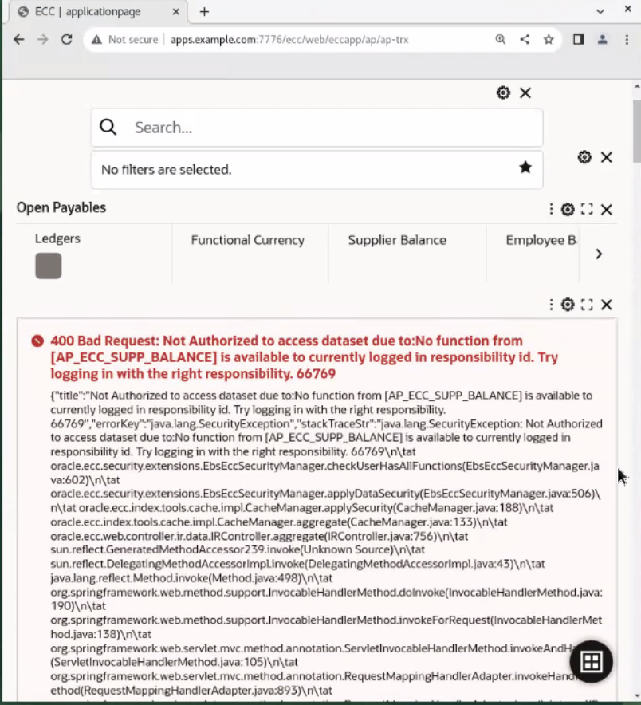
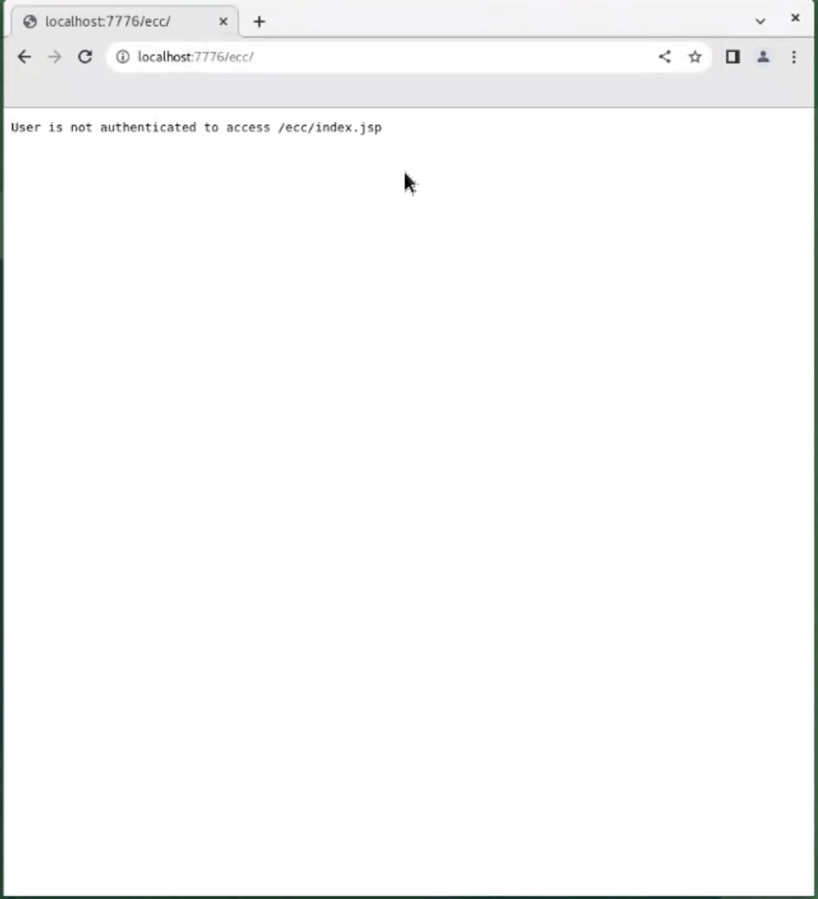
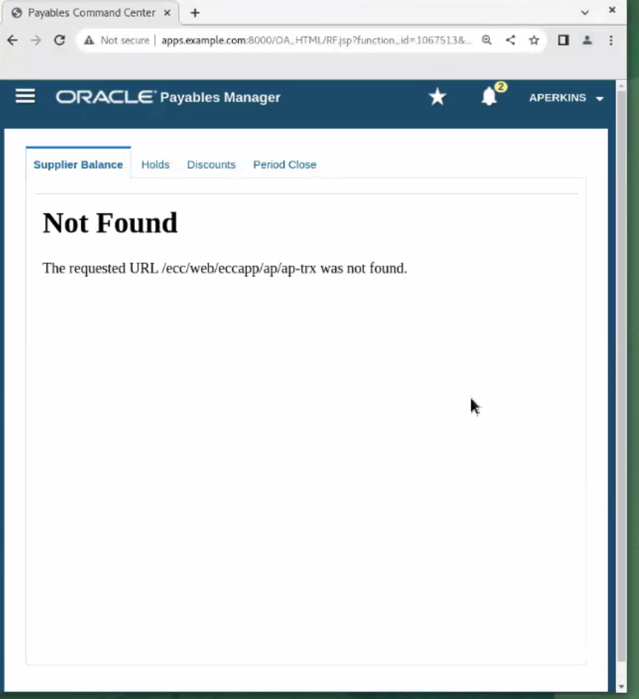
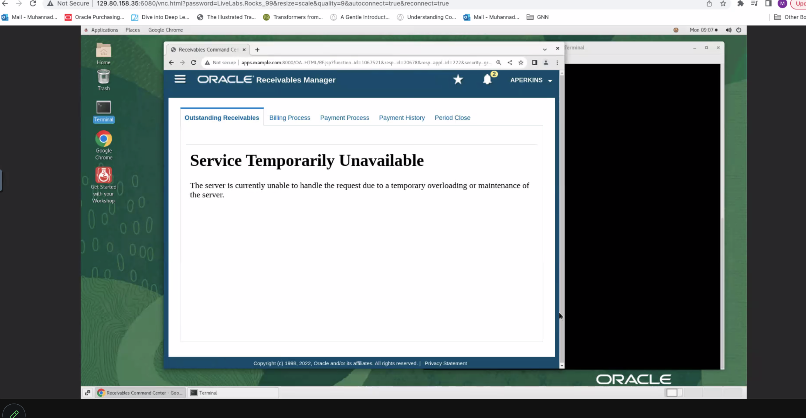

# Diagnose and monitor 


### Introduction

This lab walks you through the steps needed to diagnose and monitor Oracle Enterprise Command Center framework

Estimated Time: 10 minutes


### Objectives

In this lab, you will:
* Learn how to access Server, Application, OHS and OPMN Logs
* Learn how to access Log monitor
* Capture Loading Time for ECC Page
* Learn how to download HAR file
* Learn how to run ECC Analyzer
* Identify common issues

### Prerequisites 

This lab assumes you have:
* Completed all previous labs successfully 


##  

## Task 1: Diagnose and Monitor 
 
 1. Note the location of Server logs:

    


 2. Note the location of Application logs:

    

3. Note the location of OHS logs

    /u01/install/APPS/fs2/FMW\_Home/webtier/instances/EBS\_web\_OHS1/diagnostics/logs/OHS/EBS\_web

4. Location of opmn logs

    /u01/install/APPS/fs2/FMW_Home/webtier/instances/EBS\_web\_OHS1/diagnostics/logs/OPMN/opmn

**Log monitor**

1. Login to EBS as Admin user with eccadmin responsibility access


    ```
  	 Username: eccadmin
Password: welcome1
    ```


    ```
  	 <copy>http://&lt;EBS_MIDDLETIER_HOST_FQDN&gt;:&lt;EBS_MIDDLETIER_PORT&gt;/ecc/monitor/logs</copy>
    ```


   

**Capture Loading Time for ECC Page**

1. Open the Oracle E-Business Suite Enterprise Command Center application in the Google Chrome browser. 
2. Log in and navigate to the page you want. Then open the Chrome tools by pressing the F12 button on the keyboard, or by pressing Ctrl+Shift+I. 
3. The Development Tools window occupies the lower part of the page. Select the Network tab


  

**Download HAR file**


To analyze performance deeply download HAR file:

1. Open browser developer tools via inspect element (in chrome)
2. Navigate to "Network" tab
3. Access the dashboard page and wait till it is loaded completely
3. Then, click on the download icon highlighted below to download the HAR file
  


## Task 2: Learn about ECC Analyzer 
1. The EBS Enterprise Command Center (ECC) Analyzer is a self-service health-check script that reviews Oracle Enterprise Command Center related data, analyses current configurations and settings for the environment and provides feedback and recommendations on best practices. 
2. The Analyzer collects data using all the tables necessary to diagnose issues and provides solutions and recommended actions. 
    


3. You can download the latest ECC analyzer from [Download ECC Analyzer](https://support.oracle.com/epmos/faces/DocumentDisplay?_afrLoop=264836944547192&id=2587090.1&_afrWindowMode=0&_adf.ctrl-state=bqndlfq90_4#aref_section12)

**NOTE**:  Analyzer does not perform any INSERTs, UPDATEs or DELETEs to your data; it just reports on it.

**ECC Analyzer: Technical Requirement**

* Requires Java 1.7+
* Available on Linux platforms only

4. Verify java version

    ```
  	 <copy>java –version</copy>
    ```


2. Running Analyzer
   To run Analyzer as a java program follow below instruction. The java program will prompt for the WebLogic and APPS usernames and passwords.
   * Source ECC Environment:
     ```
<copy>. ./$ECC_BASE/Oracle/quickinstall/env/ecc.env</copy> ```

   * Unzip ECC analyzer zip:
        ```
<copy>unzip ECC_Analyzer.zip</copy> ```

3. Running analyzer

    

    ```
  	 <copy>java -	Danalyzer="ecc_analyzer.xml" -jar HA.jar</copy>
    ```

3. ECC Analyzer: Sample Output

   * Analyzer generates a zip file containing all the script outputs and the analyzer html report(ATGECCHA_<date>.html). 

   * When running the analyzer as a java program
     EBS Enterprise Command Center (ECC) Analyzer output zip file is located in the same directory where it was run.  This location is also displayed in the window after execution. 

    

    Html page contains all the information about the ECC environment being analyzed. Below are some of the sample outputs:

    
    
    


## Task 3: Identify common issues 
1. You will see the below screen if you are authenticated but not authorized to view the dashboard. You need to use the right responsibility to access the dashboard 

    

2. You will see the below screen if you are not authenticated/ or not logged in to EBS

    

3. You will see the below screen if ECC isn’t integrated with EBS (ecc.conf is missing).
    
4. You will see the below screen if ECC is integrated with EBS but ECC is down.

    

You may now **proceed to the next lab**

## Learn More
* [Enterprise Command Center- User Guide](https://docs.oracle.com/cd/E26401_01/doc.122/e22956/T27641T671922.htm)
* [Enterprise Command Center- Administration Guide](https://docs.oracle.com/cd/E26401_01/doc.122/f34732/toc.htm)
* [Enterprise Command Center- Extending Guide](https://docs.oracle.com/cd/E26401_01/doc.122/f21671/T673609T673618.htm)
* [Enterprise Command Center- Installation Guide](https://support.oracle.com/epmos/faces/DocumentDisplay?_afrLoop=264801675930013&id=2495053.1&_afrWindowMode=0&_adf.ctrl-state=1c6rxqpyoj_102)
* [Enterprise Command Center- Direct from Development videos](https://learn.oracle.com/ols/course/ebs-enterprise-command-centers-direct-from-development/50662/60350)
* [Enterprise Command Center for E-Business Suite- Technical details and Implementation](https://mylearn.oracle.com/ou/component/-/117416)

## Acknowledgements

* **Author**- Muhannad Obeidat, VP

* **Contributors**-  Muhannad Obeidat, Nashwa Ghazaly, Mikhail Ibraheem, Rahul Burnwal, Manikanta Kumar and Mohammed Khan

* **Last Updated By/Date**- Mohammed Khan, August 2023

