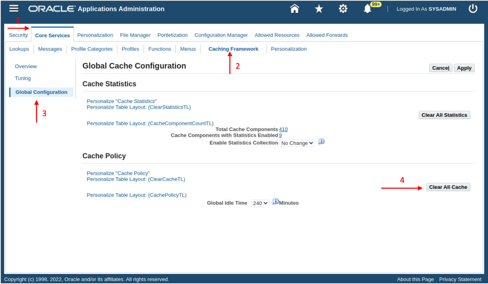
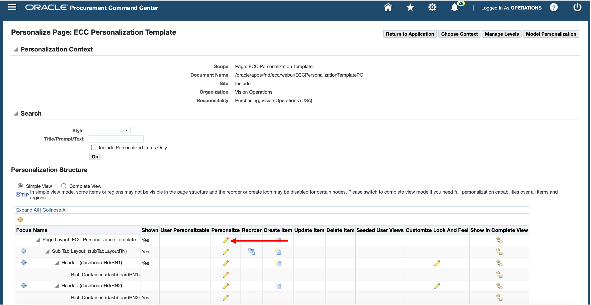
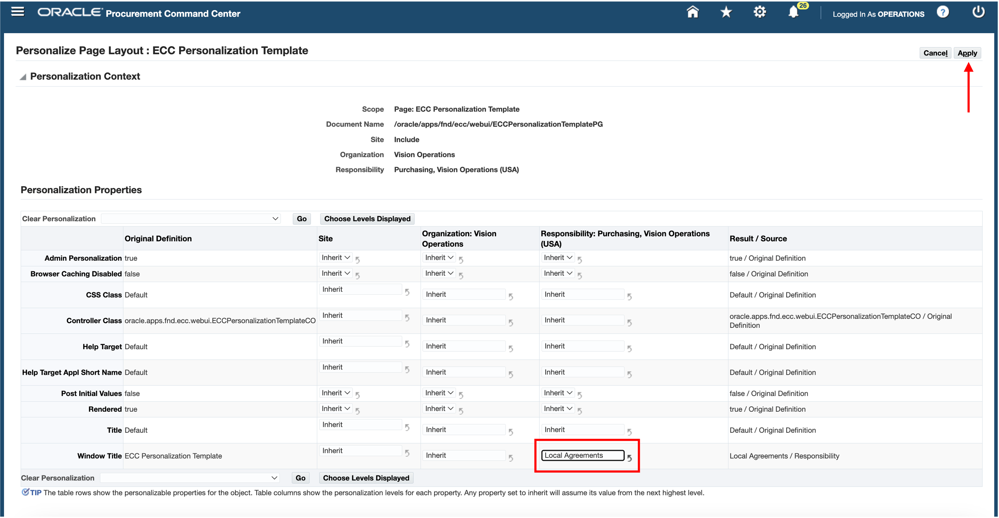
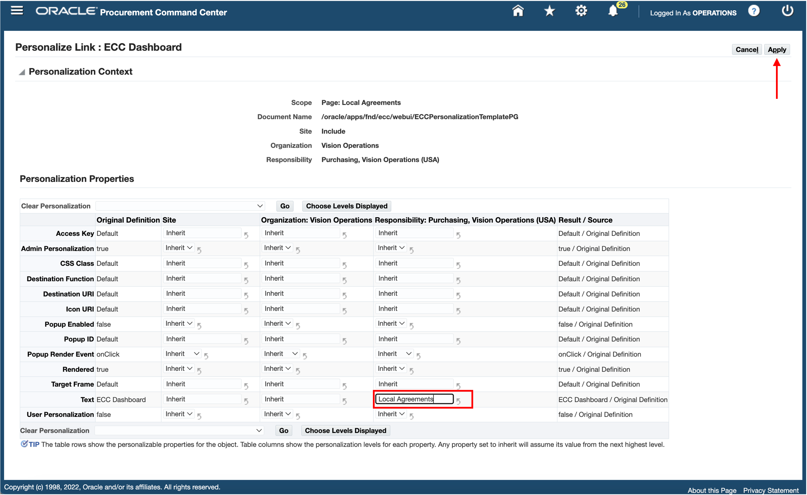
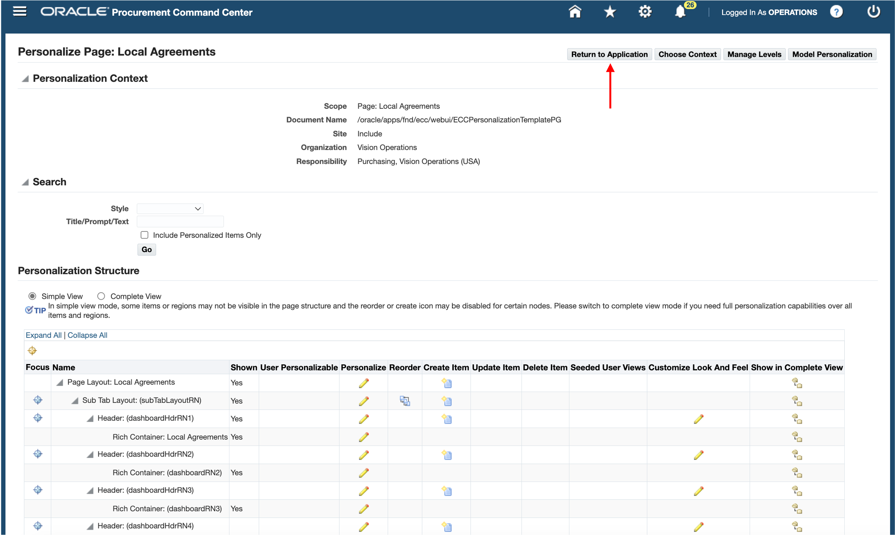
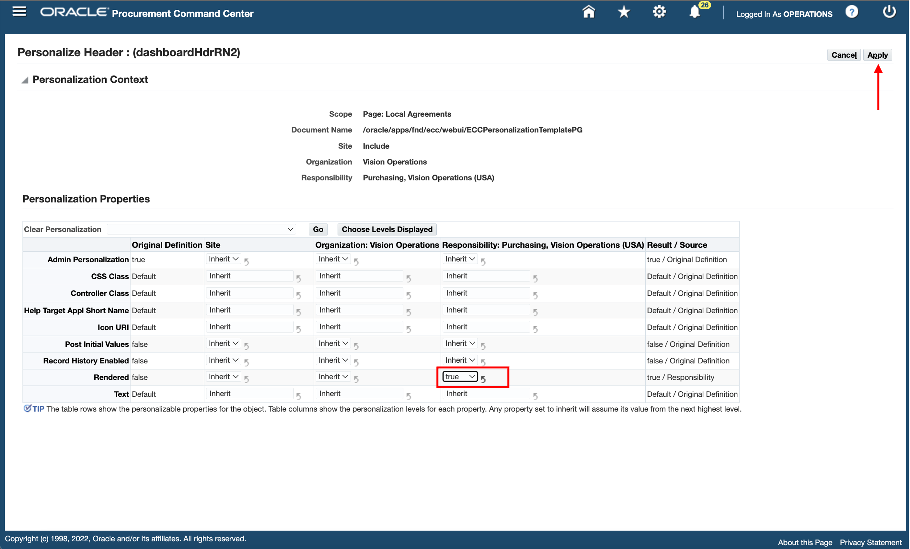

# ECC Personalization Template (Optional)


### Introduction

* ECC Personalization Template is an ECC V11 feature
* This lab walks you through the ECC Personalization Template feature, what the feature is, the benefits of this feature and hands on demos

Estimated Time: 30 minutes


### Objectives

In this lab, you will:
* Learn about ECC Personalization Template
* Create a new FND function for the dashboard
* Create RBAC setup for the new dashboard
* Add the new FND function to ECC Personalization Template to view the dashboard


### Prerequisites

This lab assumes you have:
* Completed all previous labs successfully 


##  

## Task 1: ECC Personalization Template for ECC Procurement

In Lab 5 we extended the existing Agreements dashboard to include Local agreements. To make this dashboard accessible we would ideally create an OA page which requires a lot of development effort. The other way to make the dashboard accessible to users is to leverage the ECC Personalization Template feature.

ECC Personalization Template is a seeded OA page shipped as part of ECC Developer responsibility i.e., seeded FND function FND\_ECC\_PERSONALIZE\_TEMPLATE where customers can easily add and remove tabs within this seeded OA page. This allows user to access and manage multiple dashboards from a single responsibility so that they can have a full view of all business operations. This is different from using menus i.e., creating a menu hierarchy to personalize existing dashboards, which needs additional development in terms of creating OA pages, rather the ECC Personalization Template approach is a much easier approach in personalizing and extending not just a single dashboard but across multiple dashboards. No developer is needed in developing an OA page
    


With this feature users can:

1. Structure cross departmental dashboards access
2. Create new command centers
3. Create single menu entry
4. Add new dashboards to existing dashboards

**Goal:** In this task our goal is to provide Local Agreements dashboard access to the users who have access to Purchasing, Vision Operations responsibility
        
**Personalization Steps:**
        

1. Login to EBS apps (Navigate to http://<VNC\_Public\_IP\>:8000) with below credentials
    ```
  	 Username: sysadmin
Password: welcome1
    ```
2.	The FND Function for Local Agreements Dashboard has been created in Lab 5 - Task 7

3.	Add ECC Personalization Template to Procurement Command Center Menu:
    * Navigate to EBS Home Page -> Functional Administrator responsibility -> Core Services -> Menus
        
    * Search with code as 
                                        ```
  	    <copy>PO_PCC_MAIN</copy>
            ```
    * Click on “Update” button for “Procurement Command Center” menu
    * In the menu manager section, click on “+” icon to add below menu entry details
        * Prompt: 
                                                ```
  	    <copy>Local Agreements</copy>
            ```
        * Function: 
                                                        ```
  	    <copy>ECC Personalization Template</copy>
            ```
        * Click on “Apply” button to save the menu
        
3.	Create Permission Set for Local Agreements:
    * Navigate to EBS Home Page -> Functional Administrator responsibility -> Security -> Permission Sets
        
    * Click on the “Create Permission Set” button
    * Provide the below details in “Create Permission Set” page
        * Name: 
                                                                ```
  	    <copy>PO PCC Local Agreements Permission Set</copy>
            ```
        * Code: 
           ```
  	    <copy>PO_PCC_LOCAL_AGREEMENTS_PS</copy>
            ```
        * Under Permission Builder section, click on “+” icon to add the below permission:
            * Permission: 
                       ```
  	    <copy>PO PCC ECC Local Agreements page</copy>
            ```
    * Click on “Apply” button to create the permission set
        
4.	Create Grant for Local Agreements:
    * Navigate to EBS Home Page -> Functional Administrator responsibility -> Security -> Grants
        
    * Click on “Create Grant” button
    * Provide the below details:
        * Name: 
                               ```
  	    <copy>Procurement Local Agreements Grant</copy>
            ```
        * Grantee Type: 
                                       ```
  	    <copy>Group of Users</copy>
            ```
        * Grantee: 
                                               ```
  	    <copy>PO PCC ECC Role</copy>
            ```
        * Responsibility: 
                                        ```
  	    <copy>Purchasing, Vision Operations (USA)</copy>
            ```
    * Click on the “Next” button
    * Provide the “Set”:
                                                   ```
  	    <copy>PO PCC Local Agreements Permission Set</copy>
            ```
    * Click on the “Next” button and then “Finish” button
        

5. Clear Application Cache:
    * Navigate to EBS Home Page -> Functional Administrator responsibility -> Core Services -> Caching Framework -> Global Configuration
        
    * Click on “Clear All Cache” button and then click on "Yes"
        

**Personalize ECC Personalization Template to add Local Agreements dashboard**

1. Login to EBS apps (Navigate to http://<VNC\_Public\_IP\>:8000) with below credentials
    ```
  	 Username: operations
Password: welcome1
    ```
2.	Navigate to Purchasing, Vision Operations (USA) -> Procurement Command Center -> Local Agreements
        
        
3. Click on EBS Settings icon
4. Click on “Personalize Page” option
        

4.	In the Personalization structure table, click on “Personalize” icon for Page Layout section to update the window title
        

5.	Set the window title to “Local Agreements” and click on “Apply” button
        

6.	Personalize the Rich Container (dashboardRN1)
        

7. Update the below details and click on the “Apply” button
    * Title: 
                                                   ```
  	    <copy>Local Agreements</copy>
            ```
    * Rendered: TRUE
                                                       ```
  	    <copy>TRUE</copy>
            ```
    * Destination Function: 
                                                           ```
  	    <copy>XX_PO_PCC_ECC_LOCAL_AGREEMENTS</copy>
            ```
        

8. Set the subtab title by clicking on Personalize icon for first “Sub tab link”
        

9. Update the “Text” property to “Local Agreements”, and then click on the "Apply" button
        

10. Click on “Return to Application” to access the dashboard
        
        

11.	To add other shipped dashboards, like Agreements dashboard or Requisitions dashboard in the same page, the user needs to follow the same personalization process for other sub tabs available in the ECC Personalization Template personalization.

12.	Click on “Personalize” option under EBS Settings

13.	Personalize the Header (dashboardHdrRN2)
        

14.	Set the “Rendered” property to “true”
        

15.	Personalize the Rich Container (dashboardRN2)
        

16.	Update the below details and click on the “Apply” button
    * Title: 
                                                           ```
  	    <copy>Requisitions</copy>
            ```
    * Rendered: 
                                                               ```
  	    <copy>TRUE</copy>
            ```
    * Destination Function:
                                                                   ```
  	    <copy>PO_PCC_ECC_REQUISITIONS</copy>
            ```
        

17.	Set the subtab title by clicking on Personalize icon for second “Sub tab link”
        
18.	Update the “Text” property to “Requisitions”, and then click on the "Apply" button
        

19.	Click on “Return to Application” to access the dashboards
        


## Learn More
* [Enterprise Command Center- User Guide](https://docs.oracle.com/cd/E26401_01/doc.122/e22956/T27641T671922.htm)
* [Enterprise Command Center- Administration Guide](https://docs.oracle.com/cd/E26401_01/doc.122/f34732/toc.htm)
* [Enterprise Command Center- Extending Guide](https://docs.oracle.com/cd/E26401_01/doc.122/f21671/T673609T673618.htm)
* [Enterprise Command Center- Installation Guide](https://support.oracle.com/epmos/faces/DocumentDisplay?_afrLoop=264801675930013&id=2495053.1&_afrWindowMode=0&_adf.ctrl-state=1c6rxqpyoj_102)
* [Enterprise Command Center- Direct from Development videos](https://learn.oracle.com/ols/course/ebs-enterprise-command-centers-direct-from-development/50662/60350)
* [Enterprise Command Center for E-Business Suite- Technical details and Implementation](https://mylearn.oracle.com/ou/component/-/117416)

## Acknowledgements

* **Author**- Muhannad Obeidat, VP

* **Contributors**-  Muhannad Obeidat, Nashwa Ghazaly, Mikhail Ibraheem, Rahul Burnwal, Manikanta Kumar and Mohammed Khan

* **Last Updated By/Date**- Mohammed Khan, August 2023

