# ECC Personalization Template (Optional)


### Introduction

This lab walks you through the ECC Personalization Template feature, what the feature is, the benefits of this feature and hands on demos.

Estimated Time: 30 minutes


### Objectives

In this lab, you will:
* Learn about ECC Personalization Template
* Create a new FND function for the dashboard
* Create RBAC setup for the new dashboard
* Add the new FND function to ECC Personalization Template to view the dashboard


### Prerequisites

This lab assumes you have:
* Completed all previous labs successfully 


##  

## Task 1: ECC Personalization Template for ECC Procurement

In Lab 5 we extended the existing Agreements dashboard to include Local agreements. To make this dashboard accessible we would ideally create an OA page which requires a lot of development effort. The other way to make the dashboard accessible to users is to leverage the ECC Personalization Template feature.

ECC Personalization Template is a seeded OA page shipped as part of ECC Developer responsibility i.e., seeded FND function FND\_ECC\_SCRATCHPAD where customers can easily add and remove tabs within this seeded OA page. This allows user to access and manage multiple dashboards from a single responsibility so that they can have a full view of all business operations. This is different from using menus i.e., creating a menu hierarchy to personalize existing dashboards, which needs additional development in terms of creating OA pages, rather the ECC Personalization Template approach is a much easier approach in personalizing and extending not just a single dashboard but across multiple dashboards. No developer is needed in developing an OA page
    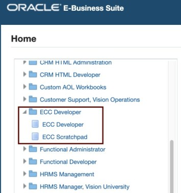


With this feature users can:

1. Structure cross departmental dashboards access
2. Create new command centers
3. Create single menu entry
4. Add new dashboards to existing dashboards

**Goal:** In this task our goal is to provide Local Agreements dashboard access to the users who have access to Purchasing, Vision Operations responsibility
        
**Personalization Steps:**
        

1. Login to EBS apps (Navigate to http://apps.example.com:8000) with below credentials
    ```
  	 Username: sysadmin
Password: welcome1
    ```
2.	The FND Function for Local Agreements Dashboard has been created in Lab 5 - Task 7

3.	Add ECC Personalization Template to Procurement Command Center Menu:
    * Navigate to Functional Administrator Responsibility -> Core Services -> Menus
    * Search with code as 
                                        ```
  	    <copy>PO_PCC_MAIN</copy>
            ```
    * Click on “Update” button for “Procurement Command Center” menu
    * In the menu manager section, click on “+” icon to add below menu entry details
        * Prompt: 
                                                ```
  	    <copy>Local Agreements</copy>
            ```
        * Function: 
                                                        ```
  	    <copy>ECC Scratchpad</copy>
            ```
        * Click on “Apply” button to save the menu
        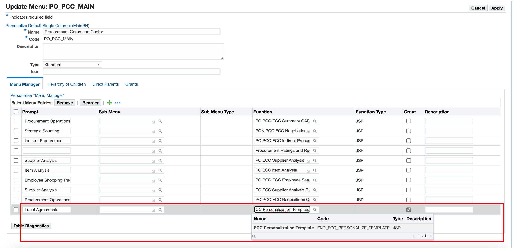
3.	Create Permission Set for Local Agreements:
    * Navigate to Functional Administrator Responsibility -> Security -> Permission Sets
    * Click on the “Create Permission Set” button
    * Provide the below details in “Create Permission Set” page
        * Name: 
                                                                ```
  	    <copy>PO PCC Local Agreements Permission Set</copy>
            ```
        * Code: 
           ```
  	    <copy>PO_PCC_LOCAL_AGREEMENTS_PS</copy>
            ```
        * Under Permission Builder section, click on “+” icon to add the below permission:
            * Permission: 
                       ```
  	    <copy>PO PCC ECC Local Agreements page</copy>
            ```
    * Click on “Apply” button to create the permission set
        
4.	Create Grant for Local Agreements:
    * Navigate to Functional Administrator Responsibility -> Security -> Grants
    * Click on “Create Grant” button
    * Provide the below details:
        * Name: 
                               ```
  	    <copy>Procurement Local Agreements Grant</copy>
            ```
        * Grantee Type: 
                                       ```
  	    <copy>Group of Users</copy>
            ```
        * Grantee: 
                                               ```
  	    <copy>PO PCC ECC Role</copy>
            ```
        * Responsibility: 
                                        ```
  	    <copy>Purchasing, Vision Operations (USA)</copy>
            ```
    * Click on the “Next” button
    * Provide the “Set” as “PO PCC Local Agreements Permission Set”
    * Click on the “Next” button and then “Finish” button
        

5. Clear Application Cache:
    * Navigate to Functional Administrator -> Core Services -> Caching Framework -> Global Configuration
    * Click on “Clear All Cache” button and then click on "Yes"
        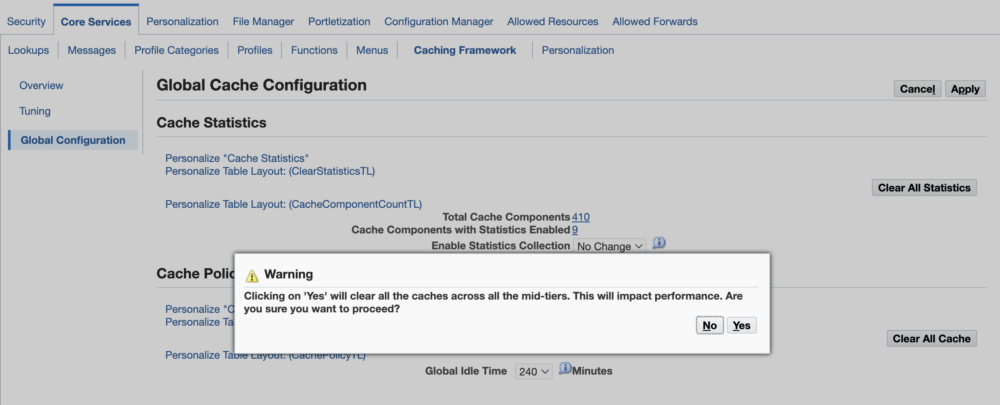

**Personalize ECC Personalization Template to add Local Agreements dashboard**

1. Login to EBS apps (Navigate to http://apps.example.com:8000) with below credentials
    ```
  	 Username: operations
Password: welcome1
    ```
2.	Navigate to Purchasing, Vision Operations (USA) -> Procurement Command Center -> Local Agreements
        
3. Click on EBS Settings icon
4. Click on “Personalize Page” option
        

4.	In the Personalization structure table, click on “Personalize” icon for Page Layout section to update the window title
        

5.	Set the window title to “Local Agreements” and click on “Apply” button
        

6.	Personalize the Rich Container (dashboardRN1)
        

7. Update the below details and click on the “Apply” button
    * Title: 
                                                   ```
  	    <copy>Local Agreements</copy>
            ```
    * Rendered: TRUE
                                                       ```
  	    <copy>TRUE</copy>
            ```
    * Destination Function: 
                                                           ```
  	    <copy>XX_PO_PCC_ECC_LOCAL_AGREEMENTS</copy>
            ```
        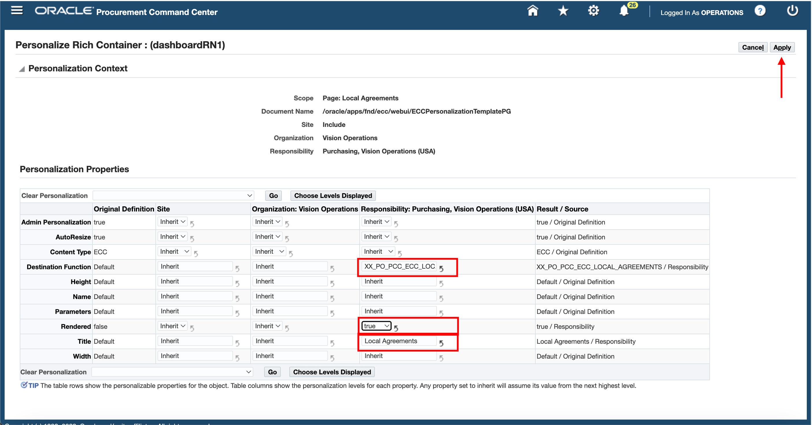

8. Set the subtab title by clicking on Personalize icon for first “Sub tab link”
        

9. Update the “Text” property to “Local Agreements”
        

10. Click on “Return to Application” to access the dashboard
        

11.	To add other shipped dashboards, like Agreements dashboard or Requisitions dashboard in the same page, the user needs to follow the same personalization process for other sub tabs available in the ECC Personalization Template personalization.

12.	Click on “Personalize” option under EBS Settings

13.	Personalize the Header (dashboardHdrRN2)
        

14.	Set the “Rendered” property to “true”
        

15.	Personalize the Rich Container (dashboardRN2)
        

16.	Update the below details and click on the “Apply” button
    * Title: 
                                                           ```
  	    <copy>Requisitions</copy>
            ```
    * Rendered: 
                                                               ```
  	    <copy>TRUE</copy>
            ```
    * Destination Function:
                                                                   ```
  	    <copy>PO_PCC_ECC_REQUISITIONS</copy>
            ```
        

17.	Set the subtab title by clicking on Personalize icon for second “Sub tab link”

18.	Update the “Text” property to “Requisitions”
        

19.	Click on “Return to Application” to access the dashboards
        


## Task 2: ECC Personalization Template for Cross-departmental access

**Goal:** As an Operations Manager, I want to monitor and measure the performance and efficiency of the entire procure-to-pay process so that I can identify opportunities for improvement, cost savings, compliance, and risk mitigation.
    

The ECC Personalization Template set up consists of two major steps: 

1. RBAC Set up
2. OA Personalization
    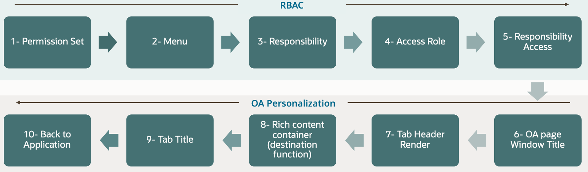


**Pre-requisites:**

1.	EBS Form functions for the required ECC Dashboards which are to be displayed in the ECC Personalization Template

**Dashboard FND Functions:**


<!DOCTYPE html>
<html>
<head>
<style>
table {
  font-family: arial, sans-serif;
  border-collapse: collapse;
  width: 100%;
}

td, th {
  border: 1px solid #dddddd;
  text-align: left;
  padding: 8px;
}

tr:nth-child(even) {
  background-color: #dddddd;
}
style="white-space:pre-wrap; word-wrap:break-word"
</style>
</head>
<body>


<table>
  <tr>
    <th></th>
    <th>FND Function</th>
    <th>Permission Set</th>
    
  </tr>

  <tr>
    <td>Requisitions dashboard</td>
    <td>PO_PCC_ECC_REQUISITIONS</td>
    <td>PO_PCC_ECC_PS</td>
  </tr>
  <tr>
    <td>Orders dashboard</td>
    <td>PO_PCC_ECC_ORDERS</td>
    <td>PO_PCC_ECC_PS</td> 
  </tr>
  <tr>
    <td>Receiving dashboard</td>
    <td>INV_ECC_RCV</td>
    <td>INV_ECC_RCV_ACCESS_PS</td>
  </tr>
    <tr>
    <td>Supplier Balance dashboard</td>
    <td>AP_ECC_SUPP_BALANCE</td>
    <td>AP_ECC_ACCESS_PS</td>
</table>
</body>
</html>


1. Login to EBS apps (From the browser URL navigate to http://apps.example.com:8000) with below credentials

    ```
  	 Username: sysadmin
Password: welcome1
    ```

**Create a new Permission Set:**

1.	Navigate to Functional Administrator Responsibility -> Security -> Permission Sets
2.	Click on “Create Permission Set”
3.	Provide the below details in “Create Permission Set” page
    *	Name: 
                                                       ```
  	    <copy>P2P Permission Set</copy>
            ```
    *	Code: 
                                                           ```
  	    <copy>P2P_PS</copy>
            ```
    *	Under Permission Builder section, click on “+” icon to add the below permission sets:	
                                                                   ```
  	    <copy>PO PCC Permission Set</copy>
            ```
                                                                   ```
  	    <copy>Receiving ECC Dashboard Access Permission Set</copy>
            ```
                                                                   ```
  	    <copy>Payables Command Center Access Permission Set</copy>
            ```
4.	Click on “Apply” button to create the permission set

    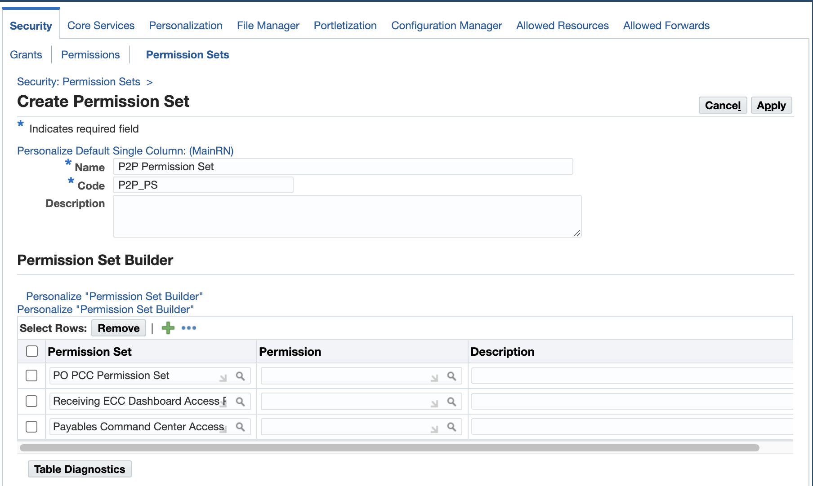

**Create a new Menu:**

1.	Navigate to Functional Administrator Responsibility -> Core Services -> Menus
2.	Click on “Create Navigation Menu”
3.	Provide the below details in “Create Navigation Menu” page
    *	Name: 
                                                       ```
  	    <copy>P2P Menu</copy>
            ```
    *	Code: 
                                                           ```
  	    <copy>P2P_MENU</copy>
            ```
    *	Under Menu Builder section, click on “+” icon to add below menu entry details:
        *	Prompt: 
                                                                   ```
  	    <copy>P2P Operations</copy>
            ```
        *	Function: 
                                                                   ```
  	    <copy>ECC Scratchpad</copy>
            ```
4.	Click on “Apply” button to create the menu

    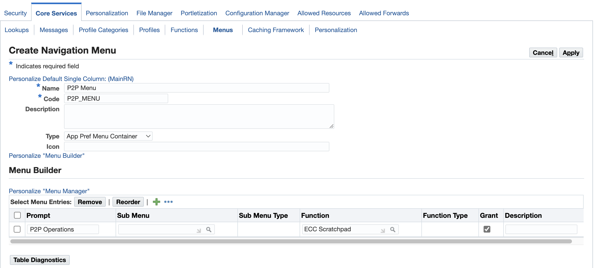


**Create a new Responsibility:**

1.	Navigate to User Management Responsibility -> Responsibility
2.	Click on “Create Responsibility”
3.	Provide the below details in “Create Responsibility” page
    *	Responsibility Name: 
                                                               ```
  	    <copy>Procure to Pay Operations Manager</copy>
            ```
    *	Menu: 
                                                               ```
  	    <copy>P2P Menu</copy>
            ```
    *	Responsibility Key: 
                                                               ```
  	    <copy>P2P_ECC_OP_MGR</copy>
            ```
    *	Application: 
                                                                   ```
  	    <copy>Purchasing</copy>
            ```
    *	Under Groups section, provide below details:
        *	Data Group Name: 
                                                                   ```
  	    <copy>Standard</copy>
            ```
        *	Application: 
                                                                   ```
  	    <copy>Purchasing</copy>
            ```
4.	Click on “Create” button to create the responsibility

    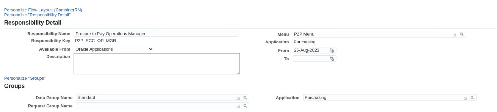


**Create a new Access role and Grant:**

1.	Navigate to User Management Responsibility -> Roles & Role Inheritance
2.	Click on “Create Role”
3.	Provide the below details in “Create Role” page
    *	Application: 
                                                               ```
  	    <copy>Purchasing</copy>
            ```
    *	Role Code: 
                                                               ```
  	    <copy>UMX|P2P_ECC_ACCESS_ROLE</copy>
            ```
    *	Display Name: 
                                                               ```
  	    <copy>P2P Access Role</copy>
            ```
    *	Description: 
                                                               ```
  	    <copy>P2P Access Role</copy>
            ```
4.	Click on “Create Grant” button
5.	Click on “Save and Proceed” button in the confirmation dialog to create the grant
6.	Now, the user is navigated to “Create Grant” page
7.	Provide the below details:
    *	Name: 
                                                               ```
  	    <copy>P2P Grant</copy>
            ```
    *	Under security context section, Responsibility: Procure to Pay Operations Manager
    *	Click on “Next” button
    *	Provide the permission set as “P2P Permission Set”
    *	Click on the “Next” button and then the “Finish” button to create the grant
8.	Now, upon clicking “Ok” in the confirmation dialog, the user is navigated to the “Update Access Role” page
9.	Click on “Apply” button

    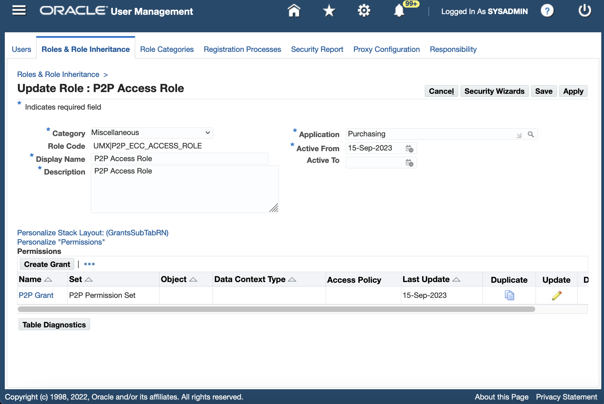
    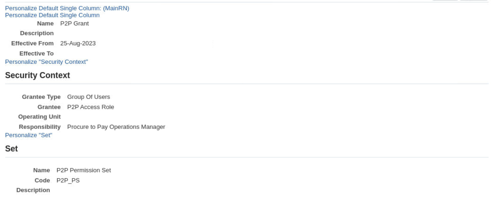

**Run Workflow Background Process:**

1.	Navigate to System Administration -> Schedule Requests
2.	Provide the Program Name as “Workflow Background Process”
3.	Under Parameters section, provide the below details:
    *	Process Deferred: Yes
    *	Process Timeout: No
4.	Click on “Continue” button and then on “Submit” button
5.  Once the “Workflow Background Process” request is completed successfully, proceed to the next step to clear the application cache

    

**Clear Application Cache:**

1.	Navigate to Functional Administrator -> Core Services -> Caching Framework -> Global Configuration
2.	Click on “Clear All Cache” button and then click on "Yes"

    


**Assign Access Role to Responsibility:**

1.	Navigate to User Management -> Roles & Role Inheritance
2.	Search for “Procure to Pay Operations Manager” responsibility
3.	Select the icon under “View In Hierarchy”

    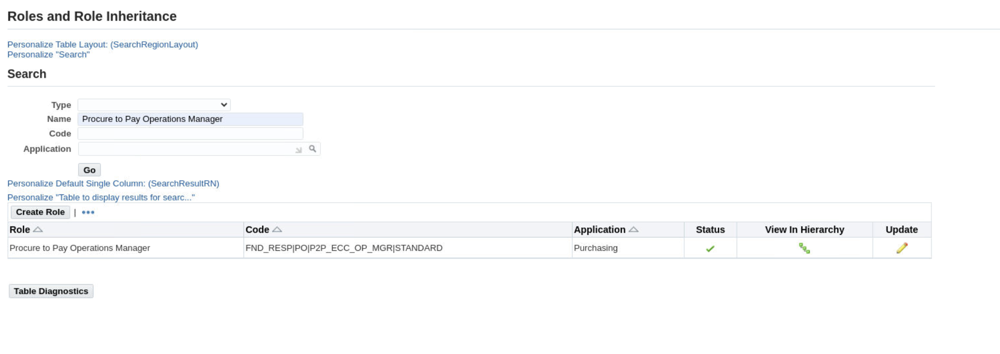

4.  Click on + icon under “Add node”	
    
5.  Then search for “P2P Access Role” and click on “Go” button
    
6.	Add the access role to the responsibility by clicking on the icon under quick select column
    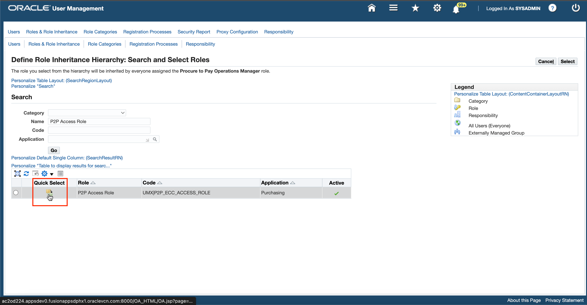
7.  We have successfully assigned the access role to the responsibility
    


**Assign the Responsibility to User:**

1.	Navigate to User Management -> Users
2.	Provide the User Name as “OPERATIONS” and click on “Go” button
3.	Click on update icon in the results for OPERATIONS user
4.	Click on “Assign Roles” button and add “Procure to Pay Operations Manager”
5.	Provide the Justification like “New Responsibility for ECC HOL”
6.  Click on “Apply” button

    

7.  Run the “Workflow Background Process” request and “Clear the application cache” as done earlier

**Run Workflow Background Process:**

1.	Navigate to System Administration -> Schedule Requests
2.	Provide the Program Name as “Workflow Background Process”
3.	Under Parameters section, provide the below details:
    * Process Deferred: Yes
    * Process Timeout: No
4.	Click on “Continue” button and then on “Submit” button
5.	Once the “Workflow Background Process” request is completed successfully, proceed to the next step to clear the application cache

    

**Clear Application Cache:**

1.	Navigate to Functional Administrator -> Core Services -> Caching Framework -> Global Configuration
2.	Click on “Clear All Cache” button and then click on "Yes"

    


**Personalize ECC Personalization Template to add ECC Procure to Pay dashboards**


**Tasks:**

1. Login to EBS apps (From the browser URL navigate to http://apps.example.com:8000) to access ECC Personalization Template under “Procure to Pay Operations Manager” responsibility

    ```
  	 Username: operations
Password: welcome1
    ```
    

1.	Navigate to Procure to Pay Operations Manager -> P2P Operations
    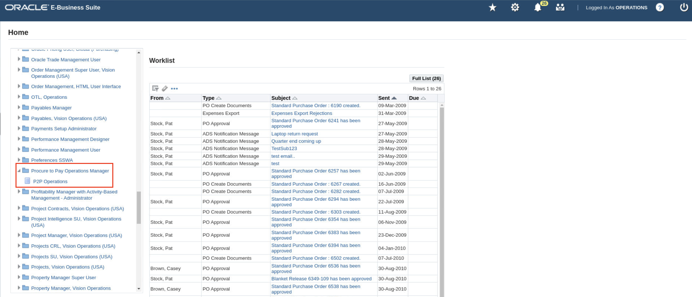

2.	Click on the EBS Settings icon
    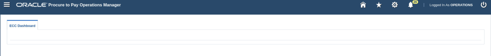

3.	Click on the “Personalize Page” option displayed in the popup
    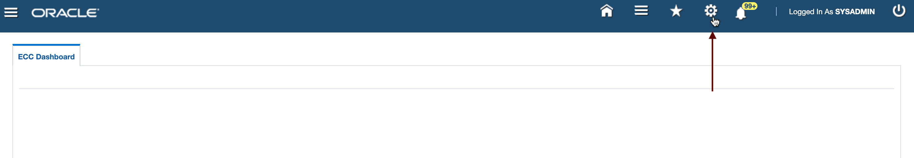


5.	In the Personalization structure table, click on “Personalize” icon for Page Layout section to update the window title
    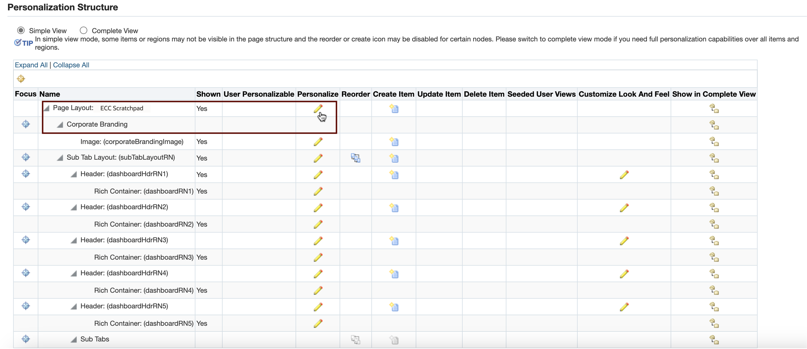

6.	Set the window title to “P2P Operations” and click on “Apply” button
    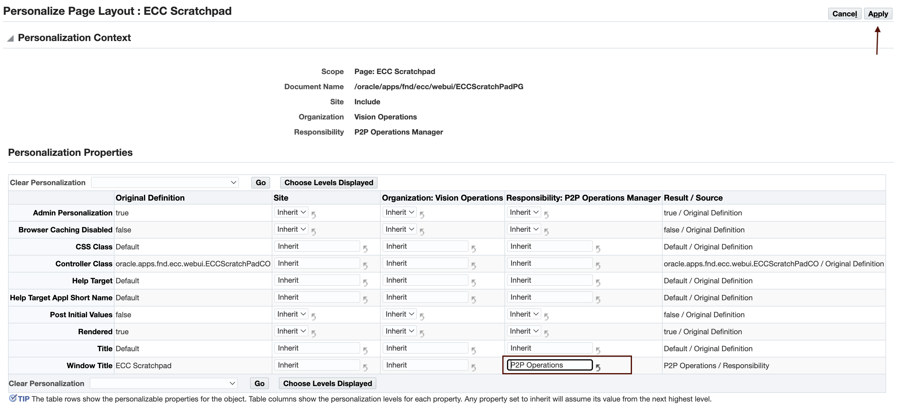

7.	Set the “rendered” property to true in respective Tab Header sections
    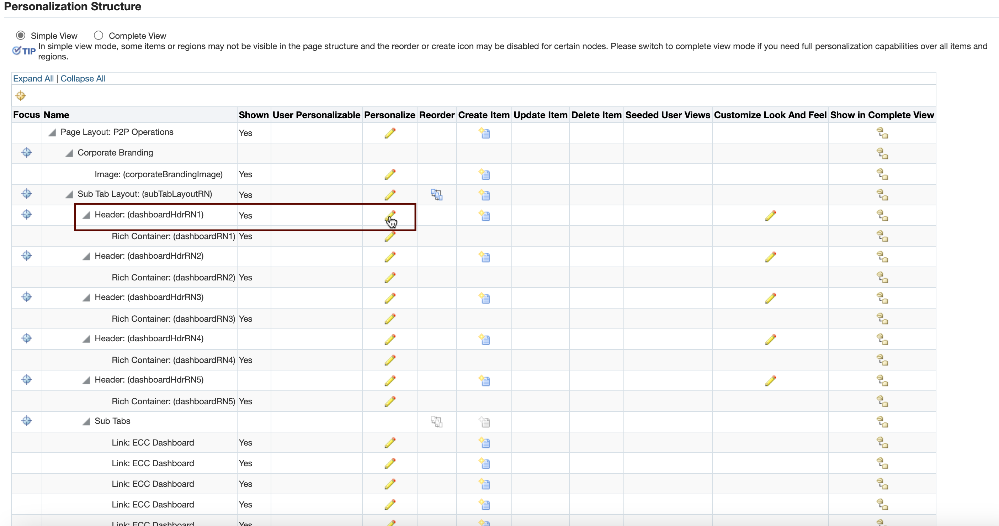
    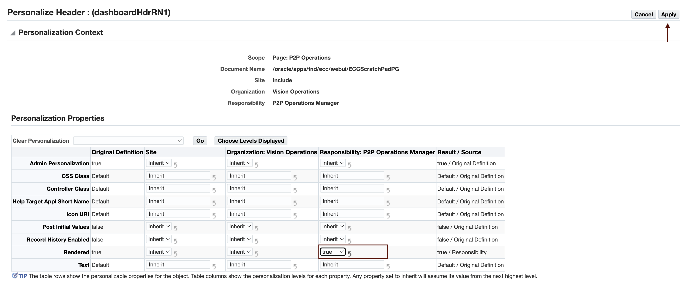

8.	Add the ECC Page FND function to respective Rich Container sections
    *	Destination Function: 
                                                               ```
  	    <copy>PO_PCC_ECC_REQUISITIONS</copy>
            ```
    *	Title: 
                                                               ```
  	    <copy>Requisitions</copy>
            ```
    *   Rendered: true


    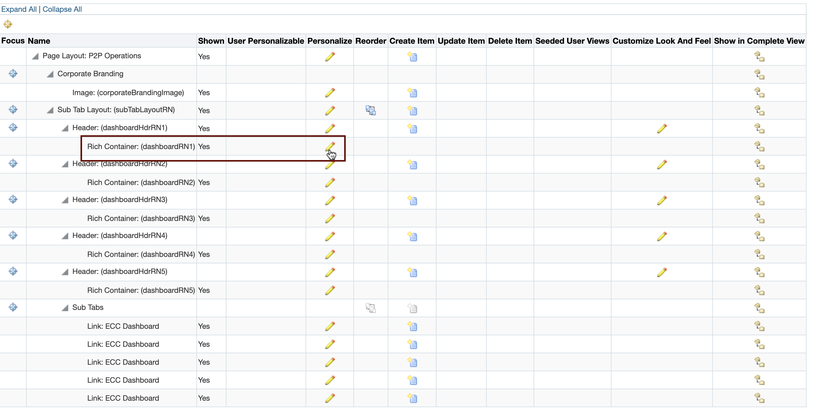
    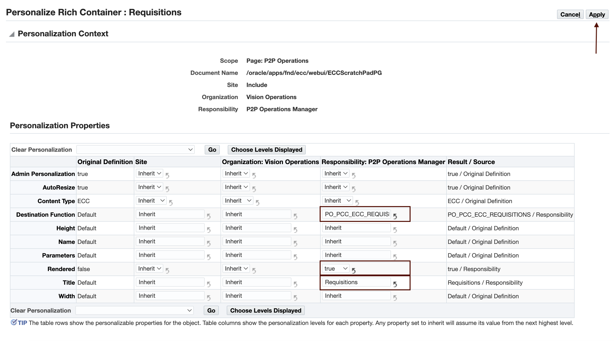

9.	Set the subtab title by clicking on Personalize icon for respective “Sub tab link”
    * Text: 
                                                               ```
  	    <copy>Requisitions</copy>
            ```
    * Rendered: TRUE

    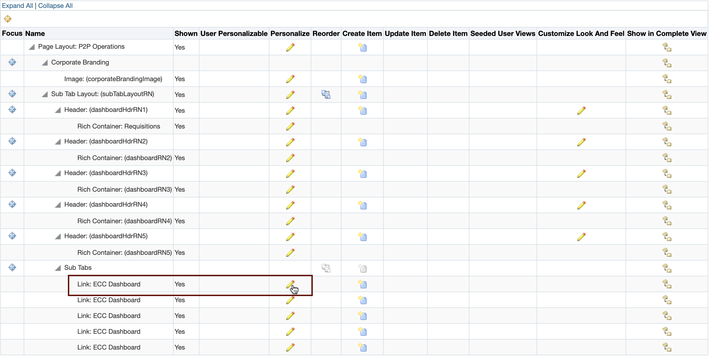
    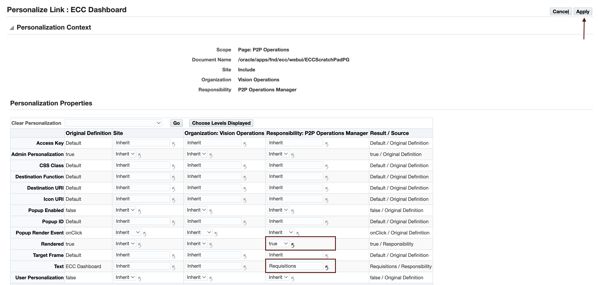
10.	Click on “Return to Application” to access the dashboard
11.	Now, the user can view the Requisitions dashboard
    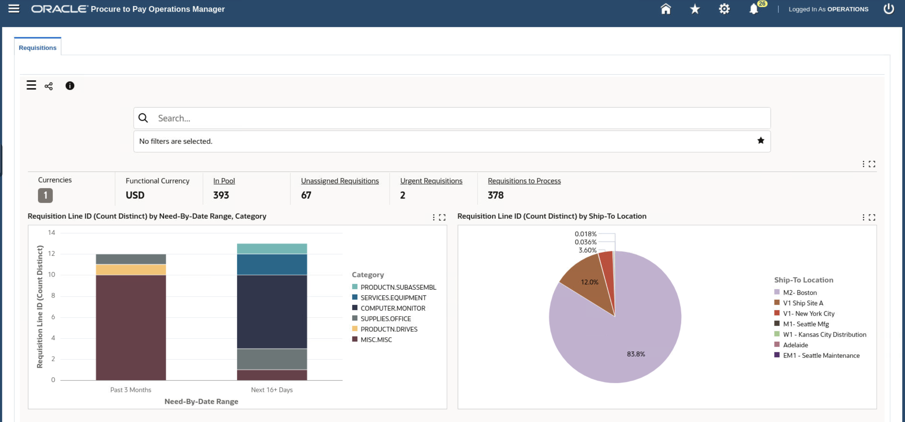

12.	Similarly, the user can add the below-mentioned remaining dashboards by following the same steps as mentioned above (Steps 7, 8, and 9)
    *	Subtab 2:
        *	Title: Orders
        *	Destination Function: PO\_PCC\_ECC\_ORDERS
    *	Subtab 3:
        *	Title: Receiving
        *	Destination Function: INV\_ECC\_RCV
    *	Subtab 4:
        *	Title: Supplier Balance
        *	Destination Function: AP\_ECC\_SUPP\_BALANCE

13.	Click on “Return to Application” to access the dashboards

    


## Learn More
* [Enterprise Command Center- User Guide](https://docs.oracle.com/cd/E26401_01/doc.122/e22956/T27641T671922.htm)
* [Enterprise Command Center- Admistration Guide](https://docs.oracle.com/cd/E26401_01/doc.122/f34732/toc.htm)
* [Enterprise Command Center- Extending Guide](https://docs.oracle.com/cd/E26401_01/doc.122/f21671/T673609T673618.htm)
* [Enterprise Command Center- Installation Guide](https://support.oracle.com/epmos/faces/DocumentDisplay?_afrLoop=264801675930013&id=2495053.1&_afrWindowMode=0&_adf.ctrl-state=1c6rxqpyoj_102)
* [Enterprise Command Center- Direct from Development videos](https://learn.oracle.com/ols/course/ebs-enterprise-command-centers-direct-from-development/50662/60350)
* [Enterprise Command Center for E-Business Suite- Technical details and Implementation](https://mylearn.oracle.com/ou/component/-/117416)

## Acknowledgements

* **Author**- Muhannad Obeidat, VP

* **Contributors**-  Muhannad Obeidat, Nashwa Ghazaly, Mikhail Ibraheem, Rahul Burnwal, Manikanta Kumar and Mohammed Khan

* **Last Updated By/Date**- Mohammed Khan, August 2023

