# End User Personalization


### Introduction

This lab walks you through the steps to perform end user personalization i.e., personalize an Oracle Enterprise Command Center dashboard as a business user

Estimated Time: 30 minutes


### Objectives

In this lab, you will:
* Learn how to take advantage of end user personalization in ECC
* Learn ten different ECC framework components and features 


<!DOCTYPE html>
<html>
<head>
<style>
table {
  font-family: arial, sans-serif;
  border-collapse: collapse;
  width: 100%;
}

td, th {
  border: 1px solid #dddddd;
  text-align: left;
  padding: 8px;
}

tr:nth-child(even) {
  background-color: #dddddd;
}
style="white-space:pre-wrap; word-wrap:break-word"
</style>
</head>
<body>

<h2>Features demoed in this Lab:</h2>

<table>
  <tr>
    <th>Type</th>
    <th>Feature</th>
    
  </tr>

  <tr>
    <td>End User Personalization</td>
    <td> 
    1.  Runtime options: Summarization Bar<br/>
    2.  Runtime options: Results Table<br/>
    3.  Runtime options: Aggregate Table<br/>
    4.  Runtime options: Chart<br/>
     
   
  </tr>
    <tr>
    <td>Navigation</td>
    <td> 
    Saved search <br/>
 
     
   
  </tr>
        <tr>
    <td>Detailed Insights</td>
    <td> 
    Results Table: Inline view <br/>
 
     
   
  </tr>

</table>
</body>
</html>


### Prerequisites 

This lab assumes you have:
* Completed all previous labs successfully 


  

## Task 1: Hands on demo of ECC Receivables

1. Navigate to http://apps.example.com:8000 in the browser with below credentials 


    ```
  	 Username: operations
Password: welcome1
    ```
2. Navigate to Receivables Manager -> Receivables Command center 
    

3. You will be navigated to the "Outstanding receivables" dashboard. Click on the Ledgers flag and select "Vision Operations (USA)" Ledger from the pop up.
    


4. We want to focus on only Past-due invoices, so from the Summarization bar lets only display metrics/dimensions/flags which are relevant to us. Click on the runtime options (three vertical dots) for Summarization Bar, enable the below mentioned items, and then click outside the runtime options of Summarization Bar for changes to reflect.
      * Ledger
      * Currency
      * Past-Due Balance

    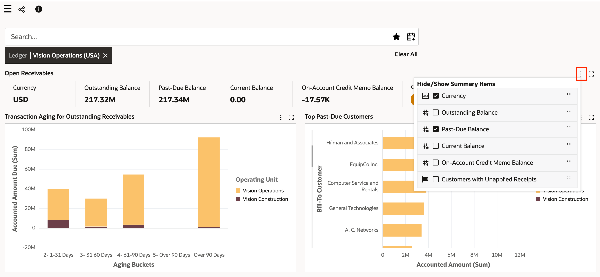

    


5. Scroll down to the Transactions List Results Table and click on the "Hide/Show Columns" icon to only focus on attributes as mentioned below. Then, click outside the Hide/Show columns of Results Table for changes to reflect.
     * Transaction number
     * Transaction Type
     * Transaction Date
     * Due Date
     * Transaction Currency
     * Amount Due
     * Bill-To Customer
    

6. You made runtime changes in Summarization bar and Results Table, these changes will remain even if you were to log out and login again.
7. In the "Transactions List" Results Table, click on the "Preview" row action for transaction number "524952" to review customer claim by opening the customer invoice. This row action leads to source transaction, i.e., row action to invoice overview for seamless integration with EBS. Click on the hamburger icon within the preview, to view the customer claim clearly.

    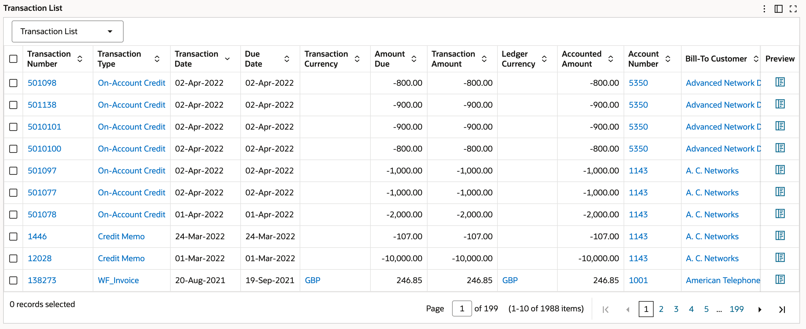
    
    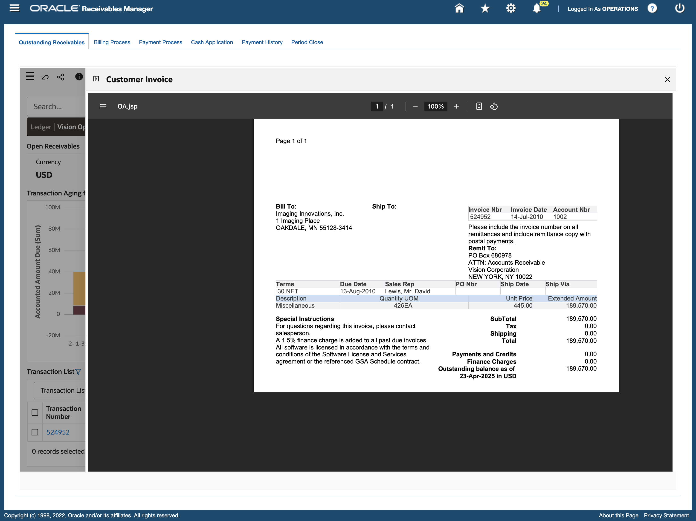


## Task 2: Hands on demo of ECC General Ledger


**Goal:** Analyze Account Activity and Drilldown to Source Transactions
1. Navigate to http://apps.example.com:8000 in the browser with below credentials 


    ```
  	 Username: eccuser
Password: welcome1
    ```
2. You will see the below screen,  from **General Ledger Super User** responsibility navigate to **General Ledger Command Center**  
        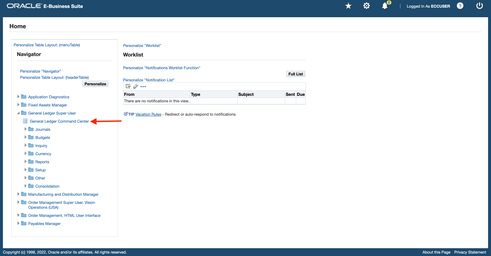

3. You will see the "Account Analysis" dashboard. If you see any existing filters in the Selected refinements, please remove them and refine the dashboard for "Period Name" attribute = Jun-23 from Available refinements (Click on the side navigation panel to open Available refinements). Also, within the "Account Analysis" dashboard you can see the "Period activities by Period name" Trellis chart. We will explore "Expenses" by clicking on "expenses" from the legend in the chart.
        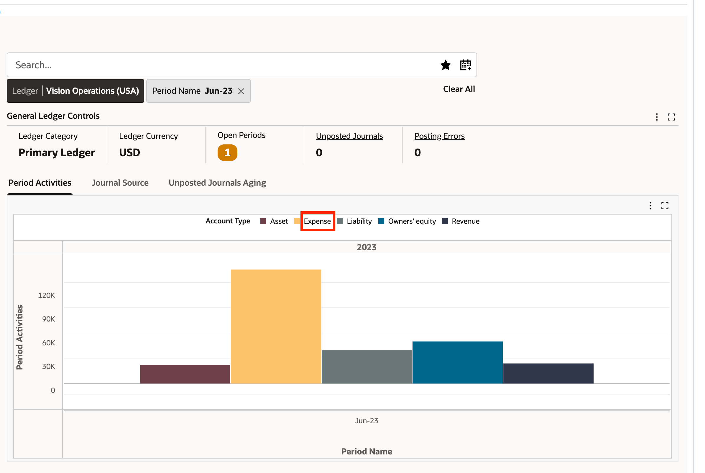
        


5. Let's explore "Employee Expenses" category
        
        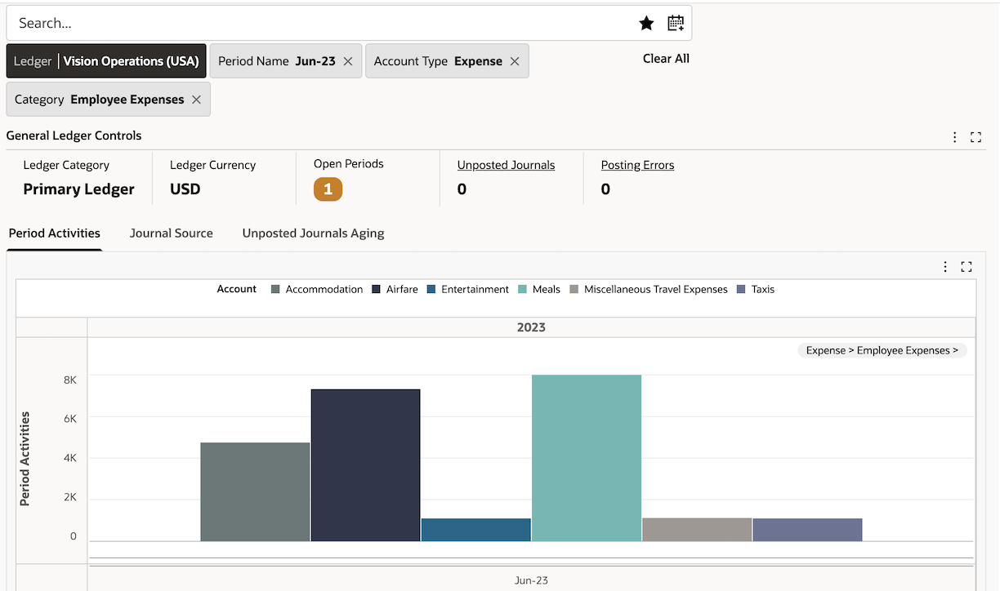
6. The highest employee expense account, is "Meals", which is rather odd. Let's explore it further.
        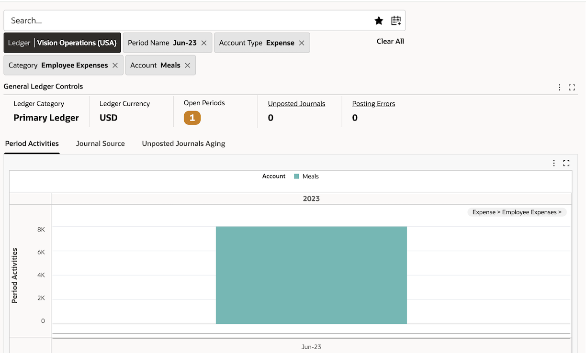

7. To investigate further why "Meals" seems unusally high, let's compare current period amount with previous period. Click on the "Period Name" breadcrumb to add previous period i.e., May-23
        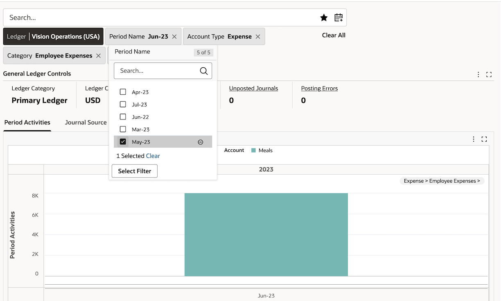
        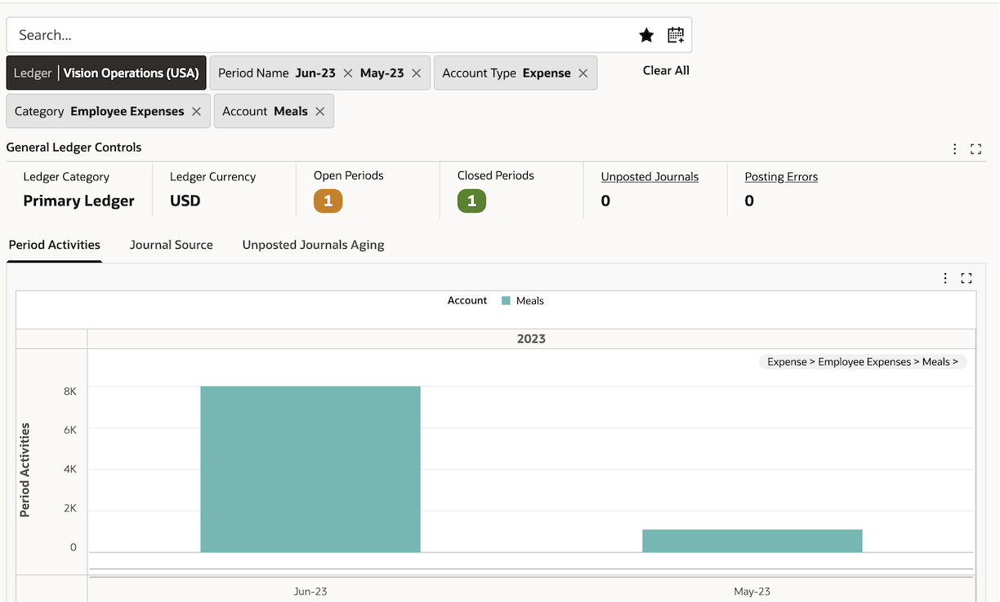

8. Previous period seems very low compared to what we were investigating, let's compare current period amount with same period last year to check for seasonality i.e., compare Jun-23 with Jun-22. To do that, click on the "Period Name" breadcrumb to add Jun-22
        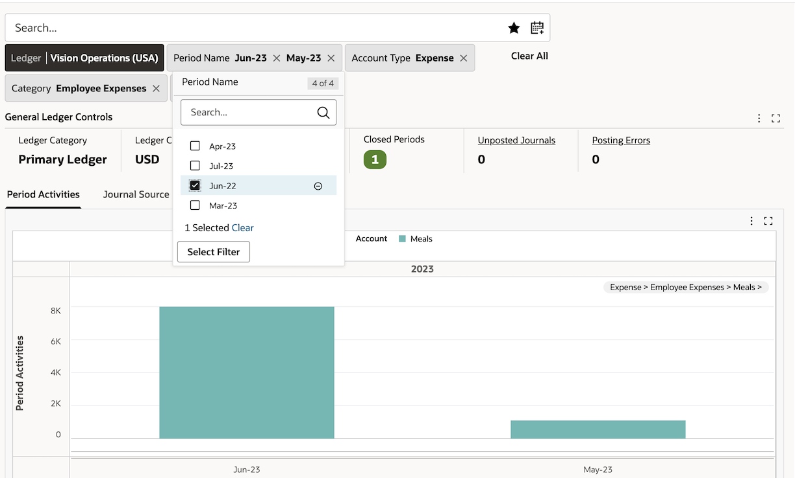
        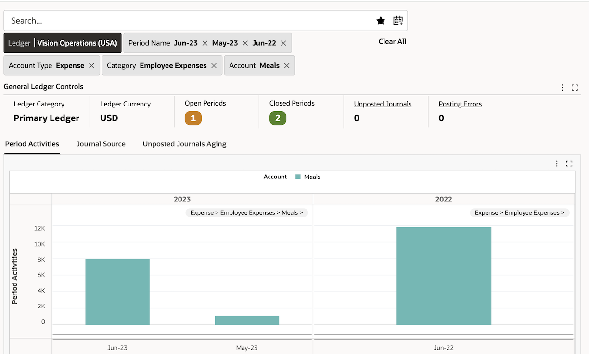

9. The amount for "meals" seems high in the previous year as well. Let's see how the chart would look like if we were to disable the "Trellis" dimension, we can do that from runtime options. Click on the chart runtime options and then click on Trellis column and click outside the selected "Fiscal Year" to remove the Trellis column.
        
        


10. Let's add the Trellis column "Fiscal Year" back again from the same runtime options. 
11. Let's explore further and analyze employee expenses by department. Click on the runtime options for "Period Activities by Chart of Accounts" Pivot view and select only the following and click on "update" within runtime options
    * Dimensions:
        * Balancing Segment
        * Cost Center
        * Account
        * Posting status
        * Period name
    * Metrics:
        * Period activity
        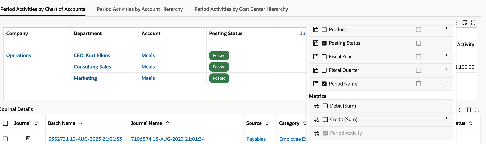
        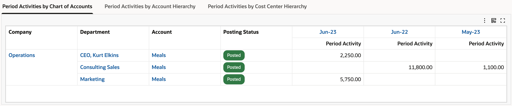

12. Click on the "Period Activities by Account Hierarchy" tab to analyze employee expenses by account hierarchy
        
13. Click on the runtime options for the Pivot view and select only Period activity as the metric, whilst keeping the selected dimension attributes as is, then click on "Update"
               
        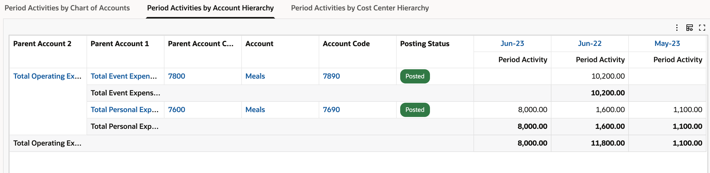

14. We can see that in Jun-23 we have an usually high amount entered under "Meals" account because of it being accounted under personal expenses, which seems wrong. To investigate this further, click on the "Account Code" for 7690. Click on the diagram icon to navigate to the diagram view
        
        


15. From this diagram, you can get to know the journal line details. Now, close the drawer and navigate back to selected refinements and save this search so that we can review it again.
* Users can save frequently-applied filters or preferred filters as saved searches, allowing other users to reuse them. All saved searches are context-sensitive to the page and are part of the search suggestions. 
* The list of saved searches appears when the focus is on the search component. Saved searches are searchable by their titles, filter attributes, and filter values. Three types of saved searches are available for users: seeded, public, and private. 
* Seeded saved searches are published along with the product. Administrators can create public saved searches. Users can create their own private saved searches. 
* Private saved searches are accessible only by the users who created them whereas public saved searches are accessible by all the dashboard users. 
        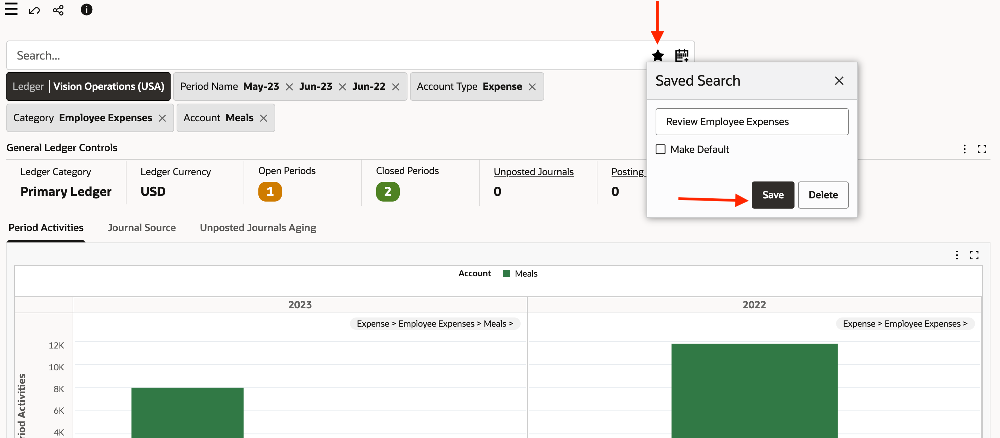


 
    


You may now  **proceed to the next lab**

## Learn More
* [Enterprise Command Center- User Guide](https://docs.oracle.com/cd/E26401_01/doc.122/e22956/T27641T671922.htm)
* [Enterprise Command Center- Administration Guide](https://docs.oracle.com/cd/E26401_01/doc.122/f34732/toc.htm)
* [Enterprise Command Center- Extending Guide](https://docs.oracle.com/cd/E26401_01/doc.122/f21671/T673609T673618.htm)
* [Enterprise Command Center- Installation Guide](https://support.oracle.com/epmos/faces/DocumentDisplay?_afrLoop=264801675930013&id=2495053.1&_afrWindowMode=0&_adf.ctrl-state=1c6rxqpyoj_102)
* [Enterprise Command Center- Direct from Development videos](https://learn.oracle.com/ols/course/ebs-enterprise-command-centers-direct-from-development/50662/60350)
* [Enterprise Command Center for E-Business Suite- Technical details and Implementation](https://mylearn.oracle.com/ou/component/-/117416)

## Acknowledgements

* **Author**- Muhannad Obeidat, VP

* **Contributors**-  Muhannad Obeidat, Nashwa Ghazaly, Mikhail Ibraheem, Rahul Burnwal, Manikanta Kumar and Mohammed Khan

* **Last Updated By/Date**- Mohammed Khan, August 2023

