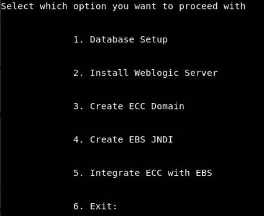
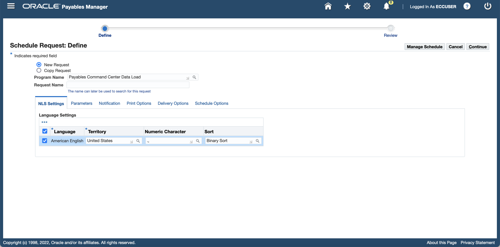
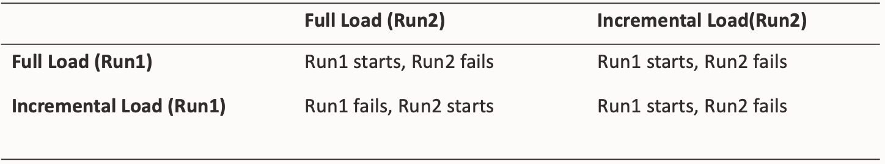

#  Installation


### Introduction


This lab walks you through the steps to install and set up Oracle Enterprise Command Center Framework. In this workshop Oracle Enterprise Command Center Framework is already installed and set up for you to use. Therefore, this lab is optional. 

Estimated Time: 45 minutes

### Objectives
In this lab, you will:

* Validate if EBS responsibility tree is up and validate if EBS run edition can be sourced
* Extract quickInstall
* Create ECC schema and install Weblogic Server
* Create and validate ECC domain and Validate ECC Release
* Register ECC Instance as FND Node and Create EBS JNDI and Validate EBS JNDI
* Integrate ECC with EBS instance and Integrate EBS with ECC
* Import ECC applications and Run dataload


### Prerequisites

This lab assumes you have:
* Completed the previous lab successfully 

##  

## Task 1: Extract Quick Install and Create ECC Schema

1. From the browser, open chrome and from the address bar navigate to http://apps.example.com:8000 

    ```
  	 <copy>http://apps.example.com:8000 </copy>
    ```


2. Login with following credentials:


    ```
  	 Username= eccadmin
Password= welcome1
    ```


3. Verify if EBS homepage is displayed, like in below image:
    
4. Ensure if the responsibility tree is up, like shown in below image:

    

**Note:** If you are not able to type in the remote desktop, then please hit the command key

5. Open a terminal window for EBS to,<n> Source EBS edition</n>. Type the following command (case is important) in the terminal :

    ```
  	 <copy>source /u01/install/APPS/EBSapps.env run</copy>
    ```


6. In the image below, you can see how you should source the running EBS edition on the terminal.
    

7. Now open a new terminal for ECC, leave the previous EBS terminal open. Within the ECC terminal, navigate to /u01 directory by using below command

    ```
  	 <copy>cd /u01</copy>
    ```


8. .bsx files are downloaded in /u01 directory. Extract the .bsx files by running the below command from /u01 directory 


    ```
  	 <copy>for f in *.bsx; do sh $f; done</copy>
    ```


    

9. This process will take a few minutes. After extraction is completed, navigate to cd /u01/Oracle/quickInstall

    ```
  	 <copy>cd /u01/Oracle/quickInstall</copy>
    ```


**Note:** In this directory (Oracle/quickInstall) there is a file called "EccConfig.properties", which has all the parameters predefined for this Hands-on-lab.

10. From the ECC terminal make sure that you are in  /u01/Oracle/quickInstall directory and then execute the below script. When prompted choose **Option 1** to create ECC schema. 

    ```
  	 <copy>./envSetup.sh</copy>
    ```
    

11. This step creates the ECC schema and provides an option to use the existing ECC user created in the ECC database:


    ```
  	 Selected ECC DB is jdbc:oracle:thin:@ebs.org:1521:ebsdb
Is the user <ECC_DB_USERNAME> existing in ECC database [y/n]?<password>
    ```


12. If you choose option “y”, you are prompted for ECC user credentials to create the ECC schema. If you choose the option “n”, you are prompted to enter ECC database system user credentials to create the ECC user and later create the ECC schema. For this demo type **"n"**

13. When prompted provide the database system user details, mentioned below:

    ```
  	 Database system username: system
Database system password: manager
Password for ECC DB user: welcome1
Confirm Password for ECC DB user: welcome1
    ```
14. You will see the below screen

    


15. **Option 1** should be completed successfully. You can verify the logs in $ECC_BASE/Oracle/quickInstall/logs/setup.log

16. Enter **Option 6** to exit and then execute following commands to validate  successful ECC schema creation:

    ```
  	 <copy> source env/ecc.env </copy>
    ```

17. Execute the following command with the credentials mentioned:


    ```
  	 <copy>sqlplus $ECC_DB_USER@"(DESCRIPTION=(ADDRESS=(PROTOCOL=tcp)(HOST=$ECC_HOST_NAME)(PORT=1521))(CONNECT_DATA=(SERVICE_NAME=$EBS_DS_NAME)))"</copy>
    ```
    ```
  	 <copy>Password:welcome1</copy>
    ```


    

18. If you are able to log in to SQL and receive a SQL> prompt, then the ECC DB connection is available to use. 

19. Exit from the SQL prompt by typing **exit;**

You may now **proceed to the next lab**

## Task 2: Install WebLogic Server and Create ECC Domain 

1. Make sure you are in the  /u01/Oracle/quickInstall directory 

2. Run the ./envSetup.sh script again and when prompted choose **Option 2** to Install Weblogic Server 

    ```
  	 <copy>./envSetup.sh</copy>
    ```
    
    
    

3. After weblogic is installed you would be prompted to submit the next option in the installation steps in which case you should  select **Option 3** otherwise execute the ./envSetup.sh script again and then choose **Option 3** to Create ECC domain. 


    ```
  	 <copy>./envSetup.sh</copy>
    ```
    


4. As part of creation of ECC domain, following are the key tasks performed (no action required in this lab):
    
    - Enter the password for ECC DB user as **welcome1** 
    - Set the password for ECC user weblogic as **welcome1**


    

5. After completing successfully you will see the below screen

    

6. From the browser navigate to the below URL 

    ```
  	 <copy>http://localhost:7776/ecc</copy>
    ```

**Note:** If you are not able to type in the remote desktop browser then please hit the command key


   * ECC Administrator UI should be accessible i.e., you should see the highlighted section in below  screen
   * Activity audit application should be imported i.e., you should see Activity audit application in home screen as highlighted below


    
7. From the browser navigate to the below URL


    ```
  	 <copy>http://localhost:7776/ecc</copy>
    ```

8. ECC Administrator UI should be accessible.

   * In **About** page “Enterprise Command Centers:” should be shown as ‘V10’.

   * “Oracle JavaScript Extension Toolkit (JET) :” should be shown as 13.1.4 

   * “SOLR” should be shown as 8.8.2

    

You may now **proceed to the next lab**

## Task 3: Register ECC as FND Node and Create EBS JNDI

 1. On the ECC terminal Enter **Option 6** to exit the Options screen and Source EBSapps running edition

    ```
  	 <copy>source /u01/install/APPS/EBSapps.env run </copy>
    ```


    


2. Run the following java command on EBS machine to register ECC instance as FND NODE, this will create "ebsdb_APPS.EXAMPLE.COM.dbc" file:

    ```
  	 <copy>java oracle.apps.fnd.security.AdminDesktop apps/apps CREATE NODE_NAME=apps.example.com DBC=/u01/install/APPS/fs2/inst/apps/ebsdb_apps/appl/fnd/12.0.0/secure/ebsdb.dbc</copy>
    ```

**Note:** Copy here works because you are on the same machine

3. Copy the "ebsdb_APPS.EXAMPLE.COM.dbc" file to the ECC instance

    ```
  	 <copy>cp ebsdb_APPS.EXAMPLE.COM.dbc /u01/Oracle/quickInstall/connection.dbc</copy>
    ```


    


    


**EBS\_ECC\_USER** is the Oracle E-Business Suite user name (FND user) with which Oracle Enterprise Command Center Framework connects to Oracle E-Business Suite using the JNDI configuration. 

4.  Make sure that from ECC terminal you update EBS\_ECC\_USER value in /u01/Oracle/quickInstall/EccConfig.properties  to ECC\_DISCOVERY\_HOL\_{yourname}, to do that follow the below steps:

   - In ECC terminal type vi /u01/Oracle/quickInstall/EccConfig.properties to open the file
   - To insert or update please enter "i" on the keyboard
   - Update EBS\_ECC\_USER property
   - Enter "Esc" on the keyboard and enter ":wq" and then press "Enter" to save the file

    

5. From the ECC terminal, execute the ./envSetup.sh script and when prompted choose **Option 4** to Create EBS JNDI.


    ```
  	 <copy>./envSetup.sh</copy>
    ```


    


    
    

   * When prompted provide a password to create new FND user as **welcome1**
   * Password for ECC Domain weblogic was previously set by you as **welcome1**
   * Password for EBS Schema apps is always **apps**

6. Open the browser and copy paste the below URL to access ECC Admin console: 
    ```
  	 <copy>http://apps.example.com:7775/console</copy>
    ```


7. Enter ECC admin user credentials 
    ```
  	 Username:weblogic
Password:welcome1
    ```


8. You should see the below screen
    

9. Go to the "Data Sources" in "Services" tab as shown below
    

10. Click on "JNDI" with the name “ebsdb” as indicated below

    
11. Go to "Monitoring" -> "Testing" tab
    

12. Select "eccManaged Server" and click on "Test Data Source"

    

13. You should see a success message in green as shown below


    


## Task 4: Integrate ECC and EBS

1. From the ECC terminal, execute the ./envSetup.sh script and choose **Option 5** to integrate ECC with EBS instance 

    ```
  	 <copy> ./envSetup.sh</copy>
    ```


2. When prompted to proceed with EBS integration submit "y" as shown below:


    

3.  Here, please enter password as **welcome1** for both ECC DB user and ECC admin user weblogic  

    

    

4. Log in to Oracle E-Business Suite as a system administrator i.e., Open the browser and navigate to http://apps.example.com:8000 

    ```
  	 Username= SYSADMIN
Password= welcome1
    ```


5. Navigate to System Administrator: Oracle Applications Manager > AutoConfig.

    

6. Select the application tier context file, and choose "Edit Parameters"

    

7. Search for the s\_ecc\_conf\_comment variable by selecting OA_VAR in the search list of values and entering s\_ecc\_conf\_comment in the search text box. Then, click the "Go" button.

    

 **Note:** 
 If  number sign (#) is present in Value field then remove it from the Value field for the s\_ecc\_conf\_comment variable to ensure that this variable is not commented. Then, click the "Save" button.
 
 Enter a reason for the update, such as Enabling Oracle Enterprise Command Center Framework. Then choose the OK button.
 
 Similarly, search for the following variables and set their values as appropriate for your installation:

    1. **s\_ecc\_protocol** - The protocol for accessing the Oracle Enterprise Command Center Framework administration UI.
    2. **s\_ecc\_web_host** - The Oracle Enterprise Command Center Framework host name.
    3. **s\_ecc\_managed\_server\_port** - The port for the Oracle Enterprise Command Center Framework managed server.
    4. **s\_ecc\_conf\_update** - A flag to update the ecc.conf file. If Oracle Enterprise Command Center Framework is enabled, use this variable to specify whether the ecc.conf file should be updated. The default value is true, which means ecc.conf will be updated during every AutoConfig run. To retain the contents of ecc.conf, such as when you are enabling TLS for the Oracle Enterprise Command Center Framework installation, set this variable to false.

 

8. Open EBS terminal and then run AutoConfig. For running Autoconfig you need to first source the EBS running edition using below command

    ```
  	 <copy>source /u01/install/APPS/EBSapps.env run</copy>
    ```


9. Then, navigate to below location

    ```
  	 <copy>cd $ADMIN_SCRIPTS_HOME</copy>
    ```


10. Run the below script

    ```
  	 <copy>./adautocfg.sh</copy>
    ```


11. It will prompt you for apps password which is by default **apps** 

    
    
12. Once Autoconfig runs successfully then navigate to below location:

    ```
  	 <copy>cd $ADMIN_SCRIPTS_HOME</copy>
    ```


    


13. And then, run the following script to check OHS status:


    ```
  	 <copy>./adapcctl.sh status</copy>
    ```

    

14. And then, run the following script to stop OHS:


    ```
  	 <copy>./adapcctl.sh stop</copy>
    ```


       

15. And then, run the following script to start OHS:

    ```
  	 <copy>./adapcctl.sh start</copy>
    ```


    

16. And then, run the following script again to check the OHS status if it has successfully started:

    ```
  	 <copy> ./adapcctl.sh status</copy>
    ```


    

17. Navigate to http://apps.example.com:8000 in the browser with below credentials 


    ```
  	 Username: SYSADMIN
Password: welcome1
    ```


    
18. Navigate to ECC Developer, you should see "Activity audit" application as below if the integration is successful
    

## Task 5: Import Applications and Run Data Load
1.  Open EBS terminal, source EBSapps running edition

    ```
  	 <copy>source /u01/install/APPS/EBSapps.env run </copy>
    ```


2. Navigate to below location in terminal 

    ```
  	 <copy>cd /u01/install/APPS/fs2/EBSapps/appl/fnd/12.0.0/bin </copy>
    ```


3. Execute patchEccFiles.pl command

    ```
  	 <copy>sh patchEccFiles.pl</copy>
    ```


4. When you run patchEccFiles.pl it will prompt you to enter a temporary directory, so enter**/tmp/ecc1**
5. When prompted enter EBS DB apps user password as **apps**
6. When prompted you need to pass the languages that you need to import. Use "en" 

    


7. When prompted you need to mention what products you need to import. 
     * "Y" is for all products
     * "N" is to specify a smaller subset of products. 

8. Enter **"N"** 

9. You will be presented with the list of products from which you need to mention which ones to import. 

10. For this demo please enter the following products: "**AP,GL,ONT,FA,WIP** "

    ```
  	 <copy>AP,GL,ONT,FA,WIP</copy>
    ```


    
    

11. You should see the following  screen when you run it successfully

    

12. Navigate to http://apps.example.com:8000 in the browser with below credentials 


    ```
  	 Username: SYSADMIN
Password: welcome1
    ```

    
13. Navigate to ECC Developer, you should see new applications as below
    

14. To perform RBAC setup with the UMX\_ECC\_RBACAuto.sh script, you should type the following command (case is important):

    ```
  	 <copy>source /u01/install/APPS/EBSapps.env run</copy>
    ```


15. Move to the $FND_TOP/bin directory for your Oracle E-Business Suite instance using the following command: 
    ```
  	 <copy>cd $FND_TOP/bin</copy>
    ```


16. Run the script using the following command:

    ```
  	 <copy>./UMX_ECC_RBACAuto.sh</copy>
    ```


17. When prompted, enter the user name and password of the APPS (username and password is **apps**) user for the Oracle E-Business Suite instance.

18. When prompted, enter the full path and file name for your .csv input file. If your file is named UMX\_ECC\_RBAC.csv and is present in the same directory as the UMX\_ECC\_RBACAuto.sh file, then the script uses that file by default and does not prompt you for the file name and path.

19. The following example shows sample output from the script:

    ```
  	 -bash-3.00$ ./UMX_ECC_RBACAuto.sh
APPS username:apps
APPS password:
Enter csv file name with full path : /slot/ems2120/appmgr/apps/apps_st/appl/UMX_ECC_RBAC.csv
Executing for Permission_set EAM_ECC_ACCESS_PS , Responsibility_name FND_RESP|EAM|MSU_VIS_OPS|STANDARD and ECC_Role UMX|EAM_ECC_ACCESS_ROLE
old   6: L_MENU_NAME varchar2(100) := '&1';
new   6: L_MENU_NAME varchar2(100) := 'EAM_ECC_ACCESS_PS';
old   8: l_responsibility_name varchar2(300) := '&2';
new   8: l_responsibility_name varchar2(300) := 'FND_RESP|EAM|MSU_VIS_OPS|STANDARD';
old  10: ecc_role_name varchar2(300) := '&3';
new  10: ecc_role_name varchar2(300) := 'UMX|EAM_ECC_ACCESS_ROLE';
Completed Successfully

PL/SQL procedure successfully completed.
-bash-3.00$
    ```
20. Navigate to http://apps.example.com:8000 in the browser with below credentials 

    ```
  	 Username: eccuser
Password: welcome1
    ```


    
21. Navigate to "Payables Manager" and then to "Payables Command Center"
    
22. Because you are yet to run the dataload you will not see any data just yet but the page should load like below

    

Each product with an Enterprise Command Center provides a concurrent program to load its product-specific data into the Oracle Enterprise Command Center Framework installation. 

Here we will take the example of Oracle Payables with the respective Data Load Concurrent Program "Payables Command Center Data Load".Run this program now to perform an initial full load. 

You should also schedule the data load programs periodically to perform incremental loads to update the data available in the Enterprise Command Center dashboards. For details, see your product documentation.
 
### Execution Flow

23. The following diagram gives an overview of a Data load process:
    


Jobs should be submitted from EBS concurrent program and hence the tracking should be exposed to the concurrent program job.
Concurrent program keeps polling the status of the job from ECC and display the current status of the job

24. Login in EBS (From the browser navigate to http://apps.example.com:8000) using below credentials:

    ```
  	 Username: eccuser
Password: welcome1
    ```


25. Once you login, navigate to "Payables Manager" and then to "Payables Command Center"


    

26. Change the function id to **1011696** in the url as indicated in the image below and hit enter

    

27. You will see the below "Schedule request" page 

    


28. Choose "Payables Command Center Data Load" in the Program name by copying it from below and pasting in the Program Name

    ```
  	 <copy>Payables Command Center Data Load</copy>
    ```


29. You should see the below screen

    
30. Go to "Parameters" tab and then select **FULL_LOAD** as Load Type and Click "Continue"

    
31. Click "Submit"
    
32. You should see the below screen once the data load is successful

    
33. You can track the dataload 
    
34. Or You can also track the dataload by copying the Concurrent Program ID then navigating to ECC Developer i.e., (Navigating to http://apps.example.com:8000/ecc) and then to Data Load Tracking Page using admin credentials provided below:


    ```
  	 Username: eccadmin
Password: welcome1
    ```


35. You can check the respective job using the Concurrent Program ID, as shown in below image

    


36. From ECC:
    - User can check details for each query in real time.
    - It reflects the current load status: Number of successful rows and number of failed rows.
    - It shows when the query started, how much time spent at the DB, the sql text and the operation.
    - User can cancel the running job

    SQL Trace can be enabled by passing “TRUE” value while starting the data load Concurrent Program.
    The trace log file will be generated with the ECC Data Load sub-request “Job ID” as the identifier. The “Job ID” is noted in the log file of sub-request.

37. Data Load job structure request:
    - One “Audit Request” per job
    - One “Dataset Key” per dataset included at the job
    - One “Audit Load Rule” per load rule for each “Audit Dataset”
    - One “Audit Load Detail” for each query retrieved from the load rule for each “Audit Load Rule”


38. The following image describes Self Job Concurrency Matrix

     

For details on Data load tuning, ETL Job parameters, SQL Plan statistics and common issues please refer to the [Enterprise Command Center- Installation Guide](https://support.oracle.com/epmos/faces/DocumentDisplay?_afrLoop=264801675930013&id=2495053.1&_afrWindowMode=0&_adf.ctrl-state=1c6rxqpyoj_102)

39. Open the browser and navigate to http://apps.example.com:8000 from eccuser

    ```
  	 Username: eccuser
Password: welcome1
    ```


40. And then to "Payables Manager" responsibility and then to "Payabales Command Center" and see if the page loads as below. This proves that the data load was successful

     

## Learn More
* [Enterprise Command Center- User Guide](https://docs.oracle.com/cd/E26401_01/doc.122/e22956/T27641T671922.htm)
* [Enterprise Command Center- Admistration Guide](https://docs.oracle.com/cd/E26401_01/doc.122/f34732/toc.htm)
* [Enterprise Command Center- Extending Guide](https://docs.oracle.com/cd/E26401_01/doc.122/f21671/T673609T673618.htm)
* [Enterprise Command Center- Installation Guide](https://support.oracle.com/epmos/faces/DocumentDisplay?_afrLoop=264801675930013&id=2495053.1&_afrWindowMode=0&_adf.ctrl-state=1c6rxqpyoj_102)
* [Enterprise Command Center- Direct from Development videos](https://learn.oracle.com/ols/course/ebs-enterprise-command-centers-direct-from-development/50662/60350)
* [Enterprise Command Center for E-Business Suite- Technical details and Implementation](https://mylearn.oracle.com/ou/component/-/117416)

## Acknowledgements

* **Author**- Muhannad Obeidat, VP

* **Contributors**-  Muhannad Obeidat, Nashwa Ghazaly, Mikhail Ibraheem, Rahul Burnwal, Manikanta Kumar and Mohammed Khan

* **Last Updated By/Date**- Mohammed Khan, August 2023

