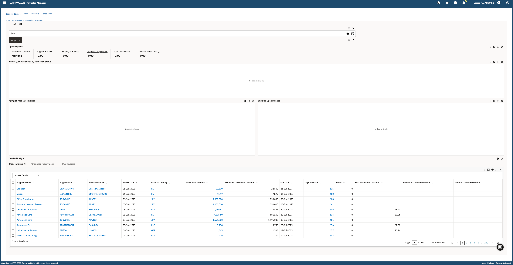

# Introduction 

## About this Workshop

The intent of this workshop is to give you practical hands on experience on Oracle Enterprise Command Center. This workshop has demonstrated use cases and step by step instructions that are easy to follow. It will walk you through all of the steps and processes that a typical ECC Developer would do, it has a show and tell of the ECC installation process, hands on labs for creating applications, data sets, pages, components etc.

There is also an instructor led lab where you will learn about several advanced features of Oracle Enterprise Command Center with examples.

This lab gives a brief introduction to Oracle Enterprise Command Center Framework

Estimated Time: 10 minutes

### Objectives
In this lab, you will:
* Learn about Oracle Enterprise Command Center Framework

### Prerequisites

This lab assumes you have:
* An Oracle Cloud account
* Requested a workshop reservation on LiveLabs

## Task 1: Learn about ECC and how you can take advantage of it?

Enterprise Command Centers (ECC) provide information discovery along with visualization and exploration capabilities embedded within Oracle E-Business Suite user interfaces. Oracle Enterprise Command Center Framework enables the creation of business dashboards in different functional areas.

Oracle E-Business Suite users navigate transactional information using interactive visual components and guided discovery capabilities allowing exploratory data analysis. Mobility and responsive design are built into the Oracle Enterprise Command Center Framework, and all dashboards automatically adjust the layout to better fit a desktop or mobile device form factor. Oracle Enterprise Command Center Framework automatically adheres to existing Oracle E-Business Suite security. The content a user sees, within a dashboard, is consistent with the Oracle E-Business Suite context and security. 

**Example of an Enterprise Command Center Dashboard**
        

You may now **proceed to the next lab**

  
## Learn More
* [Enterprise Command Center- User Guide](https://docs.oracle.com/cd/E26401_01/doc.122/e22956/T27641T671922.htm)
* [Enterprise Command Center- Administration Guide](https://docs.oracle.com/cd/E26401_01/doc.122/f34732/toc.htm)
* [Enterprise Command Center- Extending Guide](https://docs.oracle.com/cd/E26401_01/doc.122/f21671/T673609T673618.htm)
* [Enterprise Command Center- Installation Guide](https://support.oracle.com/epmos/faces/DocumentDisplay?_afrLoop=264801675930013&id=2495053.1&_afrWindowMode=0&_adf.ctrl-state=1c6rxqpyoj_102)
* [Enterprise Command Center- Direct from Development videos](https://learn.oracle.com/ols/course/ebs-enterprise-command-centers-direct-from-development/50662/60350)
* [Enterprise Command Center for E-Business Suite- Technical details and Implementation](https://mylearn.oracle.com/ou/component/-/117416)

## Acknowledgements

* **Author**- Muhannad Obeidat, VP

* **Contributors**-  Muhannad Obeidat, Nashwa Ghazaly, Mikhail Ibraheem, Rahul Burnwal, Manikanta Kumar and Mohammed Khan

* **Last Updated By/Date**- Mohammed Khan, August 2023

