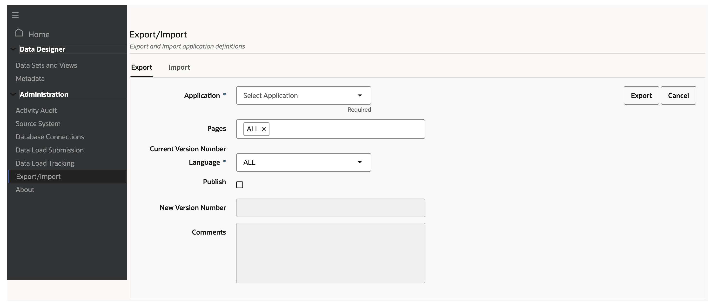
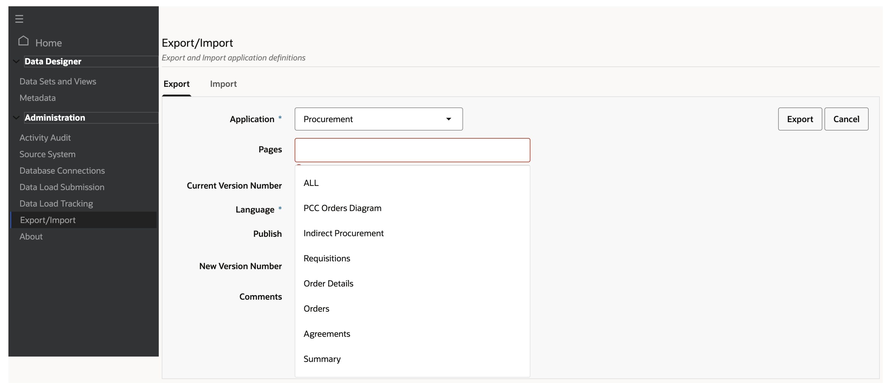
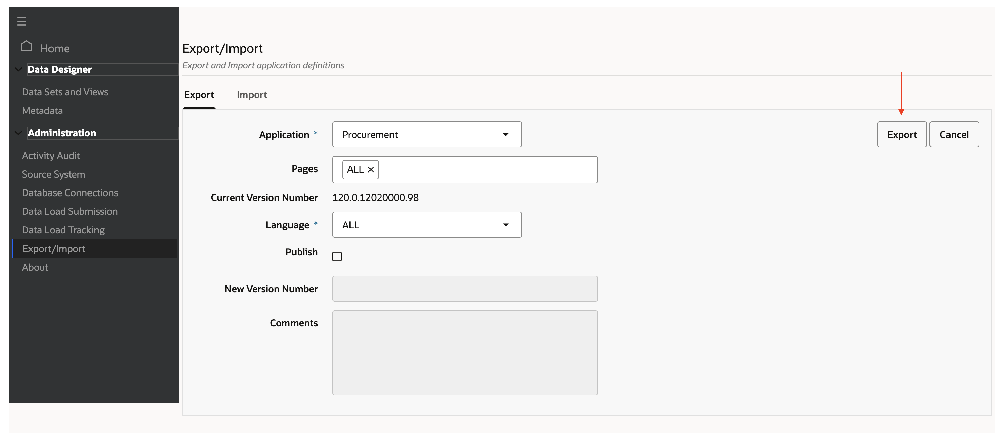
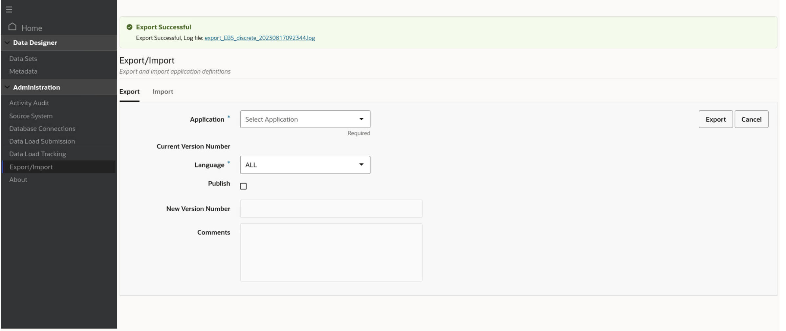
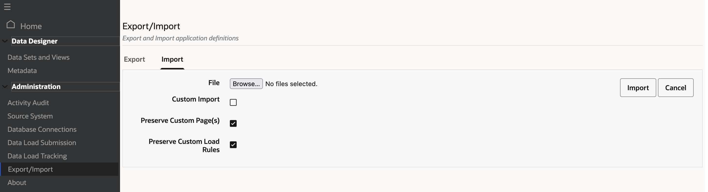
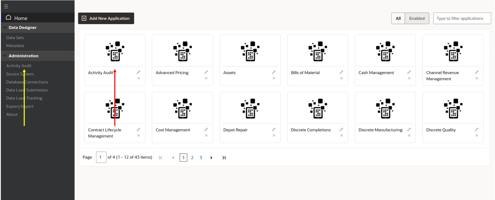
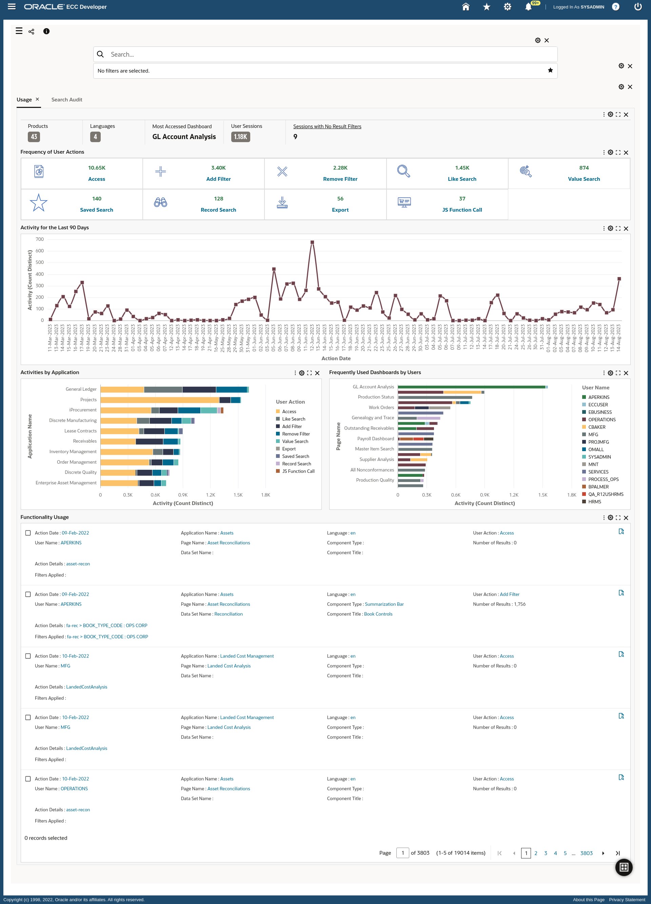
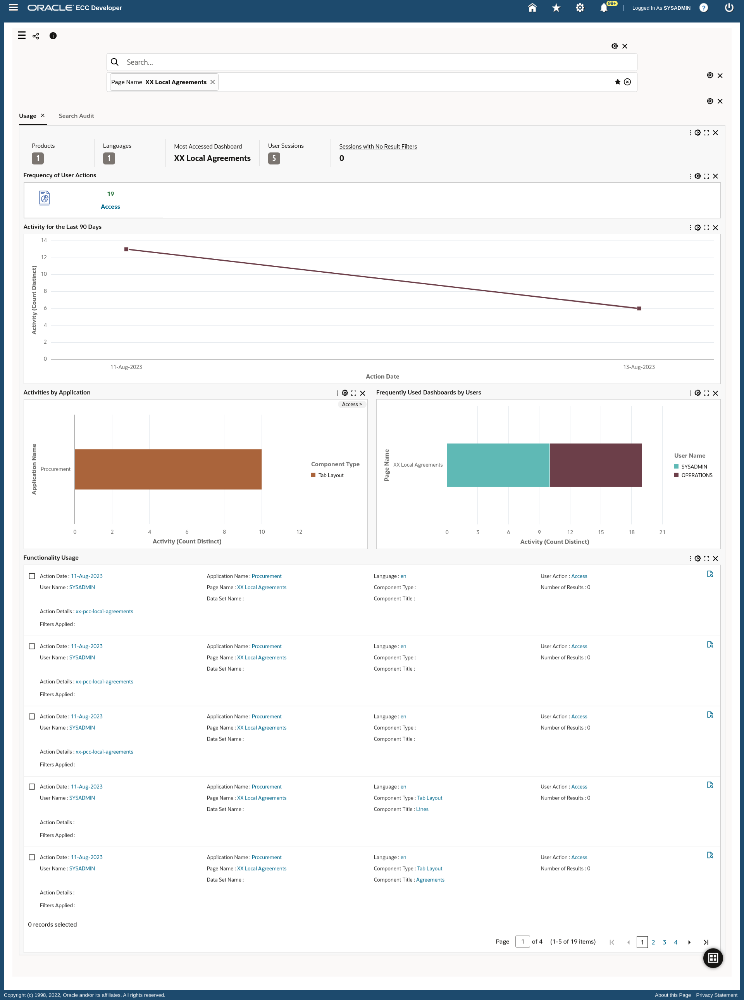

# Manage Extensibility

### Introduction

Because Oracle E-Business Suite is used across many industries and environments, users may have special requirements like merging development in one place or moving development from a test environment to a production environment. This lab details the steps needed to do so and also discusses how as an admin you can keep track of ECC usage.

Estimated Time: 30 minutes


### Objectives

In this lab, you will:

* Publish changes to other environments
* Track Usage using activity audit


### Prerequisites

This lab assumes you have:
* Completed all previous labs successfully 


##  

## Task 1 : Publish changes to other environments

* Users need to move their development across environments and sometimes multiple users working on the same application in different environments want to merge their development. For all of these use cases, ECC allows users to both export an application (along with the underlying pages and data sets) and import an application (along with the underlying pages and data sets) into a different environment. 
* The Administrator UI allows you to export or import any application. This capability helps in sharing the application for a quick assessment, creating a backup before extending, moving an application to a different environment, or restoring the shipped state of a command center. An application can be exported for any specific language, and an application can be imported preserving any custom pages or custom load rules.

1. Login to EBS apps (From the browser URL navigate to http://apps.example.com:8000) with below credentials

    ```
  	 Username: sysadmin
Password: welcome1
    ```

2. Navigate to ECC Developer -> ECC Developer
    

3. Navigate to "Export/Import" tab under "Administration" section.
    
4. Select "Procurement" application from the application drop down.
    
5. To select "English", select Language as "en" from the Language drop down and then click on "Export"
     

6. You will see a success message, indicating that the application has been exported.
     
7. Likewise, to import an application you have to click on the "Import" tab and then select the application. For instance, if you were to be in a separate environment you could select the application we just exported and then this application will:
    * Replace the existing Procurement application with our new Procurement application, overriding all of the underlying pages and data sets associated.
    * Create a new Procurement application, along with all underlying pages and data sets if there wasn't an application called "Procurement" 
     


## Task 2: Track usage using Activity Audit
* The Activity Audit dashboard is designed to support two use cases: tracking user activity and tracking search activity.


* The Activity Audit dashboard gives full insight into the use of the Enterprise Command Center dashboards. It allows business analysts and administrators to know whether dashboards are being used or not, who uses them, and at what times and which dashboard is used more. It also helps generate valuable new insights into user searches.

* Activity Audit provides the following benefits:

    * Capitalize on ECC investment

        * Track dashboard usage

        * Capture audit trail of user activities on dashboards

        * Tune deployment and tune extract, transform, and load (ETL) processes

    * Tune business operations

        * Monitor search activity

        * Identify and analyze user intents

        * Resolve issues as they arise
* Application and Data set details

    * Dataset Name: Activity Audit

    * Dataset Key: activity-audit

    * Application Name: Activity Audit

    * Application Short Name: activity-audit

    * Page Name: Activity Tracker

    * Page Short Name: activity-tracker
* To access the dashboard, navigate to the Activity Audit section in the Administration UI or you can click on the "Activity audit" application from Home.

     
     

* You can also choose to view individual application/page details as well. Click on the Page name filter from the Available refinements section and filter for "XX Local Agreements" page
     


You may now **proceed to the next lab**


## Learn More
* [Enterprise Command Center- User Guide](https://docs.oracle.com/cd/E26401_01/doc.122/e22956/T27641T671922.htm)
* [Enterprise Command Center- Administration Guide](https://docs.oracle.com/cd/E26401_01/doc.122/f34732/toc.htm)
* [Enterprise Command Center- Extending Guide](https://docs.oracle.com/cd/E26401_01/doc.122/f21671/T673609T673618.htm)
* [Enterprise Command Center- Installation Guide](https://support.oracle.com/epmos/faces/DocumentDisplay?_afrLoop=264801675930013&id=2495053.1&_afrWindowMode=0&_adf.ctrl-state=1c6rxqpyoj_102)
* [Enterprise Command Center- Direct from Development videos](https://learn.oracle.com/ols/course/ebs-enterprise-command-centers-direct-from-development/50662/60350)
* [Enterprise Command Center for E-Business Suite- Technical details and Implementation](https://mylearn.oracle.com/ou/component/-/117416)

## Acknowledgements

* **Author**- Muhannad Obeidat, VP

* **Contributors**-  Muhannad Obeidat, Nashwa Ghazaly, Mikhail Ibraheem, Rahul Burnwal, Manikanta Kumar and Mohammed Khan

* **Last Updated By/Date**- Mohammed Khan, August 2023

