# Power User Personalization

### Introduction


This lab walks you through the steps to personalize Oracle Enterprise Command Center dashboards as a Power user.

Estimated Time: 30 minutes

### Objectives
In this lab, you will:
* Learn about ECC component categorization and ECC configuration model
* Personalize ECC Payables command center as a Power User
* Personalize ECC General Ledger command center as a Power User


### Prerequisites

This lab assumes you have:
* Completed all previous labs successfully 

##  

## Task 1: ECC Component walkthroughs

**Categorization of components**

Oracle Enterprise Command Center Framework UI components are grouped into four main groups:
   * Navigation:
      * Search Box
      * Selected Refinements (breadcrumb)
      * Available Refinements
   * Visualization: 
      * Summarization Bar
      * Chart
      * Tag Cloud
      * Aggregated Table
      * Diagram
      * Aggregated Grid
   * Detailed insights:    
      * Results Table
      * Results Grid
   * Layout:
      * Tabbed component container

   All Oracle Enterprise Command Center Framework components come with a unified configuration model that enhances the configuration experience. Also, many components share a subset of user-facing options. 


**Configuration model**


   The Oracle Enterprise Command Center Framework configuration model uses a familiar structure that follows that of a SQL query. No coding or custom expressions are required to configure any Oracle Enterprise Command Center Framework component.
   For the sake of explaining different configuration options of Oracle Enterprise Command Center Framework components, we will use a SQL query structure to introduce the relevant concept in the Oracle Enterprise Command Center Framework configuration template. Please note that Oracle Enterprise Command Center Framework does not execute a SQL query to display data in a component.


   For example, given the SQL query:

      SELECT
      SUM(ASSET_COST), MAJOR_CATEGORY

   The metric can be added under "Metrics" with the Attribute of "Asset Cost" and Aggregation "Sum".
    
   
   If the SQL statement is:

      FROM
      fa-asset
   The Oracle Enterprise Command Center Framework Configuration would show
   fa_asset as the selected data set.
    

   If the SQL statement is:
      WHERE
      ASSET\_TYPE = 'CAPITALIZED'
   The Oracle Enterprise Command Center Framework Configuration would have the condition with Asset Type Code for Attribute, = for Operator, and CAPITALIZED for Value.
    
   If the SQL statement is:
      GROUP BY MAJOR\_CATEGORY
   The Oracle Enterprise Command Center Framework Configuration would have
   The category listed under Dimensions
    
   If the SQL statement is:
      HAVING
      SUM(ASSET\_COST) > 10000
   The Oracle Enterprise Command Center Framework Configuration would have Asset Cost (SUM) for Attribute, >= for Operator, and 10000 for Value under Aggregate Conditions.
    


   Based on the above example, the following chart will be displayed:
    
   Likewise a Results Table, which is a flat list of rows, displaying Batch name, Journal name, Account type, Source, Category from  attributes would be similar to a translate to 
      Select Batch name, Journal name, Account type, Source, Category from table name


## Task 2: Personalize Supplier Balance Dashboard

**Goal**: As a Payables Accountant, I want to track  cash outflow for invoice payments per bank account so that I can analyze payment trends 


1. Login to EBS apps (Navigate to http://<VNC\_Public\_IP\>:8000) with below credentials
    ```
  	 Username: eccuser
Password: welcome1
    ```

2. Navigate to Payables Manager responsibility -> Payables Command Center -> Supplier Balance Dashboard
   

4. From Supplier Balance dashboard, click on the Ledgers flag and select "Vision Operations (USA)" Ledger from the pop up.

   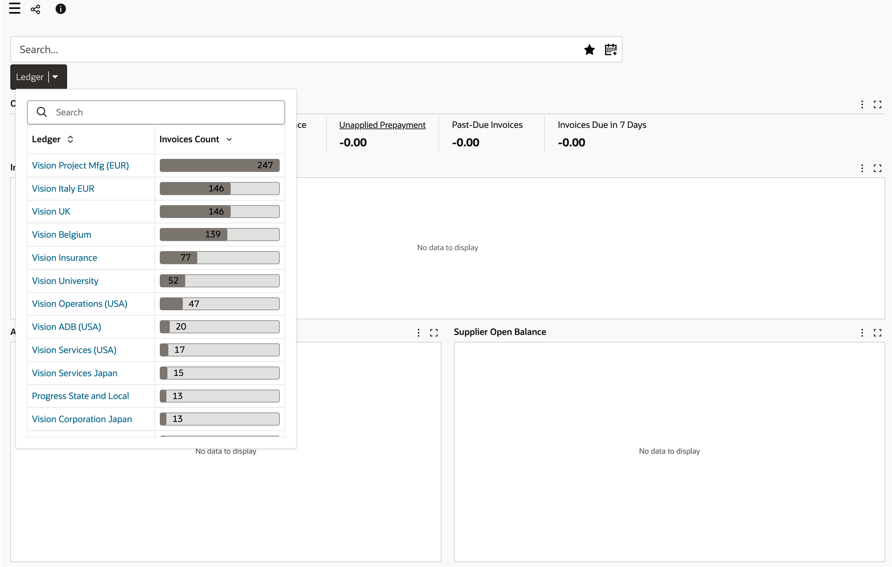
   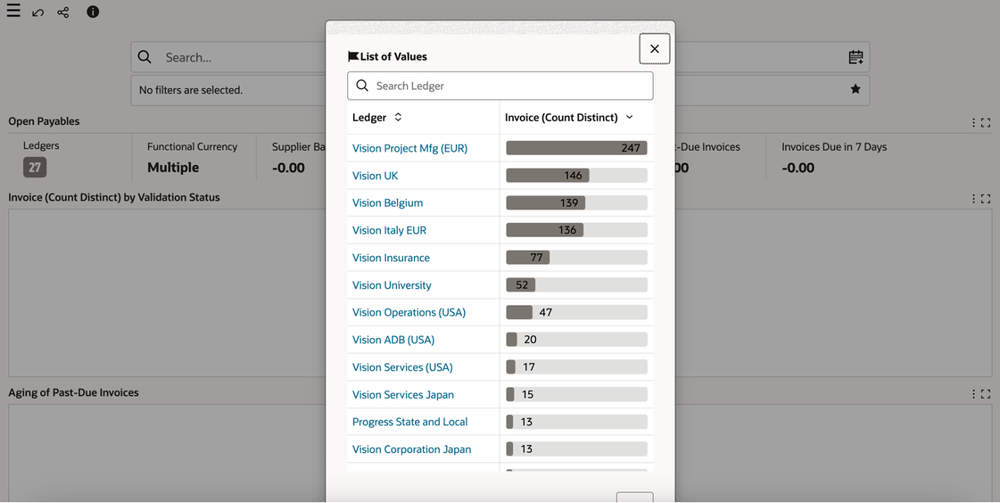


5. Enable Personalization Mode by clicking on the "i" icon (on the top left of the page, beside the share icon) and then click on "Personalize" button.

     
   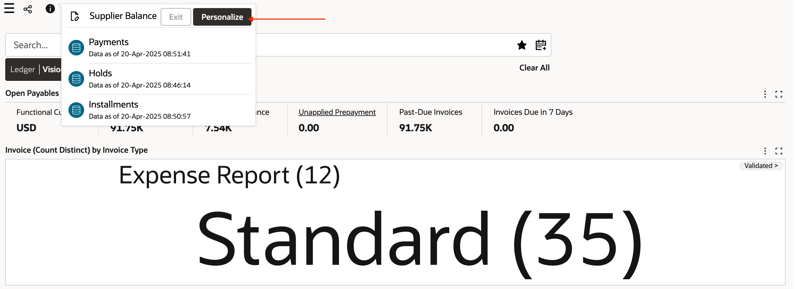

6. The "Personalize" button is now disabled and the personalization icon changes to blue when the dashboard is in edit mode. All components in the dashboard will now have the configuration and delete icon

   


7. Add a new Tab in the existing Tab component. To do this you need to click on the configuration icon for the existing Tab component and then add a new Tab in it. Name this tab "Bank Balance"

   

8. Click "Preview" and then click "Save"
   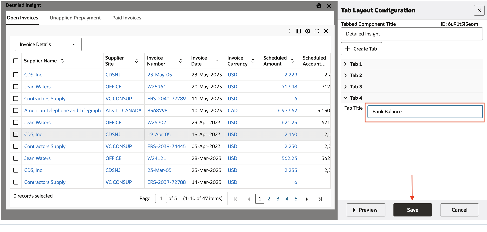
   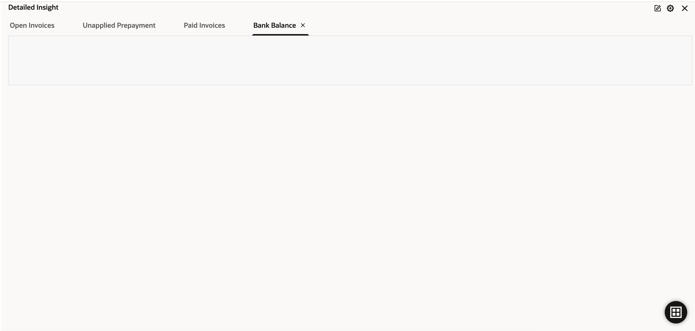

9. Add a chart component inside the new tab "Bank Balance", by dragging and dropping the chart component within the tab layout, to highlight paid amount per bank account

    - Data set: Payments 
    - Chart type: Bar
    - Dimension: Bank Account (series dimension)
    - Metric: Paid amount (Attribute) and Sum (Aggregation) 

10. Click preview 
11. This gives cash outflow across all currencies, now add additional dimension to split the chart per currency.

12. Add "Currency" as Trellis column dimension
13. Click "Preview" and then click "Save"

   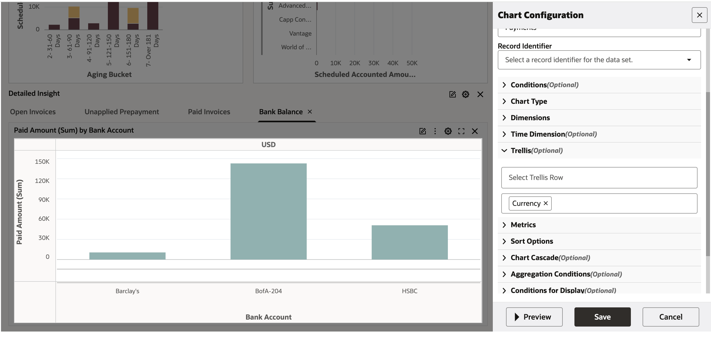
   


14. In addition of viewing detailed payments add a Pivot view under "Bank Balances" tab.

15. Add New Component- Aggregate Table (Pivot view is an alternate visualization of the Aggregate Table component)
    - Data set: Payments
    - Attributes:
          - Supplier name
          - Supplier site
          - Currency name (This will become a column when Pivot visualization is enabled)
    - Metric:
          - Paid amount (Attribute) and Sum (Aggregation)
16. Click preview. This gives per supplier, per supplier site totals of invoice paid amount.

    

17. Save the configuration

    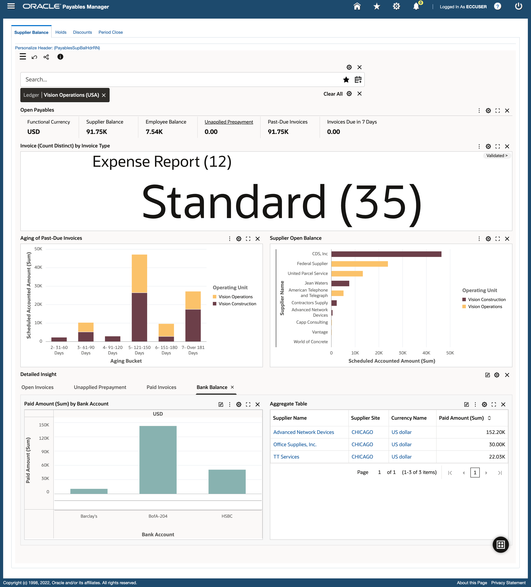

18. Now, lets convert the Aggregate table to a Pivot view. Click on the configuration, click on "Enable Pivot view" from the "Visualization" accordion, click on "Preview" and then click on "Save".
    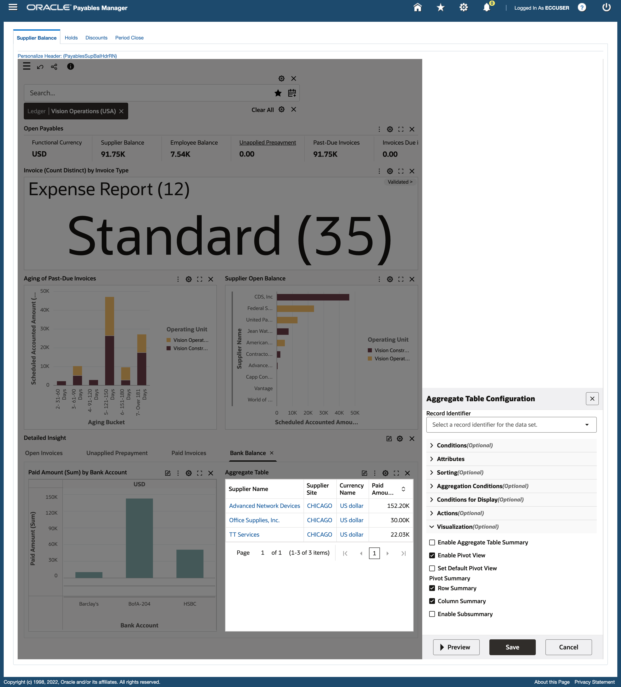
19. Switch to Pivot view from Aggregate Table view by clicking on the Pivot view icon [The Pivot View allows users to perform comparisons and identify trends across several cross-sections of data. The values in the header rows and columns represent every possible grouping of the selected attributes. Each body cell contains a metric value corresponding to the values in the heading rows and columns.].
    
    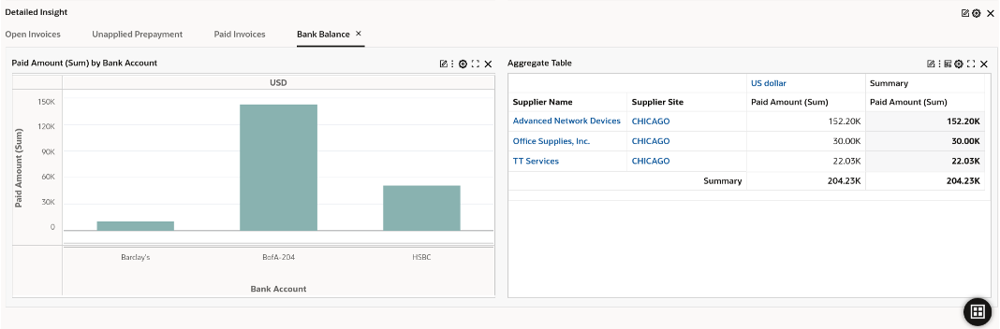


    

20. Finally, click on the "i" icon and then the "Exit" button to disable Personalization mode.
   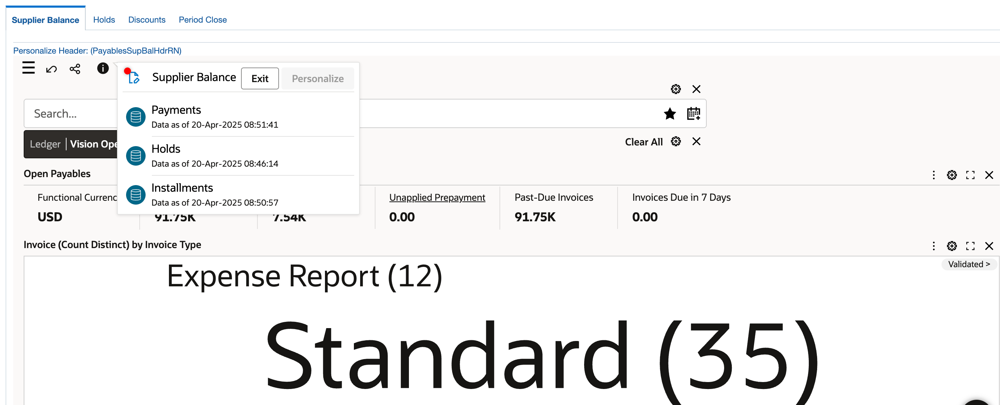

## Task 3: Personalize Account Analysis dashboard

**Goal**: Investigate and act to maintain the accuracy of financial records


1. Login to EBS apps (Navigate to http://<VNC\_Public\_IP\>:8000) with below credentials

    ```
  	 Username: eccuser
Password: welcome1
    ```


2. You will see the below screen,  From **General Ledger Super User** responsibility navigate to **General Ledger Command Center**

   


3. You will see the Account Analysis dashboard. If you see any existing filters in the Selected refinements, please remove them and then enable personalization from "i" icon 
   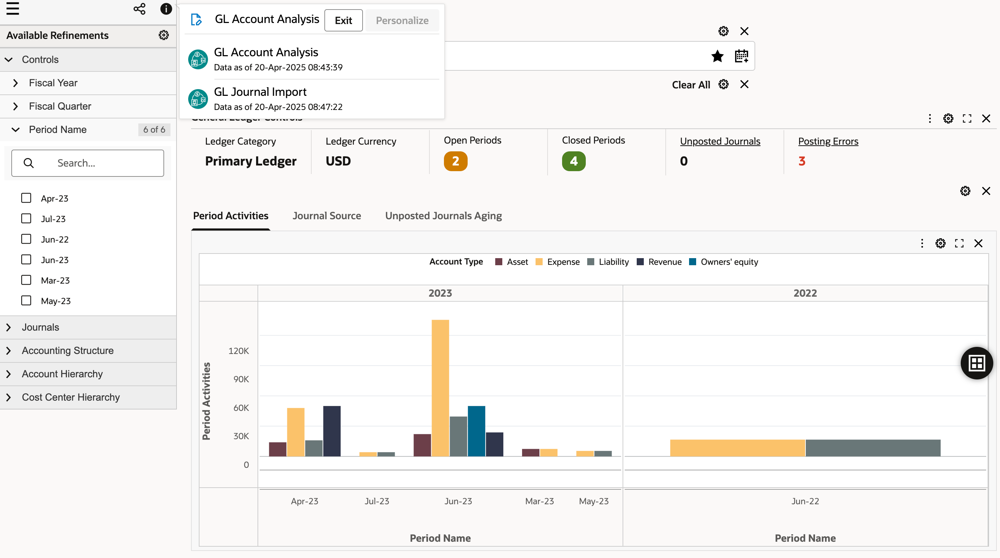

4. Click on the search bar to find the previously saved search [in Lab 2 - Task 2]
   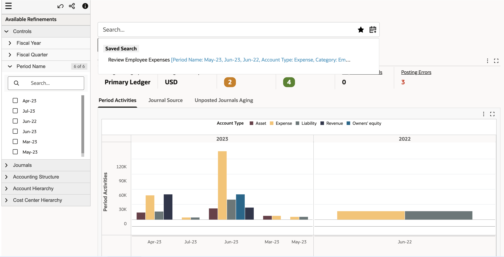

5. Click on the saved search to start our investigation from there
   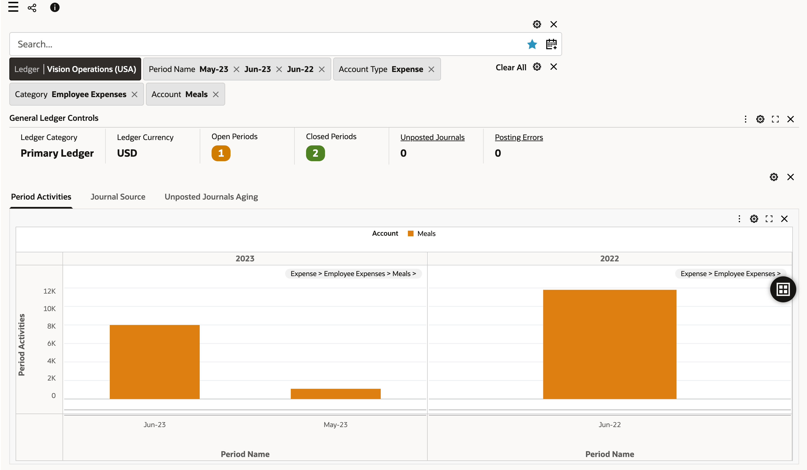


8. Add a new Tab in the existing Tab component, the one below the chart. To do this you need to click on the configuration icon for the existing Tab component and then add a new Tab in it. Add Tab Title as "Period Activities by Department and Parent Account". Click "Preview" and then click "Save".
   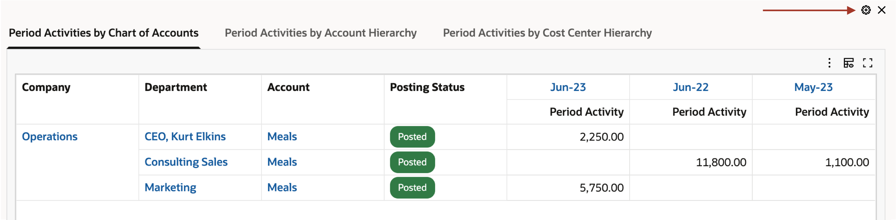
 
9. Add a new bar chart  inside this new tab

   

10. Configure the chart with the below details:

    - Dataset: GL Account Analysis
    - Chart type: Bar
    - Group dimension: Cost Center
    - Series dimension: Parent account 1
    - Trellis column: Period Name
    - Metric: Period Activity (Attribute) and no Aggregation, since this is a calculated attribute.

10. Click "Preview" 

   
11. Save the configuration. You will be able to see a combined view of account segment and hierarchy
   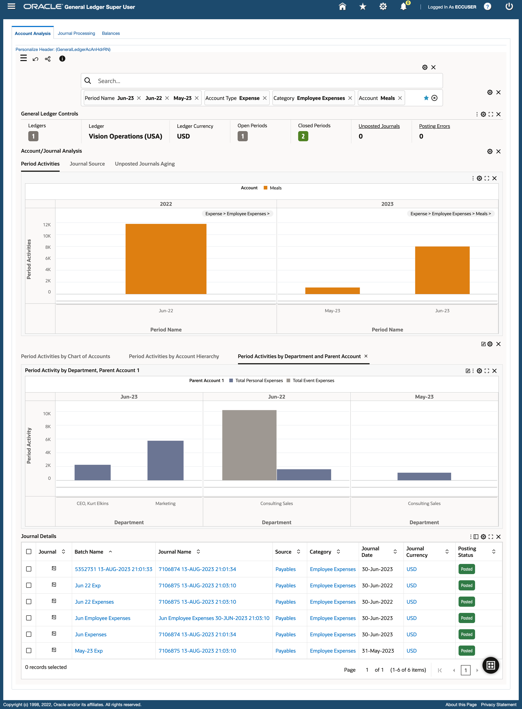


## Learn More
* [Enterprise Command Center- User Guide](https://docs.oracle.com/cd/E26401_01/doc.122/e22956/T27641T671922.htm)
* [Enterprise Command Center- Administration Guide](https://docs.oracle.com/cd/E26401_01/doc.122/f34732/toc.htm)
* [Enterprise Command Center- Extending Guide](https://docs.oracle.com/cd/E26401_01/doc.122/f21671/T673609T673618.htm)
* [Enterprise Command Center- Installation Guide](https://support.oracle.com/epmos/faces/DocumentDisplay?_afrLoop=264801675930013&id=2495053.1&_afrWindowMode=0&_adf.ctrl-state=1c6rxqpyoj_102)
* [Enterprise Command Center- Direct from Development videos](https://learn.oracle.com/ols/course/ebs-enterprise-command-centers-direct-from-development/50662/60350)
* [Enterprise Command Center for E-Business Suite- Technical details and Implementation](https://mylearn.oracle.com/ou/component/-/117416)

## Acknowledgements

* **Author**- Muhannad Obeidat, VP

* **Contributors**-  Muhannad Obeidat, Nashwa Ghazaly, Mikhail Ibraheem, Rahul Burnwal, Manikanta Kumar and Mohammed Khan

* **Last Updated By/Date**- Mohammed Khan, August 2023

