# Use ECC Dashboards- Introduction to Information Discovery and User Preferences


### Introduction

This lab walks you through the a few demo flow scenarios that will help you learn the basics of Oracle Enterprise Command Center framework

Estimated Time: 45 minutes

### Objectives
In this lab, you will:
* Learn about three different command centers and how you can do basic information discovery
* Learn 17 different ECC framework components and features 


<!DOCTYPE html>
<html>
<head>
<style>
table {
  font-family: arial, sans-serif;
  border-collapse: collapse;
  width: 100%;
}

td, th {
  border: 1px solid #dddddd;
  text-align: left;
  padding: 8px;
}

tr:nth-child(even) {
  background-color: #dddddd;
}
style="white-space:pre-wrap; word-wrap:break-word"
</style>
</head>
<body>

<h2>Features demoed in this Lab:</h2>

<table>
  <tr>
    <th>Type</th>
    <th>Feature</th>
    
  </tr>

  <tr>
    <td>Visualization</td>
    <td> 
    1. Summarization bar: Flag<br/>
    2. Summarization bar: Metric<br/>
    3. Chart Cascading<br/>
    4. Diagram: Pagination<br/>
    5. Diagram: Compare<br/>
    6. Diagram: Find similar<br/>
    7. Diagram: Actions<br/>
    
     
   
  </tr>
    <tr>
    <td>Navigation</td>
    <td> 
    1. Key Flexfields support <br/>
    2. Record Search<br/>
    3. Available refinements: Multi/single select from list<br/>
    4. Selected refinements: Breadcrumb<br/>
    5. Available refinements: Attribute Groups<br/>
    <tr>
    <td>End user personalization</td>
    <td> 
    1. Runtime options<br/>
    2. Runtime options: Charts<br/>
     
   
  </tr>
    <tr>
    <td>Detailed Insights</td>
    <td> 
    1. Row actions<br/>
    2. Results table: Actions<br/>
    
     
   
  </tr>

</table>
</body>
</html>

    
   


### Prerequisites

This lab assumes you have:
* Completed all previous labs successfully 


## Task 1: Validate integration of EBS and ECC 

1. Navigate to http://apps.example.com:8000 in the browser with below credentials 


    ```
  	 Username: SYSADMIN
Password: welcome1
    ```
    

2. Navigate to ECC Developer, you should be able to see the applications as shown in the below image, if the integration is successful
    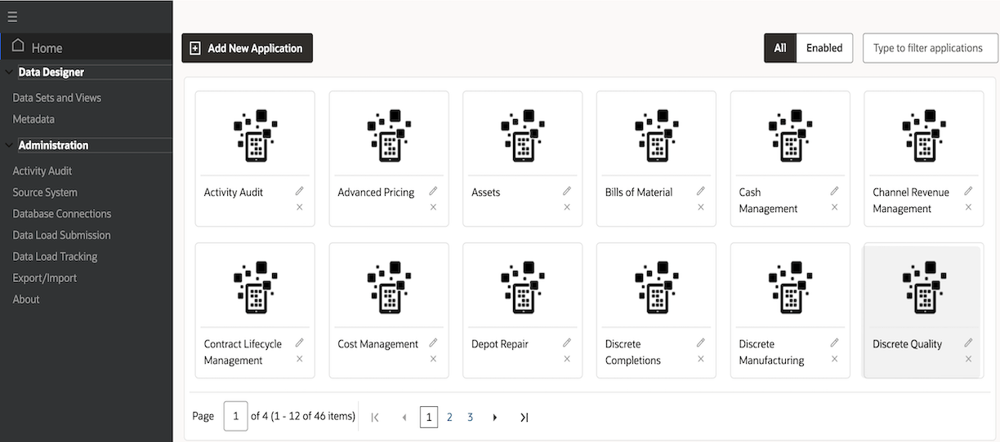
3. Click on the "Activity audit" application.

    

4. Click on the "Activity Tracker" page
    

    

## Task 2: Hands on demo of ECC Fixed Assets

**Goal:** Tune Business Operations and Improve Data Quality. 

1. Login to EBS apps (From the browser URL navigate to http://apps.example.com:8000) with below credentials

    ```
  	 Username: aperkins
Password: welcome1
    ```
2. Navigate to Fixed Assets Manager -> Assets Command center and then to "Asset Location" dashboard
    

3. Click on "Books" flag to select a book [Flags display count of the configured dimension. Users can make a selection at runtime from the pop up as demonstrated here]
    
4. Click on "OPS CORP" Book Type Code from the "Books" flag pop up
5. Click on "Unassigned Assets" to track Unassigned assets. [Metrics are used to display the value of a specific metric. Metrics can be configured to be either to navigate to a destination dashboard or tab and optionally invoke a refinement action or have no action at all].
    
6. From the "Unassigned Assets by Category" tag cloud, click on "Computer" to filter for "Computer" category [The tag cloud cascades to the next level defined by the designer. Any value clicked from a tag cloud would result in refinement and the entire page will be refined for that particular value].
    
7. Drill down to sub-categories by clicking on "PC" from the "Unassigned Assets by Category" tag cloud
    
8. From the "Units assigned by State/County" chart, click on "California" location track assets by location flexfield segments [Key flexfield support for location segment. Locations are displayed with dynamic label].
    
9. From the "Units assigned by City" chart[The chart title has changed after cascading as it is dynamic], click on "San Francisco" city to track assets by location flexfield segments
    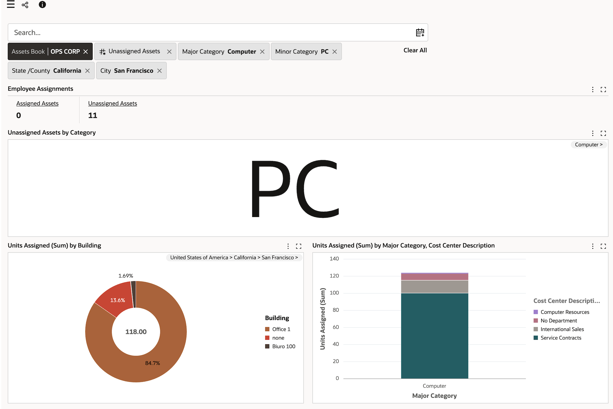

10. In the search bar type "Laptop" and hit enter, without waiting and clicking on the suggestions list, to search for "Laptop" assets. [This is a search feature in ECC called Record Search]

    

11. From the "Assignment Details" Results table click on the "Asset Assignment" Row action for the Asset number "100640" to navigate to the Asset workbench [This feature is called "Row Actions" where in you can choose to configure an action that can either open in a new tab, drawer, pop up] .
    
12. You will see the assignment form with selected asset, and assign asset to employee [As forms are not accessible in the environment provided, so you can skip this step]
    


## Task 3: Hands on demo of ECC Procurement


1. Login to EBS apps (From the browser URL navigate to http://apps.example.com:8000) with below credentials

    ```
  	 Username: operations
Password: welcome1
    ```

1. Navigate to Purchasing, Vision Operations (USA) -> Procurement Command Center and then to "Procurement Operations" dashboard
    
2. Within "Procurement Operations", navigate to "Orders" dashboard. Click on the "i" icon, this displays all the data sets used in the dashboard along with the updated time.
    


7. Scroll to the bottom of the page to view the Results table, here click on the three horizontal dots (used to denote actions) and view the actions configured in this Results Table
    
    * You can see two row actions: View and Order details.
    * Click on "Order details", which is a hyperlink to a different ECC dashboard, we are now navigating from Orders page, which has details of all orders to a page which has details on only this particular order i.e., the order specified in this row.
11. As you can see we are navigated to the Order details page, with "Order" and "Operating Unit" already applied in Selected refinements. ECC allows you to configure what attributes you want to refine for, when you are navigating to the row action dashboard, in this case it is "Order" and "Operating Unit".
    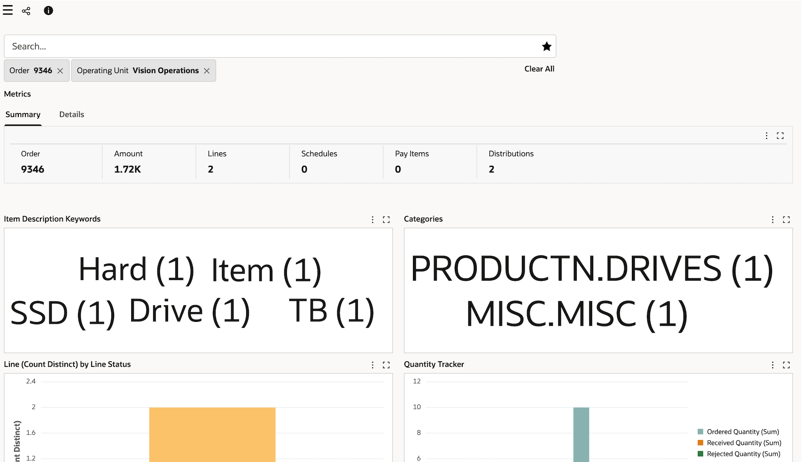
12. From the selected refinements, you can click on the 
"Order" value refinement to either replace the "Order" or click on the attribute name "Order" to replace/add more orders to refine the page. 
    

13. Click on the side navigation panel on the top left to open the "Available refinements" section and from "Schedules Summary" Attribute group click on "Ship-To location" attribute [Attribute group is a grouped list of attributes with each group representing a functional or logical grouping for a set of attributes] and select "M-1 Seattle Mfg" value.
    


## Task 4: Hands on demo of ECC Inventory Management 

**Goal:** Investigate picks to find a common cause. 


1. Login to EBS apps (From the browser URL navigate to http://apps.example.com:8000) with below credentials

    ```
  	 Username: mfg
Password: welcome1
    ```
2. Navigate to Logistics Manager -> Command Center and then to "Track and Trace" dashboard
    

3. In the Track and Trace dashboard, in Available refinements, by default "Inventory Trace Supplier" is the selected dataset. Change the data set to "Inventory Trace Sales Orders", within "Inventory Trace Sales Orders" data set, search for three order numbers we know we have received complaints for with respect to packaging. Order numbers: 74699, 74708 and 74700 [In Available refinements within a multi select list, you can search and select multiple values, and then click on filter to apply them in one go or you can choose to click on any one value and refine for that value immediately. Here we will do the former].

    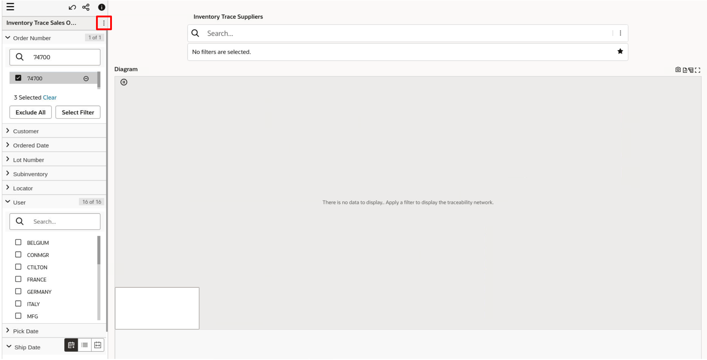

    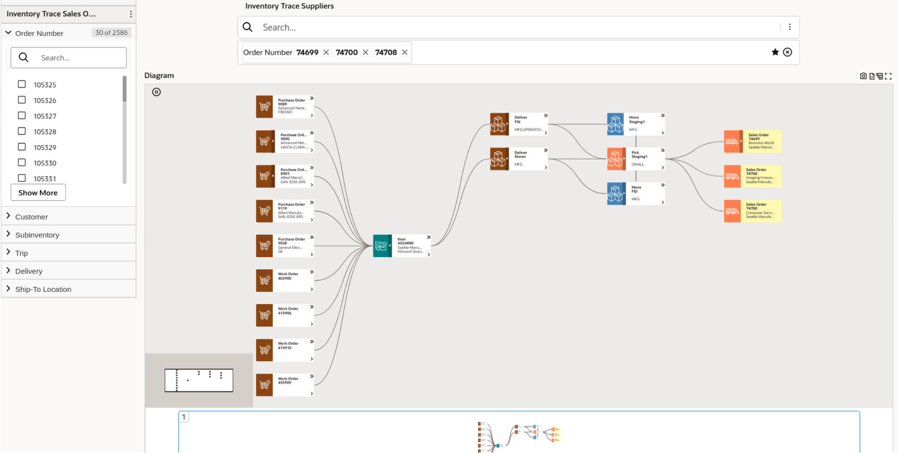
4. From the selected refinements breadcrumb, you can see the applied sales orders, here you can choose to add more sales orders or remove existing ones [You can see at the bottom of the diagram there is a small but concise overview of the diagram, in this example we only have one diagram but the feature allows for multiple diagrams to be shown in a paginated manner if the refinement were to result in completely distinct diagrams]. Hold "control" key and click on all three sales orders from the diagram, then right click to view the pop up options.
    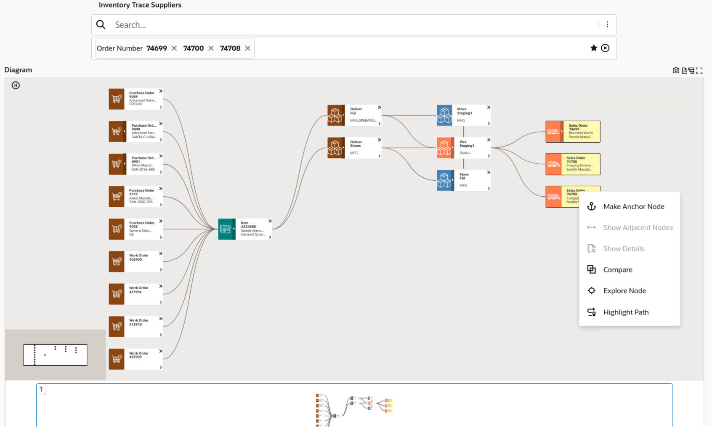
5.  Click on "Compare" option ["Compare" feature allows a user to compare multiple nodes in one go].
    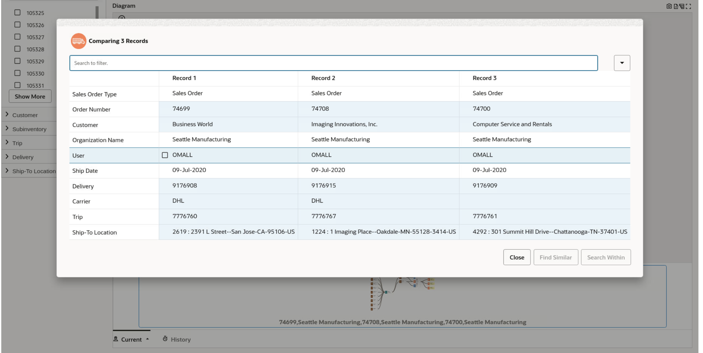
6. We can see that the orders relate to different customers, they are shipped on the same date and from the same organisation but we know of other orders shipped on the same date and from the same organisation that didn't report any problems. We can also see that there is a common user that is related to these defective sales orders. 
    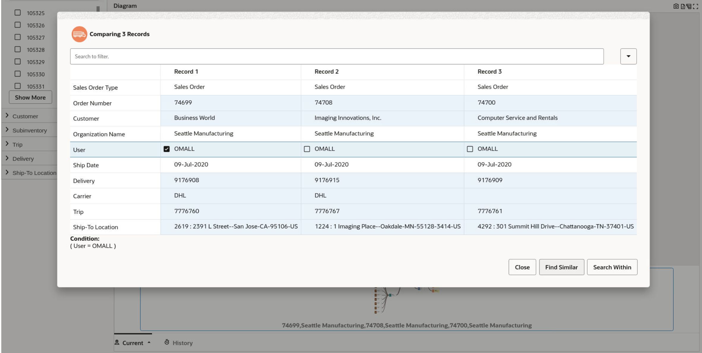
7. Click on this user "OMALL" and then click on "Find similar" ["Find similar" feature allows you to investigate further using a particular attribute, in this case all sales orders handled by user "OMALL" will be refined].
    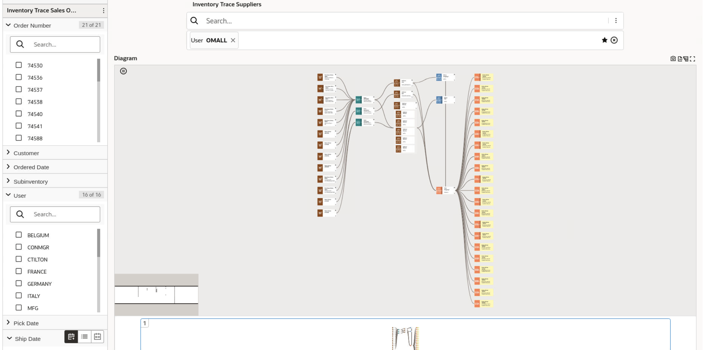
8. You can see that there are multiple other orders handled by user "OMALL". 
    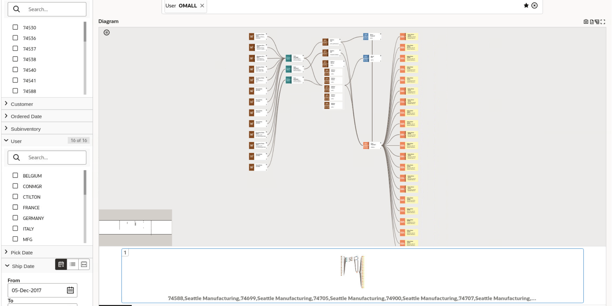
9.  You can find their status and prevent shipping by changing their inventory status from the material workbench. To do that right click on the "Pick staging 1" node as below:
    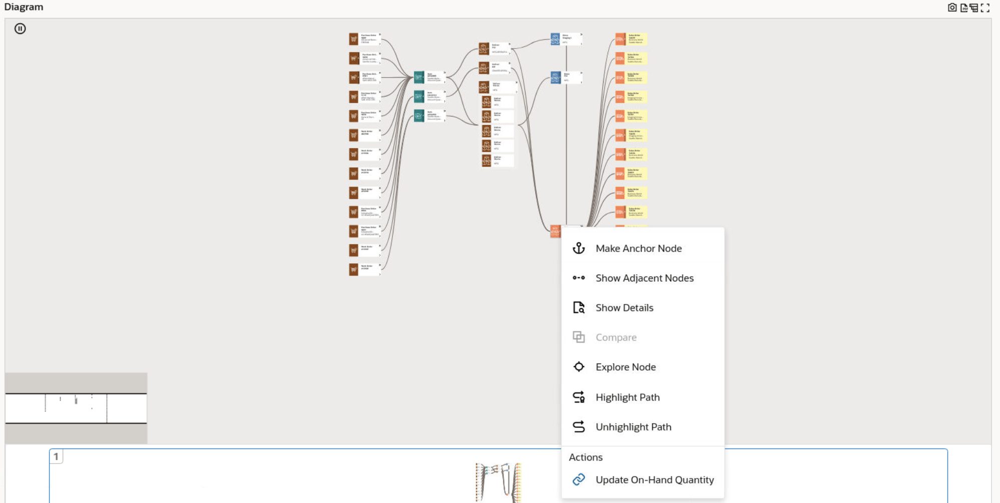
10. Click on the action "Update on hand quantity" to navigate to the material workbench [Actions in diagram are configured at node level to enable a user to perform any action at any node level, this action can navigate a user to a different dashboard or open a new dashboard inline within the existing view. In this case the former has been configured].
    


We have reached the end of this lab, we covered 3 different demo flows and 17 different ECC framework features.


You may now **proceed to the next lab**

## Learn More
* [Enterprise Command Center- User Guide](https://docs.oracle.com/cd/E26401_01/doc.122/e22956/T27641T671922.htm)
* [Enterprise Command Center- Admistration Guide](https://docs.oracle.com/cd/E26401_01/doc.122/f34732/toc.htm)
* [Enterprise Command Center- Extending Guide](https://docs.oracle.com/cd/E26401_01/doc.122/f21671/T673609T673618.htm)
* [Enterprise Command Center- Installation Guide](https://support.oracle.com/epmos/faces/DocumentDisplay?_afrLoop=264801675930013&id=2495053.1&_afrWindowMode=0&_adf.ctrl-state=1c6rxqpyoj_102)
* [Enterprise Command Center- Direct from Development videos](https://learn.oracle.com/ols/course/ebs-enterprise-command-centers-direct-from-development/50662/60350)
* [Enterprise Command Center for E-Business Suite- Technical details and Implementation](https://mylearn.oracle.com/ou/component/-/117416)

## Acknowledgements

* **Author**- Muhannad Obeidat, VP

* **Contributors**-  Muhannad Obeidat, Nashwa Ghazaly, Mikhail Ibraheem, Rahul Burnwal, Manikanta Kumar and Mohammed Khan

* **Last Updated By/Date**- Mohammed Khan, August 2023


