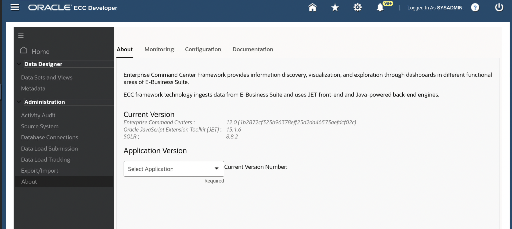

# Create and Validate ECC Domain

This lab walks you through the steps to create and validate ECC domain so that you can set up Oracle Enterprise Command Center Framework

Estimated Time: 30 minutes

### Objectives
In this lab, you will:
* Create and validate ECC domain
* Validate ECC Release

### Prerequisites

This lab assumes you have:
* Completed all previous labs successfully 

##  

## Task 1: Create ECC Domain

* After weblogic is installed you would be prompted to submit the next option in the installation steps in which case you should  select <b>Option 3</b> otherwise Execute the ./envSetup.sh script again and then choose <b>Option 3</b> to Create ECC domain. 

<pre><button class="copy-button" title="Copy text to clipboard">Copy</button><code class="hljs apache"> ./envSetup.sh
</code></pre></li>

* As part of creation of ECC domain, following are the key tasks performed (no action required in this lab):

   * Enter the password for ECC DB user as <b>welcome1</b> 
   * Set the password for ECC user weblogic as <b>welcome1</b>

* After completing successfully you will see the below screen

## Task 2: Validate ECC Domain

* From the browser navigate to the below URL 

<pre><button class="copy-button" title="Copy text to clipboard">Copy</button><code class="hljs apache">
 

http://localhost:7776/ecc

</code></pre></li>

<b>Note:</b> If you are not able to type in the remote desktop browser then please hit the command key

* ECC Administrator UI should be accessible i.e., you should see the highlighted section in below  screen
* Activity audit application should be imported i.e., you should see Activity audit application in home screen as highlighted below

## Task 3: Validate ECC Release

* From the browser navigate to the below URL

<pre><button class="copy-button" title="Copy text to clipboard">Copy</button><code class="hljs apache">
 http://localhost:7776/ecc

</code></pre></li>
* ECC Administrator UI should be accessible.

* In <b>About</b> page “Enterprise Command Centers:” should be shown as ‘V10’.

* “Oracle JavaScript Extension Toolkit (JET) :” should be shown as 13.1.4 

* “SOLR” should be shown as 8.8.2

## Learn More
* [Enterprise Command Centres- User Guide](https://docs.oracle.com/cd/E26401_01/doc.122/e22956/T27641T671922.htm)
* [Enterprise Command Centres- Admistration Guide](https://docs.oracle.com/cd/E26401_01/doc.122/f34732/toc.htm)
* [Enterprise Command Centres- Extending Guide](https://docs.oracle.com/cd/E26401_01/doc.122/f21671/T673609T673618.htm)
* [Enterprise Command Centres- Installation Guide](https://support.oracle.com/epmos/faces/DocumentDisplay?_afrLoop=264801675930013&id=2495053.1&_afrWindowMode=0&_adf.ctrl-state=1c6rxqpyoj_102)
* [Enterprise Command Centres- Direct from Development videos](https://learn.oracle.com/ols/course/ebs-enterprise-command-centers-direct-from-development/50662/60350)
* [Enterprise Command Centres for E-Business Suite- Technical details and Implementation](https://mylearn.oracle.com/ou/component/-/117416)

## Acknowledgements

* **Author** - Muhannad Obeidat, VP
* **Contributors** -  Muhannad Obeidat, Nashwa Ghazaly, Mikhail Ibraheem, Rahul Burnwal and Mohammed Khan
* **Last Updated By/Date** - Mohammed Khan, March 2023

