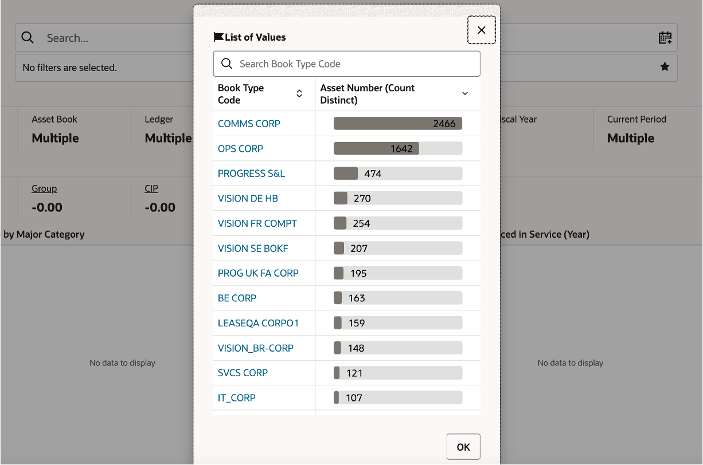
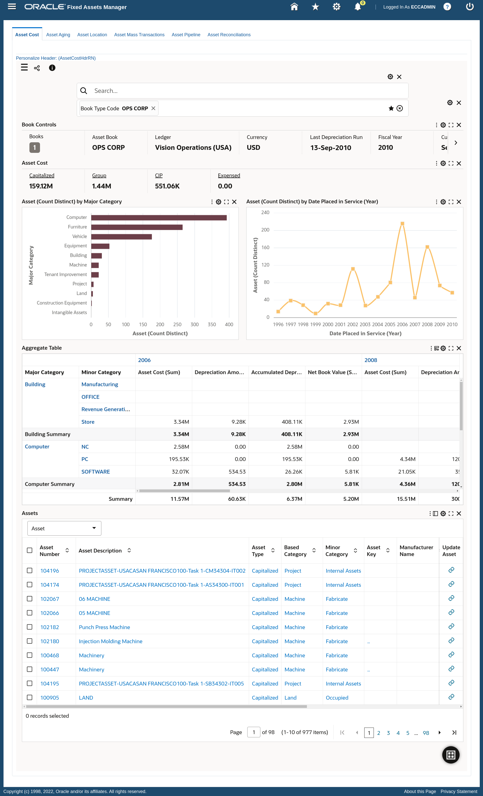
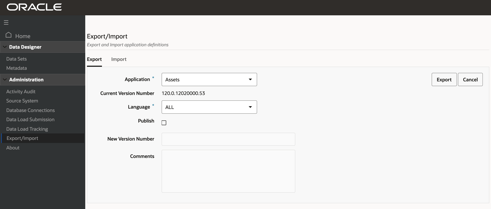

# Admin user personalization

### Introduction

Because Oracle E-Business Suite is used across many industries and environments, users may have special requirements. In that case, administrative users can extend existing dashboards or create new dashboards based on new data sets.

Estimated Time: 20 minutes

### Objectives

In this lab, you will:

* Build a new dashboard on an existing data set

* Change the way a component is configured or visualized

* Hide/Show attributes available in the data set

* Add new components

### Prerequisites

This lab assumes you have:
* Completed all previous labs successfully 

##  

## Task 1 : Restore Assets Command Center data

1. From ECC terminal copy paste the following commands 

<pre><button class="copy-button" title="Copy text to clipboard" >Copy</button><code class="hljs apache">curl "localhost:7776/core_ecc/admin/collections?action=RESTORE&name=fa-asset&location=/u01/dataset_backup&collection=fa-asset"
</code></pre></li>
  

<pre><button class="copy-button" title="Copy text to clipboard">Copy</button><code class="hljs apache">curl "localhost:7776/core_ecc/admin/collections?action=RESTORE&name=fa-rec&location=/u01/dataset_backup&collection=fa-rec"
</code></pre></li>

<pre><button class="copy-button" title="Copy text to clipboard">Copy</button><code class="hljs apache">curl "localhost:7776/core_ecc/admin/collections?action=RESTORE&name=fa-clr&location=/u01/dataset_backup&collection=fa-clr"
</code></pre></li>

<pre><button class="copy-button" title="Copy text to clipboard">Copy</button><code class="hljs apache">curl "localhost:7776/core_ecc/admin/collections?action=RESTORE&name=fa-masstrans&location=/u01/dataset_backup&collection=fa-masstrans"
</code></pre></li>

## Task 2 : Build a new dashboard on an existing data set

**Goal**:  As an asset manager, I want to have a complete view of all assets financial data so that I can communicate key financial aspects to management on capital expenditure

1. Login to EBS apps (Go to http://apps.example.com:8000) with below credentials

 <pre>Username: eccadmin
Password: welcome1
</code></pre>

  

2. Click on Fixed Assets Manager and then on Assets Command center

**Extending an Existing Dashboard**

In this section you will extend an Oracle Enterprise Command Center Framework dashboard and show it inside the same Oracle Application Framework rich container from a functional administrator perspective.

This scenario covers extensions to the Assets Cost dashboard in Assets Command Center as a showcase scenario.

**Back Up Existing Application**

Before you start extending an application, take a backup from the existing application (shipped) as follows:

3. Using the eccadmin credentials, navigate to ECC Developer responsibility then go to the Export/Import page.

4. Click the Export tab.

5. Select the application name.

6. Specify the Language: ALL.

7. Click the Export button.

**Export Application**

**Copy an Existing Page**

As we are targeting to extend the asset cost dashboard, we first need to copy the existing dashboard as follows:

8. In the Home page, search for the Assets application.

9. Click Assets to explore application pages.

**Application Pages**

10. Click Copy Page icon in the Asset Cost page.

11. The copied page is added to the application list of pages and named as Asset Cost (1). Open Assets again to view Asset Cost (1) page.

**New Copied Page**

12. Edit the page definition by clicking on the pencil icon on the copied page.

13. In the page definition, change the page key and display name.

**Note**: It is recommended to prefix page key and display name with 'xx'.

**Edit Page Definition**

14. Save the changes.

15. Click on the Page name (XX Asset Cost), open the page, and start the extension.

16. Click on "Books" from the Summarization bar and then select "OPS CORP" to refine the dashboard for OPS CORP book.

You should see the below screen

**Extend a Page**

Based on the functional requirements to enrich the Asset Cost dashboard, the extension targets the addition of a new visualization:

**Add a new  Visualization**

17. Open Add Component List. Drag and drop the Aggregate table component below the charts.

18. Click the Configuration icon. Add below dimensions:
   * Dataset: Fixed Assets
   * Attributes: 
      * Based category
      * Minor category
      * Date placed in service (year) (This will become the Column when Pivot visualization is selected)
   * Metrics: Asset cost, Depreciation amount, Accumulated depreciation, Net book value

   
   * From visualization tab you should enable Pivot view and set it as default 
   * Also from the visualization tab you should add pivot summary for Based category and Minor category 

   
   * Click preview and then save

   

## Task 3: Personalizing in Oracle E-Business Suite

After applying all the required extensions in the copied Asset Cost dashboard, you should follow the below steps:

1. Login to EBS apps (Go to http://apps.example.com:8000) with below credentials and navigate to "Functional Administrator" responsibility

 <pre>Username: eccadmin
Password: welcome1
</code></pre>

2. You should see the below image:
   

3. In the "Core Services" tab, select the "Functions" subtab.

   

4. Enter the following text in the "Code" input box 

<pre><button class="copy-button" title="Copy text to clipboard">Copy</button><code class="hljs apache">FA_ECC_ASSET_COST
</code></pre></li>

5. Click on "Go"

   

6. You will see the below screen, click on "Duplicate":

   

7. Update the "Name" and "code" as below

* Name:
<pre><button class="copy-button" title="Copy text to clipboard">Copy</button><code class="hljs apache">Fixed Assets Command Center XX Cost
</code></pre></li>

* Code:
<pre><button class="copy-button" title="Copy text to clipboard">Copy</button><code class="hljs apache">FA_ECC_XX_ASSET_COST
</code></pre></li>

8. Click on "Continue":

   

9. You will see the below screen

   

10. You should edit the "HTML Call" input box with below text:

<pre><button class="copy-button" title="Copy text to clipboard">Copy</button><code class="hljs apache">GWY.jsp?targetAppType=ECC&targetPage=/web/eccapp/fa/xx-asset-cost
</code></pre></li>

11. Click on "Submit"

   

12. You will see the below confirmation message:

   

13. Navigate to "Security" and then to "Permission Sets" tab

   

14. Search for permission set "Fixed Assets Command Center Access Permission Set"
   

15. Click on "Update"
   

16. Click on the "+" icon

   

17. Copy the below text
<pre><button class="copy-button" title="Copy text to clipboard">Copy</button><code class="hljs apache">Fixed Assets Command Center Home
</code></pre></li>

18. Pasted the copied text in the new entry field, highlighted below:

   

18. Click on the magnifying glass beside the text

   

19. Click on the  highlighted "quick select" option 

   

   
20. From the below screen, click on "Apply"

   
21. You should see the below confirmation message

   

**Personalize the Oracle Application Framework Page**

Now, you need to personalize the Oracle Application Framework page to replace the shipped dashboard with the new personalized one, using the steps below.

1. In Oracle E-Business Suite, navigate to the Assets Command Center, then to the Asset Cost page (shipped page).

2. At Oracle Application Framework page level, choose Settings, then Personalize Page.
   

3. Click "Edit" to personalize the Asset Cost page rich container.

   **Personalizing the Asset Cost Page Rich Container**
   
4. At the responsibility level, personalize the rich container by adding the newly created function FA\_ECC\_XX\_ASSET\_COST in the Destination Function, it is highlighted in the screen below.

   

5. Click on "Apply"   
   

**Note:** You can personalize the page at the site or organization level as well.

**Test and Export**

After personalizing the Oracle Application Framework page, access the new extended page from Oracle E-Business Suite.

1. Navigate to the Fixed Assets Manager responsibility.

2. Navigate to the Assets Command Center and select the tab for the Asset Cost dashboard.

3. The newly extended dashboard is displayed instead of the shipped Asset Cost dashboard.

   

4. Validate the dashboard functionality.

5. Navigate to the ECC Developer responsibility.

6. Navigate to the Export/Import page and click the Export tab to export the updated application

## Task 4: Advanced Extensibility 

**Extend an Existing Data Set**

Objectives covered in this section are:

   1.  Extend a data set to include additional attributes not shipped out of the box but available in Oracle E-Business Suite.

   2. Display those attributes in the different part of the Oracle Enterprise Command Center Framework dashboard.

   3. Add additional attributes

   4. Back up an existing application

   5. Create a new data set

Before starting extending an application, take a backup from the existing application (shipped) as follows:

   1. Using the ECC Developer responsibility, navigate to the Export/Import page.

   2. Click the Export tab.

   3. Select the application name.

   4. Specify the Language: en

   5. Click the Export button.
   

Shipped data set can be extended by creating additional attributes from source data.

Perform the following steps to include new attributes. For examples on working with metadata load and data load procedures, refer toCode Example for Designing a Metadata Load Procedure and Code Example for Modifying a Data Load Procedure.

1. Review the ECC\_SPEC\_ID structure for the shipped data set. Inclusion of new attributes should not change the grain level of data. If new attributes affect the grain level, then the ECC\_SPEC\_ID structure has to be revised.

2. Copy the PL/SQL procedure in the data load for the shipped data set.

3. If the data load procedure uses a database view, copy the view.

4. Update the query in the data load procedure in order to ingest the data into the new attributes.

5. Update view name in PL/SQL procedure for both the full load and the incremental load.

6. To create new attributes in metadata:

7. If the data set has a shipped metadata load, copy the shipped PL/SQL procedure and update the procedure to include the new attributes.

8. If the data set has no shipped metadata load, create a new PL/SQL package and procedure to create new attributes.

9. Navigate to the Data Sets section in the Administrator UI, open the data set and add the new metadata load and data load.

10. Note: The sequence for new load rules should start with 101, as sequence numbers till 99 are reserved for shipped data loads.

11. For validating the new load rules, run the metadata load followed by a full load.

12. Once the loads are successful, update the data load concurrent program by extending the executable file of concurrent program.

Example of New Attributes in Metadata

   
Example of Updated Data Set Load Rules

   

**Add a Custom Security Handler**

You can extend a shipped security handler by including a custom security package in the data set security rule. The filters from the custom security handler are combined with filters from the shipped security handler. Perform the following steps to include a custom security handler. (For details on sample metadata load and data load procedures, refer to Code Example for Designing a Metadata Load Procedure and Code Example for Modifying a Data Load Procedure.

1. Copy the shipped security handler PL/SQL package and procedure.

2. If the procedure uses a database view, copy the view.

3. Update the query in security handler procedure.

4. Update the view name in PL/SQL procedure. Save the package and procedure.

5. Navigate to the data sets section in the Administrator UI, open the data set, switch to the Security Rule tab and add the new security handler in the Custom Security Handler field.

**Data Sets Page - Security Tab**

   

**Copy an Oracle Enterprise Command Center Framework Page**
An administrator must copy the required dashboard and then add new components to change the location order of them. Use the newly- added attributes in the component configuration.

See: Extending an Existing Dashboard for more details about the Copy page and adding/configuring new components.

**Create a New FND Function**
After creating the page, the Administrator has to create an Oracle Application Object Library function, FND\_FORM\_FUNCTION, to show the newly created page inside Oracle E-Business Suite. See: Create FND Function.

**Oracle E-Business Suite Personalization**
Update Oracle E-Business Suite through personalization with the URL for the newly created page. See: Personalize the Oracle Application Framework Page.

From Oracle E-Business Suite, verify that a user can open the new page and the new UI is shown. If everything is working fine, then export the application to back up and propagate your changes to other environments.

**Back Up an Updated Application**
Test and create a new export of application to back up and propagate your changes to other environments. See: Test and Export.

**Create a New Data Set**
Based on the flexible structure of Oracle Enterprise Command Center Framework, you can create your data set and build a custom dashboard on top of it based on your business requirements.

The steps below summarize the process of creating a new data set, adding it to a new application, building a new custom dashboard, and accessing it from an Oracle E-Business Suite functional responsibility.

1. Create a new PL/SQL package for data load. See Sample PL/SQL Package for information on creating a PL/SQL package.

2. Create a new data set. Refer to Data Set for details about how to create new data.

3. Create data set metadata. See Metadata and Dynamic Metadata for more details about metadata.

4. Create a new application or use an existing application and assign the data set to the application. See Application for more details about creating an application.

5. Using the Data Load Submission option from the Oracle Enterprise Command Center Framework Administrator UI, run the full load. Refer to Administration of Enterprise Command Centers, Oracle E-Business Suite Administering Enterprise Command Centers for more information.

6. Create a new page in the new/existing application. For more information on creating a new page, see Page.

7. Design the page using the different ECC visualization components. See Anatomy of Oracle Enterprise Command Center Framework UI Components for more details about how to add and configure visualization components.

8. After designing the dashboard, you need to integrate this new dashboard with Oracle E-Business Suite, using the steps below.

9. Create a security handler. Refer to Sample Custom Security Handler for more details about security handlers.

10. In Oracle E-Business Suite, create a new function (FND function). See Create a New FND Function for information about creating functions.

11. Create a new permission set or use the existing one. See Permission Sets, Oracle E-Business Suite Security Guide for more information.

12. Configure security for the data set. In the Oracle Enterprise Command Center Framework Administrator UI, select the Data Set option and:

13. Enable security.

14. Add the security handler name.

15. Add the privilege (FND function).

16. Back up the application. See Back Up an Updated Application for more details about application export.

17. Within Oracle E-Business Suite, create a new Oracle Application Framework page, or add a new tab to an existing Oracle Application Framework page. See Add a New Tab to a Command Center Oracle Application Framework Page for more details about adding a new tab.

18. Create a concurrent program to be used to run the full load directly from Oracle E-Business Suite. See the Sample Concurrent Program section for more information. Also refer to Overview of Concurrent Programs and Requests, Oracle E-Business Suite Setup Guide and Overview of Concurrent Processing, Oracle E-Business Suite Developer's Guide for details on concurrent programs.

You may now **proceed to the next lab**

## Learn More
* [Enterprise Command Center- User Guide](https://docs.oracle.com/cd/E26401_01/doc.122/e22956/T27641T671922.htm)
* [Enterprise Command Center- Admistration Guide](https://docs.oracle.com/cd/E26401_01/doc.122/f34732/toc.htm)
* [Enterprise Command Center- Extending Guide](https://docs.oracle.com/cd/E26401_01/doc.122/f21671/T673609T673618.htm)
* [Enterprise Command Center- Installation Guide](https://support.oracle.com/epmos/faces/DocumentDisplay?_afrLoop=264801675930013&id=2495053.1&_afrWindowMode=0&_adf.ctrl-state=1c6rxqpyoj_102)
* [Enterprise Command Center- Direct from Development videos](https://learn.oracle.com/ols/course/ebs-enterprise-command-centers-direct-from-development/50662/60350)
* [Enterprise Command Center for E-Business Suite- Technical details and Implementation](https://mylearn.oracle.com/ou/component/-/117416)

## Acknowledgements

**Author**- Muhannad Obeidat, VP

**Contributors**-  Muhannad Obeidat, Nashwa Ghazaly, Mikhail Ibraheem, Rahul Burnwal and Mohammed Khan

**Last Updated By/Date**- Mohammed Khan, March 2023

