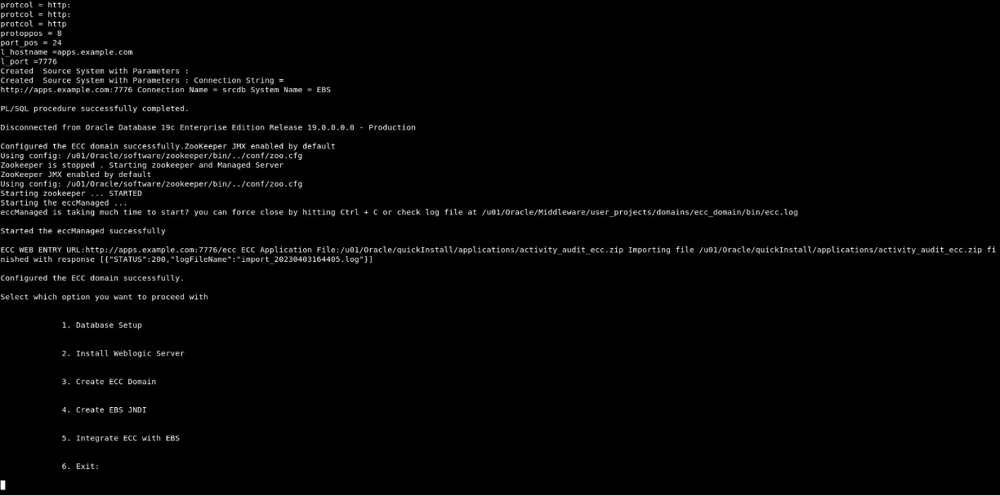
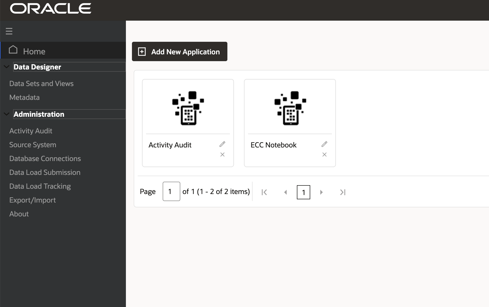

# Create ECC Domain

### Introduction

This lab walks you through the steps to create and validate ECC domain so that you can set up Oracle Enterprise Command Center Framework

Estimated Time: 30 minutes

### Objectives
In this lab, you will:
* Create and validate ECC domain
* Validate ECC Release

### Prerequisites

This lab assumes you have:
* Completed all previous labs successfully 

##  

## Task 1: Create ECC Domain

1. After weblogic is installed you would be prompted to submit the next option in the installation steps in which case you should  select **Option 3** otherwise Execute the ./envSetup.sh script again and then choose **Option 3** to Create ECC domain. 

<pre><button class="copy-button" title="Copy text to clipboard">Copy</button><code class="hljs apache"> ./envSetup.sh
</code></pre></li>

2. As part of creation of ECC domain, following are the key tasks performed (no action required in this lab):

   * Enter the password for ECC DB user as **welcome1** 
   * Set the password for ECC user weblogic as **welcome1**

3. After completing successfully you will see the below screen

## Task 2: Validate ECC Domain

1. From the browser navigate to the below URL 

<pre><button class="copy-button" title="Copy text to clipboard">Copy</button><code class="hljs apache">
 
http://localhost:7776/ecc

</code></pre></li>

**Note:** If you are not able to type in the remote desktop browser then please hit the command key

   * ECC Administrator UI should be accessible i.e., you should see the highlighted section in below  screen
   * Activity audit application should be imported i.e., you should see Activity audit application in home screen as highlighted below

   

## Task 3: Validate ECC Release

1. From the browser navigate to the below URL

<pre><button class="copy-button" title="Copy text to clipboard">Copy</button><code class="hljs apache">
 http://localhost:7776/ecc

</code></pre></li>
2. ECC Administrator UI should be accessible.

   * In **About** page “Enterprise Command Centers:” should be shown as ‘V10’.

   * “Oracle JavaScript Extension Toolkit (JET) :” should be shown as 13.1.4 

   * “SOLR” should be shown as 8.8.2

   

You may now **proceed to the next lab**

## Learn More
* [Enterprise Command Center- User Guide](https://docs.oracle.com/cd/E26401_01/doc.122/e22956/T27641T671922.htm)
* [Enterprise Command Center- Admistration Guide](https://docs.oracle.com/cd/E26401_01/doc.122/f34732/toc.htm)
* [Enterprise Command Center- Extending Guide](https://docs.oracle.com/cd/E26401_01/doc.122/f21671/T673609T673618.htm)
* [Enterprise Command Center- Installation Guide](https://support.oracle.com/epmos/faces/DocumentDisplay?_afrLoop=264801675930013&id=2495053.1&_afrWindowMode=0&_adf.ctrl-state=1c6rxqpyoj_102)
* [Enterprise Command Center- Direct from Development videos](https://learn.oracle.com/ols/course/ebs-enterprise-command-centers-direct-from-development/50662/60350)
* [Enterprise Command Center for E-Business Suite- Technical details and Implementation](https://mylearn.oracle.com/ou/component/-/117416)

## Acknowledgements

**Author**- Muhannad Obeidat, VP

**Contributors**-  Muhannad Obeidat, Nashwa Ghazaly, Mikhail Ibraheem, Rahul Burnwal and Mohammed Khan

**Last Updated By/Date**- Mohammed Khan, March 2023

