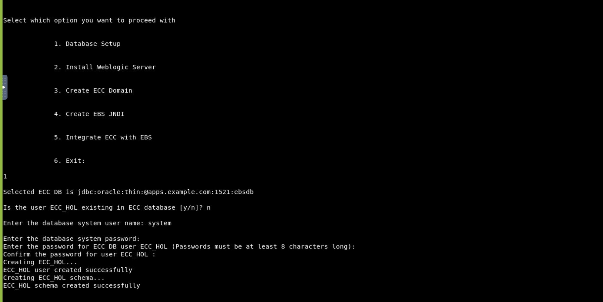
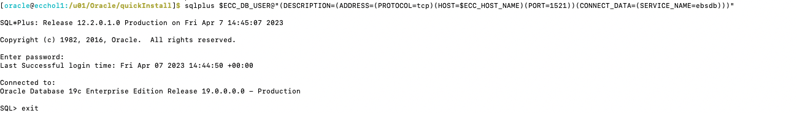

#  Create ECC schema 

### Introduction

This lab walks you through the steps to create ECC schema and to install weblogic server so that you can set up Oracle Enterprise Command Center Framework

Estimated Time: 30 minutes

### Objectives
In this lab, you will:
* Create ECC schema and install Weblogic Server

### Prerequisites

This lab assumes you have:
* Completed the previous section successfully 

##  

## Task 1: Extract quickInstall 

1. Keep the previous EBS terminal open and now open a new terminal for ECC. Within that, navigate to /u01 directory by using below command

<pre><button class="copy-button" title="Copy text to clipboard">Copy</button><code class="hljs apache">cd /u01
</code></pre></li>

2. .bsx files are downloaded in /u01 directory. Extract the .bsx files by running the below command from /u01 directory 

<pre><button class="copy-button" title="Copy text to clipboard">Copy</button><code class="hljs apache">for f in *.bsx; do sh $f; done
</code></pre></li>

3. This process will take a few minutes. After extraction is completed, navigate to cd /u01/Oracle/quickInstall

<pre><button class="copy-button" title="Copy text to clipboard">Copy</button><code class="hljs apache">cd /u01/Oracle/quickInstall
</code></pre></li>

**Note:** In this directory (Oracle/quickInstall) there is a file called "EccConfig.properties", which has all the parameters predefined for this Hands-on-lab. You don't have to change any parameters but described below are some important parameters you should keep in mind. 

**ECC_BASE**- The root directory where you extracted the .bsx files. This property is set to the value /u01 by default.

**ECC\_CONFIG\_LOC**- You can optionally set this property to the location of a custom ecc-config.properties file. Oracle Enterprise Command Center Framework will then use the properties file in this location instead of the standard ecc-config.properties file created in the $ECC_BASE/Oracle/quickInstall/env/ecc directory.

**ECC\_LOG\_DIR**- The directory where the Oracle Enterprise Command Center Framework administration application log files should be generated. For cluster setup, this directory must be shared between all nodes. All nodes must have read and write access to this shared directory.

**EBS\_MIDDLETIER\_HOST\_FQDN**- The fully qualified domain name (FQDN) for the Oracle E-Business Suite application tier. If the Oracle E-Business Suite instance uses a proxy or load balancer, use the FQDN for the web entry point instead.

**EBS\_MIDDLETIER\_PORT**- The Oracle E-Business Suite application tier port. If the Oracle E-Business Suite instance uses a proxy or load balancer, use the port for the web entry point instead. If you plan to enable TLS for communication between Oracle E-Business Suite and the Oracle Enterprise Command Center Framework installation, then you should use port 4443 here. See Enabling TLS for Oracle Enterprise Command Center Framework, Release 12.2, My Oracle Support Knowledge Document 2496445.1.

**EBS\_MIDDLETIER\_PROTOCOL**- The Oracle E-Business Suite application tier protocol, either http or https. If the Oracle E-Business Suite instance uses a proxy or load balancer, use the protocol for the web entry point instead. If you plan to enable TLS for communication between Oracle E-Business Suite and the Oracle Enterprise Command Center Framework installation, then you must set the protocol to https here. See Enabling TLS for Oracle Enterprise Command Center Framework, Release 12.2, My Oracle Support Knowledge Document 2496445.1.

**EBS\_MIDDLETIER\_INTERNAL\_HOSTS**- The host name of the Oracle E-Business Suite instances. If there is more than one Oracle E-Business Suite instance behind a load balancer, specify all the Oracle E-Business Suite host names separated by a comma.

For further information please refer to section 4.3.1 of the following document
[Installing Oracle Enterprise Command Center Framework](https://mosemp.us.oracle.com/epmos/faces/ui/km/DocumentDisplay.jspx?_afrLoop=263547950196438&id=2495053.1&_afrWindowMode=0&_adf.ctrl-state=1can4pxb6b_4#schemabackup)

## Task 2: Create ECC Schema

1. From the terminal navigate to /u01/Oracle/quickInstall using below command

<pre><button class="copy-button" title="Copy text to clipboard">Copy</button><code class="hljs apache">cd /u01/Oracle/quickInstall
</code></pre></li>

2. Execute the below script and when prompted choose **Option 1** to create ECC schema. 

<pre><button class="copy-button" title="Copy text to clipboard">Copy</button><code class="hljs apache"> ./envSetup.sh
</code></pre></li>

3. This step creates the ECC schema and provides an option to use the existing ECC user created in the ECC database:

<pre style="">Selected ECC DB is jdbc:oracle:thin:@ebs.org:1521:ebsdb
Is the user <ECC_DB_USERNAME> existing in ECC database [y/n]?<password>

</pre>

4. If you choose option “y”, you are prompted for ECC user credentials to create the ECC schema. If you choose the option “n”, you are prompted to enter ECC database system user credentials to create the ECC user and later create the ECC schema.

   * For this demo type **"n"**

5. When prompted provide the database system user details, mentioned below:
 <pre>
Database system username: system
Database system password: manager
Password for ECC DB User: welcome1
</code></pre></li>

6.**Option 1** should be completed successfully. You can verify the logs in $ECC_BASE/Oracle/quickInstall/logs/setup.log

7. Enter **Option 6** to exit and then execute following commands to validate  successful ECC schema creation:

<pre><button class="copy-button" title="Copy text to clipboard">Copy</button><code class="hljs apache">source env/ecc.env
</code></pre></li>

8. Execute the following command with the credentials mentioned:

<pre><button class="copy-button" title="Copy text to clipboard">Copy</button><code class="hljs apache">
sqlplus $ECC_DB_USER@"(DESCRIPTION=(ADDRESS=(PROTOCOL=tcp)(HOST=$ECC_HOST_NAME)(PORT=1521))(CONNECT_DATA=(SERVICE_NAME=$EBS_DS_NAME)))"</code></pre></li>

 <pre>
Password:welcome1
</code></pre></li>

9. If you are able to log in to SQL and receive a SQL> prompt, then the ECC DB connection is available to use. 

10. Exit from the SQL prompt by typing **exit;**

## Task 3: Install Weblogic Server

1. Make sure you are in the  /u01/Oracle/quickInstall directory 

2. Run the ./envSetup.sh script again and when prompted choose **Option 2** to Install Weblogic Server 

<pre><button class="copy-button" title="Copy text to clipboard">Copy</button><code class="hljs apache"> ./envSetup.sh
</code></pre></li>

   

   
   

You may now **proceed to the next lab**

## Learn More
* [Enterprise Command Center- User Guide](https://docs.oracle.com/cd/E26401_01/doc.122/e22956/T27641T671922.htm)
* [Enterprise Command Center- Admistration Guide](https://docs.oracle.com/cd/E26401_01/doc.122/f34732/toc.htm)
* [Enterprise Command Center- Extending Guide](https://docs.oracle.com/cd/E26401_01/doc.122/f21671/T673609T673618.htm)
* [Enterprise Command Center- Installation Guide](https://support.oracle.com/epmos/faces/DocumentDisplay?_afrLoop=264801675930013&id=2495053.1&_afrWindowMode=0&_adf.ctrl-state=1c6rxqpyoj_102)
* [Enterprise Command Center- Direct from Development videos](https://learn.oracle.com/ols/course/ebs-enterprise-command-centers-direct-from-development/50662/60350)
* [Enterprise Command Center for E-Business Suite- Technical details and Implementation](https://mylearn.oracle.com/ou/component/-/117416)

## Acknowledgements

**Author**- Muhannad Obeidat, VP

**Contributors**-  Muhannad Obeidat, Nashwa Ghazaly, Mikhail Ibraheem, Rahul Burnwal and Mohammed Khan

**Last Updated By/Date**- Mohammed Khan, March 2023

