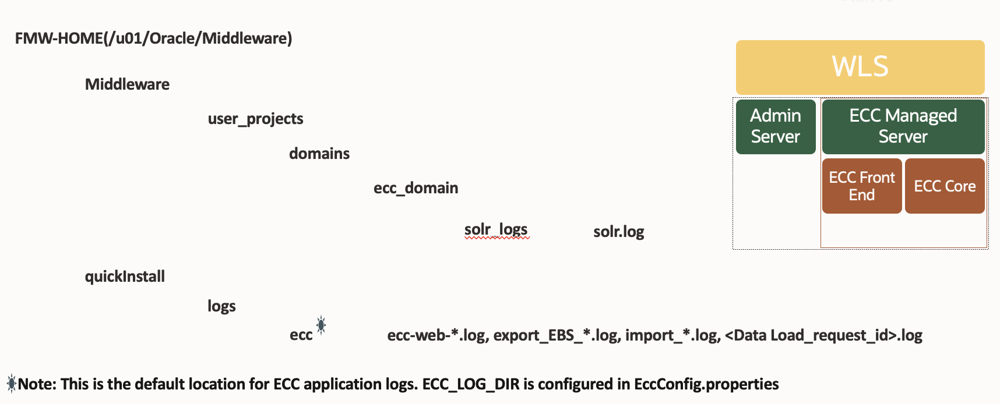
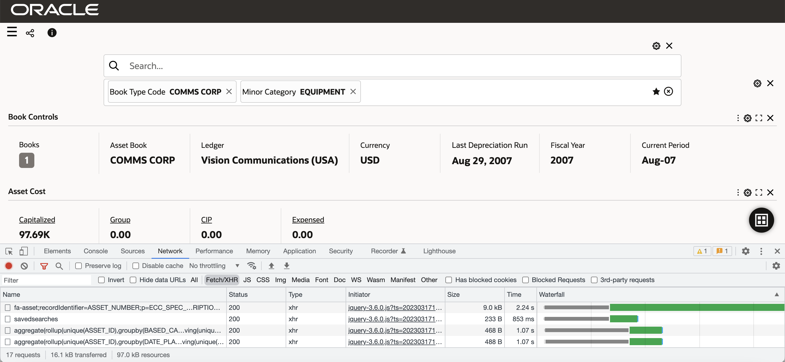
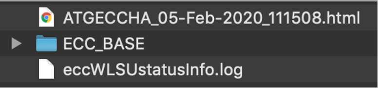
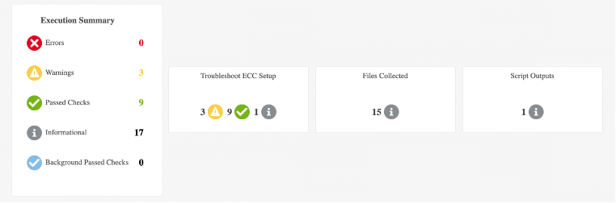
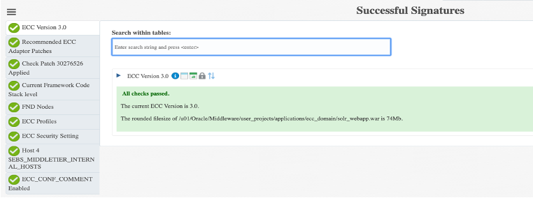
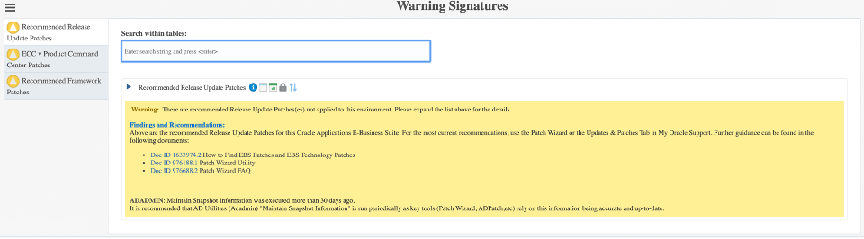

# Diagnose and monitor 


### Introduction

This lab walks you through the steps to general steps performed in diagnosing and monitoring Oracle Enterprise Command Center framework

Estimated Time: 10 minutes


### Objectives

In this lab, you will:
* Learn how to access Server, Application, OHS and OPMN Logs
* Learn how to access Log monitor
* Capture Loading Time for ECC Page
* Learn how to download HAR file
* Learn how to take advantage of Activity Audit

* Learn how to run ECC Analyzer
* Identify common issues

### Prerequisites 

This lab assumes you have:
* Completed all previous labs successfully 


##  

## Task 1: Diagnose and Monitor 
 
 1. Note the location of Server logs:

    


 2. Note the location of Application logs:

    

3. Note the location of OHS logs

    /u01/install/APPS/fs2/FMW\_Home/webtier/instances/EBS\_web\_OHS1/diagnostics/logs/OHS/EBS\_web

4. Location of opmn logs

    /u01/install/APPS/fs2/FMW_Home/webtier/instances/EBS\_web\_OHS1/diagnostics/logs/OPMN/opmn

**Log monitor**

1. Login to EBS as Admin user with eccadmin responsibility access


    ```
  	 Username: eccadmin
Password: welcome1
    ```


    ```
  	 <copy>http://&lt;EBS_MIDDLETIER_HOST_FQDN&gt;:&lt;EBS_MIDDLETIER_PORT&gt;/ecc/monitor/logs</copy>
    ```


   

**Capture Loading Time for ECC Page**

1. Open the Oracle E-Business Suite Enterprise Command Center application in the Google Chrome browser. 
2. Log in and navigate to the page you want. Then open the Chrome tools by pressing the F12 button on the keyboard, or by pressing Ctrl+Shift+I. 
3. The Development Tools window occupies the lower part of the page. Select the Network tab


  

**Download HAR file**


To analyze performance deeply download HAR file:

1. Open browser developer tools via inspect element (in chrome)
2. Navigate to "Network" tab
3. Click on the download icon highlighted below
  


## Task 2: Learn about Activity Audit 

The Activity Audit dashboard gives full insight into the use of the Enterprise Command Center dashboards. It allows business analysts and administrators to know whether dashboards are being used or not, who uses them, and at what times and which dashboard is used more. It also helps generate valuable new insights into user searches.

Activity Audit provides the following benefits:

 * Capitalize on ECC investment

 * Track dashboard usage

 * Capture audit trail of user activities on dashboards

 * Tune deployment and tune extract, transform, and load (ETL) processes

 * Tune business operations

 * Monitor search activity

 * Identify and analyze user intents

 * Resolve issues as they arise

1. To access the dashboard, navigate to the Activity Audit section in the Administration UI.

    

**Tracking User Activity**

The types of user activity tracked are, as follows:

1. Action Details: Refinements that are applied on the dashboard due to user action. Multiple values of an attribute are separated by '|'. Each filter is captured along with the corresponding data set.

2. Filters Applied: Total filters in Selected Refinements. Multiple values of an attribute separated by '|'. Each filter is included along with the corresponding data set.

3. Component Title: Title of the component where the user action has been performed.

4. Component Type: Type of component where the user action has been performed.

5. Number of Results: Total number of records in detailed insight components (Results Table and Grid) after the user action.

6. Application Name: Name of application for the dashboard.

7. Page Name: Name of dashboard.

8. Data Set Name: Name of the data set for the user action.

**Enabling Activity Audit**

The following properties in the EccConfig.properties file control activity auditing. This feature can be enabled during installation by setting the properties in EccConfig.properties. For more details on installation, refer to Installing Oracle Enterprise Command Center Framework, My Oracle Support Knowledge Document 2495053.1.

* Set the property ecc.activity.audit.isenabled to true or false for enabling or disabling the feature respectively.

* Add the data sets to the property ecc.activity.audit.enabled.datasets = <data set 1>, <data set 2> for capturing user activities in the dashboards configured with these data sets. Each data set key must be separated by a comma (,). By default, no data set is specified.

**Note**: If the property is not set with any data set, the feature will be enabled to all the data sets. Dashboards (and corresponding data sets) with frequent usage where user activity needs to be captured for compliance or analytical purposes should be considered for activity audit.

* Set the property ecc.activity.audit.ingest.limit to define the limit on the number of user actions beyond which a Data Load is triggered to refresh the dashboard data. The default limit is 100. This can be updated to adjust the frequency of data loads based on the number of dashboards, users and the average activity.

**Capturing User Activity**

User activity is captured if Activity Audit application is available.

On Oracle Enterprise Command Center Framework server startup, the Activity Audit data is ingested to Oracle Enterprise Command Center Framework asynchronously by following the above procedure.

Users need not submit a data load separately. If a data load is submitted, it resets the data set and once the scheduled query load is triggered, the updated data is ingested into the Activity Audit data set.

**Application and Data Set Details**

* Dataset Name: Activity Audit

* Dataset Key: activity-audit

* Application Name: Activity Audit

* Application Short Name: activity-audit

* Page Name: Activity Tracker

* Page Short Name: activity-tracker

2. The Activity Audit dashboard is designed to support two use cases: tracking user activity and tracking search activity.
    


For more information on Activity audit please refer to [Enterprise Command Center- Admistration Guide](https://docs.oracle.com/cd/E26401_01/doc.122/f34732/T676250T676672.htm#8723752)

## Task 3: Learn about ECC Analyzer 
1. The EBS Enterprise Command Center (ECC) Analyzer is a self-service health-check script that reviews Oracle Enterprise Command Center related data, analyses current configurations and settings for the environment and provides feedback and recommendations on best practices. 
2. The Analyzer collects data using all the tables necessary to diagnose issues and provides solutions and recommended actions. 
    


3. You can download the latest ECC analyzer from [Download ECC Analyzer](https://support.oracle.com/epmos/faces/DocumentDisplay?_afrLoop=264836944547192&id=2587090.1&_afrWindowMode=0&_adf.ctrl-state=bqndlfq90_4#aref_section12)

**NOTE**:  Analyzer does not perform any INSERTs, UPDATEs or DELETEs to your data; it just reports on it.

**ECC Analyzer: Technical Requirement**

* Requires Java 1.7+
* Available on Linux platforms only

4. Verify java version

    ```
  	 <copy>java –version</copy>
    ```


2. Running Analyzer
   To run Analyzer as a java program follow below instruction. The java program will prompt for the WebLogic and APPS usernames and passwords.

    

    ```
  	 <copy>java -	Danalyzer="ecc_analyzer.xml" -jar HA.jar</copy>
    ```

3. ECC Analyzer: Sample Output

   * Analyzer generates a zip file containing all the script outputs and the analyser html report(ATGECCHA_<date>.html). 

   * When running the analyzer as a java program
     EBS Enterprise Command Center (ECC) Analyzer output zip file is located in the same directory where it was run.  This location is also displayed in the window after execution. 

    

    Html page contains all the information about the ECC environment being analysed. Below are some of the sample outputs:

    
    
    


## Task 4: Identify common issues 
1. You will see the below screen if you are authenticated but not authorized to view the dashboard. You need to use the right responsibility to access the dashboard 

    

2. You will see the below screen if you are not authenticated/ or not logged in to EBS

    

3. You will see the below screen if ECC isn’t integrated with EBS (ecc.conf is missing).
    
4. You will see the below screen if ECC is integrated with EBS but ECC is down.

    

You may now **proceed to the next lab**

## Learn More
* [Enterprise Command Center- User Guide](https://docs.oracle.com/cd/E26401_01/doc.122/e22956/T27641T671922.htm)
* [Enterprise Command Center- Admistration Guide](https://docs.oracle.com/cd/E26401_01/doc.122/f34732/toc.htm)
* [Enterprise Command Center- Extending Guide](https://docs.oracle.com/cd/E26401_01/doc.122/f21671/T673609T673618.htm)
* [Enterprise Command Center- Installation Guide](https://support.oracle.com/epmos/faces/DocumentDisplay?_afrLoop=264801675930013&id=2495053.1&_afrWindowMode=0&_adf.ctrl-state=1c6rxqpyoj_102)
* [Enterprise Command Center- Direct from Development videos](https://learn.oracle.com/ols/course/ebs-enterprise-command-centers-direct-from-development/50662/60350)
* [Enterprise Command Center for E-Business Suite- Technical details and Implementation](https://mylearn.oracle.com/ou/component/-/117416)

## Acknowledgements

* **Author**- Muhannad Obeidat, VP

* **Contributors**-  Muhannad Obeidat, Nashwa Ghazaly, Mikhail Ibraheem, Rahul Burnwal and Mohammed Khan

* **Last Updated By/Date**- Mohammed Khan, March 2023

