# ECC anatomy

### Introduction

This lab walks you through two existing ECC dashboards, explaining what components are used in the dashboards, their significance, their usage guidelines and how end users can generate value using ECC. 

Estimated Time: 30 minutes

### Objectives

In this lab, you will:

* Learn about the anatomy of an ECC dashboard
* Learn about the Supplier Balance dashboard and underlying components 
* Learn about the Geneology and Trace dashboard and underlying components 

### Prerequisites

This lab assumes you have:

* Completed all previous labs successfully 
* Have run the respective dataloads needed for Discrete Discrete Manufacturing Command Center (Manufacturing and Distribution Manager Standard responsibility). The steps will be similar to how you ran the Payables Command Center dataload, to find out the respective program name, you can refer to the "Installation guide" provided in the "Learn more" section.

##  

## Task 1: Anatomy of an ECC framework

A Command Center is made up of several dashboards exposing different aspects of a functional area. 

**Dashboard/ Page**: A dashboard is home for all the visualization components that are designed to perform a specific type of function: Filtering the data displayed on the page, displaying visual representations of data, displaying lists of records or record attributes, or highlighting specific values. The following is an example of an ECC dashboard "Account Analysis":

  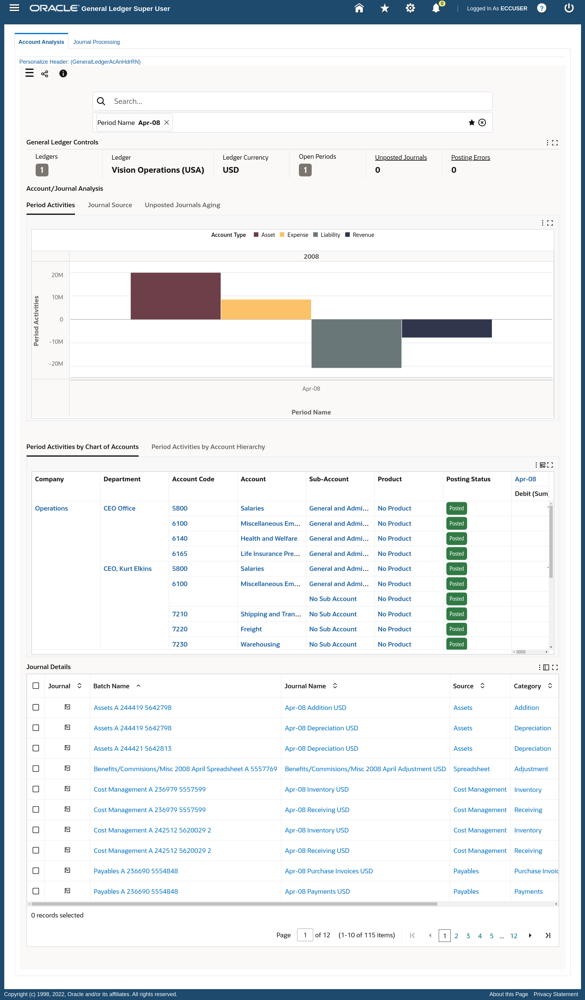
A dashboard or a page can be defined only within the context of an application. 

**Application**: An application encapsulates all elements needed to power the dashboard. It references data sets which in turn control how data is populated through load rules and behavior of every attributes on the UI through metadata. An application can reference data sets owned by other applications. 
 
**Data set**: A data set is both a logical and a physical grouping of attributes to support business dashboard operations and use cases. From a logical perspective, it is designed to support several use cases that are accessed through one or more Oracle Enterprise Command Center Framework dashboards. The design typically caters to open‐ended interaction with the underlying data.

At the physical level, the data set stores one or more records with a uniquely identifying key that represents a particular level of detail of the entity stored in the enterprise system.

A data set declares the data load rules that it supports and how they are used to populate data into the data set. Each data set should be assigned to an application as an owned data set but can be referenced by other applications. The owning application is responsible for populating data into the data set.

A data set's contents can be downloaded into a CSV file by clicking the Download icon.

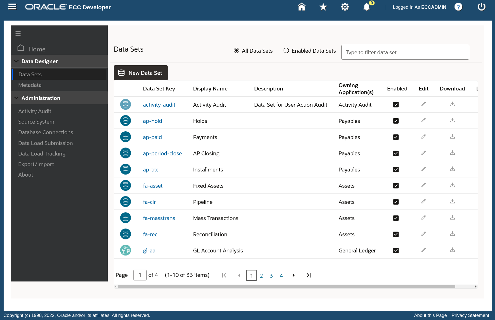

Each data set has Load rules (Data Load process). For more information, see: Overview of a Data Load Process. For more information, see: Overview of a Data Load Process.
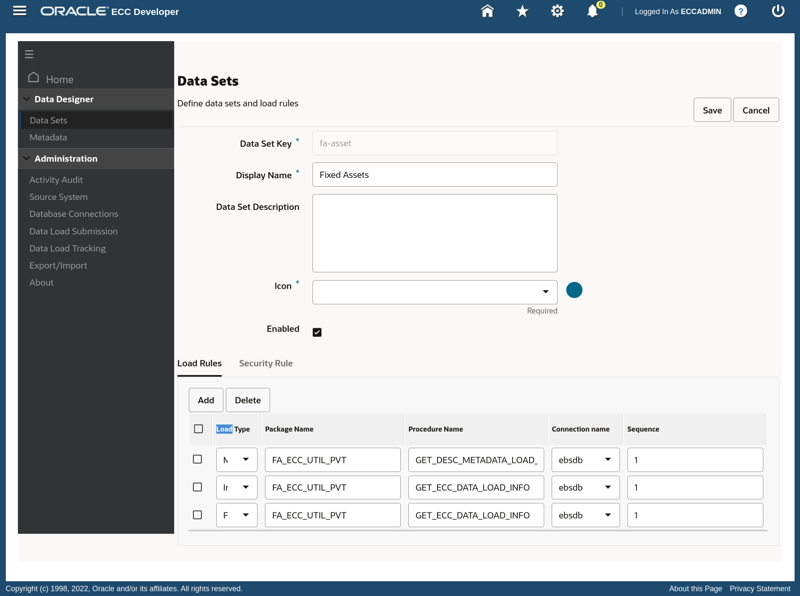

Each Data set also has a security rule (Security) where a security handler is defined along with privileges. For more information, see Overview of Security in Oracle Enterprise Command Center Framework.

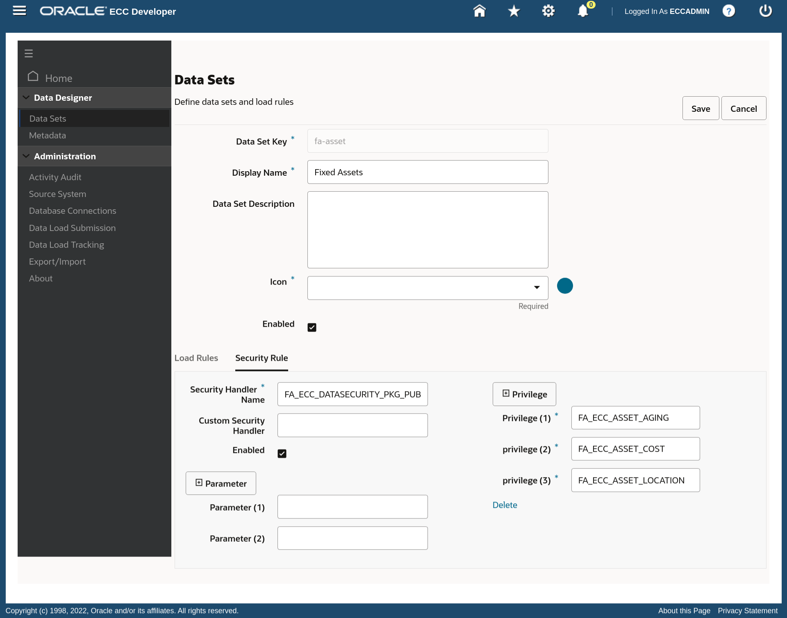

Contents of a data set can be exported with attribute keys and attribute display names as headers. For more information refer to the Oracle E‐Business Suite User's Guide.

Note: A data set cannot be deleted if it is used to configure one or more components.

**Metadata:** Each attribute stored in the data set is controlled by metadata properties that specify its behavior on the user interface. Additional value-add features such as calculations, bucketing, and precedence rules can also be specified.

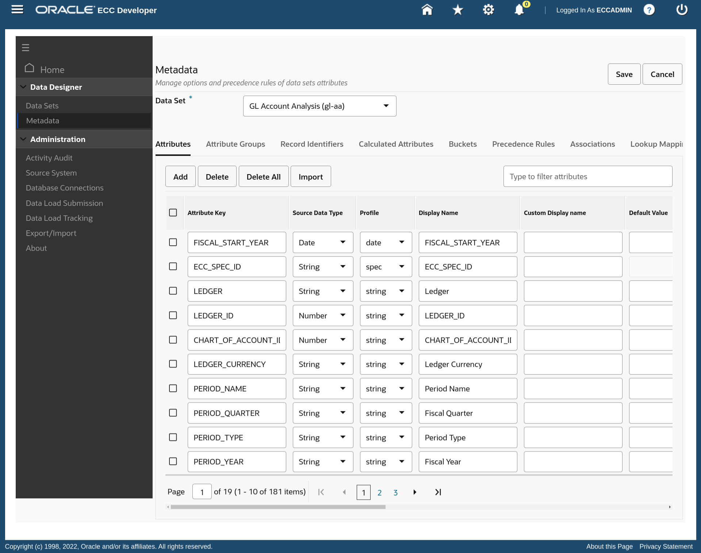

Overview of Components
An Oracle Enterprise Command Center Framework dashboard is a collection of UI visualization components.

Oracle Enterprise Command Center Framework UI components are grouped into four main groups:

<table id="huyh">

  <tr>
    <th>Group</th>
    <th>Components</th>
  </tr>
  <tr>
    <td>Navigation</td>
    <td>Search Box 
Selected Refinements (breadcrumbs) 
Available Refinements</td>
</tr>
  </tr>
  <tr>
    <td> Viusalisation</td>
    <td>Summarization Bar 
Chart 
Tag Cloud 
Aggregated Table 
Diagram 
Aggregated Grid</td>
</tr>
  <tr>
    <td>Detailed insight</td>
    <td>Results Table 
Grid</td>
</tr>
  <tr>
    <td>Layout</td>
    <td>Tabbed component container</td>
  </tr>

  </tr>
</table>

## Task 2: Walkthrough of Supplier Balance dashboard (Instructor led)

The Supplier dashboard presents supplier and invoice payment details. Using the Supplier Balance dashboard you can identify which supplier has the highest invoice amount and when that amount is due. Take an action on that invoice. For example, drill down to pay that specific invoice. This dashboard also lists the recently paid invoices. You can track details of recently paid invoices.

The following are the key components in the Supplier dashboard:

**Search Box**

Oracle Enterprise Command Center Framework comes with search capabilities that allow users to search for a term within a particular data set.

To perform a basic search, type your search term into the search box and Oracle Enterprise Command Center Framework will then list available matches in attribute values. If you select a value from the suggestion list then Oracle Enterprise Command Center Framework will execute a specific search on that attribute match. Alternatively, you can click on the magnifying glass (search icon) to retrieve all records containing this value regardless of which attribute matches your search criteria.

**Example of a Search Box Placed on a Page**

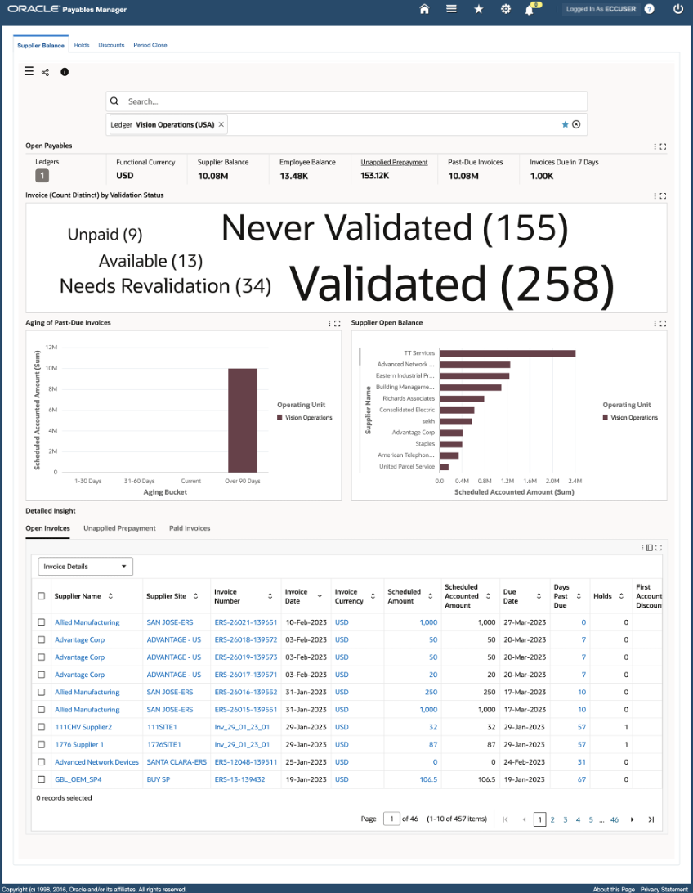

**Selected Refinements**

Selected Refinements display all values that the user has selected to filter the dashboard, organized by attribute name and data set. The captured filtered can come from user interaction with any of the Oracle Enterprise Command Center components that allow refinements such as search box, tag clouds, charts, and so on.

The Selected Refinements component can additionally control associative filtering behavior and make the dashboard sensitive to refinement state coming from directly or indirectly associated data sets. This is done by specifying the associated data sets in the configuration.

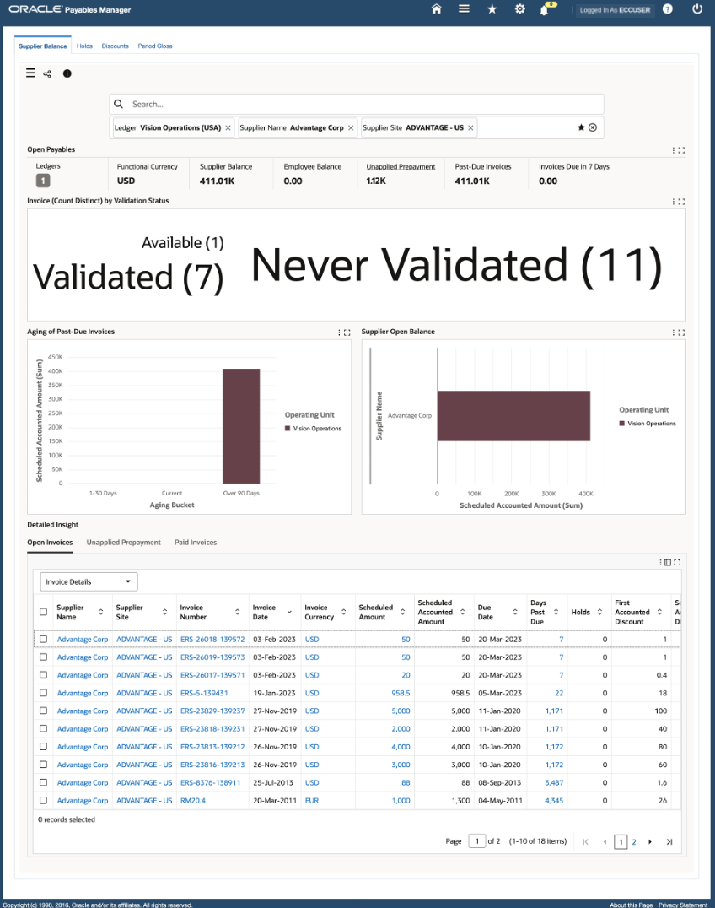

**Breadcrumbs**

The Breadcrumbs feature is an intuitive representation of the selected refinements as a trail of filters on the dashboard page. This feature is configured along with the search box on page. It emphasizes the sequence of the steps in the path the user has chosen to arrive at the current state of the dashboard. The Breadcrumbs component can be added in two ways:

* Dragging the selected refinements section to page area

* Adding a new component: 'Selected Refinements' from the components list

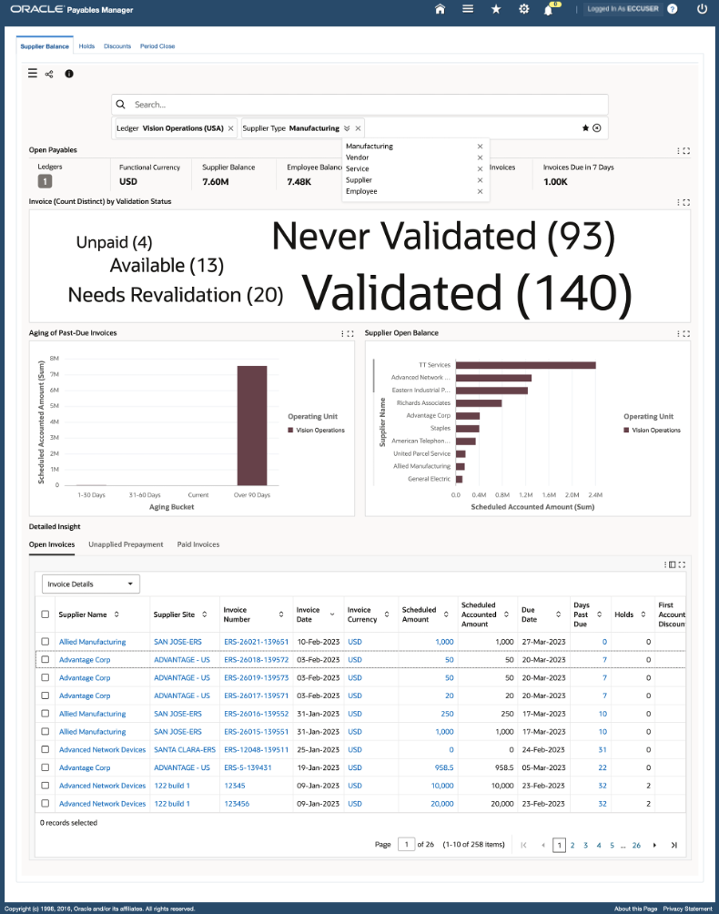

Breadcrumbs component allows the user to replace or apply additional filters from the selected refinement, inheriting all the refinement behavior as in available refinements.

If you click on the attribute name, then you can select another value and apply it as a filter on top of the existing one from the same attribute.

If you click on the attribute value, then you can select another value and replace it with the existing one from the same attribute.

**Saved Search**

Oracle Enterprise Command Center Framework provides an option to save the frequently applied filters or preferred filters as saved searches for allowing users to reuse them. All saved searches are context-sensitive to the page and are part of the search suggestions. The list of saved searches can be obtained when focused on the search component. Saved searches are searchable by their title, filter attributes and filter values.

Three types of saved searches are available for the users: Seeded, Public, and Private. Seeded saved searches are published along with the product, Public saved searches are created by admin users and all the saved searches created by users are called Private saved searches. Private saved searches are accessible only by the users who created them, whereas public saved searches are accessible by all the dashboard users.

For more information, see Saved Search, [Enterprise Command Center- User Guide](https://docs.oracle.com/cd/E26401_01/doc.122/e22956/T27641T671922.htm)

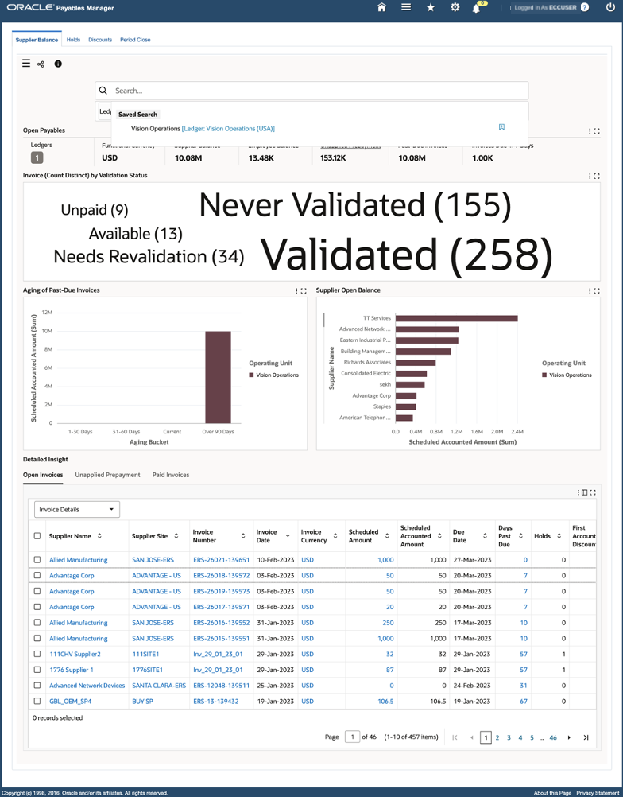

**Available Refinements**

The Available Refinements feature enables interactive navigation through the data without having prior knowledge of its distribution nor characteristics.

As a user interacts with available refinements components or perform filtering operations from other components on the dashboard, Available Refinements dynamically updates the attribute list to show relevant attributes and attribute refinements. This navigation is data-driven and supports progressive disclosure of additional attributes as appropriate according to the user's navigation path through the data. Data rendered in the attribute value list also honors refinement state and can shrink, expand or be removed based on which subset of data user is exploring.

Available Refinements supports displaying attributes in a grouped list to reduce clutter.

Available Refinements also supports switching between data sets to apply relevant filters from the data sets. The name of the selected data set will appear in the header of the available refinements section.

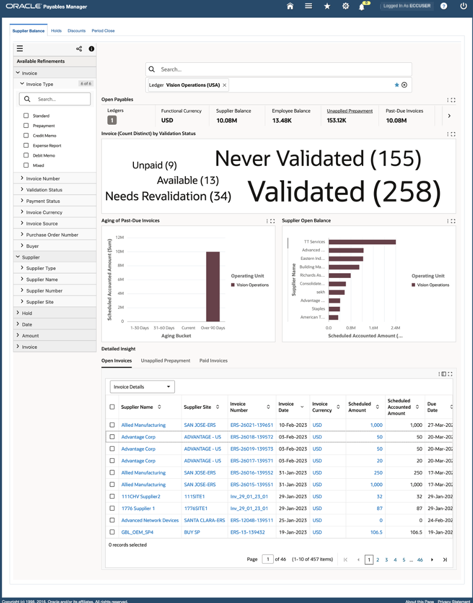

**Visualisation Components**

Oracle Enterprise Command Center Framework has a set of graphs and charts that provide a powerful way of summarizing and presenting data that are critical in decision making. The user can find insights, detect outliers, filter the data directly from the charts, and drill down to a deeper level of detail.

**Summarization Bar**

The Summarization Bar allows users to get their footing into a particular business area by viewing metric or dimension values that summarize important aspects about the business area covered by the dashboard.

An entry in the summarization bar can be one of the types in the following table:

 Entry Types for a Summarization Bar

<table id="huyh">

  <tr>
    <th>Summary items</th>
    <th>Description</th>
  </tr>
  <tr>
    <td>Metric</td>
    <td>Displays the value of a specific metric, such as total sales or average profit.
Can be used to navigate to a destination dashboard or tab and optionally invoke a refinement action.t</td>
  </tr>
  <tr>
    <td>Dimension</td>
    <td> The dimension value associated with either the top or bottom value of an associated metric value, such as the product category with the highest total sales.</td>
  </tr>
  <tr>
    <td>Flag</td>
    <td>Flags display the count of the configured dimension. Additional metrics are displayed in the pop-up.</td>
  </tr>
 
  </tr>
</table>

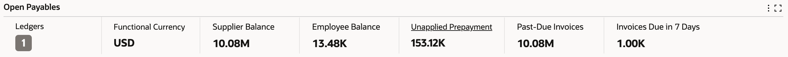

Users can choose to enable/disable or re order summarization bar via runtime options

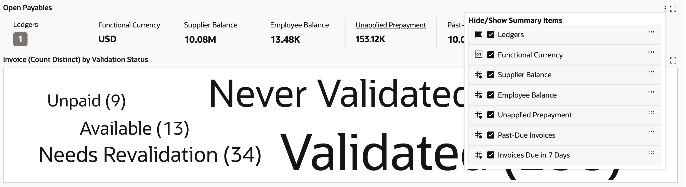

**Tag Cloud**

The Tag Cloud component allows users to compare a set of displayed terms based on the value of an associated metric. The component can optionally display the metric value associated with each term.

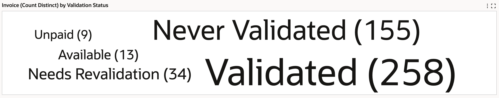

From Runtime options Users can change dimensions and metrics as well as choose to export the Tag cloud data

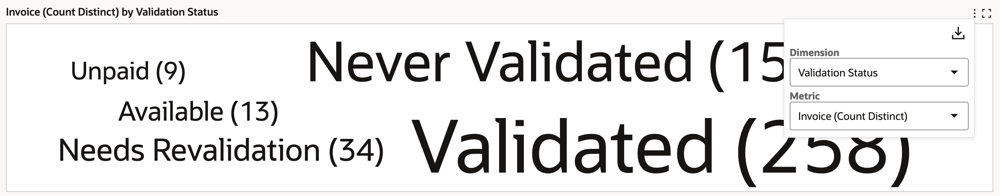

**Chart**

The Chart component displays a graphical chart based on the application data. It supports several sub-types and includes options for selecting the specific data to display.

The Supplier dashboard contains two Bar charts:

1. Aging of Past Due Invoices: Displays Scheduled accounted amount per aging buckets
2. Supplier Balance: This chart is a horizontal bar chart which displays Scheduled accounted amount per Supplier Name

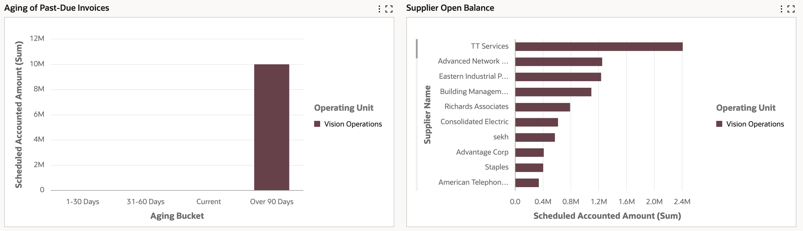

From Runtime users can choose to do the following:

1. Flip the bar Vertical/Horizontal
2. Change the bar to be Stacked/ Unstacked
3. Choose single or multi metric
4. Choose to display data as a percentage
5. Choose to display data as a line
6. Change dimension, metric, sorting parameters, number of dimensions displayed and display order of the chart
7. Export: A chart can be exported as a PNG image that contains a snapshot of the chart. The snapshot contains the chart as-is -- as seen on the dashboard to honor runtime changes and any change in size with chart maximization. Underlying data of the chart component can also be exported in a CSV file. Exported data also honors all the runtime changes. As the underlying data needs to be holistic, exported data of chart will contain all the data even if Top N is configured.

**Color Pinning**: Chart colors can be pinned with context specific colors. These colors remain intact irrespective of user session.

For more information, see Color Pinning, [Enterprise Command Center- User Guide](https://docs.oracle.com/cd/E26401_01/doc.122/e22956/T27641T671922.htm)

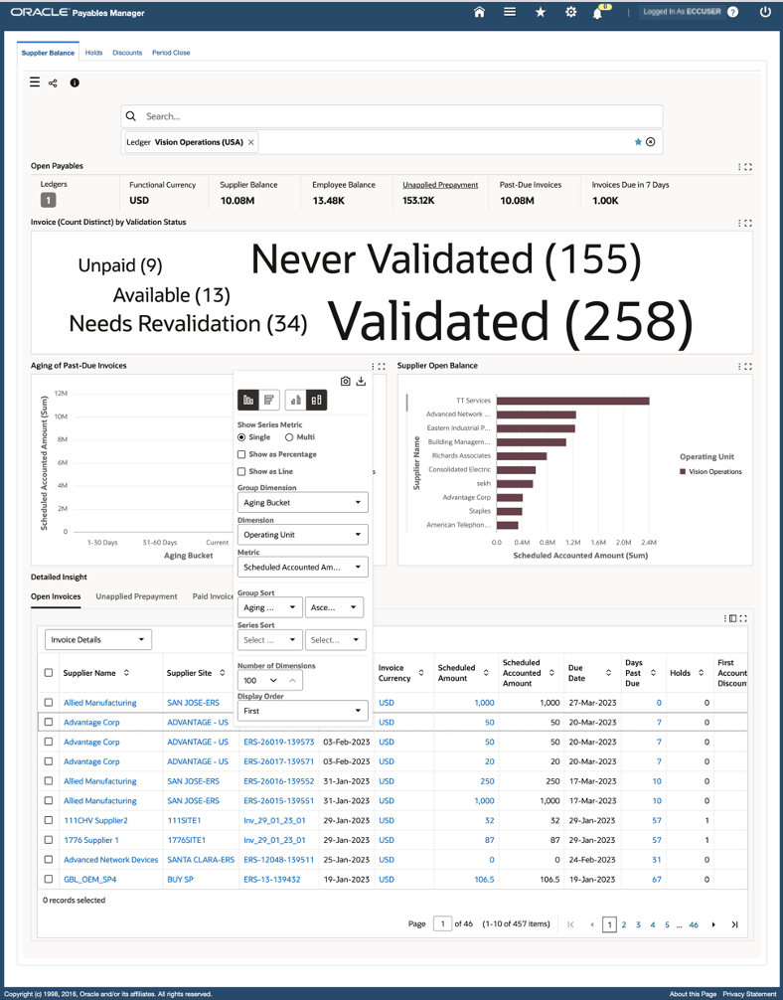

**Multi data set support**

Bar and Bar/Line charts support display of metrics from multiple data sets over the common dimensions. The common dimensions should have the same attribute display name and an association should be defined on these data sets.

Association takes care of refining the dashboard appropriately when a filter is applied from the chart. Metrics are aggregated according to the data corresponding to the data set. If a dimension value is missing from any of the data set, it is shown with a corresponding zero value.

Multi data Set Support is applicable for multi-metric charts and honors the existing functionalities of a multi-metric chart.

Once Multi Data Set Support is enabled, a designer can configure the conditions and record identifier for each data set.

Multi Data Set Support also allows users to configure metrics from the same data set but with different conditions or record identifiers.

**Tab Layout**

The tabbed component container allows you to group components on a dashboard. Containers cannot be nested within each other and you cannot move components inside or outside a tabbed component.
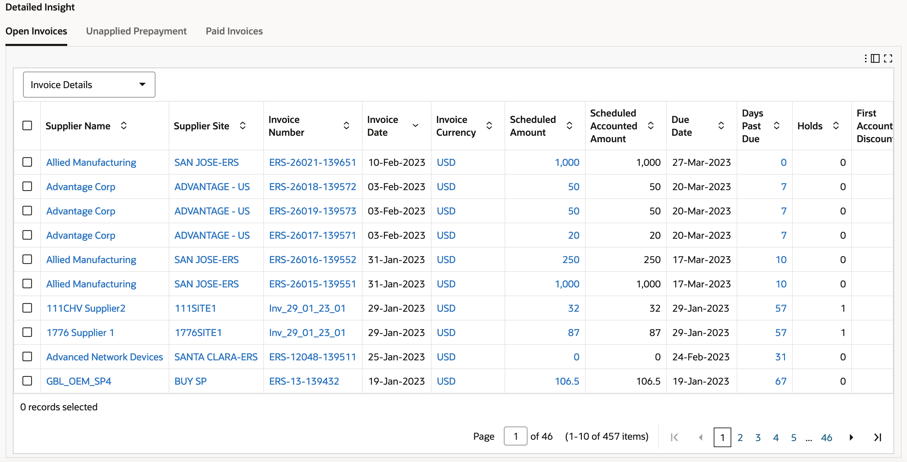

**Results Table**

The Results Table component displays a set of data in a table format. A results table displays ten records in each page and when expanded at runtime, the results table displays up to 50 records per page.

Descriptive flexfield attributes can be configured as an attribute group in a results table.

The data displayed in the Results Table component is either:

A flat list of records from a selected data set. Each row represents a single record. The columns contain attribute values for that record.

Results Table - Flat List

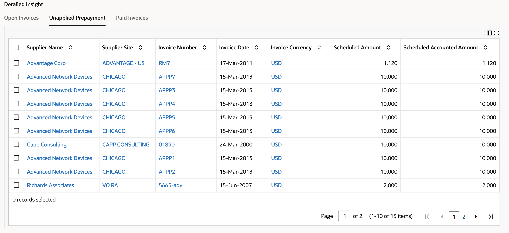

A grouped list of attributes. Each group represents a functional or logical grouping for a set of attributes.

Results Table - Attribute Groups

From Runtime options users can choose to export the data and also to hide/show or reorder columns

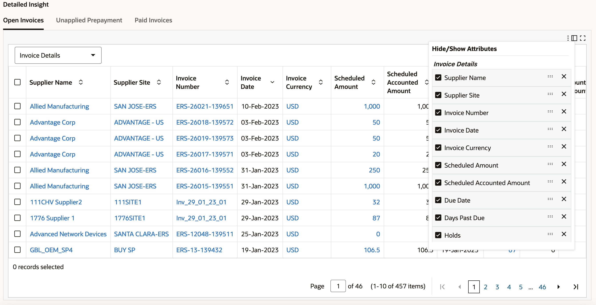

## Task 3: Walkthrough of Geneology and Trace dashboard (Instructor led)

The Genealogy & Trace dashboard displays the genealogy and trace of material lot and serial unit entities within a network viewer diagram. Production supervisors can trace the serial or lot entity in the shop floor and view component materials, work orders, and shipping details. The dashboard allows users to perform backward and forward traceability across the supply chain.

You can search by entering a work order, lot number, serial number, purchase order, or a sales order. You can also view information based on the available refinements for the work orders, purchase orders, lot numbers, serial numbers, and sales orders data sets. See the Discrete Manufacturing Command Center Overview for more information.

From the Manufacturing and Distribution Manager Standard responsibility, navigate to the Genealogy & Trace dashboard:

(N) Manufacturing and Distribution Manager Standard > WIP > Discrete > Discrete Manufacturing Command Center > Genealogy and Trace [Tab]

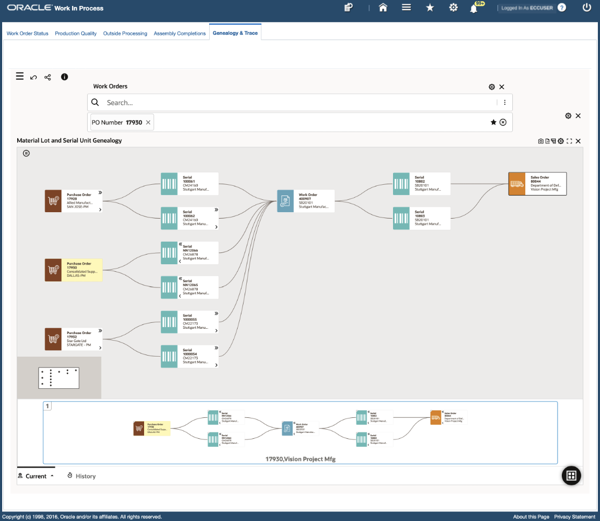

The following are the key components in the Geneology and Trace dashboard:

**Diagram**

A diagram provides a visualization of a business process. You can track and trace an entire business activity while getting your required insights in one page. For example, you can trace a damaged lot number to track the customer recipient of this lot while also understanding the manufacturing process and suppliers responsible for the damage. You can zoom in to focus on an intermediate process or zoom out to get a perspective of the entire process.

Any filter in selected refinements such as Prchase Order Number, for example in the above diagram, is considered as an anchor node in the diagram and is highlighted in yellow. The entire diagram shows the business process flows with the anchor node in context. That is, the diagram displays operations that can be related to the anchor node.

You can choose any node in the diagram to be the anchor node using the Diagram Context menu and selecting Make Anchor Node. The diagram immediately shifts the context to the selected node and shows processes related to it.

For example, if the diagram shows transactions from a particular purchase order and finds a work order of interest in between the transactions, then you can select that work order as the anchor node, and the diagram then shows all the entities related to that work order.

A diagram has an upper limit for the number of nodes that can be displayed based on the limit set on the diagram.

You can add filters and the diagram component automatically organizes itself to show the related processes in a page. Pagination allows you to switch among the pages to view other related process flows. Use the pagination control below the diagram to navigate between pages.

For example, if you apply three purchase order numbers as filters, then the first two purchase order processes are represented in the first page, because the diagram understood there are subsequent transactions common to these purchase orders. The remaining purchase order is shown in a different page.

You can also expand any node to display upstream and downstream processes related to that node. You can expand a node by either by clicking the icons on the node or clicking "Show adjacent nodes" in Options.

To view the entire details related to a particular node in a tabular form, click "Show Details". You can export a snapshot of the diagram component for collaboration with other stakeholders. This exported snapshot is saved in PNG or SVG format.

The "Find Similar" feature helps you filter the diagram by a specific value and displays matching flows (diagrams); for example, review other Lots with similar characteristics. This feature is embedded in the Show Details and Compare pop-up windows.

Another feature embedded within the Show details section is "Search within", essentially users can filter within a given diagram for any attribution. This is a local filter which will not affect other components and will highlight nodes and paths that satisfy the filter critia and dim the rest.

The "Multi-Select Node" feature allows you to select more than one node from the same business entity (from the same or different rank), compare between these nodes to spot differences, and find similarities or filter directly by the selected node by making them anchor nodes.

Pagination: Diagram pagination uses Film Strip Thumbnails to help you explore multiple distinct business processes in a single view per process with an overview of each business process. This feature displays an active image of the current business process flow, page number, and business entity (node) identifiers.

For more information, see Diagram, [Enterprise Command Center- User Guide](https://docs.oracle.com/cd/E26401_01/doc.122/e22956/T27641T671922.htm)

You may now **proceed to the next lab**

## Learn More
* [Enterprise Command Center- User Guide](https://docs.oracle.com/cd/E26401_01/doc.122/e22956/T27641T671922.htm)
* [Enterprise Command Center- Admistration Guide](https://docs.oracle.com/cd/E26401_01/doc.122/f34732/toc.htm)
* [Enterprise Command Center- Extending Guide](https://docs.oracle.com/cd/E26401_01/doc.122/f21671/T673609T673618.htm)
* [Enterprise Command Center- Installation Guide](https://support.oracle.com/epmos/faces/DocumentDisplay?_afrLoop=264801675930013&id=2495053.1&_afrWindowMode=0&_adf.ctrl-state=1c6rxqpyoj_102)
* [Enterprise Command Center- Direct from Development videos](https://learn.oracle.com/ols/course/ebs-enterprise-command-centers-direct-from-development/50662/60350)
* [Enterprise Command Center for E-Business Suite- Technical details and Implementation](https://mylearn.oracle.com/ou/component/-/117416)

## Acknowledgements

**Author**- Muhannad Obeidat, VP

**Contributors**-  Muhannad Obeidat, Nashwa Ghazaly, Mikhail Ibraheem, Rahul Burnwal and Mohammed Khan

**Last Updated By/Date**- Mohammed Khan, March 2023

