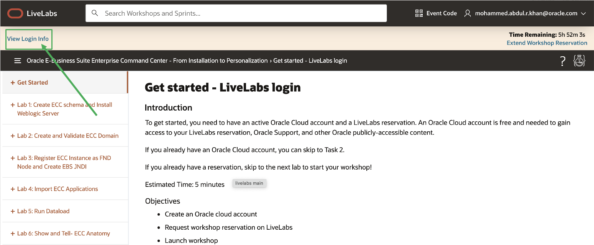
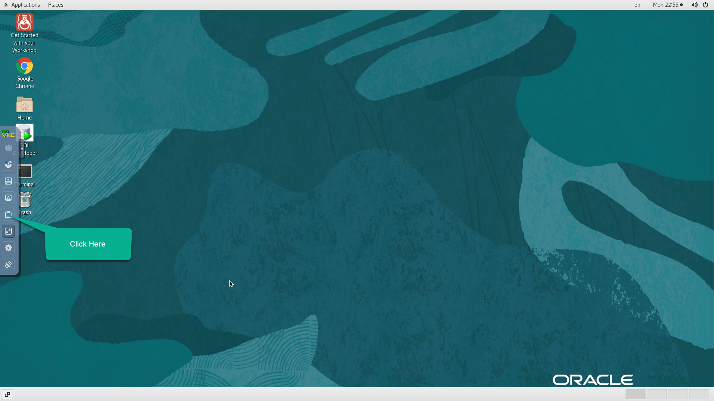

# Get started

### Introduction

This lab helps you get started with the workshop and gives a brief introduction to Oracle Enterprise Command Center Framework

Estimated Time: 20 minutes

### Objectives
In this lab, you will:
* Launch remote desktop
* Learn about Oracle Enterprise Command Center Framework

### Prerequisites

This lab assumes you have:
* An Oracle Cloud account
* Requested a workshop reservation on LiveLabs

##  

## Task 1: Launch remote desktop

1. Click on  "View login info" on the top left, as shown in below image
  

2. Click on "Launch remote desktop" button to Launch your remote desktop, this is where you will install Oracle Enterprise Command Center Framework.
  

3. You should see the below screen when you access the remote desktop:
  

## Task 2: Enable Copy/Paste from Local to Remote Desktop

1. During the execution of your labs, you may need to copy text from your local PC/Mac to the remote desktop, such as commands from the lab guide. While such direct copy/paste isn't supported as you will realize, you may proceed as indicated below to enable an alternative local-to-remote clipboard with Input Text Field.

2. Click on the small gray tab on the middle-left side of your screen to open the control bar and then, select the clipboard icon

3. Copy some text from your local computer as illustrated below and paste it into the clipboard widget, then finally open up the desired application (e.g. Terminal) and paste accordingly using mouse controls

**Note**: Please make sure you initialize your clipboard with Step 1 shown in the screenshot above before opening the target application in which you intend to paste the text. Otherwise, you will find the paste function in the context menu grayed out when attempting to paste for the first time.

## Task 3: Validate if EBS responsibility tree is up

1. From the browser, open chrome and from the address bar navigate to http://apps.example.com:8000 

<pre><button class="copy-button" title="Copy text to clipboard">Copy</button><code class="hljs apache">http://apps.example.com:8000 
</code></pre></li>

2. Login with following credentials:

<pre>Username= eccadmin
Password= welcome1
</code></pre></li>

3. Verify if EBS homepage is displayed, like in below image:
  
4. Ensure if the responsibility tree is up, like shown in below image:

  

**Note:** If you are not able to type in the remote desktop, then please hit the command key

## Task 4: Validate if EBS run edition can be sourced 

1. Open a terminal window for EBS to,<n> Source EBS edition</n>. Type the following command (case is important) in the terminal :
<pre><button class="copy-button" title="Copy text to clipboard">Copy</button><code class="hljs apache">source /u01/install/APPS/EBSapps.env run
</code></pre></li>

2. In the image below, you can see how you should source the running EBS edition on the terminal.
  

## Task 5: Introduction to ECC (No action required)

**Oracle ECC Overview**

Enterprise Command Centers (ECC) provide information discovery along with visualization and exploration capabilities embedded within Oracle E-Business Suite user interfaces. Oracle Enterprise Command Center Framework enables the creation of business dashboards in different functional areas.

Oracle E-Business Suite users navigate transactional information using interactive visual components and guided discovery capabilities allowing exploratory data analysis. Mobility and responsive design are built into the Oracle Enterprise Command Center Framework, and all dashboards automatically adjust the layout to better fit a desktop or mobile device form factor. Oracle Enterprise Command Center Framework automatically adheres to existing Oracle E-Business Suite security. The dashboard content a user sees is completely consistent with the Oracle E-Business Suite context and security. 

  **Example of an Enterprise Command Center Dashboard**

  

You may now **proceed to the next lab**

  
## Learn More
* [Enterprise Command Center- User Guide](https://docs.oracle.com/cd/E26401_01/doc.122/e22956/T27641T671922.htm)
* [Enterprise Command Center- Admistration Guide](https://docs.oracle.com/cd/E26401_01/doc.122/f34732/toc.htm)
* [Enterprise Command Center- Extending Guide](https://docs.oracle.com/cd/E26401_01/doc.122/f21671/T673609T673618.htm)
* [Enterprise Command Center- Installation Guide](https://support.oracle.com/epmos/faces/DocumentDisplay?_afrLoop=264801675930013&id=2495053.1&_afrWindowMode=0&_adf.ctrl-state=1c6rxqpyoj_102)
* [Enterprise Command Center- Direct from Development videos](https://learn.oracle.com/ols/course/ebs-enterprise-command-centers-direct-from-development/50662/60350)
* [Enterprise Command Center for E-Business Suite- Technical details and Implementation](https://mylearn.oracle.com/ou/component/-/117416)

## Acknowledgements

**Author**- Muhannad Obeidat, VP

**Contributors**-  Muhannad Obeidat, Nashwa Ghazaly, Mikhail Ibraheem, Rahul Burnwal and Mohammed Khan

**Last Updated By/Date**- Mohammed Khan, March 2023

