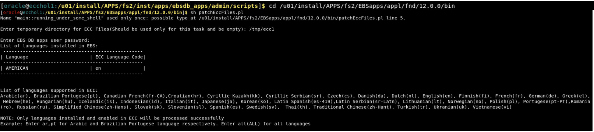
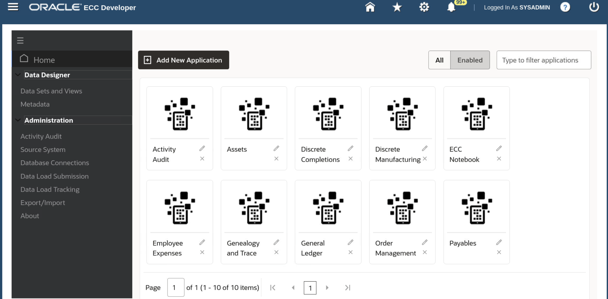

# Import ECC applications

### Introduction


This lab walks you through the steps to import ECC applications so that you can set up Oracle Enterprise Command Center Framework


Estimated Time: 15 minutes

### Objectives
In this lab, you will:
* Import ECC applications


### Prerequisites

This lab assumes you have:
* Completed all previous labs successfully 

##  

## Task 1: Import ECC Applications

1.  Open EBS terminal, source EBSapps running edition

    ```
  	 <copy>source /u01/install/APPS/EBSapps.env run </copy>
    ```


2. Navigate to below location in terminal 

    ```
  	 <copy>cd /u01/install/APPS/fs2/EBSapps/appl/fnd/12.0.0/bin </copy>
    ```


3. Execute patchEccFiles.pl command

    ```
  	 <copy>sh patchEccFiles.pl</copy>
    ```


4. When you run patchEccFiles.pl it will prompt you to enter a temporary directory, so enter**/tmp/ecc1**
5. When prompted enter EBS DB apps user password as **apps**
6. When prompted you need to pass the languages that you need to import. Use "en" 

    


7. When prompted you need to mention what products you need to import. 
     * "Y" is for all products
     * "N" is to specify a smaller subset of products. 

8. Enter **"N"** 

9. You will be presented with the list of products from which you need to mention which ones to import. 

10. For this demo please enter the following products: "**AP,GL,ONT,FA,WIP** "

    ```
  	 <copy>AP,GL,ONT,FA,WIP</copy>
    ```


    
    

11. You should see the following  screen when you run it successfully

    


## Task 2: Validate Import of ECC applications

1. Navigate to http://apps.example.com:8000 in the browser with below credentials 


    ```
  	 Username: SYSADMIN
Password: welcome1
    ```

    
2. Navigate to ECC Developer, you should see new applications as below
    


You may now **proceed to the next lab**


## Learn More
* [Enterprise Command Center- User Guide](https://docs.oracle.com/cd/E26401_01/doc.122/e22956/T27641T671922.htm)
* [Enterprise Command Center- Admistration Guide](https://docs.oracle.com/cd/E26401_01/doc.122/f34732/toc.htm)
* [Enterprise Command Center- Extending Guide](https://docs.oracle.com/cd/E26401_01/doc.122/f21671/T673609T673618.htm)
* [Enterprise Command Center- Installation Guide](https://support.oracle.com/epmos/faces/DocumentDisplay?_afrLoop=264801675930013&id=2495053.1&_afrWindowMode=0&_adf.ctrl-state=1c6rxqpyoj_102)
* [Enterprise Command Center- Direct from Development videos](https://learn.oracle.com/ols/course/ebs-enterprise-command-centers-direct-from-development/50662/60350)
* [Enterprise Command Center for E-Business Suite- Technical details and Implementation](https://mylearn.oracle.com/ou/component/-/117416)

## Acknowledgements

* **Author**- Muhannad Obeidat, VP

* **Contributors**-  Muhannad Obeidat, Nashwa Ghazaly, Mikhail Ibraheem, Rahul Burnwal and Mohammed Khan

* **Last Updated By/Date**- Mohammed Khan, March 2023

