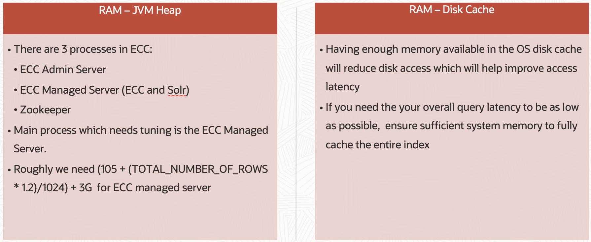
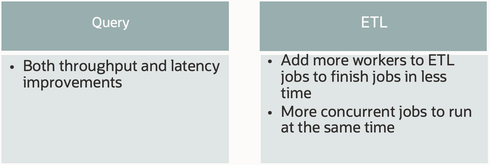

# Improve Performance

### Introduction

This lab walks you through the general steps to improve performance in Oracle Enterprise Command Center framework

Estimated Time: 10 minutes

### Objectives

In this lab, you will:
* Learn about Dataload Tuning

* Learn about Framework tuning

### Prerequisites

This lab assumes you have:
* Completed all previous labs successfully 

##  

## Task 1: Learn about Dataload Tuning 
**Data Load Tuning**
 
Some system level parameters for ETL for tuning ETL performance:
 * ir.fullload.threads 

The number of threads to handle ETL jobs of type "pull" that are allowed to run concurrently. 
The default value for this parameter is the number of available cores in the Oracle Enterprise Command Center Framework server

 * ir.job.threads
 
The number of ingest threads to serve one ETL job.
The default value for this parameter is the number of available cores in the server divided by two

 * ir.push.threads 
 

The number of threads to handle ETL jobs of type "push" that are allowed to run concurrently. 
The default value for this parameter is the number of available cores in the Oracle Enterprise Command Center Framework server

## Task 2: Learn about Framework Tuning 

**Disk**

ECC gives flexibility to mount data storage folder on any disk. 
SSD provides high transfer rates and pretty much eliminate the latency problems associated with randomly accessing data

**Memory**

**Core**

Adding more cores to the machine will impact both ETL and Query time

## Learn More
* [Enterprise Command Center- User Guide](https://docs.oracle.com/cd/E26401_01/doc.122/e22956/T27641T671922.htm)
* [Enterprise Command Center- Admistration Guide](https://docs.oracle.com/cd/E26401_01/doc.122/f34732/toc.htm)
* [Enterprise Command Center- Extending Guide](https://docs.oracle.com/cd/E26401_01/doc.122/f21671/T673609T673618.htm)
* [Enterprise Command Center- Installation Guide](https://support.oracle.com/epmos/faces/DocumentDisplay?_afrLoop=264801675930013&id=2495053.1&_afrWindowMode=0&_adf.ctrl-state=1c6rxqpyoj_102)
* [Enterprise Command Center- Direct from Development videos](https://learn.oracle.com/ols/course/ebs-enterprise-command-centers-direct-from-development/50662/60350)
* [Enterprise Command Center for E-Business Suite- Technical details and Implementation](https://mylearn.oracle.com/ou/component/-/117416)

## Acknowledgements

**Author**- Muhannad Obeidat, VP

**Contributors**-  Muhannad Obeidat, Nashwa Ghazaly, Mikhail Ibraheem, Rahul Burnwal and Mohammed Khan

**Last Updated By/Date**- Mohammed Khan, March 2023

