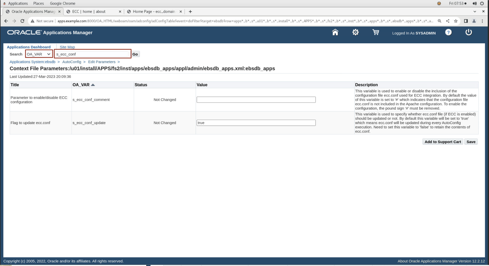
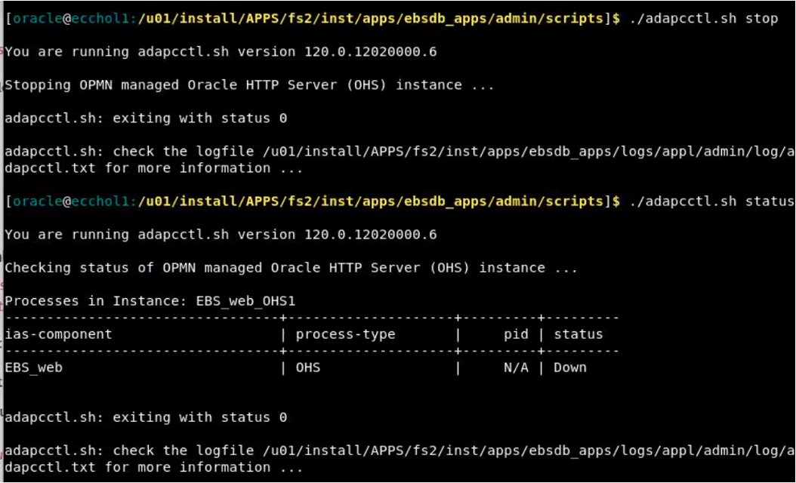

# Integrate  EBS  to ECC Instance:

### Introduction


This lab walks you through the steps to integrate  EBS to ECC Instance so that Enterprise Command Center can be accessed from EBS . 


Estimated Time: 30 minutes

### Objectives
In this lab, you will:
* Integrate EBS with ECC


### Prerequisites

This lab assumes you have:
* Completed all previous labs successfully 

##  

## Task 1: Integrate EBS with ECC 

 1. Log in to Oracle E-Business Suite as a system administrator i.e., Open the browser and navigate to http://apps.example.com:8000 

    ```
  	 Username= SYSADMIN
Password= welcome1
    ```


 2. Navigate to System Administrator: Oracle Applications Manager > AutoConfig.

    

 3. Select the application tier context file, and choose "Edit Parameters"

    

 4. Select OA_VAR in the search list of values and then search for the the following variable in the search text box

    ```
  	 <copy>s_ecc_conf</copy>
    ```
 
    Then, click the "Go" button.
5.  Like in the below image
    

 **Note:** 
 If  number sign (#) is present in Value field then remove it from the Value field for the s\_ecc\_conf\_comment variable to ensure that this variable is not commented. Then, click the "Save" button.
 
 Enter a reason for the update, such as Enabling Oracle Enterprise Command Center Framework. Then choose the OK button.
 
 Similarly, search for the following variables and set their values as appropriate for your installation:

    1. **s\_ecc\_protocol** - The protocol for accessing the Oracle Enterprise Command Center Framework administration UI.
    2. **s\_ecc\_web_host** - The Oracle Enterprise Command Center Framework host name.
    3. **s\_ecc\_managed\_server\_port** - The port for the Oracle Enterprise Command Center Framework managed server.
    4. **s\_ecc\_conf\_update** - A flag to update the ecc.conf file. If Oracle Enterprise Command Center Framework is enabled, use this variable to specify whether the ecc.conf file should be updated. The default value is true, which means ecc.conf will be updated during every AutoConfig run. To retain the contents of ecc.conf, such as when you are enabling TLS for the Oracle Enterprise Command Center Framework installation, set this variable to false.


6. Open EBS terminal and then run AutoConfig. For running Autoconfig you need to first source the EBS running edition using below command

    ```
  	 <copy>source /u01/install/APPS/EBSapps.env run</copy>
    ```
    

7. Then, navigate to below location

    ```
  	 <copy>cd $ADMIN_SCRIPTS_HOME</copy>
    ```

    

8. Run the below script

    ```
  	 <copy>./adautocfg.sh</copy>
    ```


9. It will prompt you for apps password which is by default **apps** 

    
    

10. Once Autoconfig runs successfully then navigate to below location:

    ```
  	 <copy>cd $ADMIN_SCRIPTS_HOME</copy>
    ```


    


11. And then, run the following script to check OHS status:


    ```
  	 <copy>./adapcctl.sh status</copy>
    ```

    

12. And then, run the following script to stop OHS regardless if OHS was UP/Down:


    ```
  	 <copy>./adapcctl.sh stop</copy>
    ```


       

13. And then, run the following script to start OHS:

    ```
  	 <copy>./adapcctl.sh start</copy>
    ```


    

14. And then, run the following script again to check the OHS status if it has successfully started:

    ```
  	 <copy> ./adapcctl.sh status</copy>
    ```


    

## Task 2: Validate integration of EBS and ECC 

1. Navigate to http://apps.example.com:8000 in the browser with below credentials 


    ```
  	 Username: SYSADMIN
Password: welcome1
    ```


    
2. Navigate to ECC Developer, you should see "Activity audit" application as below if the integration is successful
    


You may now **proceed to the next lab**

## Learn More
* [Enterprise Command Center- User Guide](https://docs.oracle.com/cd/E26401_01/doc.122/e22956/T27641T671922.htm)
* [Enterprise Command Center- Admistration Guide](https://docs.oracle.com/cd/E26401_01/doc.122/f34732/toc.htm)
* [Enterprise Command Center- Extending Guide](https://docs.oracle.com/cd/E26401_01/doc.122/f21671/T673609T673618.htm)
* [Enterprise Command Center- Installation Guide](https://support.oracle.com/epmos/faces/DocumentDisplay?_afrLoop=264801675930013&id=2495053.1&_afrWindowMode=0&_adf.ctrl-state=1c6rxqpyoj_102)
* [Enterprise Command Center- Direct from Development videos](https://learn.oracle.com/ols/course/ebs-enterprise-command-centers-direct-from-development/50662/60350)
* [Enterprise Command Center for E-Business Suite- Technical details and Implementation](https://mylearn.oracle.com/ou/component/-/117416)

## Acknowledgements

* **Author**- Muhannad Obeidat, VP

* **Contributors**-  Muhannad Obeidat, Nashwa Ghazaly, Mikhail Ibraheem, Rahul Burnwal and Mohammed Khan

* **Last Updated By/Date**- Rahul Burnwal, May 2024

