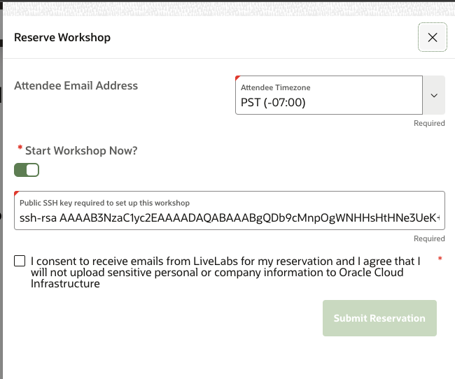

# Introduction 

## About this Workshop

The intent of this workshop is to give you practical hands on experience on Oracle Enterprise Command Center. This workshop has demonstrated use cases and step by step instructions that are easy to follow. It will walk you through the steps required for installing Oracle Enterprise Command Center,  showcase various dashboards and ECC components and also detail the steps required for personalizing dashboards.
There is also an Instructor led lab where you will learn about several features of Oracle Enterprise Command Center with examples.

This lab gives a brief introduction to Oracle Enterprise Command Center Framework and guides you on how you can launch remote desktop to start your workshop.

Estimated Time: 10 minutes

### Introduction to Oracle Enterprise Command Center

Enterprise Command Centers (ECC) provide information discovery along with visualization and exploration capabilities embedded within Oracle E-Business Suite user interfaces. Oracle Enterprise Command Center Framework enables the creation of business dashboards in different functional areas.

Oracle E-Business Suite users navigate transactional information using interactive visual components and guided discovery capabilities allowing exploratory data analysis. Mobility and responsive design are built into the Oracle Enterprise Command Center Framework, and all dashboards automatically adjust the layout to better fit a desktop or mobile device form factor. Oracle Enterprise Command Center Framework automatically adheres to existing Oracle E-Business Suite security. The dashboard content a user sees is completely consistent with the Oracle E-Business Suite context and security. 

**Example of an Enterprise Command Center Dashboard**

### Objectives
In this lab, you will:
* Learn about Oracle Enterprise Command Center Framework
* Launch remote desktop

### Prerequisites

This lab assumes you have:
* An Oracle Cloud account
* Requested a workshop reservation on LiveLabs

## Task 1: Add public key in reservation of workshop

Whether running on own tenancy or livelabs sandbox, you nee to go through this step. Before reserving the lab instance, download the SSH keys from this location: [ecc-hol-keys.zip](https://c4u04.objectstorage.us-ashburn-1.oci.customer-oci.com/p/EcTjWk2IuZPZeNnD_fYMcgUhdNDIDA6rt9gaFj_WZMiL7VvxPBNMY60837hu5hga/n/c4u04/b/livelabsfiles/o/labfiles/ecc-hol-keys.zip) 
Unzip the downloaded zip file.
Go to the extract directory and open public key ecchol.pub. Copy the file content (key value) and paste it in as per the screenshot below.
     
     

## Task 2: Launch remote desktop (Run on LiveLabs sandbox)

This task is to be performed if you want to run this workshop on the LiveLabs sandbox.

1. Click on  "View login info" on the top left, as shown in below image
    

2. Click on "Launch remote desktop" button to Launch your remote desktop, this is where you will install Oracle Enterprise Command Center Framework.
    

3. You should see the below screen when you access the remote desktop:
    

You may now **proceed to the next lab**

  
## Learn More
* [Enterprise Command Center- User Guide](https://docs.oracle.com/cd/E26401_01/doc.122/e22956/T27641T671922.htm)
* [Enterprise Command Center- Admistration Guide](https://docs.oracle.com/cd/E26401_01/doc.122/f34732/toc.htm)
* [Enterprise Command Center- Extending Guide](https://docs.oracle.com/cd/E26401_01/doc.122/f21671/T673609T673618.htm)
* [Enterprise Command Center- Installation Guide](https://support.oracle.com/epmos/faces/DocumentDisplay?_afrLoop=264801675930013&id=2495053.1&_afrWindowMode=0&_adf.ctrl-state=1c6rxqpyoj_102)
* [Enterprise Command Center- Direct from Development videos](https://learn.oracle.com/ols/course/ebs-enterprise-command-centers-direct-from-development/50662/60350)
* [Enterprise Command Center for E-Business Suite- Technical details and Implementation](https://mylearn.oracle.com/ou/component/-/117416)

## Acknowledgements

* **Author**- Muhannad Obeidat, VP

* **Contributors**-  Muhannad Obeidat, Nashwa Ghazaly, Mikhail Ibraheem, Rahul Burnwal and Mohammed Khan

* **Last Updated By/Date**- Mohammed Khan, March 2023

