# Set up Oracle Enterprise Command Center Framework

To set up Oracle Enterprise Command Center Framework, you must configure the Oracle Enterprise Command Center Framework components, verify the server status in the server logs, apply the latest Oracle WebLogic Server 12.2.1.4 Critical Patch Update (CPU), and configure the JNDI to connect to Oracle E-Business Suite.

## Introduction

*Describe the lab in one or two sentences, for example:* This lab walks you through the steps to ...

Estimated Time: -- minutes

### About <Product/Technology> (Optional)
Enter background information here about the technology/feature or product used in this lab - no need to repeat what you covered in the introduction. Keep this section fairly concise. If you find yourself needing more than two sections/paragraphs, please utilize the "Learn More" section.

### Objectives

*List objectives for this lab using the format below*

In this lab, you will:
* Objective 1
* Objective 2
* Objective 3

### Prerequisites (Optional)

*List the prerequisites for this lab using the format below. Fill in whatever knowledge, accounts, etc. is needed to complete the lab. Do NOT list each previous lab as a prerequisite.*

This lab assumes you have:
* An Oracle Cloud account
* All previous labs successfully completed

*This is the "fold" - below items are collapsed by default*

## Task 1: Apply Container Patches

Enterprise Command Center is available for EBS 12.2.4 onwards. Following are the list of patches to be applied sequentially:

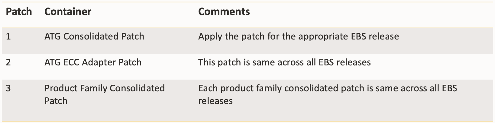

Note: AD and TXK Delta 12 will be pre-req for all the above-mentioned containers in ECC V9.

## Task 2: EBS – Enable Enterprise Command Center 

Update the value of listed application context variables in EBS application and execute AutoConfig in the backend followed by restart of EBS Services:

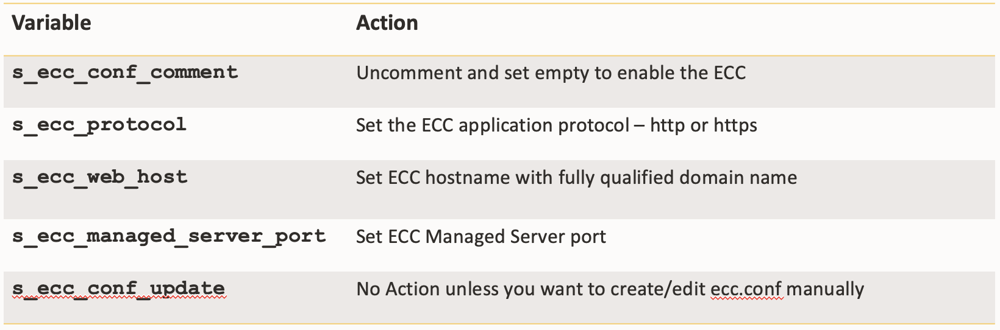

## Task 3: EBS – Role Based Access Control (RBAC) Setup

* Two possible approaches to RBAC setup:
    Manual approach – Refer to the installation guide for Enterprise Command Center on how to configure RBAC manually for a particular module.
    Automated approach using UMX_ECC_RBACAuto.sh script
      Create the UMX_ECC_RBAC.csv file that specifies Permission Set (Code) for Grants, Add to Shipped Responsibility (Code) and Role Code for each record.
* Execute “Workflow Background Process” Concurrent program after the setup.
* Cleanup the global cache using Functional Administrator responsibility.

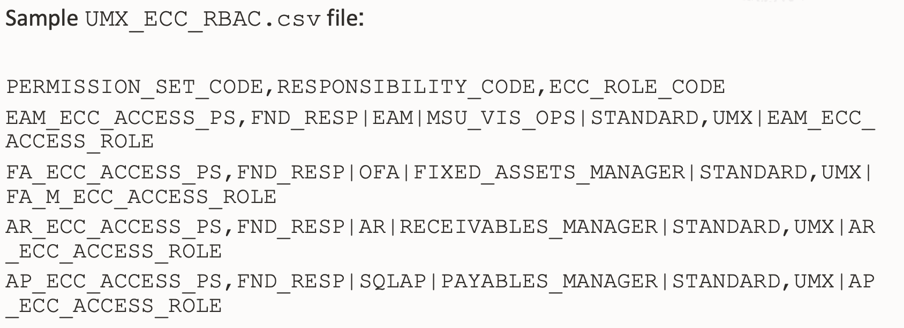

## Learn More

*(optional - include links to docs, white papers, blogs, etc)*

* [URL text 1](http://docs.oracle.com)
* [URL text 2](http://docs.oracle.com)

## Acknowledgements
* **Author** - <Name, Title, Group>
* **Contributors** -  <Name, Group> -- optional
* **Last Updated By/Date** - <Name, Month Year>

## Task 1: Investigate Account analysis dashboard 

Inspect Period Expenses

* Drill down to analyze period expenses

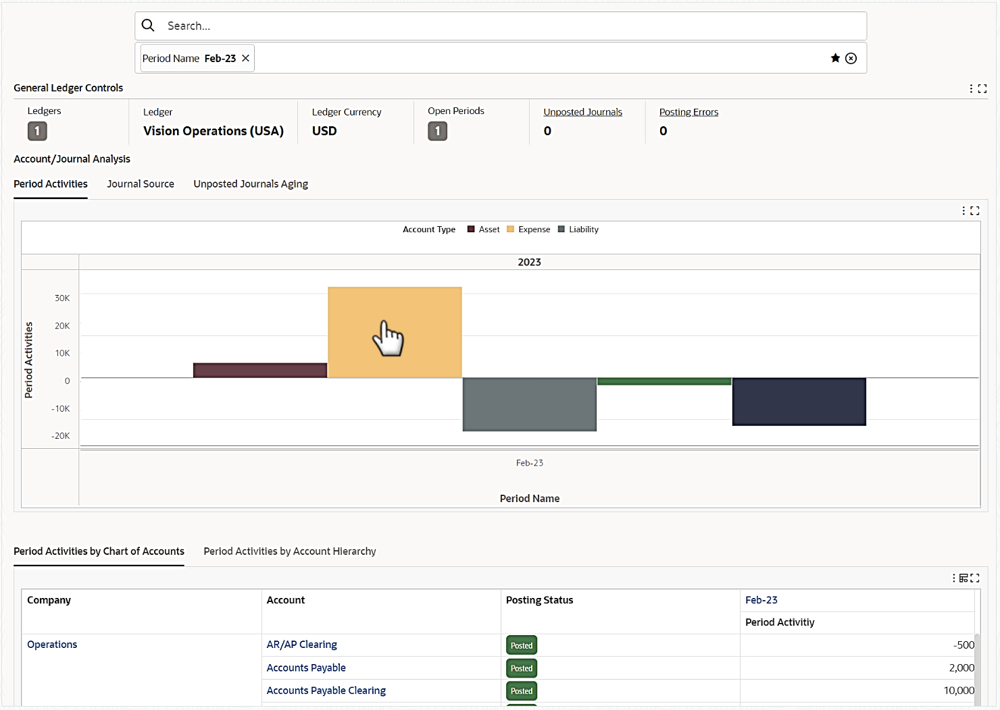
Analyze Employee Expenses
* Audit employee expenses period activities

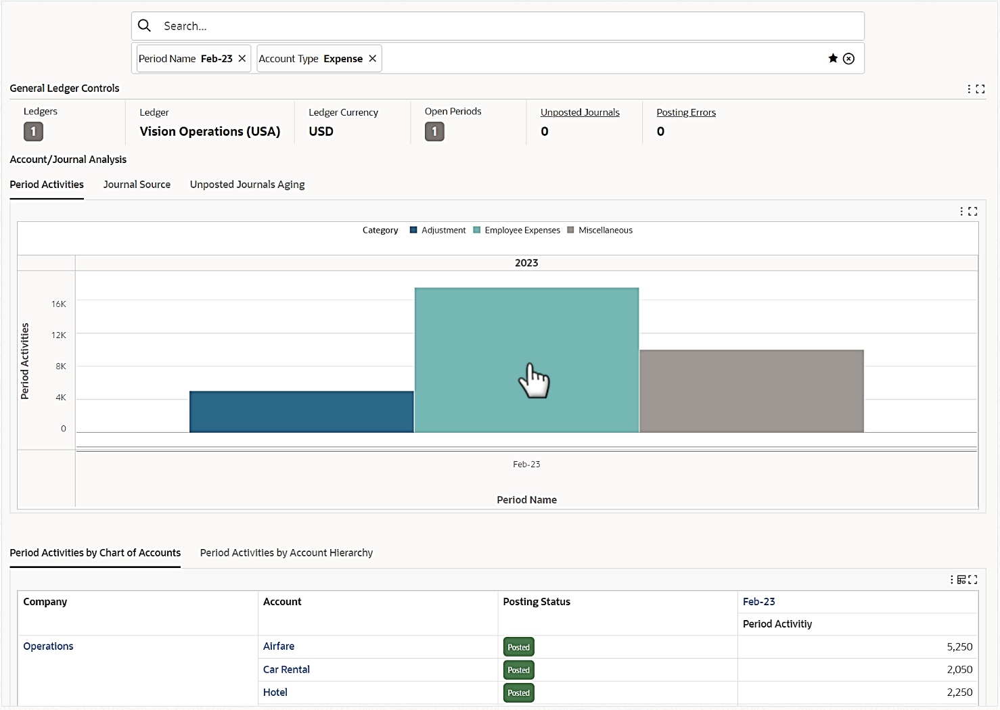
Examine Expense Accounts
* Examine employee expenses

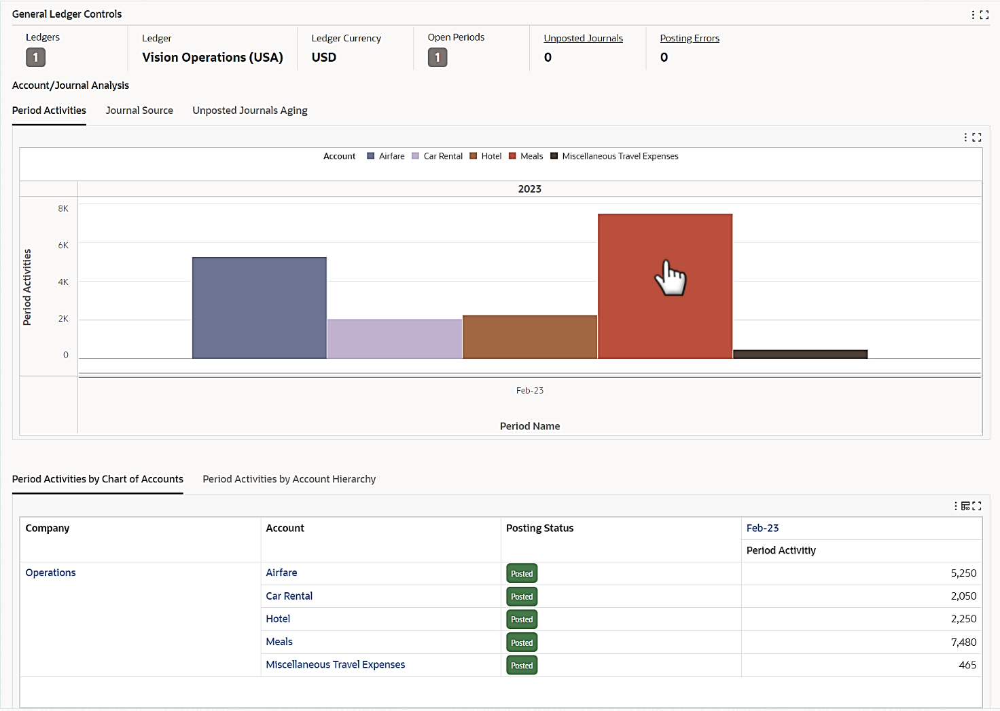
Seasonality Comparison
* Compare current period meals with the previous period

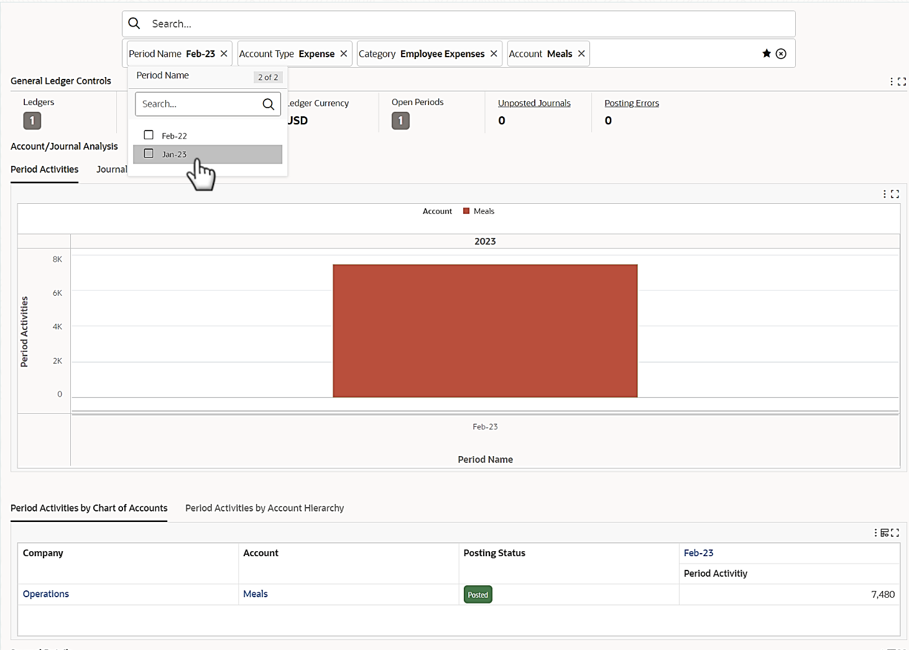
* Compare current period meals with same period last year

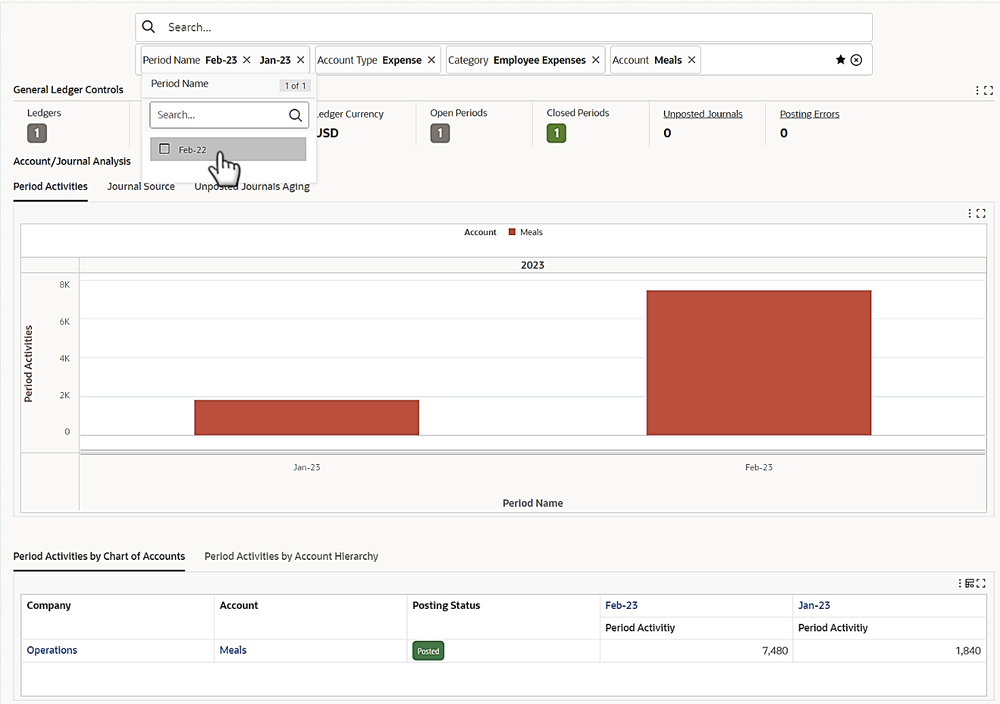
Examine Expense Accounts
* Breakdown employee expenses by department

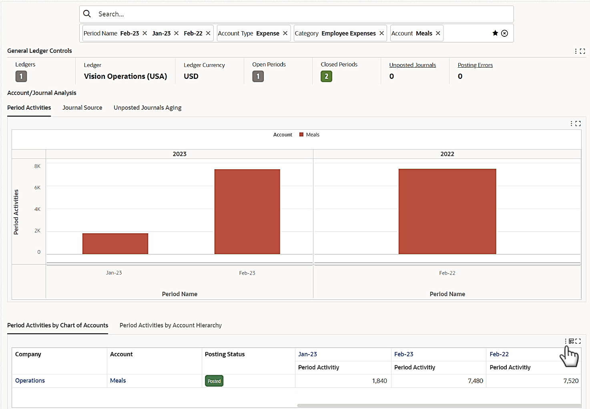

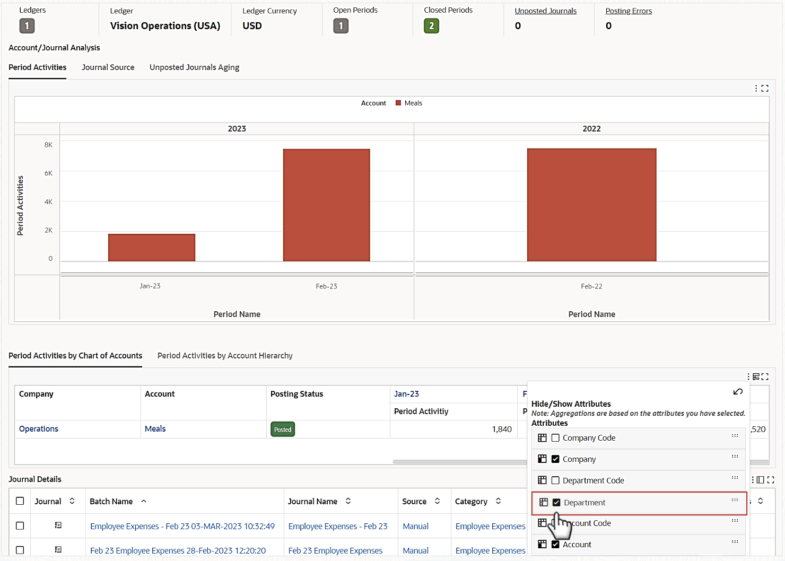
* Analyze employee expenses account hierarchy

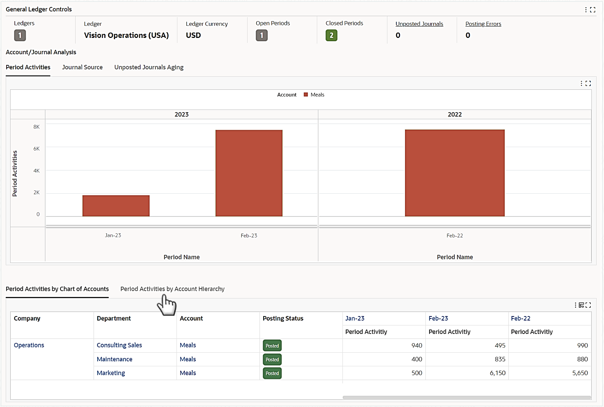
* Drill into account details

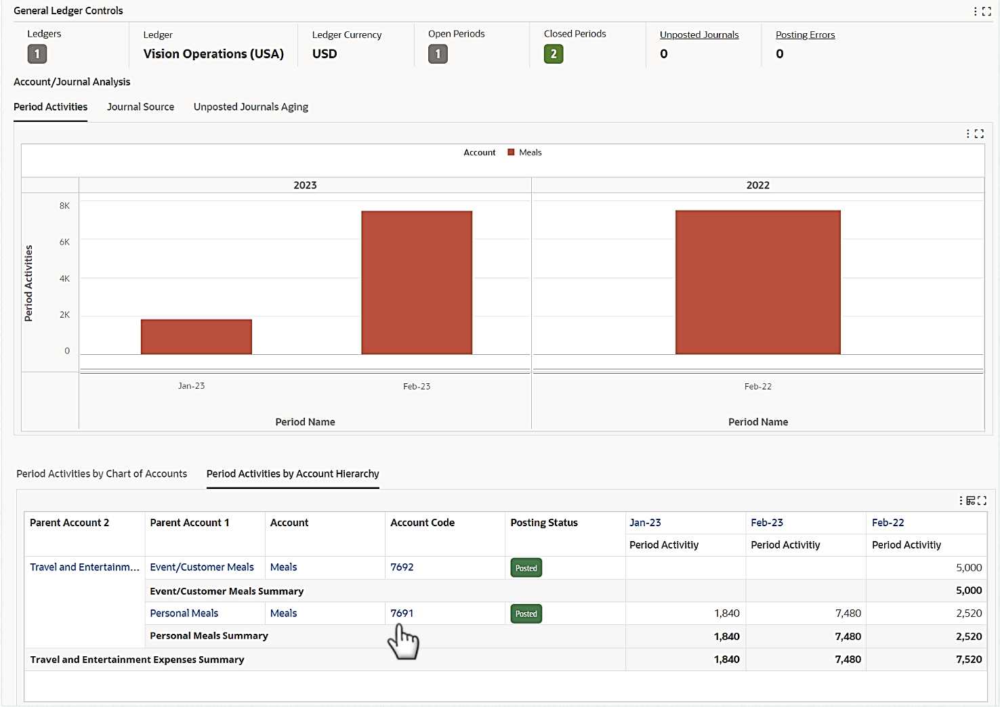
Drill Into Account Inquiry
* Identify highest expense amount

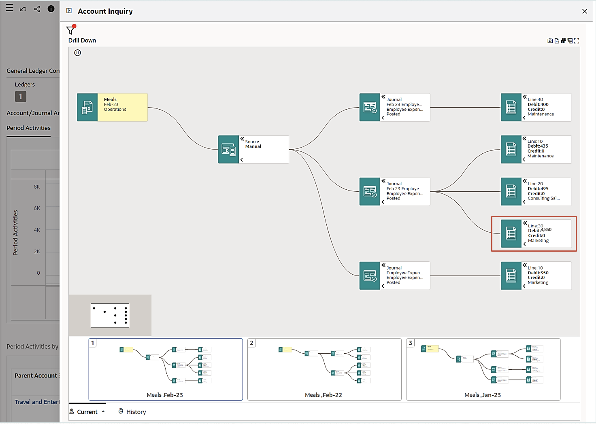
* Drill down to subledger journal for the highest meal amount

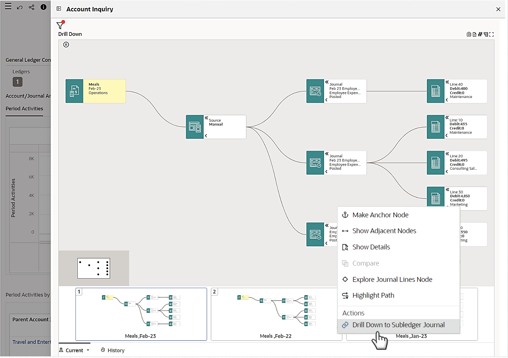
Inspect Questionable Line
* View source transaction

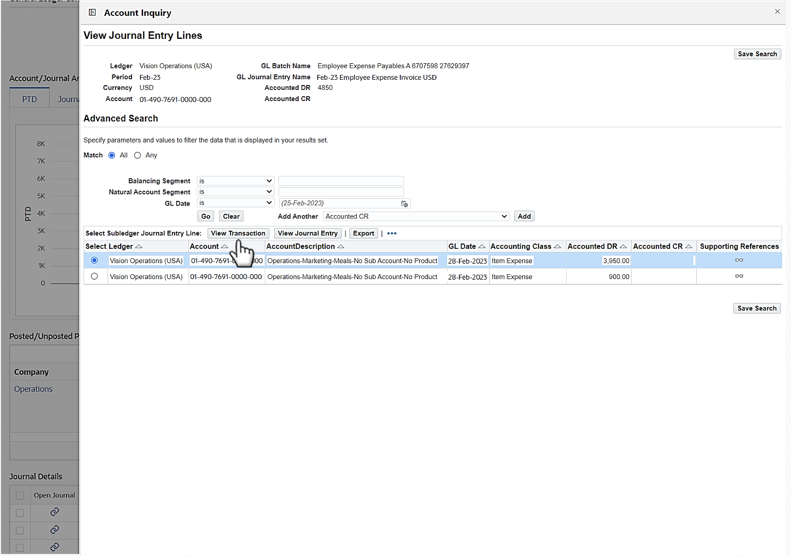
Drill Into Source Invoice
* Review the employee expense report

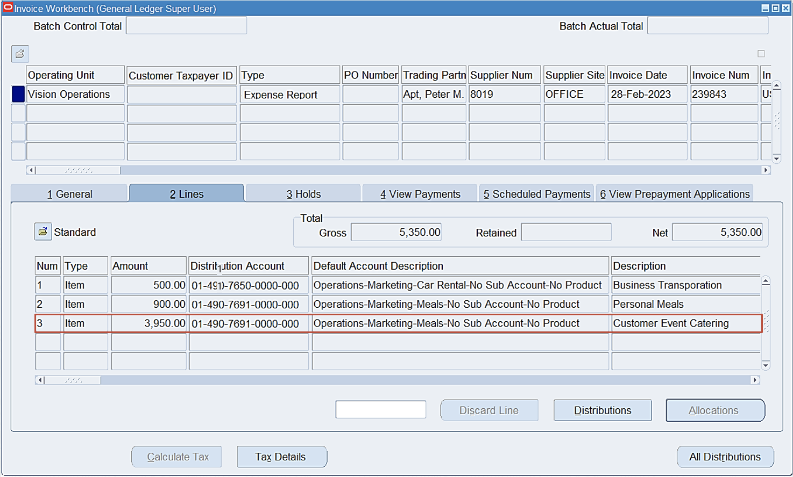

