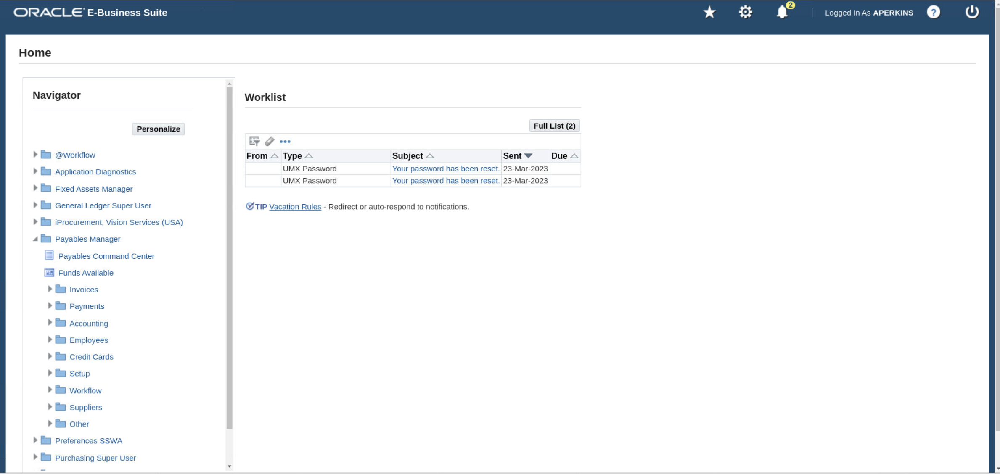
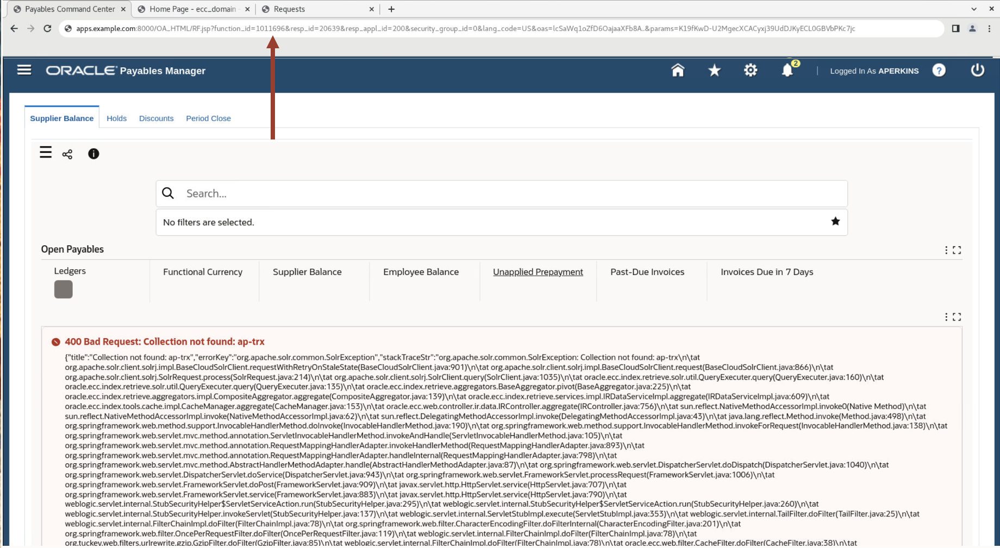
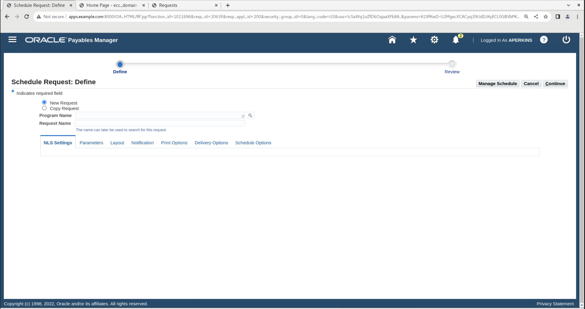
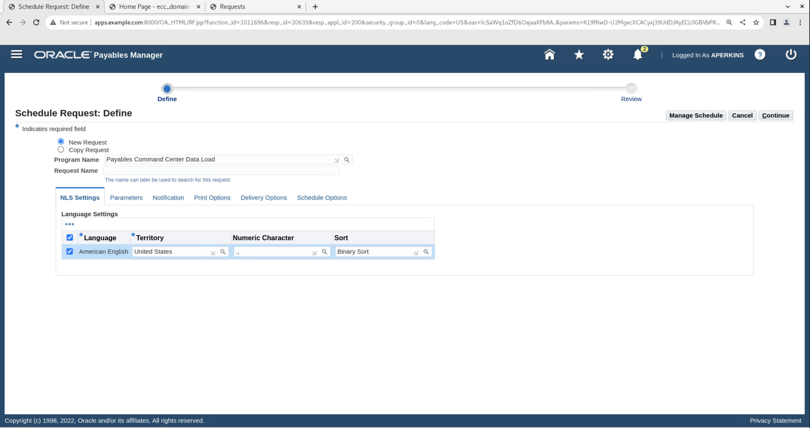
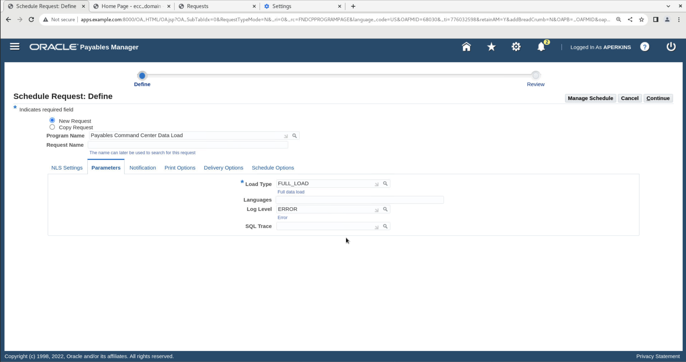
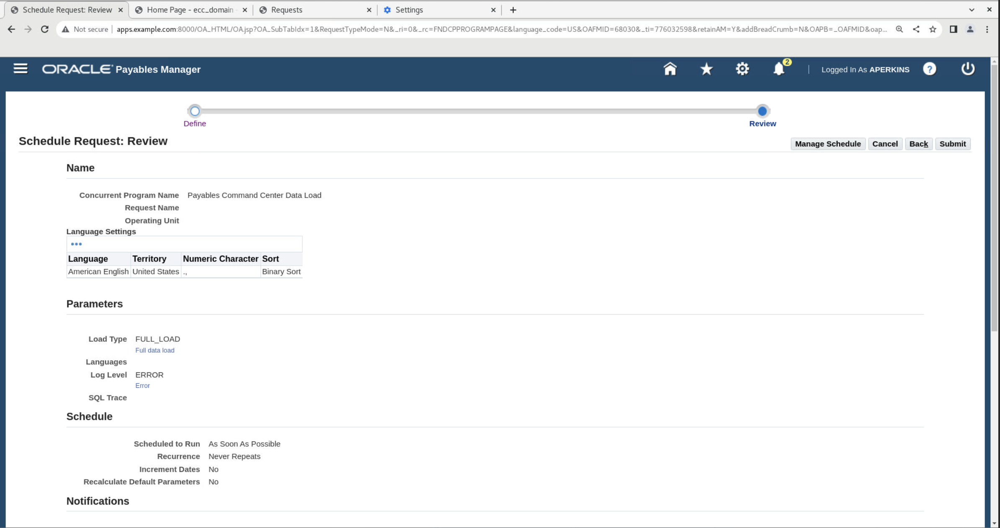
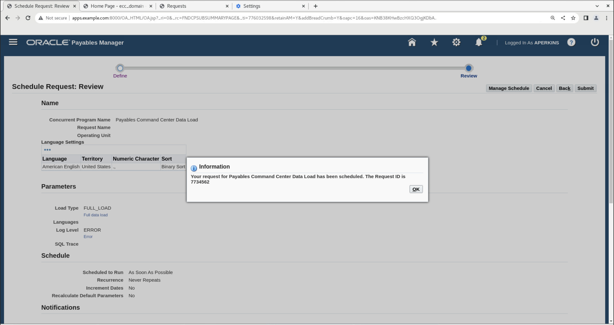
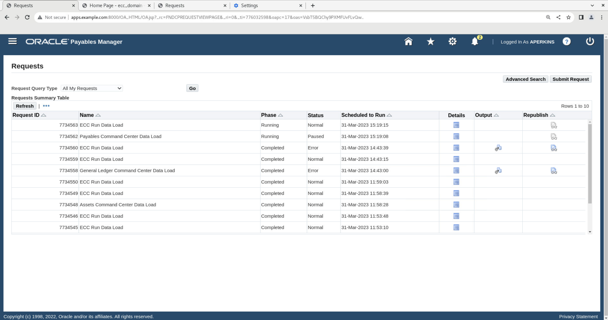
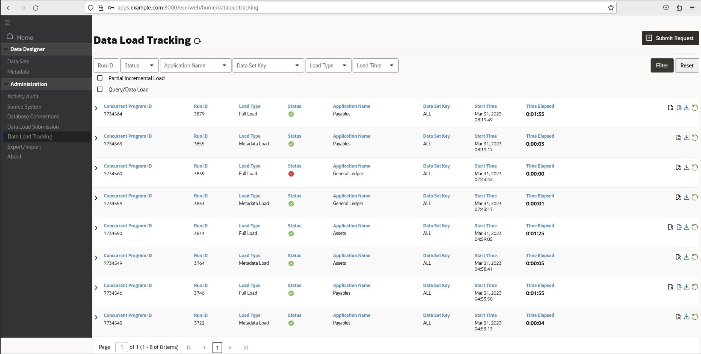

# Run Dataload

This lab walks you through the steps to run dataload so that you can set up Oracle Enterprise Command Center Framework

Estimated Time: 15 minutes

### Objectives
In this lab, you will:
* Run dataload
* Identify Common dataload and set up issues

### Prerequisites

This lab assumes you have:
* An Oracle Cloud account
* All previous labs successfully completed

## 

## Task 1: Set up RBAC

To perform RBAC setup with the UMX\_ECC\_RBACAuto.sh script, perform these steps:

* Type the following command (Case is important):
<pre><button class="copy-button" title="Copy text to clipboard">Copy</button><code class="hljs apache">source /u01/install/APPS/EBSapps.env run

</code></pre></li>

Move to the $FND_TOP/bin directory for your Oracle E-Business Suite instance using the following command: 

<pre><button class="copy-button" title="Copy text to clipboard">Copy</button><code class="hljs apache">cd $FND_TOP/bin

</code></pre></li>

Run the script using the following command:

<pre><button class="copy-button" title="Copy text to clipboard">Copy</button><code class="hljs apache">./UMX\_ECC\_RBACAuto.sh

</code></pre></li>

When prompted, enter the user name and password of the APPS user for the Oracle E-Business Suite instance.

When prompted, enter the full path and file name for your .csv input file.
If your file is named UMX\_ECC\_RBAC.csv and is present in the same directory as the UMX\_ECC\_RBACAuto.sh file, then the script uses that file by default and does not prompt you for the file name and path.

The following example shows sample output from the script:

  <textarea name="myTextBox" cols="700" rows="20" style="background-color:#000000;"  disabled>
-bash-3.00$ ./UMX_ECC_RBACAuto.sh
APPS username:apps
APPS password:
Enter csv file name with full path : /slot/ems2120/appmgr/apps/apps_st/appl/UMX_ECC_RBAC.csv
Executing for Permission_set EAM_ECC_ACCESS_PS , Responsibility_name FND_RESP|EAM|MSU_VIS_OPS|STANDARD and ECC_Role UMX|EAM_ECC_ACCESS_ROLE
old   6: L_MENU_NAME varchar2(100) := '&1';
new   6: L_MENU_NAME varchar2(100) := 'EAM_ECC_ACCESS_PS';
old   8: l_responsibility_name varchar2(300) := '&2';
new   8: l_responsibility_name varchar2(300) := 'FND_RESP|EAM|MSU_VIS_OPS|STANDARD';
old  10: ecc_role_name varchar2(300) := '&3';
new  10: ecc_role_name varchar2(300) := 'UMX|EAM_ECC_ACCESS_ROLE';
Completed Successfully

PL/SQL procedure successfully completed.
-bash-3.00$
</textarea>

## Task 2: Validate RBAC set up

After you run the script, ensure that the responsibilities you set up are assigned to the users who should have access to the Enterprise Command Centers.

Please refer to Section 8.2 from [Enterprise Command Centres- Installation Guide](https://support.oracle.com/epmos/faces/DocumentDisplay?_afrLoop=264801675930013&id=2495053.1&_afrWindowMode=0&_adf.ctrl-state=1c6rxqpyoj_102)

## Task 3: Submit a Job
Each product with an Enterprise Command Center provides a concurrent program to load its product-specific data into the Oracle Enterprise Command Center Framework installation. 

Here we will take the example of Oracle Payables with the respective Data Load Concurrent Program "Payables Command Center Data Load".Run this program now to perform an initial full load. 

You should also schedule the data load programs periodically to perform incremental loads to update the data available in the Enterprise Command Center dashboards. For details, see your product documentation.
 
### Execution Flow

Jobs should be submitted from EBS concurrent program and hence the tracking should be exposed to the concurrent program job.
Concurrent program keeps polling the status of the job from ECC and display the current status of the job

Login in EBS (http://localhost:8000) as "Aperkins" user. Once you login, navigate to "Payables Manager" and then to Payables Command center.

Change the function id to 1011696 in the url as indicated in the image below and hit enter

You will get the below screen

Choose Payables Command Center Data Load in the Program name

Click Continue and then select FULL LOAD as Load type 

Click Submit

You will get below screen once the data load is successful

You can also track the dataload from ECC as below

From ECC:
* User can check details for each query at real time.
* It reflects the current load status: Number of successful rows and number of failed rows.
* It shows when the query started, how much time spent at the DB, the sql text and the operation.
* User can cancel the running job

SQL Trace can be enabled by passing “TRUE” value while starting the data load Concurrent Program.
The trace log file will be generated with the ECC Data Load sub-request “Job ID” as the identifier. The “Job ID” is noted in the log file of sub-request.

* Data Load job structure request:
  One “Audit Request” per job
  One “Dataset Key” per dataset included at the job
  One “Audit Load Rule” per load rule for each “Audit Dataset”
  One “Audit Load Detail” for each query retrieved from the load rule for each “Audit Load Rule”

### Self Job Concurrency Matrix
 

For details on Data load tuning, ETL Job parameters, SQL Plan statistics and common issues please refer to the [Enterprise Command Centres- Installation Guide](https://support.oracle.com/epmos/faces/DocumentDisplay?_afrLoop=264801675930013&id=2495053.1&_afrWindowMode=0&_adf.ctrl-state=1c6rxqpyoj_102)

## Learn More
* [Enterprise Command Centres- User Guide](https://docs.oracle.com/cd/E26401_01/doc.122/e22956/T27641T671922.htm)
* [Enterprise Command Centres- Admistration Guide](https://docs.oracle.com/cd/E26401_01/doc.122/f34732/toc.htm)
* [Enterprise Command Centres- Extending Guide](https://docs.oracle.com/cd/E26401_01/doc.122/f21671/T673609T673618.htm)
* [Enterprise Command Centres- Installation Guide](https://support.oracle.com/epmos/faces/DocumentDisplay?_afrLoop=264801675930013&id=2495053.1&_afrWindowMode=0&_adf.ctrl-state=1c6rxqpyoj_102)
* [Enterprise Command Centres- Direct from Development videos](https://learn.oracle.com/ols/course/ebs-enterprise-command-centers-direct-from-development/50662/60350)
* [Enterprise Command Centres for E-Business Suite- Technical details and Implementation](https://mylearn.oracle.com/ou/component/-/117416)

## Acknowledgements

* **Author** - Muhannad Obeidat, VP
* **Contributors** -  Muhannad Obeidat, Nashwa Ghazaly, Mikhail Ibraheem, Rahul Burnwal, Mohammed Khan
* **Last Updated By/Date** - Mohammed Khan, March 2023

