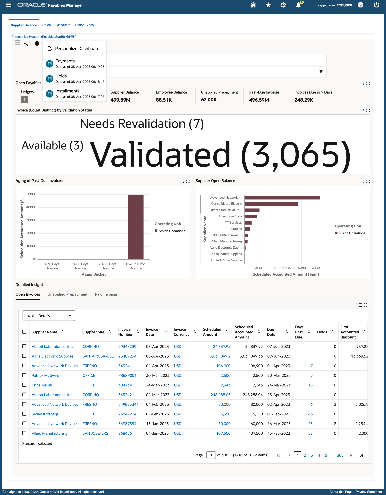
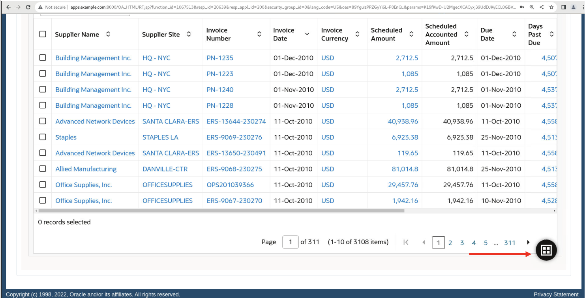
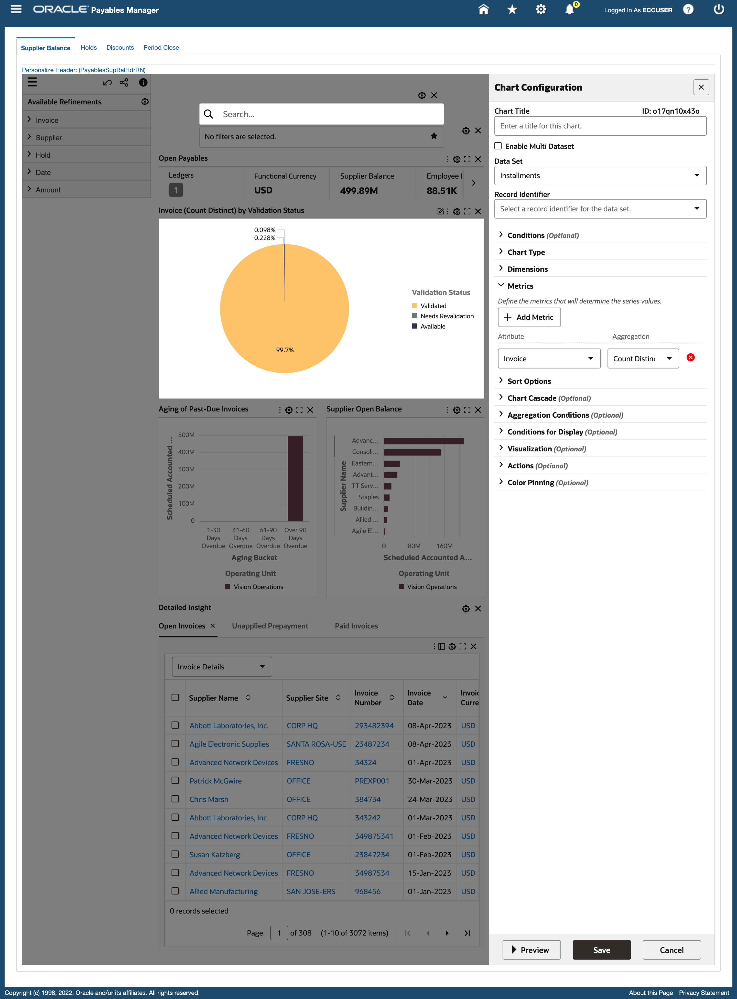
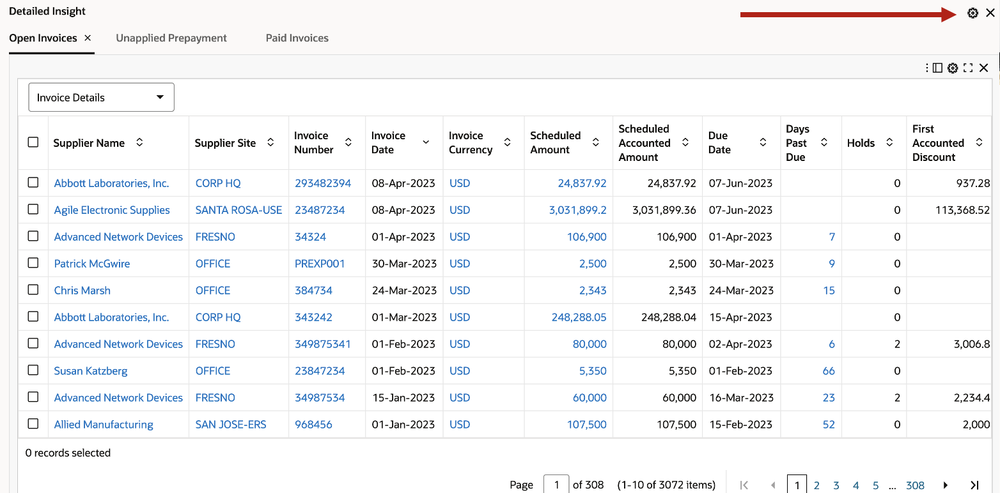
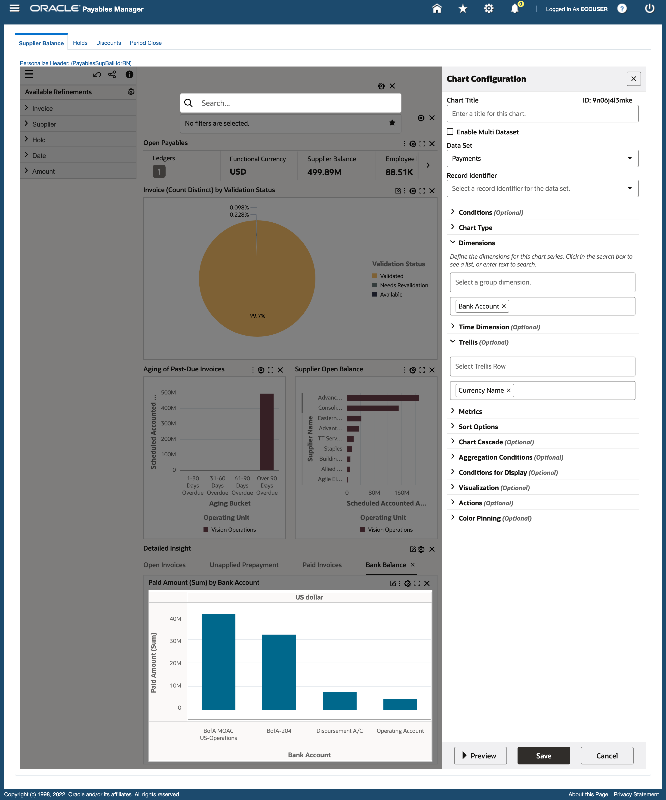
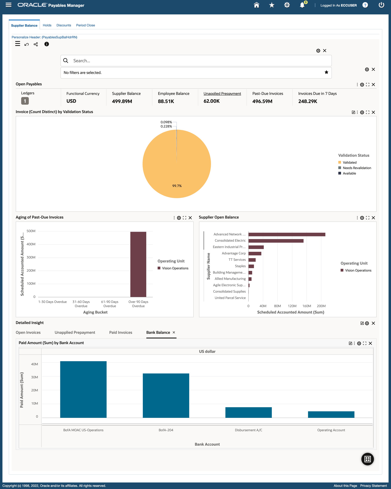
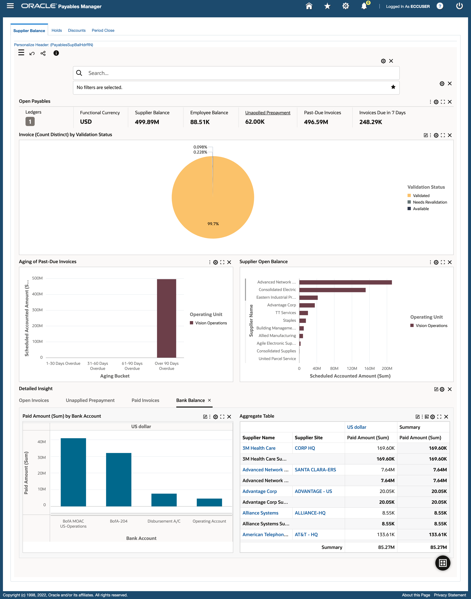
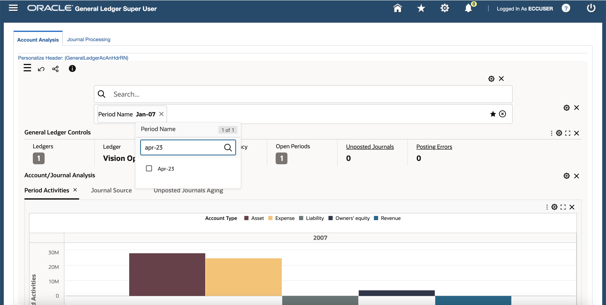
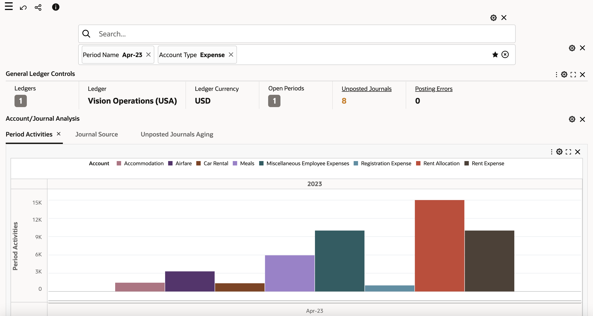

# Power User Personalization

### Introduction

In ECC, Power users can modify a dashboard to tailor it based on their business requirements. This lab walks you through the steps to Personalize an existing dashboard to suit it to your business requirement with an example. 

Estimated Time: 20 minutes

A Power User has:

*	Same designer experience as admin
*	Enabled at the user level using the profile option “FND: ECC Power User Enabled”
*	All personalizations are saved without any deployment. 
*	No access to ECC Admin UI

<h2> A Power user can/can't do the following: </h2>

<table id="huyh">

  <tr>
    <th>Can</th>
    <th>Cannot</th>
  </tr>
  <tr>
    <td>Adding a new component</td>
    <td>Create a new data set</td>
  </tr>
  <tr>
    <td>Modify existing component</td>
    <td>Create a new dashboard</td>
  </tr>
  <tr>
    <td>Delete component</td>
    <td>Configure a component from a data set that is not part of the application datasets</td>
  </tr>
  <tr>
    <td>Change dashboard layout</td>
    <td>Create public save search</td>
  </tr>

  </tr>
</table>

### Objectives

In this lab, you will:
* Personalize the Supplier Balance dashboard to track cash outflow for invoice payments per bank account so that you can analyze payment trends
* Personalize the Account Analysis dashboard to maintain the accuracy of financial records

### Prerequisites 

This lab assumes you have:
* Completed all previous labs successfully 

##  

## Task 1: Personalize Supplier Balance dashboard 

<b>Goal</b>: As a Payables Accountant, I want to track  cash outflow for invoice payments per bank account so that I can analyze payment trends 

* Login to EBS apps (Navigate to http://apps.example.com:8000) with below credentials

 <pre>
 Username: eccuser
 Password: welcome1

</code></pre></li>
* You will see the below screen:
  

* From "Payables Manager", navigate to "Payables Command Center"
  

* From Supplier Balance dashboard, Enable Personalization Mode by clicking on the "i" icon (on the top left of the page, beside the share icon) to edit the dashboard as a Power User

  
* The personalization icon changes to blue when the dashboard is in edit mode. All components in the dashboard will now have the configuration and delete icon

  

* Remove existing Tag cloud by clicking on Tag cloud's "x" icon and then replace Tag cloud with a Pie chart (Pie is the default visualization in Chart component)

* Delete the Tag cloud component  

  

* Add a chart (Pie chart) that replaces the deleted Tag cloud. You can do this by going to the bottom of the page and clicking the "Open components list" icon
  

* Go to the top of the page and drag  chart component into the dashboard

* Now edit the configuration of the chart. 

    1. Data set: Installaments 
    2. Chart type: Pie (Default is Pie, keep it as is)
    3. Dimension: Validation status
    4. Metric: Atrribute (Invoice) and Aggregation (count distinct) 
* Click preview and then Save

  

* Add a new Tab in the existing Tab component. To do this you need to click on the configuration icon for the existing Tab component and then add a new Tab in it. Name this tab "Bank Balance"

  

  

* Click preview and then Save
  

* Add a chart component inside the new tab "Bank Balance" to highlight paid amount per bank account

    1. Data set: Payments 
    2. Chart type: Bar
    3. Dimension: Bank Account (series dimension)
    4. Metric: Attribute (Paid amount) and Aggregation (Sum) 

* Click preview 

  
* This gives cash outflow across all currencies, now add additional dimension to split the chart per currency.

* Add "Currency" as Trellis column dimension
* Click preview and then Save

  
  

* In addition of viewing detailed payments add a Pivot view

* Add New Component- Aggregate Table (Pivot view is an alternate visualization of the Aggregate Table component)
    * Data set: Payments
    * Attributes:
         * Supplier name
         * Supplier site
         * Currency name (This will become a column when Pivot visualization is enabled)
    * Metric:
         * Attribute (Paid amount) and Aggregation (Sum)
* Click preview 

* This gives Per supplier, per supplier site totals of invoice paid amount.

  
* Enable Pivot view and Sub summary and then click preview

  

* Save the configuration

  

## Task 2: Run dataload for General Ledger Command Center

You have already run dataload for Payables command center. The steps are similar here.

* Login to EBS apps (Navigate to http://apps.example.com:8000) with below credentials

 <pre>
 Username: eccuser
 Password: welcome1
 Responsibility: General Ledger Super User

</code></pre></li>

* Navigate to "General Ledger Command Center"

* When the dashboard appears change the function id in the dashboard to <b>1011696</b> as done before in the Payables command center. 

   

* You will then see the below screen

   

* Choose "General Ledger Command Center Data Load" in the Program name by copying it from below and pasting in the Program Name
<pre><button class="copy-button" title="Copy text to clipboard">Copy</button><code class="hljs apache">General Ledger Command Center Data Load

</code></pre></li>
* You will see the below screen
   

* From "Parameters" tab choose the Load type as  <b>FULL_LOAD</b>, Set Ledger ID as <b>1</b> and Set/Reset Data as <b>TRUE</b>, this will wipe out all the records in the dataset.
   

* Click on "Submit"

   
   

* Track the data load progress
   

* You can also track the dataload in ECC Dataload Tracking page by logging in (http://apps.example.com:8000/ecc) via below credentials, using the Concurrent Program ID:

<pre>
Username: eccadmin
Password: welcome1
</code></pre></li>

* You will see the below screen
   

## Task 3 : Personalize Account Analysis dashboard 

* Login to EBS apps (Navigate to http://apps.example.com:8000) with below credentials

 <pre>
 Username: eccuser
 Password: welcome1
 </code></pre></li>

* You will see the below screen,  From <b>General Ledger Super User </b> responsibility navigate to <b>General Ledger Command Center</b>

  

   <b>Goal</b>:: Investigate and Act To Maintain the Accuracy Of Financial Records

* From General Ledger Super User navigate to General Ledger Command Center and then to Account analysis dashboard. Personalize the dashboard to view employee expenses by the parent account by clicking on the "i" icon to edit the dashboard as a Power User
  

* The personalization icon changes to blue when the dashboard is in edit mode. All components in the dashboard will now have the configuration and delete icon

  

* By default the dashboard is populated with the oldest period, Jan-07. Replace this period Jan-07 with Apr-23 in selected refinements to view latest data 
  

  <b> Note: </b> If instead you see period Adj-07 then replace it with Apr-23.

* Add another refinement Account type : "Expense", by clicking on expense from the charts

  

* You will see that the chart automatically cascades to display different accounts because cascading is enabled and configured by admin
  

* Add a new Tab in the existing Tab component. To do this you need to click on the configuration icon for the existing Tab component and then add a new Tab in it. 

  
* Add Tab Title as "Period Activities by Department and Parent Account"

  

* Click preview and then Save
 
* Add a new bar chart  inside the tab and configure the chart with the below details:

    1. Dataset: GL Account Analysis
    2. Chart type: Bar
    3. Group dimension: Cost Center
    4. Series dimension: Parent account 1
    5. Trellis column: Period Name
    6. Metric: Attribute (Period Activity) and no Aggregation, since this is a calculated attribute.

* Click preview 

  
* Save the configuration. You will be able to see a combined view of account segment and hierarchy
  

You may now  **proceed to the next lab**

## Learn More
* [Enterprise Command Centres- User Guide](https://docs.oracle.com/cd/E26401_01/doc.122/e22956/T27641T671922.htm)
* [Enterprise Command Centres- Admistration Guide](https://docs.oracle.com/cd/E26401_01/doc.122/f34732/toc.htm)
* [Enterprise Command Centres- Extending Guide](https://docs.oracle.com/cd/E26401_01/doc.122/f21671/T673609T673618.htm)
* [Enterprise Command Centres- Installation Guide](https://support.oracle.com/epmos/faces/DocumentDisplay?_afrLoop=264801675930013&id=2495053.1&_afrWindowMode=0&_adf.ctrl-state=1c6rxqpyoj_102)
* [Enterprise Command Centres- Direct from Development videos](https://learn.oracle.com/ols/course/ebs-enterprise-command-centers-direct-from-development/50662/60350)
* [Enterprise Command Centres for E-Business Suite- Technical details and Implementation](https://mylearn.oracle.com/ou/component/-/117416)

## Acknowledgements

* **Author** - Muhannad Obeidat, VP
* **Contributors** -  Muhannad Obeidat, Nashwa Ghazaly, Mikhail Ibraheem, Rahul Burnwal and Mohammed Khan
* **Last Updated By/Date** - Mohammed Khan, March 2023

