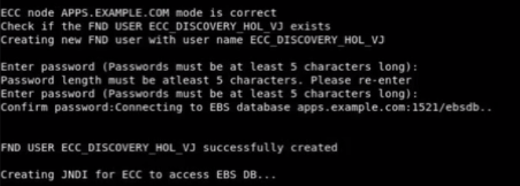
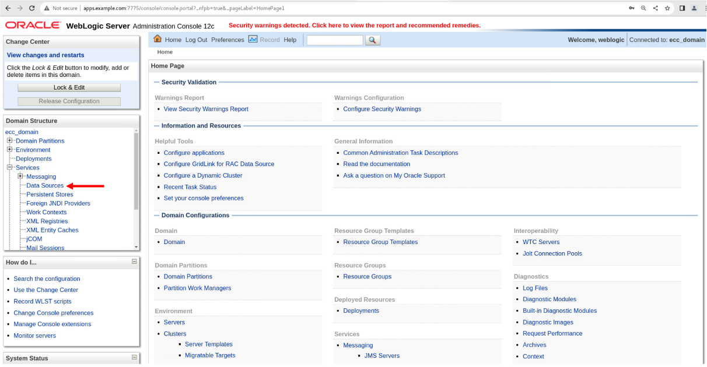
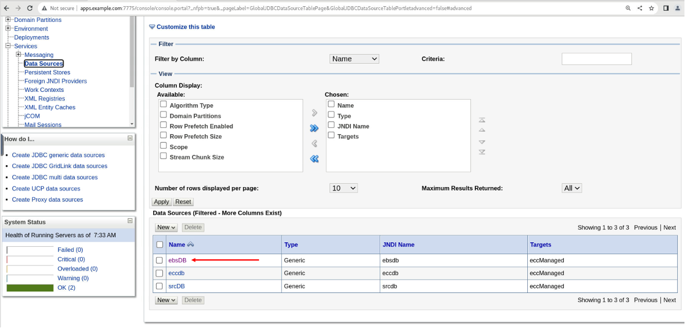
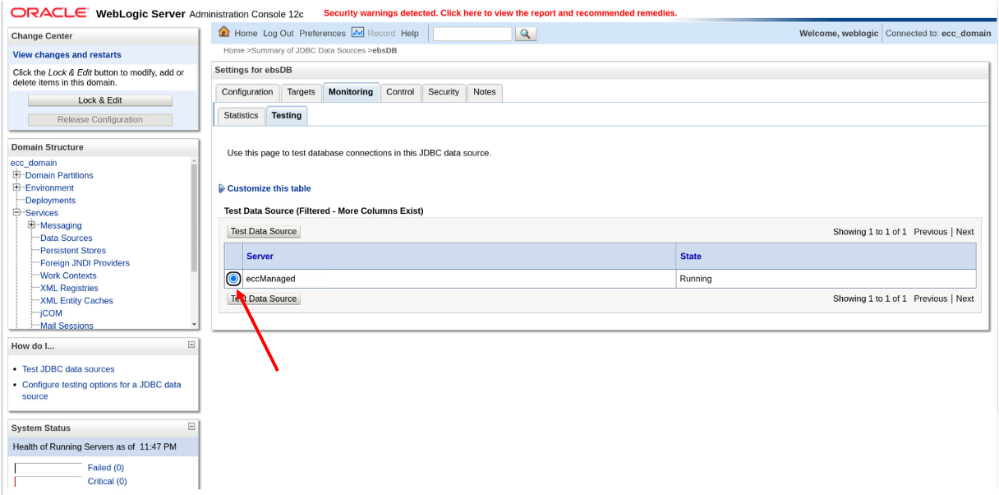

# Register ECC Instance as FND Node and Create EBS JNDI

### Introduction

This lab walks you through the steps to Register ECC Instance as FND Node and Create EBS JNDI so that you can set up Oracle Enterprise Command Center Framework

Estimated Time: 30 minutes

### Objectives
In this lab, you will:
* Register ECC Instance as FND Node and Create EBS JNDI
* Validate EBS JNDI
* Integrate ECC with EBS instance
* Integrate EBS with ECC

### Prerequisites

This lab assumes you have:
* Completed all previous labs successfully 

##  

## Task 1: Register ECC Instance as FND Node

1. On the ECC terminal Enter **Option 6** to exit the Options screen and Source EBSapps running edition
<pre><button class="copy-button" title="Copy text to clipboard">Copy</button><code class="hljs apache">
 
source /u01/install/APPS/EBSapps.env run 

</code></pre></li>

2. Run the following java command on EBS machine to register ECC instance as FND NODE, this will create "ebsdb_APPS.EXAMPLE.COM.dbc" file:

<pre><button class="copy-button" title="Copy text to clipboard">Copy</button><code class="hljs apache">
 
java oracle.apps.fnd.security.AdminDesktop apps/apps CREATE NODE_NAME=apps.example.com DBC=/u01/install/APPS/fs2/inst/apps/ebsdb_apps/appl/fnd/12.0.0/secure/ebsdb.dbc

</code></pre></li>

**Note:** Copy here works because you are on the same machine

3. Copy the "ebsdb_APPS.EXAMPLE.COM.dbc" file to the ECC instance

<pre><button class="copy-button" title="Copy text to clipboard">Copy</button><code class="hljs apache">
 
cp ebsdb_APPS.EXAMPLE.COM.dbc /u01/Oracle/quickInstall/connection.dbc

</code></pre></li>

## Task 2: Update Oracle EBS user name 

**EBS\_ECC\_USER** is the Oracle E-Business Suite user name (FND user) with which Oracle Enterprise Command Center Framework connects to Oracle E-Business Suite using the JNDI configuration. 

1.  Make sure that from ECC terminal you update EBS\_ECC\_USER value in /u01/Oracle/quickInstall/EccConfig.properties  to ECC\_DISCOVERY\_HOL\_{yourname}, to do that follow the below steps:

     1. In ECC terminal type vi /u01/Oracle/quickInstall/EccConfig.properties to open the file
     2. To insert or update please enter "i" on the keyboard
     3. Update EBS\_ECC\_USER property
     4. Enter "Esc" on the keyboard and enter ":wq" and then press "Enter" to save the file

## Task 3: Create EBS JNDI

1. From the ECC terminal, execute the ./envSetup.sh script and when prompted choose **Option 4** to Create EBS JNDI.

<pre><button class="copy-button" title="Copy text to clipboard">Copy</button><code class="hljs apache">./envSetup.sh
</code></pre></li>

   * When prompted provide a password to create new FND user as **welcome1**
   * Password for ECC Domain weblogic was previously set by you as **welcome1**
   * Password for EBS Schema apps is always **apps**

## Task 4: Validate EBS JNDI

1. Open the browser and copy paste the below URL to access ECC Admin console: 

<pre><button class="copy-button" title="Copy text to clipboard">Copy</button><code class="hljs apache">
 
http://apps.example.com:7775/console

</code></pre></li>

2. Enter ECC admin user credentials 
 <pre>
Username:weblogic
Password:welcome1
</code></pre></li>

3. You should see the below screen
   

4. Go to the "Data Sources" in "Services" tab as shown below
   

5. Click on "JNDI" with the name “ebsdb” as indicated below

   

6. Go to "Monitoring" -> "Testing" tab
   

7. Select "eccManaged Server" and click on "Test Data Source"

   

8. You should see a success message in green as shown below

   

## Task 5: Integrate ECC with EBS Instance

1. From the ECC terminal, execute the ./envSetup.sh script and choose **Option 5** to integrate ECC with EBS instance 

<pre><button class="copy-button" title="Copy text to clipboard">Copy</button><code class="hljs apache"> ./envSetup.sh
</code></pre></li>

2. When prompted to proceed with EBS integration submit "y" as shown below:

3.  Here, please enter password as **welcome1** for both ECC DB user and ECC admin user weblogic  

## Task 6: Integrate EBS with ECC 

 1. Log in to Oracle E-Business Suite as a system administrator i.e., Open the browser and navigate to http://apps.example.com:8000 

 <pre>Username= SYSADMIN
Password= welcome1
</code></pre></li>
 2. Navigate to System Administrator: Oracle Applications Manager > AutoConfig.

 

 3. Select the application tier context file, and choose "Edit Parameters".
  

 4. Search for the s\_ecc\_conf\_comment variable by selecting OA_VAR in the search list of values and entering s\_ecc\_conf\_comment in the search text box. Then, click the "Go" button.

   

 5. If  number sign (#) is present in Value field then remove it from the Value field for the s\_ecc\_conf\_comment variable to ensure that this variable is not commented. Then, click the "Save" button.
 6. Enter a reason for the update, such as Enabling Oracle Enterprise Command Center Framework. Then choose the OK button.
 7. Similarly, search for the following variables and set their values as appropriate for your installation:

    1. **s\_ecc\_protocol** - The protocol for accessing the Oracle Enterprise Command Center Framework administration UI.
    2. **s\_ecc\_web_host** - The Oracle Enterprise Command Center Framework host name.
    3. **s\_ecc\_managed\_server\_port** - The port for the Oracle Enterprise Command Center Framework managed server.
    4. **s\_ecc\_conf\_update** - A flag to update the ecc.conf file. If Oracle Enterprise Command Center Framework is enabled, use this variable to specify whether the ecc.conf file should be updated. The default value is true, which means ecc.conf will be updated during every AutoConfig run. To retain the contents of ecc.conf, such as when you are enabling TLS for the Oracle Enterprise Command Center Framework installation, set this variable to false.
 

 8. Open EBS terminal and then run AutoConfig. For running Autoconfig you need to first source the EBS running edition using below command
 <pre><button class="copy-button" title="Copy text to clipboard">Copy</button><code class="hljs apache">source /u01/install/APPS/EBSapps.env run
</code></pre></li>

9. Then, navigate to below location

 <pre><button class="copy-button" title="Copy text to clipboard">Copy</button><code class="hljs apache">cd $ADMIN_SCRIPTS_HOME
</code></pre></li>

10. Run the below script
 <pre><button class="copy-button" title="Copy text to clipboard">Copy</button><code class="hljs apache">./adautocfg.sh
</code></pre></li>

11. It will prompt you for apps password which is by default**apps** 

   
   

12. Once Autoconfig runs successfully then navigate to below location:

 <pre><button class="copy-button" title="Copy text to clipboard">Copy</button><code class="hljs apache">cd $ADMIN_SCRIPTS_HOME
</code></pre></li>
   

13. And then, run the following script to check OHS status:
 <pre><button class="copy-button" title="Copy text to clipboard">Copy</button><code class="hljs apache"> ./adapcctl.sh status
</code></pre></li>
   

14. And then, run the following script to stop OHS:

 <pre><button class="copy-button" title="Copy text to clipboard">Copy</button><code class="hljs apache"> ./adapcctl.sh stop
</code></pre></li>
      

15. And then, run the following script to start OHS:

 <pre><button class="copy-button" title="Copy text to clipboard">Copy</button><code class="hljs apache"> ./adapcctl.sh start
</code></pre></li>
   

16. And then, run the following script again to check the OHS status if it has successfully started:
 <pre><button class="copy-button" title="Copy text to clipboard">Copy</button><code class="hljs apache"> ./adapcctl.sh status
</code></pre></li>

   

## Task 7: Validate integration of EBS and ECC 

1. Navigate to http://apps.example.com:8000 in the browser with below credentials 

 <pre>
Username: SYSADMIN
Password: welcome1
</code></pre></li>

    
2. Navigate to ECC Developer, you should see "Activity audit" application as below if the integration is successful
   

You may now **proceed to the next lab**

## Learn More
* [Enterprise Command Center- User Guide](https://docs.oracle.com/cd/E26401_01/doc.122/e22956/T27641T671922.htm)
* [Enterprise Command Center- Admistration Guide](https://docs.oracle.com/cd/E26401_01/doc.122/f34732/toc.htm)
* [Enterprise Command Center- Extending Guide](https://docs.oracle.com/cd/E26401_01/doc.122/f21671/T673609T673618.htm)
* [Enterprise Command Center- Installation Guide](https://support.oracle.com/epmos/faces/DocumentDisplay?_afrLoop=264801675930013&id=2495053.1&_afrWindowMode=0&_adf.ctrl-state=1c6rxqpyoj_102)
* [Enterprise Command Center- Direct from Development videos](https://learn.oracle.com/ols/course/ebs-enterprise-command-centers-direct-from-development/50662/60350)
* [Enterprise Command Center for E-Business Suite- Technical details and Implementation](https://mylearn.oracle.com/ou/component/-/117416)

## Acknowledgements

**Author**- Muhannad Obeidat, VP

**Contributors**-  Muhannad Obeidat, Nashwa Ghazaly, Mikhail Ibraheem, Rahul Burnwal and Mohammed Khan

**Last Updated By/Date**- Mohammed Khan, March 2023

