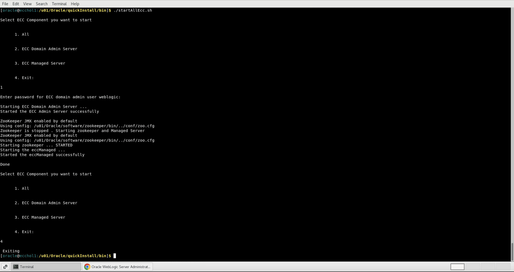

# Start and stop ECC

### Introduction

This lab walks you through the steps to start and stop Oracle Enterprise Command Center Framework

Estimated Time: 5 minutes

### Objectives

In this lab, you will:
* Learn how to start and stop ECC

### Prerequisites 

This lab assumes you have:
* Completed all previous labs successfully 

##  

## Task 1: Learn how to start and stop ECC

* Start ECC

Start the Oracle Enterprise Command Center Framework servers by running the <b>./startAllEcc.sh</b> script located in the $ECC_BASE/Oracle/quickInstall/bin directory and choosing option 1 - All. This option starts the Oracle Enterprise Command Center Framework managed server and the admin server in the required sequence. When prompted, enter the Oracle Enterprise Command Center Framework domain admin server user name and password.

* Stop ECC

Stop the Oracle Enterprise Command Center Framework servers by running the <b>./stopAllEcc.sh</b> script located in the $ECC_BASE/Oracle/quickInstall/bin directory and choosing option 1 - All. This option stops the Oracle Enterprise Command Center Framework managed server and the admin server in the required sequence. When prompted, enter the Oracle Enterprise Command Center Framework domain admin server user name and password.

You may now  **proceed to the next lab**

## Learn More
* [Enterprise Command Centres- User Guide](https://docs.oracle.com/cd/E26401_01/doc.122/e22956/T27641T671922.htm)
* [Enterprise Command Centres- Admistration Guide](https://docs.oracle.com/cd/E26401_01/doc.122/f34732/toc.htm)
* [Enterprise Command Centres- Extending Guide](https://docs.oracle.com/cd/E26401_01/doc.122/f21671/T673609T673618.htm)
* [Enterprise Command Centres- Installation Guide](https://support.oracle.com/epmos/faces/DocumentDisplay?_afrLoop=264801675930013&id=2495053.1&_afrWindowMode=0&_adf.ctrl-state=1c6rxqpyoj_102)
* [Enterprise Command Centres- Direct from Development videos](https://learn.oracle.com/ols/course/ebs-enterprise-command-centers-direct-from-development/50662/60350)
* [Enterprise Command Centres for E-Business Suite- Technical details and Implementation](https://mylearn.oracle.com/ou/component/-/117416)

## Acknowledgements

* **Author** - Muhannad Obeidat, VP
* **Contributors** -  Muhannad Obeidat, Nashwa Ghazaly, Mikhail Ibraheem, Rahul Burnwal and Mohammed Khan
* **Last Updated By/Date** - Mohammed Khan, March 2023

