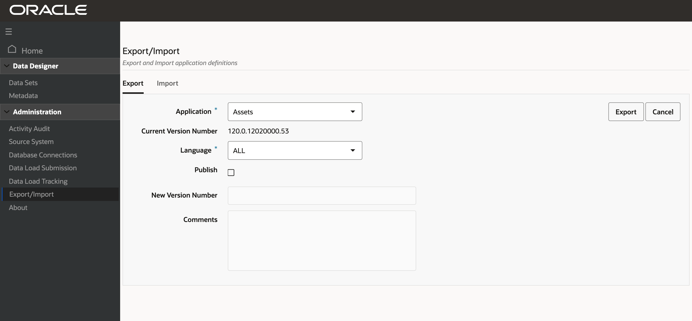
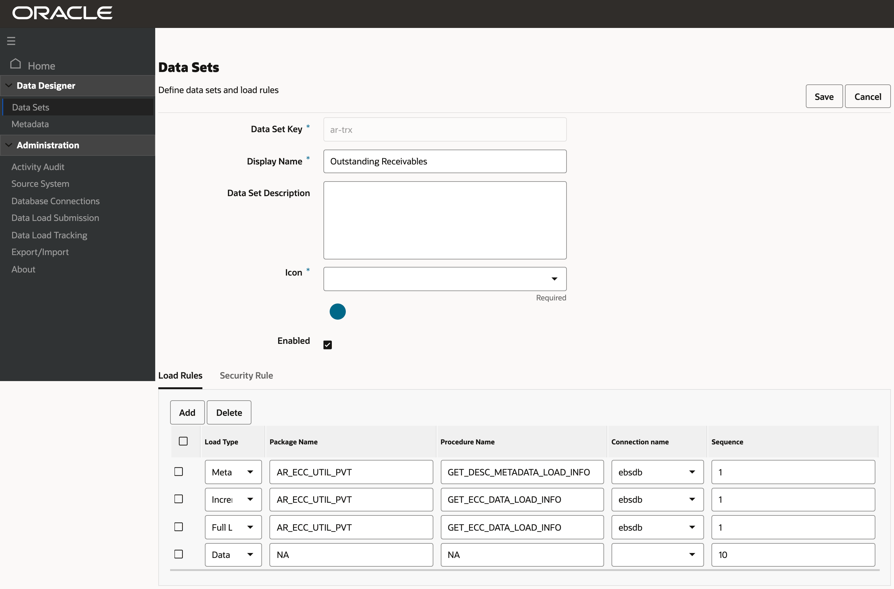

# Admin User Personalisation

Because Oracle E-Business Suite is used across many industries and environments, users may have special requirements. In that case, administrative users can extend existing dashboards or create new dashboards based on new data sets.

Estimated Time: 20 minutes

### Objectives

In this lab, you will:
* Build a new dashboard on an existing data set

* Change the way a component is configured or visualized

* Hide/Show attributes available in the data set

* Remove existing or add new components

* Remove actions or links

### Prerequisites (Optional)

This lab assumes you have:
* All previous labs successfully completed

##  

## Task 1 : Build a new dashboard on an existing data set

<b>Extending an Existing Dashboard</b>

In this section you will extend an Oracle Enterprise Command Center Framework dashboard and show it inside the same Oracle Application Framework rich container from a functional administrator perspective.

This scenario covers extensions to the Asset Cost dashboard in Assets Command Center as a showcase scenario.

<b>Back Up Existing Application</b>

Before starting extending an application, take a backup from the existing application (shipped) as follows:

* Using the ECC Developer responsibility, navigate to the Export/Import page.

* Click the Export tab.

* Select the application name.

* Specify the Language: en.

* Click the Export button.

<b>Export Application</b>

<b>Creating a New Page</b>

To create a completely new dashboard from scratch, we can either copy an existing page, or completely create a new page to application and then add components in the page.

<b>Copy an Existing Page</b>

As we are targeting to extend the asset cost dashboard, we first need to copy the existing dashboard as follows:

* Log in with the ECC Developer responsibility,

* In the Home page, search for the Assets application.

* Click Assets to explore application pages.

<b>Application Pages</b>

* Click Copy Page icon in the Asset Cost page.

* The copied page is added to the application list of pages and named as Asset Cost (1).

<b>New Copied Page</b>

* Edit the page definition by clicking on the pencil icon on the copied page.

* In the page definition, change the page key and display name.

<b>Note</b>: It is recommended to prefix page key and display name with 'xx'.

<b>Edit Page Definition</b>

* Save the changes.

* Click on the Page name (XX Asset Cost), open the page, and start the extension.

<b>Create a New Page</b>

* Using the ECC Developer responsibility, navigate to the ECC home page.

* Click on an Application

* Click on "+ Add New Page" to create a blank page.

<b>Add a New Page</b>

ECC Administration Page with '+Add New Page' Icon

<b>Extend a Page</b>

Based on the functional requirements to enrich the Asset Cost dashboard, the extension targets the following scenario:

<b>Replace Existing Visualization</b>

Replace Asset Cost summarization bar with a tag cloud, where the user has asset type term is displayed based on the asset cost and cascade down to property type.

* Open Add Component List. Drag and drop the tag cloud component beside the Asset Cost summarization bar.

* Click the Configuration icon.

<b>Tag Cloud Configuration</b>

* Configure Tag Cloud:

<table border="1" cellpadding="4" cellspacing="0" summary="table is summarized in text">
<caption>Tag Cloud Configuration Options</caption>
<tbody><tr class="HEADER" valign="center" bgcolor="#E0E0E0">
<th scope="col"><b>Option</b></th>
<th scope="col"><b>Description</b></th>
</tr>
<tr valign="top">
<td>Title</td>
<td>Leave the title empty, to display dynamic title based on dimension and metric are defined.</td>
</tr>
<tr valign="top">
<td>Data Set</td>
<td>Assets</td>
</tr>
<tr valign="top">
<td>Record Identifier</td>
<td>Asset Number

<strong>Note:</strong> The record identifier prevents aggregate duplicate records based on the granularity level in the data set.

</td>
</tr>
<tr valign="top">
<td>Condition</td>
<td>NA</td>
</tr>
<tr valign="top">
<td>Visualization</td>
<td>Enable Show Metric Value 
Number of Items = 10</td>
</tr>
<tr valign="top">
<td>Dimension</td>
<td>Asset Type 
Property Type</td>
</tr>
<tr valign="top">
<td>Metric</td>
<td>Asset Cost (Sum) 
Asset (Count Distinct)</td>
</tr>
<tr valign="top">
<td>Tag Cloud Cascade</td>
<td>Asset Type 
Property Type</td>
</tr>
<tr valign="top">
<td>Aggregation Condition</td>
<td>NA</td>
</tr>
<tr valign="top">
<td>Condition for Display</td>
<td>Book Type Code (Count Distinct) = 1

<strong>Note:</strong> As the tag cloud will display the asset types based on cost, then it is better to display the asset cost within the context of asset book.

</td>
</tr>
</tbody></table>

Click Preview to view the component runtime view.

Note: As there is no asset book selected yet, the tag cloud displays "No data to Display" until the user selects one asset book.

* Click Save. Select Asset Book from Summarization Bar "Flag pop-up" to get the data displayed within the context of the selected Asset Book.

* Delete Asset Cost summarization bar.

* Click on the Delete icon.
<b>Asset Cost (Sum) by Asset Type Tag Cloud</b>

Using the runtime option, the user can change the metric displayed on the tag cloud. Click Option, and then change the metric value using the drop-down list.
Drop-down List to Change Metric Value

Asset (Count Distinct) by Asset Type

When a user filters by any term in the tag cloud, the filter will cascade down to the Property type code.

Click to filter.

Tag Cloud Cascading Filter

<b>Update a Chart</b>

Adding a reference line at the average total cost by category so that users can compare total asset cost per category against the average.

In this extension, the following steps will be done:

* Add a reference line.

* Change chart configuration to display asset cost first instead of count.

* Define a new condition for display based on Asset Book.

* Click Configuration to open the chart configuration panel.

Edit Chart Configuration

Open the Metric configuration option, and update the following:

* Delete the first metric defined, Asset (Count Distinct).

* Click + Add Metric.

* Define Asset (Count Distinct).

* Click Preview.

The chart displays Asset Cost (Sum) at runtime.

Updated Metric Configuration

* Click +Add Reference Line.

   * Select the first metric defined "Asset Cost (Sum)".

   * Select Aggregation function "Average".

   * Click Preview, and the reference line based on average total cost by category is displayed on the chart.

* Save the Chart Configuration.

* Reference Line

<b>Update a Results Table</b>

Define a Hyperlink Action in Asset Cost dashboard to navigate to Asset Location dashboard.

Assets Results Table

* Click the configuration icon to open the configuration panel.

* Results Table Configuration

* Expand Attribute according to define the action at the attribute level.

Column Action Configuration

Apply the following configuration information:

<table border="1" cellpadding="4" cellspacing="0" summary="table is summarized in text">
<caption>Column Action Configuration Information</caption>
<tbody><tr class="HEADER" valign="center" bgcolor="#E0E0E0">
<th scope="col"><b>Option</b></th>
<th scope="col"><b>Value</b></th>
</tr>
<tr valign="top">
<td>Column Action</td>
<td>Column Action</td>
</tr>
<tr valign="top">
<td>Action</td>
<td>Hyperlink</td>
</tr>
<tr valign="top">
<td>Display action description in the tooltip</td>
<td>True 
In the tooltip test box: Go to Asset Location</td>
</tr>
<tr valign="top">
<td>Open in a new window</td>
<td>False</td>
</tr>
<tr valign="top">
<td>URL*</td>
<td>
<pre>/ecc/web/eccapp/fa/asset-location?eccDeepLink=[{"fa-asset":[{"attributeKey":"ASSET_NUMBER","values":[{0}],"operator":"=="}]}] </pre></td>
</tr>
<tr valign="top">
<td>+ Add URL Parameter</td>
<td>Select attribute: Asset Number 
Note: asset number reference {0}, is added in the URL</td>
</tr>
</tbody></table>

* Deep link:

Used to navigate between two different pages and apply a filter(s) to the destination page

Can apply a range filter, selection filter, and search filter

Click Preview and Save.

Previewing and Saving Configuration

At runtime, a user can click an asset number to navigate to the asset location dashboard, and then filter the dashboard with the selected asset number.

Example of Filtering on Asset Number

## Task 2: Personalizing in Oracle E-Business Suite

<b>Create FND Function</b>

After applying all the required extensions in the copied Asset Cost dashboard, create a new FND function and grant access to this function as follows:

* In the Oracle E-Business Suite environment, navigate to the Functional Administrator responsibility.

* In the Core Services tab, select the Function subtab.

* Select the Create Function tab.

   * Enter the function code, 'FA_ECC_XX_ASSET_COST'.

   * Enter the function name, 'Fixed Assets Command Center Cost'.

   * For Type, select 'SSWA jsp function'.

   * Click the Continue button.

Creating a Function

* Enter the page URL in HTML Call text box. Note: in the Page URL, enter the page key created in the section Copy Existing Page..

Example of a Page URL for a Function Definition

* Click the Submit button.

Confirmation of Function Creation

* Navigate to the Security tab and select Permission Set.

* Assign the new FND function to the Assets Permission Set.

* Search for permission set "Fixed Assets Command Center Access Permission Set" - "FA_ECC_ACCESS_PS".

  * Click Edit.

Example of a Permission Set

* Add the newly created function.

Updating a Permission Set

* Click the Apply button.

<b>Personalize the Oracle Application Framework Page</b>

Now, you need to personalize the Oracle Application Framework page to replace the shipped dashboard with the new personalized one, using the steps below.

* In Oracle E-Business Suite, navigate to the Assets Command Center, then to the Asset Cost page (shipped page).

* At Oracle Application Framework page level, choose Settings, then Personalize Page.

* Click Edit to personalize the Asset Cost page rich container.

Personalizing the Asset Cost Page Rich Container

* At the responsibility level, personalize the rich container by adding the newly created function FA_ECC_XX_ASSET_COST in the Destination Function.

Note that you can personalize the page at the site or organization level as well.

Personalizing a Page at the Responsibility Level

* Click the Apply button.

<b>Test and Export</b>

After personalizing the Oracle Application Framework page, access the new extended page from Oracle E-Business Suite.

* Navigate to the Fixed Assets Manager responsibility.

* Navigate to the Assets Command Center and select the tab for the Asset Cost dashboard.

* The newly extended dashboard is displayed instead of the shipped Asset Cost dashboard.

* Validate the dashboard functionality.

* Navigate to the ECC Developer responsibility.

* Navigate to the Export/Import page and click the Export tab to export the updated application

Export the Updated Application

## Task 3: Advanced Extensibility 

<b>Extend an Existing Data Set</b>

* Objectives covered in this section are:

* Extend a data set to include additional attributes not shipped out of the box but available in Oracle E-Business Suite.

* Display those attributes in the different part of the Oracle Enterprise Command Center Framework dashboard.

* Add additional attributes

* Back up an existing application

* Create a new data set

Before starting extending an application, take a backup from the existing application (shipped) as follows:

* Using the ECC Developer responsibility, navigate to the Export/Import page.

* Click the Export tab.

* Select the application name.

* Specify the Language: en

* Click the Export button.

Shipped data set can be extended by creating additional attributes from source data.

Perform the following steps to include new attributes. (For examples on working with metadata load and data load procedures, refer toCode Example for Designing a Metadata Load Procedure and Code Example for Modifying a Data Load Procedure.

* Review the ECC_SPEC_ID structure for the shipped data set. Inclusion of new attributes should not change the grain level of data. If new attributes affect the grain level, then the ECC_SPEC_ID structure has to be revised.

* Copy the PL/SQL procedure in the data load for the shipped data set.

* If the data load procedure uses a database view, copy the view.

* Update the query in the data load procedure in order to ingest the data into the new attributes.

* Update view name in PL/SQL procedure for both the full load and the incremental load.

* To create new attributes in metadata:

* If the data set has a shipped metadata load, copy the shipped PL/SQL procedure and update the procedure to include the new attributes.

* If the data set has no shipped metadata load, create a new PL/SQL package and procedure to create new attributes.

* Navigate to the Data Sets section in the Administrator UI, open the data set and add the new metadata load and data load.

* Note: The sequence for new load rules should start with 101, as sequence numbers till 99 are reserved for shipped data loads.

* For validating the new load rules, run the metadata load followed by a full load.

* Once the loads are successful, update the data load concurrent program by extending the executable file of concurrent program.

Example of New Attributes in Metadata

Example of Updated Data Set Load Rules

<b>Add a Custom Security Handler</b>

You can extend a shipped security handler by including a custom security package in the data set security rule. The filters from the custom security handler are combined with filters from the shipped security handler. Perform the following steps to include a custom security handler. (For details on sample metadata load and data load procedures, refer to Code Example for Designing a Metadata Load Procedure and Code Example for Modifying a Data Load Procedure.

* Copy the shipped security handler PL/SQL package and procedure.

* If the procedure uses a database view, copy the view.

* Update the query in security handler procedure.

* Update the view name in PL/SQL procedure. Save the package and procedure.

* Navigate to the data sets section in the Administrator UI, open the data set, switch to the Security Rule tab and add the new security handler in the Custom Security Handler field.

Data Sets Page - Security Tab

<b>Copy an Oracle Enterprise Command Center Framework Page</b>
An administrator must copy the required dashboard and then add new components to change the location order of them. Use the newly- added attributes in the component configuration.

See: Extending an Existing Dashboard for more details about the Copy page and adding/configuring new components.

<b>Create a New FND Function</b>
After creating the page, the Administrator has to create an Oracle Application Object Library function, FND_FORM_FUNCTION, to show the newly created page inside Oracle E-Business Suite. See: Create FND Function.

<b>Oracle E-Business Suite Personalization</b>
Update Oracle E-Business Suite through personalization with the URL for the newly created page. See: Personalize the Oracle Application Framework Page.

From Oracle E-Business Suite, verify that a user can open the new page and the new UI is shown. If everything is working fine, then export the application to back up and propagate your changes to other environments.

<b>Back Up an Updated Application</b>
Test and create a new export of application to back up and propagate your changes to other environments. See: Test and Export.

<b>Create a New Data Set</b>
Based on the flexible structure of Oracle Enterprise Command Center Framework, you can create your data set and build a custom dashboard on top of it based on your business requirements.

The steps below summarize the process of creating a new data set, adding it to a new application, building a new custom dashboard, and accessing it from an Oracle E-Business Suite functional responsibility.

Create a new PL/SQL package for data load. See Sample PL/SQL Package for information on creating a PL/SQL package.

Create a new data set. Refer to Data Set for details about how to create new data.

Create data set metadata. See Metadata and Dynamic Metadata for more details about metadata.

Create a new application or use an existing application and assign the data set to the application. See Application for more details about creating an application.

Using the Data Load Submission option from the Oracle Enterprise Command Center Framework Administrator UI, run the full load. Refer to Administration of Enterprise Command Centers, Oracle E-Business Suite Administering Enterprise Command Centers for more information.

Create a new page in the new/existing application. For more information on creating a new page, see Page.

Design the page using the different ECC visualization components. See Anatomy of Oracle Enterprise Command Center Framework UI Components for more details about how to add and configure visualization components.

After designing the dashboard, you need to integrate this new dashboard with Oracle E-Business Suite, using the steps below.

Create a security handler. Refer to Sample Custom Security Handler for more details about security handlers.

In Oracle E-Business Suite, create a new function (FND function). See Create a New FND Function for information about creating functions.

Create a new permission set or use the existing one. See Permission Sets, Oracle E-Business Suite Security Guide for more information.

Configure security for the data set. In the Oracle Enterprise Command Center Framework Administrator UI, select the Data Set option and:

Enable security.

Add the security handler name.

Add the privilege (FND function).

Back up the application. See Back Up an Updated Application for more details about application export.

Within Oracle E-Business Suite, create a new Oracle Application Framework page, or add a new tab to an existing Oracle Application Framework page. See Add a New Tab to a Command Center Oracle Application Framework Page for more details about adding a new tab.

Create a concurrent program to be used to run the full load directly from Oracle E-Business Suite. See the Sample Concurrent Program section for more information. Also refer to Overview of Concurrent Programs and Requests, Oracle E-Business Suite Setup Guide and Overview of Concurrent Processing, Oracle E-Business Suite Developer's Guide for details on concurrent programs.

## Learn More
* [Enterprise Command Centres- User Guide](https://docs.oracle.com/cd/E26401_01/doc.122/e22956/T27641T671922.htm)
* [Enterprise Command Centres- Admistration Guide](https://docs.oracle.com/cd/E26401_01/doc.122/f34732/toc.htm)
* [Enterprise Command Centres- Extending Guide](https://docs.oracle.com/cd/E26401_01/doc.122/f21671/T673609T673618.htm)
* [Enterprise Command Centres- Installation Guide](https://support.oracle.com/epmos/faces/DocumentDisplay?_afrLoop=264801675930013&id=2495053.1&_afrWindowMode=0&_adf.ctrl-state=1c6rxqpyoj_102)
* [Enterprise Command Centres- Direct from Development videos](https://learn.oracle.com/ols/course/ebs-enterprise-command-centers-direct-from-development/50662/60350)
* [Enterprise Command Centres for E-Business Suite- Technical details and Implementation](https://mylearn.oracle.com/ou/component/-/117416)

## Acknowledgements

* **Author** - Muhannad Obeidat, VP
* **Contributors** -  Muhannad Obeidat, Nashwa Ghazaly, Mikhail Ibraheem, Rahul Burnwal and Mohammed Khan
* **Last Updated By/Date** - Mohammed Khan, March 2023

