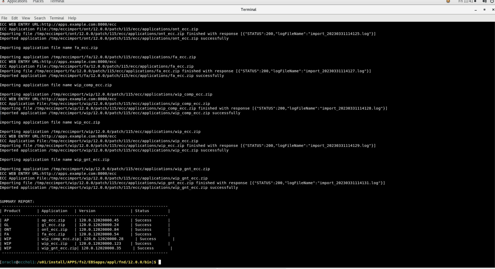

# Import ECC applications

This lab walks you through the steps to import ECC applications so that you can set up Oracle Enterprise Command Center Framework

Estimated Time: 15 minutes

### Objectives
In this lab, you will:
* Import ECC applications

### Prerequisites

This lab assumes you have:
* Completed all previous labs successfully 

##  

## Task 1: Import ECC Applications

*  Source EBSapps running edition
<pre><button class="copy-button" title="Copy text to clipboard">Copy</button><code class="hljs apache">
 
source /u01/install/APPS/EBSapps.env run 

</code></pre></li>

* Navigate to below location in terminal 

<pre><button class="copy-button" title="Copy text to clipboard">Copy</button><code class="hljs apache">
 
cd /u01/install/APPS/fs2/EBSapps/appl/fnd/12.0.0/bin

</code></pre></li>

* Execute patchEccFiles.pl command
<pre><button class="copy-button" title="Copy text to clipboard">Copy</button><code class="hljs apache">
 
sh patchEccFiles.pl

</code></pre></li>

* When you run patchEccFiles.pl it will prompt you to enter a temporary directory, so enter <b>/tmp/ecc1</b>
* When prompted enter EBS DB apps user password as <b>apps</b>
* When prompted you need to pass the languages that you need to import. Use "en" 

* When prompted you need to mention what products you need to import. 
     * "Y" is for all products
     * "N" is to specify a smaller subset of products. 

* Enter <b>"N"</b> 

* You will be presented with the list of products from which you need to mention which ones to import. 

* For this demo please enter the following products: "<b>AP,GL,ONT,FA,WIP</b> "

<pre><button class="copy-button" title="Copy text to clipboard">Copy</button><code class="hljs apache">
 
AP,GL,ONT,FA,WIP

</code></pre></li>

* You should see the following  screen when you run it successfully

## Task 2: Validate Import of ECC applications

* Navigate to http://apps.example.com:8000 in the browser with below credentials 

 <pre>
Username: SYSADMIN
Password: welcome1

</code></pre></li>

    
* Navigate to ECC Developer, you should see new applications as below

## Learn More
* [Enterprise Command Centres- User Guide](https://docs.oracle.com/cd/E26401_01/doc.122/e22956/T27641T671922.htm)
* [Enterprise Command Centres- Admistration Guide](https://docs.oracle.com/cd/E26401_01/doc.122/f34732/toc.htm)
* [Enterprise Command Centres- Extending Guide](https://docs.oracle.com/cd/E26401_01/doc.122/f21671/T673609T673618.htm)
* [Enterprise Command Centres- Installation Guide](https://support.oracle.com/epmos/faces/DocumentDisplay?_afrLoop=264801675930013&id=2495053.1&_afrWindowMode=0&_adf.ctrl-state=1c6rxqpyoj_102)
* [Enterprise Command Centres- Direct from Development videos](https://learn.oracle.com/ols/course/ebs-enterprise-command-centers-direct-from-development/50662/60350)
* [Enterprise Command Centres for E-Business Suite- Technical details and Implementation](https://mylearn.oracle.com/ou/component/-/117416)

## Acknowledgements

* **Author** - Muhannad Obeidat, VP
* **Contributors** -  Muhannad Obeidat, Nashwa Ghazaly, Mikhail Ibraheem, Rahul Burnwal and Mohammed Khan
* **Last Updated By/Date** - Mohammed Khan, March 2023

